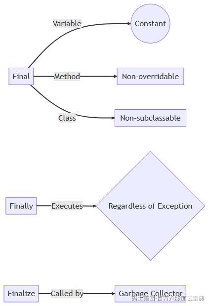

在 Java 中，虽然final、finally 和 finalize三个名称相似，但它们的角色和用途完全不同：



#### 1. `final` （关键字）

- 用于修饰类、方法和变量，目的是“锁定”机制：

- **类**：声明为 `final` 后不能被继承；
- **方法**：不能被子类重写；
- **变量**：变为常量，初始化后不能重新赋值——如果是引用类型，不可指向新对象，但可修改内部状态。M

- **适用场景**：定义常量（如 `public static final`）、确保核心方法逻辑不被篡改、设计不可扩展类。

#### 2. `finally` （代码块）

- 用于 `try-catch` 结构中：

```java
try {
    // ... 可能抛异常的代码
} catch(Exception e) {
    // 异常处理
} finally {
    // 无论是否异常，都会执行，用于关闭资源等
}
```

- **特性**：

- 无论是否发生异常、是否有 `return`，**通常会**执行；
- 唯一例外：如 JVM 调用 `System.exit()`、线程被中断等；

- **适用场景**：保证资源释放（如关闭流/连接），即使方法提前返回也能正常释放。

#### 3. `finalize()` （Object 方法，已废弃）

- 属于垃圾回收机制的一部分：

- JVM 在确认对象无需使用后，可调用该对象的 `finalize()` 方法；
- 非实时、非强制执行，执行时机会不确定，存在延迟或根本不执行风险。B

- **设计初衷**：作为对象被 GC 时的“最后清理机会”；
- **实际情况**：

- 因不可预测、不及时、可能引起资源泄漏，已被弃用；
- 推荐使用 `try-with-resources` 或显式释放资源方式取代。

### 三者对比

|  |  |  |  |
| --- | --- | --- | --- |
| 特性 | final | finally | finalize() |
| 语法类型 | 关键字 | 异常处理的保底块 | `java.lang.Object`  的实例方法 |
| 阻止类型 | 继承、重写、赋值 | 不适用 | 不适用 |
| 执行时机 | 编译/加载时 | `try`  /`catch`  之后，几乎总执行 | 垃圾回收时调用，执行非实时、不确定 |
| 推荐用途 | 常量、锁定类/方法逻辑 | 释放资源、清理环境 | 不推荐使用，依赖 `try-with-resources` |
