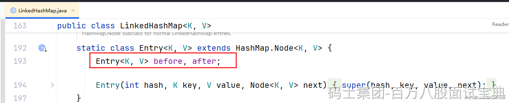

**HashSet底层怎么实现的？**

这还用问么，前面说了，HashSet底层就是HashMap的key。

**Map和Set区别？**

没有所谓的区别，Set是基于Map的key实现的。

**LinkedHashSet是怎么保证存储有序的？**

你也可以理解为LinkedHashMap是怎么保证存取有序的。。所以他还是基于哈希表去存的。而哈希表有个特点，必然是基于key的hash运算跟数组做一些操作，得到要存储的索引位置，顺序必然是随机的，但是LinkedHashSet就是有序的，怎么保证的？

其实没啥难的，就是对HashMap里的Node又包装了一层，搞了个before和after，来记录存取顺序

**当插入重复元素时，内部流程怎么走的？**

将之前Node的value做了个替换。。
