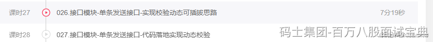

low的方案：直接说你项目中用到了什么框架，框架里面涉及了什么设计模式~~

**But，之前我听录音，有面试官问问题的时候，直接说，别聊框架，说你自己的实际落地的设计模式。**

所以咱们要 **提前准备** 项目中落地的设计模式，虽然我知道很多同学，实际项目没涉及到落地设计模式，但是你面试必须有！！！

如果贴合项目聊：

- low方案：单例，工厂，代理。
- 正常最好聊：策略，责任链，观察者，模板……

比如我们做的短信平台项目，里面涉及到了多个校验的操作，我们希望这些校验操作之间可以做到解耦，并且根据客户的情况不同，做到一个定制化的校验。

比如客户A： 1，3，2，5，6，4顺序校验

比如客户B： 1，2，3 顺序校验

针对每个客户保存他要做的校验规则，存储客户的某个字段里。

可以将校验规则向上抽取一个接口，所有的校验规则都去实现这个接口，编写具体的逻辑。

然后利用Spring4版本中的泛型注入，直接从Spring的一级缓存里，将这个校验接口的所有实现类注入到我的业务代码。

根据客户存储的校验规则查询出来，然后在一级缓存（Map），获取对应的校验实现类去执行校验逻辑。

**你想想Mybatis的Cache，再想想Servlet规范中的Filter，再想想SpringMVC中的Interceptor。。。**

> <https://www.mashibing.com/course/1957>
>
> 

## ​
