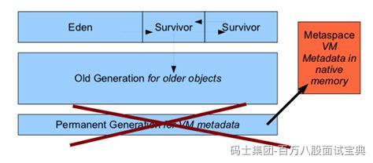

Java 8 中引入 MetaSpace 替代 PermGen，主要是为了解决 PermGen 限制导致的灵活性不足和频繁 Full GC 的问题。PermGen 是 JVM heap 内的一块固定大小区，用于存放类元数据、字符串常量池等信息，但其容量受 `-XX:MaxPermSize` 限制，一旦空间耗尽就会抛出 `OutOfMemoryError: PermGen`。且动态加载/卸载类会导致 PermGen 空间管理复杂，Full GC 也必须处理这块区域，影响效率。

MetaSpace 将类元数据移至操作系统的本地内存（native memory），不再受限于堆大小。它默认可以自动扩展至系统可用内存大小，减少了挂起 Full GC 的频率，同时卸载类时回收元数据更加灵活 。虽然也可通过 `-XX:MaxMetaspaceSize` 进行限制，但不会像 PermGen 那样固定死，大幅降低了 OOM 的可能性。

因此，MetaSpace 提高了元数据存储的动态管理能力，简化了 GC 逻辑，提升性能和可维护性，同时也消除了开发者调整 PermGen 参数的痛点，是更现代、更高效的设计选择。
