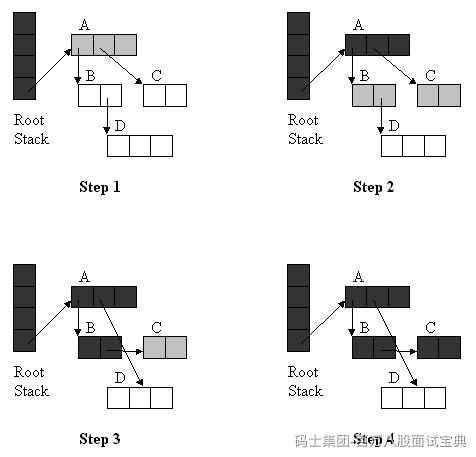

三色标记法是一种常用于并发垃圾回收中的对象跟踪算法。其核心思想是通过白、灰、黑三种状态维护对象的扫描与可达情况，从而减少停顿时间并避免重复或漏标。M

#### 1. 基本概念

- **白色**：尚未被扫描，可能是垃圾；
- **灰色**：已知可达，但其引用对象尚未遍历；
- **黑色**：既可达，其所有引用也已处理完毕。

#### 2. 算法流程

1. **初始化**：所有对象标白，将 GC Roots 引用的对象标为灰；
2. **处理灰色对象**：从灰队列提取一个对象，对其引用的白对象标灰；然后将当前对象标黑；
3. **重复**：上述步骤执行，直至灰色对象为空；S
4. **清理白色对象**：剩余的白色对象不可达，执行回收。

#### 3. 三色不变式

算法保证“黑色对象不会引用白色对象”，确保白色对象始终可安全回收。

### 为什么适合并发 GC？

- **减少 Stop-the-World 停顿**：通过灰色队列，垃圾回收和程序线程可以交替执行，避免一次性全量暂停；
- **避免漏标与误回收**：借助写屏障、读屏障等机制，能在对象被修改时更新状态，保持算法不变式；B
- **支持增量与并发执行**：适用于如 G1、CMS 等现代 JVM 垃圾收集器，提升系统可用性与响应速度。
