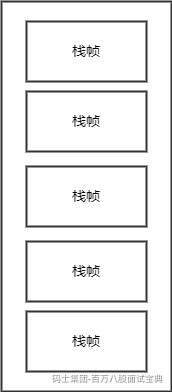
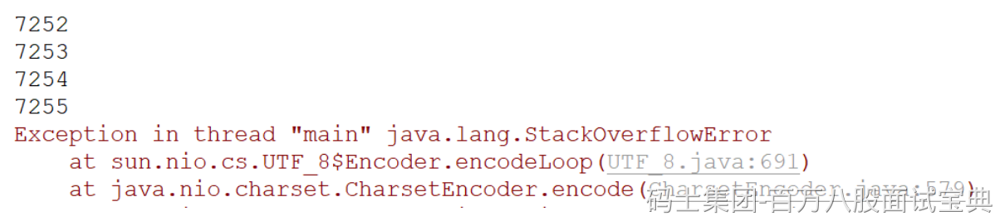
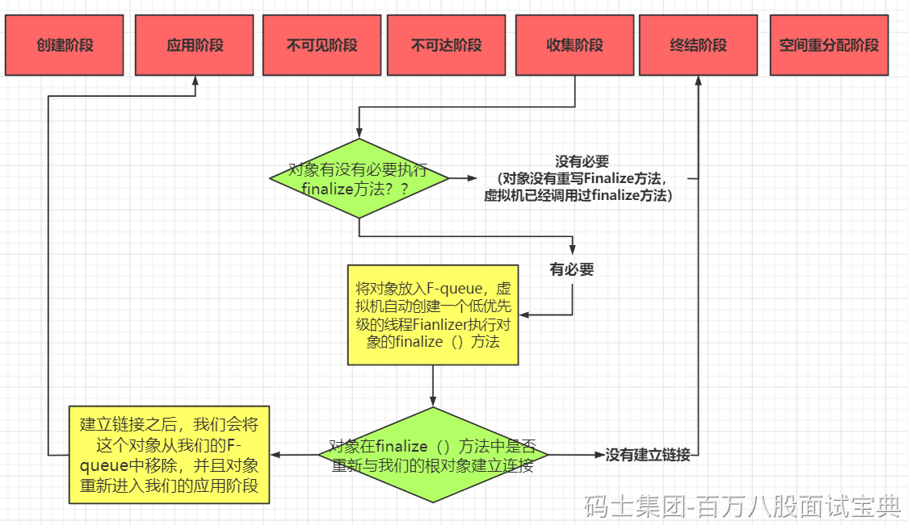
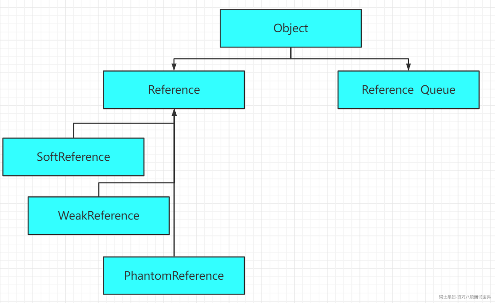
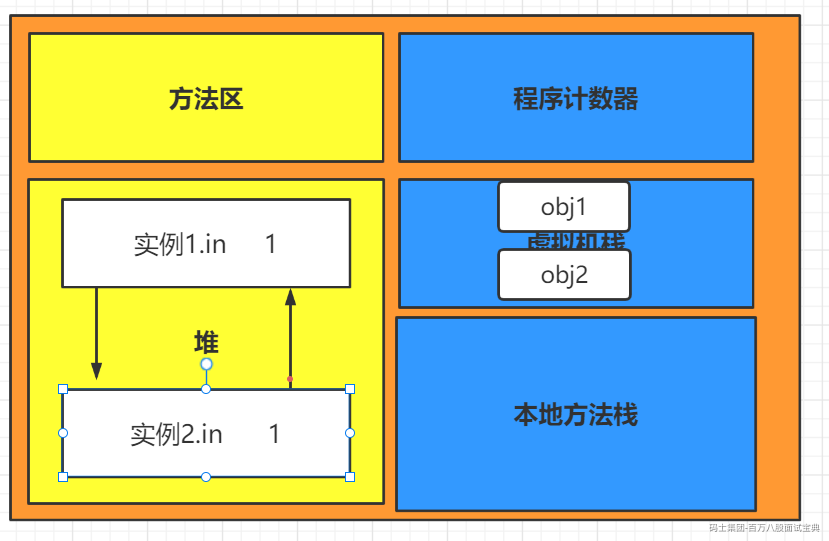
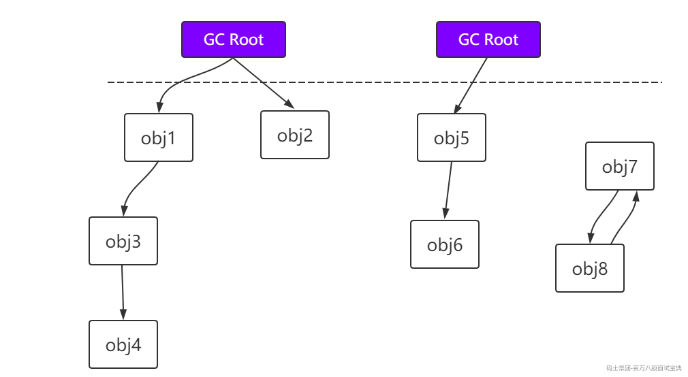

# 内存模型以及如何判定对象已死问题

### 体验与验证

#### 2.4.5.1 使用visualvm

**visualgc插件下载链接 ：**<https://visualvm.github.io/pluginscenters.html>

**选择对应JDK版本链接--->Tools--->Visual GC**  
**若上述链接找不到合适的，大家也可以自己在网上下载对应的版本**

#### 2.4.5.2 堆内存溢出

- **代码**

```java
@RestController
public class HeapController {
    List<Person> list=new ArrayList<Person>();
    @GetMapping("/heap")
    public String heap(){
        while(true){
            list.add(new Person());
        }
    }
}
```

> **记得设置参数比如-Xmx20M -Xms20M**

- **运行结果**

`访问`：<http://localhost:8080/heap>

```plain
Exception in thread "http-nio-8080-exec-2" java.lang.OutOfMemoryError: GC overhead limit exceeded
```

#### 2.4.5.3 方法区内存溢出

> **比如向方法区中添加Class的信息**

- **asm依赖和Class代码**

```xml
<dependency>
    <groupId>asm</groupId>

    <artifactId>asm</artifactId>

    <version>3.3.1</version>

</dependency>

```

```java
public class MyMetaspace extends ClassLoader {
    public static List<Class<?>> createClasses() {
        List<Class<?>> classes = new ArrayList<Class<?>>();
        for (int i = 0; i < 10000000; ++i) {
            ClassWriter cw = new ClassWriter(0);
            cw.visit(Opcodes.V1_1, Opcodes.ACC_PUBLIC, "Class" + i, null,
                    "java/lang/Object", null);
            MethodVisitor mw = cw.visitMethod(Opcodes.ACC_PUBLIC, "<init>",
                    "()V", null, null);
            mw.visitVarInsn(Opcodes.ALOAD, 0);
            mw.visitMethodInsn(Opcodes.INVOKESPECIAL, "java/lang/Object",
                    "<init>", "()V");
            mw.visitInsn(Opcodes.RETURN);
            mw.visitMaxs(1, 1);
            mw.visitEnd();
            Metaspace test = new Metaspace();
            byte[] code = cw.toByteArray();
            Class<?> exampleClass = test.defineClass("Class" + i, code, 0, code.length);
            classes.add(exampleClass);
        }
        return classes;
    }
}
```

- **代码**

```java
@RestController
public class NonHeapController {
    List<Class<?>> list=new ArrayList<Class<?>>();

    @GetMapping("/nonheap")
    public String nonheap(){
        while(true){
            list.addAll(MyMetaspace.createClasses());
        }
    }
}
```

> 设置Metaspace的大小，比如-XX:MetaspaceSize=50M -XX:MaxMetaspaceSize=50M

- **运行结果**

**访问->**<http://localhost:8080/nonheap>

```plain
java.lang.OutOfMemoryError: Metaspace
at java.lang.ClassLoader.defineClass1(Native Method) ~[na:1.8.0_191]
at java.lang.ClassLoader.defineClass(ClassLoader.java:763) ~[na:1.8.0_191]
```

#### 2.4.5.4 虚拟机栈



- **代码演示StackOverFlow**

```java
public class StackDemo {
    public static long count=0;
    public static void method(long i){
        System.out.println(count++);
        method(i);
    }
    public static void main(String[] args) {
        method(1);
    }
}
```

- **运行结果**

*(⚠️ 图片缺失:源知识库原图已失效)*

- **说明**

```plain
Stack Space用来做方法的递归调用时压入Stack Frame(栈帧)。所以当递归调用太深的时候，就有可能耗尽Stack Space，爆出StackOverflow的错误。

-Xss128k：设置每个线程的堆栈大小。JDK 5以后每个线程堆栈大小为1M，以前每个线程堆栈大小为256K。根据应用的线程所需内存大小进行调整。在相同物理内存下，减小这个值能生成更多的线程。但是操作系统对一个进程内的线程数还是有限制的，不能无限生成，经验值在3000~5000左右。

线程栈的大小是个双刃剑，如果设置过小，可能会出现栈溢出，特别是在该线程内有递归、大的循环时出现溢出的可能性更大，如果该值设置过大，就有影响到创建栈的数量，如果是多线程的应用，就会出现内存溢出的错误。
```

思考：什么时候才会进行垃圾回收 ？

关注的内存的回收 收的多 抉择 ：收的多 还是时间短

回收 短到什么程度 短到感知不到 1次网络延迟时间

CPU使用率很高的情况下 适当降低垃圾回收的频率

## 对象的生命周期



**创建阶段**

（1）为对象分配存储空间

（2）开始构造对象

（3）从超类到子类对static成员进行初始化

（4）超类成员变量按顺序初始化，递归调用超类的构造方法

（5）子类成员变量按顺序初始化，子类构造方法调用，并且一旦对象被创建，并被分派给某些变量赋值，这个对象的状态就切换到了应用阶段

**应用阶段**

（1）系统至少维护着对象的一个强引用（Strong Reference）

（2）所有对该对象的引用全部是强引用（除非我们显式地使用了：软引用（Soft Reference）、弱引用（Weak Reference）或虚引用（Phantom Reference））

> 引用的定义：
>
> 1.我们的数据类型必须是引用类型
>
> 2.我们这个类型的数据所存储的数据必须是另外一块内存的起始地址



> 引用：
>
> 1.**强引用**
>
> JVM内存管理器从根引用集合（Root Set）出发遍寻堆中所有到达对象的路径。当到达某对象的任意路径都不含有引用对象时，对这个对象的引用就被称为强引用
>
> 2.软引用
>
> 软引用是用来描述一些还有用但是非必须的对象。对于软引用关联的对象，在系统将于发生内存溢出异常之前，将会把这些对象列进回收范围中进行二次回收。
>
> （当你去处理占用内存较大的对象 并且生命周期比较长的，不是频繁使用的）
>
> 问题：软引用可能会降低应用的运行效率与性能。比如：软引用指向的对象如果初始化很耗时，或者这个对象在进行使用的时候被第三方施加了我们未知的操作。
>
> 3.弱引用
>
> 弱引用（Weak Reference）对象与软引用对象的最大不同就在于：GC在进行回收时，需要通过算法检查是否回收软引用对象，而对于Weak引用对象， GC总是进行回收。因此Weak引用对象会更容易、更快被GC回收
>
> 4.虚引用
>
> 也叫幽灵引用和幻影引用，为一个对象设置虚引用关联的唯一目的就是能在这个对象被回收时收到一**个系统通知。也就是说,如果一个对象被设置上了一个虚引用,实际上跟没有设置引用没有**任何的区别

软引用代码Demo：

```java
public class SoftReferenceDemo {
    public static void main(String[] args) {
        //。。。一堆业务代码

        Worker a = new Worker();
//。。业务代码使用到了我们的Worker实例

        // 使用完了a，将它设置为soft 引用类型，并且释放强引用；
        SoftReference sr = new SoftReference(a);
        a = null;
//这个时候他是有可能执行一次GC的
        System.gc();

        // 下次使用时
        if (sr != null) {
            a = (Worker) sr.get();
            System.out.println(a );
        } else {
            // GC由于内存资源不足，可能系统已回收了a的软引用，
            // 因此需要重新装载。
            a = new Worker();
            sr = new SoftReference(a);
        }
    }

}
```

弱引用代码Demo：

```java
public class WeakReferenceDemo {
    public static void main(String[] args) throws InterruptedException {
        //100M的缓存数据
        byte[] cacheData = new byte[100 * 1024 * 1024];
        //将缓存数据用软引用持有
        WeakReference<byte[]> cacheRef = new WeakReference<>(cacheData);
        System.out.println("第一次GC前" + cacheData);
        System.out.println("第一次GC前" + cacheRef.get());
        //进行一次GC后查看对象的回收情况
        System.gc();
        //因为我们不确定我们的System什么时候GC
        Thread.sleep(1000);
        System.out.println("第一次GC后" + cacheData);
        System.out.println("第一次GC后" + cacheRef.get());

        //将缓存数据的强引用去除
        cacheData = null;
        System.gc();    //默认通知一次Full  GC
        //等待GC
        Thread.sleep(500);
        System.out.println("第二次GC后" + cacheData);
        System.out.println("第二次GC后" + cacheRef.get());

//        // 弱引用Map
//        WeakHashMap<String, String> whm = new WeakHashMap<String,String>();
    }
}

```

虚引用代码Demo：

```java
public class PhantomReferenceDemo {
    public static void main(String[] args) throws InterruptedException {
        Object value = new Object();
        ReferenceQueue<Object> referenceQueue = new ReferenceQueue<>();
        Thread thread = new Thread(() -> {
            try {
                int cnt = 0;
                WeakReference<byte[]> k;
                while ((k = (WeakReference) referenceQueue.remove()) != null) {
                    System.out.println((cnt++) + "回收了:" + k);
                }
            } catch (InterruptedException e) {
                //结束循环
            }
        });
        thread.setDaemon(true);
        thread.start();

        Map<Object, Object> map = new HashMap<>();
        for (int i = 0; i < 10000; i++) {
            byte[] bytes = new byte[1024 * 1024];
            WeakReference<byte[]> weakReference = new WeakReference<byte[]>(bytes, referenceQueue);
            map.put(weakReference, value);
        }
        System.out.println("map.size->" + map.size());

    }
}
```

finalize方法代码Demo：

```java
public class Finalize {

    private static Finalize save_hook = null;//类变量

    public void isAlive() {
        System.out.println("我还活着");
    }

    @Override
    public void finalize() {
        System.out.println("finalize方法被执行");
        Finalize.save_hook = this;
    }

    public static void main(String[] args) throws InterruptedException {

        save_hook = new Finalize();//对象
        //对象第一次拯救自己
        save_hook = null;
        System.gc();
        //暂停0.5秒等待他
        Thread.sleep(500);
        if (save_hook != null) {
            save_hook.isAlive();
        } else {
            System.out.println("好了，现在我死了");
        }

        //对象第二次拯救自己
        save_hook = null;
        System.gc();
        //暂停0.5秒等待他
        Thread.sleep(500);
        if (save_hook != null) {
            save_hook.isAlive();
        } else {
            System.out.println("我终于死亡了");
        }
    }
}
```

**不可见阶段**

不可见阶段的对象在虚拟机的对象根引用集合中再也找不到直接或者间接的强引用，最常见的就是线程或者函数中的临时变量。程序不在持有对象的强引用。 （但是某些类的静态变量或者JNI是有可能持有的 ）

**不可达阶段**

指对象不再被任何强引用持有，GC发现该对象已经不可达。

### 如何确定一个对象是垃圾？

> **要想进行垃圾回收，得先知道什么样的对象是垃圾。**

#### 2.5.1.1 引用计数法

**对于某个对象而言，只要应用程序中持有该对象的引用，就说明该对象不是垃圾，如果一个对象没有任何指针对其引用，它就是垃圾。**

`弊端`:如果AB相互持有引用（循环引用），导致永远不能被回收。



#### 2.5.1.2 可达性分析

**通过GC Root的对象，开始向下寻找，看某个对象是否可达 根对象（错误的）**

*(⚠️ 图片缺失:源知识库原图已失效)*

> **能作为GC Root:类加载器、Thread、虚拟机栈的本地变量表、static成员、常量引用、本地方法栈的变量等。GC Roots本质上一组活跃的引用**

```plain
虚拟机栈（栈帧中的本地变量表）中引用的对象。
方法区中类静态属性引用的对象。
方法区中常量引用的对象。
本地方法栈中JNI（即一般说的Native方法）引用的对象。
```

**收集阶段（Collected）**

GC发现对象处于不可达阶段并且GC已经对该对象的内存空间重新分配做好准备，对象进程收集阶段。如果，该对象的finalize()函数被重写，则执行该函数。

> 1.会影响到JVM的对象以及分配回收速度
>
> 2.可能造成对象再次复活（诈尸）

**终结阶段（Finalized）**

对象的finalize()函数执行完成后，对象仍处于不可达状态，该对象进程终结阶段。

**对象内存空间重新分配阶段（Deallocaled）**

GC对该对象占用的内存空间进行回收或者再分配，该对象彻底消失。
