# 垃圾收集器浅析

## JVM参数

### 3.1.1 标准参数

```plain
-version
-help
-server
-cp
```

*(⚠️ 图片缺失:源知识库原图已失效)*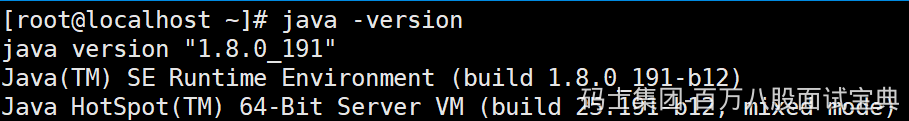

### 3.1.2 -X参数

> 非标准参数，也就是在JDK各个版本中可能会变动

```plain
-Xint     解释执行
-Xcomp    第一次使用就编译成本地代码
-Xmixed   混合模式，JVM自己来决定
```

*(⚠️ 图片缺失:源知识库原图已失效)*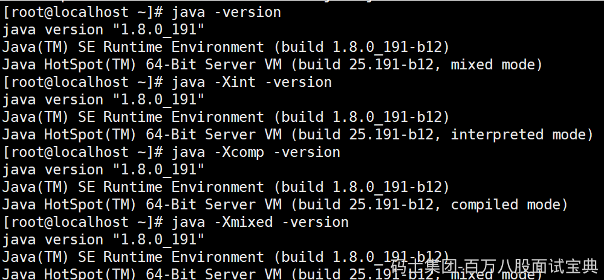

### 3.1.3 -XX参数

> 使用得最多的参数类型
>
> 非标准化参数，相对不稳定，主要用于JVM调优和Debug

```plain
a.Boolean类型
格式：-XX:[+-]<name>            +或-表示启用或者禁用name属性
比如：-XX:+UseConcMarkSweepGC   表示启用CMS类型的垃圾回收器
     -XX:+UseG1GC              表示启用G1类型的垃圾回收器
b.非Boolean类型
格式：-XX<name>=<value>表示name属性的值是value
比如：-XX:MaxGCPauseMillis=500
```

### 3.1.4 其他参数

```plain
-Xms1000M等价于-XX:InitialHeapSize=1000M
-Xmx1000M等价于-XX:MaxHeapSize=1000M
-Xss100等价于-XX:ThreadStackSize=100
```

> 所以这块也相当于是-XX类型的参数

### 3.1.5 查看参数

> java -XX:+PrintFlagsFinal -version > flags.txt

*(⚠️ 图片缺失:源知识库原图已失效)*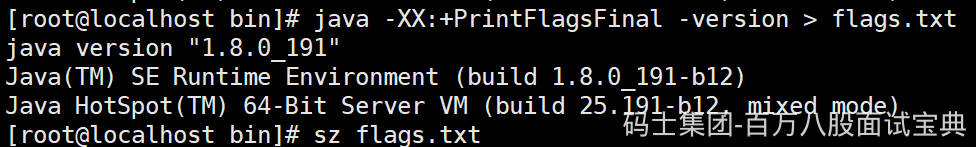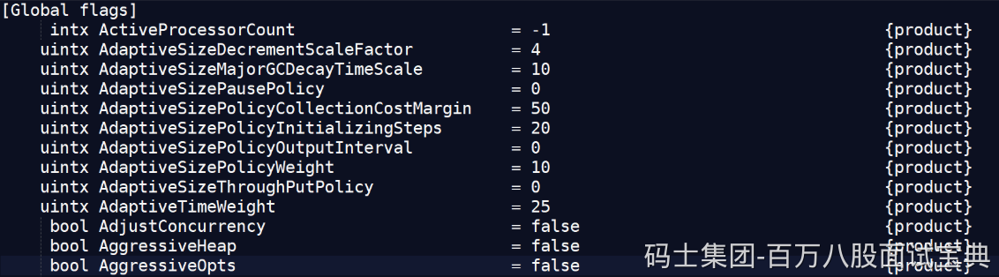

> 值得注意的是"="表示默认值，":="表示被用户或JVM修改后的值  
> 要想查看某个进程具体参数的值，可以使用jinfo，这块后面聊  
> 一般要设置参数，可以先查看一下当前参数是什么，然后进行修改

### 3.1.6 设置参数的常见方式

- 开发工具中设置比如IDEA，eclipse

- 运行jar包的时候:java -XX:+UseG1GC xxx.jar

- web容器比如tomcat，可以在脚本中的进行设置

- 通过jinfo实时调整某个java进程的参数(参数只有被标记为manageable的flags可以被实时修改)

### 3.1.7 实践和单位换算

```plain
1Byte(字节)=8bit(位)
1KB=1024Byte(字节)
1MB=1024KB
1GB=1024MB
1TB=1024GB
```

```plain
(1)设置堆内存大小和参数打印
-Xmx100M -Xms100M -XX:+PrintFlagsFinal
(2)查询+PrintFlagsFinal的值
:=true
(3)查询堆内存大小MaxHeapSize
:= 104857600
(4)换算
104857600(Byte)/1024=102400(KB)
102400(KB)/1024=100(MB)
(5)结论
104857600是字节单位
```

### 3.1.8 常用参数含义

|  |  |  |
| --- | --- | --- |
| 参数 | 含义 | 说明 |
| -XX:CICompilerCount=3 | 最大并行编译数 | 如果设置大于1，虽然编译速度会提高，但是同样影响系统稳定性，会增加JVM崩溃的可能 |
| -XX:InitialHeapSize=100M | 初始化堆大小 | 简写-Xms100M |
| -XX:MaxHeapSize=100M | 最大堆大小 | 简写-Xms100M |
| -XX:NewSize=20M | 设置年轻代的大小 |  |
| -XX:MaxNewSize=50M | 年轻代最大大小 |  |
| -XX:OldSize=50M | 设置老年代大小 |  |
| -XX:MetaspaceSize=50M | 设置方法区大小 |  |
| -XX:MaxMetaspaceSize=50M | 方法区最大大小 |  |
| -XX:+UseParallelGC | 使用UseParallelGC | 新生代，吞吐量优先 |
| -XX:+UseParallelOldGC | 使用UseParallelOldGC | 老年代，吞吐量优先 |
| -XX:+UseConcMarkSweepGC | 使用CMS | 老年代，停顿时间优先 |
| -XX:+UseG1GC | 使用G1GC | 新生代，老年代，停顿时间优先 |
| -XX:NewRatio | 新老生代的比值 | 比如-XX:Ratio=4，则表示新生代:老年代=1:4，也就是新生代占整个堆内存的1/5 |
| -XX:SurvivorRatio | 两个S区和Eden区的比值 | 比如-XX:SurvivorRatio=8，也就是(S0+S1):Eden=2:8，也就是一个S占整个新生代的1/10 |
| -XX:+HeapDumpOnOutOfMemoryError | 启动堆内存溢出打印 | 当JVM堆内存发生溢出时，也就是OOM，自动生成dump文件 |
| -XX:HeapDumpPath=heap.hprof | 指定堆内存溢出打印目录 | 表示在当前目录生成一个heap.hprof文件 |
| -XX:+PrintGCDetails -XX:+PrintGCTimeStamps -XX:+PrintGCDateStamps -Xloggc:g1-gc.log | 打印出GC日志 | 可以使用不同的垃圾收集器，对比查看GC情况 |
| -Xss128k | 设置每个线程的堆栈大小 | 经验值是3000-5000最佳 |
| -XX:MaxTenuringThreshold=6 | 提升年老代的最大临界值 | 默认值为 15 |
| -XX:InitiatingHeapOccupancyPercent | 启动并发GC周期时堆内存使用占比 | G1之类的垃圾收集器用它来触发并发GC周期,基于整个堆的使用率,而不只是某一代内存的使用比. 值为 0 则表示”一直执行GC循环”. 默认值为 45. |
| -XX:G1HeapWastePercent | 允许的浪费堆空间的占比 | 默认是10%，如果并发标记可回收的空间小于10%,则不会触发MixedGC。 |
| -XX:MaxGCPauseMillis=200ms | G1最大停顿时间 | 暂停时间不能太小，太小的话就会导致出现G1跟不上垃圾产生的速度。最终退化成Full GC。所以对这个参数的调优是一个持续的过程，逐步调整到最佳状态。 |
| -XX:ConcGCThreads=n | 并发垃圾收集器使用的线程数量 | 默认值随JVM运行的平台不同而不同 |
| -XX:G1MixedGCLiveThresholdPercent=65 | 混合垃圾回收周期中要包括的旧区域设置占用率阈值 | 默认占用率为 65% |
| -XX:G1MixedGCCountTarget=8 | 设置标记周期完成后，对存活数据上限为 G1MixedGCLIveThresholdPercent 的旧区域执行混合垃圾回收的目标次数 | 默认8次混合垃圾回收，混合回收的目标是要控制在此目标次数以内 |
| -XX:G1OldCSetRegionThresholdPercent=1 | 描述Mixed GC时，Old Region被加入到CSet中 | 默认情况下，G1只把10%的Old Region加入到CSet中 |
|  |  |  |

### 垃圾收集器

> 如果说收集算法是内存回收的方法论，那么垃圾收集器就是内存回收的具体实现。

*(⚠️ 图片缺失:源知识库原图已失效)*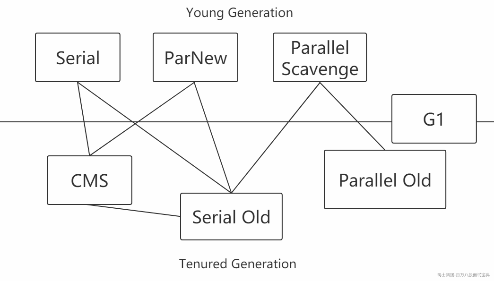

#### 2.5.5.1 Serial

Serial收集器是最基本、发展历史最悠久的收集器，曾经（在JDK1.3.1之前）是虚拟机新生代收集的唯一选择。

它是一种单线程收集器，不仅仅意味着它只会使用一个CPU或者一条收集线程去完成垃圾收集工作，更重要的是其在进行垃圾收集的时候需要暂停其他线程。

```plain
优点：简单高效，拥有很高的单线程收集效率
缺点：收集过程需要暂停所有线程
算法：复制算法
适用范围：新生代
应用：Client模式下的默认新生代收集器
```

*(⚠️ 图片缺失:源知识库原图已失效)*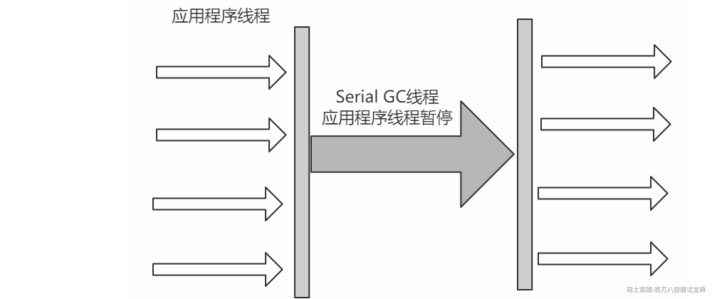

#### 2.5.5.2 Serial Old

Serial Old收集器是Serial收集器的老年代版本，也是一个单线程收集器，不同的是采用"**标记-整理算法**"，运行过程和Serial收集器一样。

*(⚠️ 图片缺失:源知识库原图已失效)*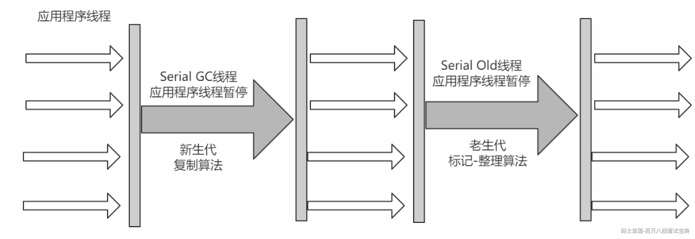

#### 2.5.5.3 ParNew

可以把这个收集器理解为Serial收集器的多线程版本。

```plain
优点：在多CPU时，比Serial效率高。
缺点：收集过程暂停所有应用程序线程，单CPU时比Serial效率差。
算法：复制算法
适用范围：新生代
应用：运行在Server模式下的虚拟机中首选的新生代收集器
```

*(⚠️ 图片缺失:源知识库原图已失效)*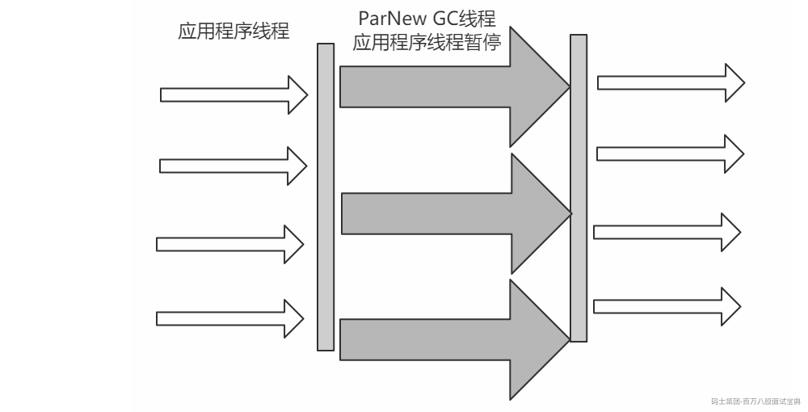

#### 2.5.5.4 Parallel Scavenge

Parallel Scavenge收集器是一个新生代收集器，它也是使用复制算法的收集器，又是并行的多线程收集器，看上去和ParNew一样，但是Parallel Scanvenge更关注系统的**吞吐量**。

> 吞吐量=运行用户代码的时间/(运行用户代码的时间+垃圾收集时间)
>
> 比如虚拟机总共运行了100分钟，垃圾收集时间用了1分钟，吞吐量=(100-1)/100=99%。
>
> 若吞吐量越大，意味着垃圾收集的时间越短，则用户代码可以充分利用CPU资源，尽快完成程序的运算任务。

```plain
-XX:MaxGCPauseMillis控制最大的垃圾收集停顿时间，
-XX:GCRatio直接设置吞吐量的大小。
```

#### 2.5.5.5 Parallel Old

Parallel Old收集器是Parallel Scavenge收集器的老年代版本，使用多线程和**标记-整理算法**进行垃圾回收，也是更加关注系统的**吞吐量**。

#### 2.5.4.6 CMS

> `官网`： <https://docs.oracle.com/javase/8/docs/technotes/guides/vm/gctuning/cms.html#concurrent_mark_sweep_cms_collector>
>
> CMS(Concurrent Mark Sweep)收集器是一种以获取 `最短回收停顿时间`为目标的收集器。
>
> 采用的是"标记-清除算法",整个过程分为4步

```plain
(1)初始标记 CMS initial mark     标记GC Roots直接关联对象，不用Tracing，速度很快
(2)并发标记 CMS concurrent mark  进行GC Roots Tracing
(3)重新标记 CMS remark           修改并发标记因用户程序变动的内容
(4)并发清除 CMS concurrent sweep 清除不可达对象回收空间，同时有新垃圾产生，留着下次清理称为浮动垃圾
```

> 由于整个过程中，并发标记和并发清除，收集器线程可以与用户线程一起工作，所以总体上来说，CMS收集器的内存回收过程是与用户线程一起并发地执行的。

*(⚠️ 图片缺失:源知识库原图已失效)*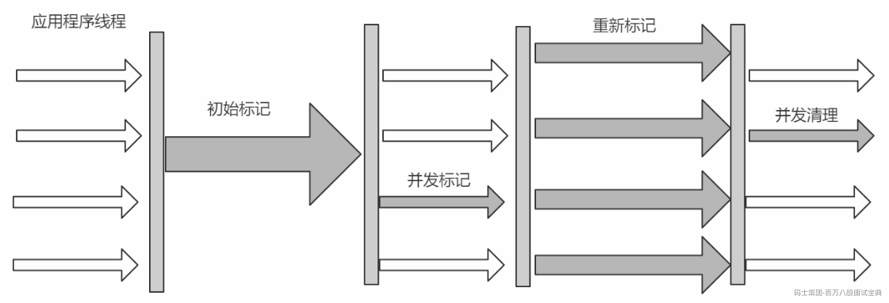

```plain
优点：并发收集、低停顿
缺点：产生大量空间碎片、并发阶段会降低吞吐量
```

#### 2.5.5.7 G1(Garbage-First)

> `官网`： <https://docs.oracle.com/javase/8/docs/technotes/guides/vm/gctuning/g1_gc.html#garbage_first_garbage_collection>
>
> 使用G1收集器时，Java堆的内存布局与就与其他收集器有很大差别，它将整个Java堆划分为多个大小相等的独立区域（Region），虽然还保留有新生代和老年代的概念，但新生代和老年代不再是物理隔离的了，它们都是一部分Region（不需要连续）的集合。
>
> 每个Region大小都是一样的，可以是1M到32M之间的数值，但是必须保证是2的n次幂
>
> 如果对象太大，一个Region放不下[超过Region大小的50%]，那么就会直接放到H中
>
> 设置Region大小：-XX:G1HeapRegionSize=M
>
> 所谓Garbage-Frist，其实就是优先回收垃圾最多的Region区域

```plain
（1）分代收集（仍然保留了分代的概念）
（2）空间整合（整体上属于“标记-整理”算法，不会导致空间碎片）
（3）可预测的停顿（比CMS更先进的地方在于能让使用者明确指定一个长度为M毫秒的时间片段内，消耗在垃圾收集上的时间不得超过N毫秒）
```

*(⚠️ 图片缺失:源知识库原图已失效)*

工作过程可以分为如下几步

```plain
初始标记（Initial Marking）      标记以下GC Roots能够关联的对象，并且修改TAMS的值，需要暂停用户线程
并发标记（Concurrent Marking）   从GC Roots进行可达性分析，找出存活的对象，与用户线程并发执行
最终标记（Final Marking）        修正在并发标记阶段因为用户程序的并发执行导致变动的数据，需暂停用户线程
筛选回收（Live Data Counting and Evacuation） 对各个Region的回收价值和成本进行排序，根据用户所期望的GC停顿时间制定回收计划
```

*(⚠️ 图片缺失:源知识库原图已失效)*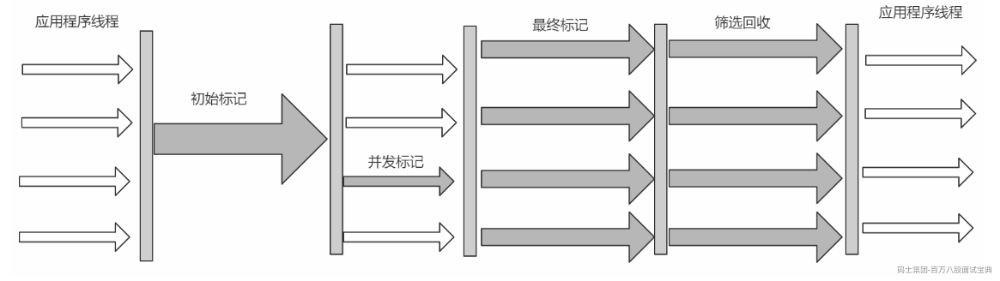

#### 2.5.5.8 ZGC

> `官网`： <https://docs.oracle.com/en/java/javase/11/gctuning/z-garbage-collector1.html#GUID-A5A42691-095E-47BA-B6DC-FB4E5FAA43D0>
>
> JDK11新引入的ZGC收集器，不管是物理上还是逻辑上，ZGC中已经不存在新老年代的概念了
>
> 会分为一个个page，当进行GC操作时会对page进行压缩，因此没有碎片问题
>
> 只能在64位的linux上使用，目前用得还比较少

（1）可以达到10ms以内的停顿时间要求

（2）支持TB级别的内存

（3）堆内存变大后停顿时间还是在10ms以内

*(⚠️ 图片缺失:源知识库原图已失效)*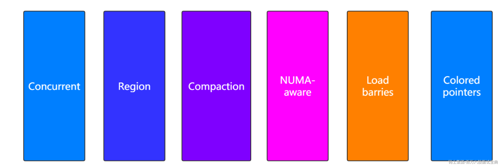

#### 2.5.5.9 垃圾收集器分类

- **串行收集器**->Serial和Serial Old

只能有一个垃圾回收线程执行，用户线程暂停。

`适用于内存比较小的嵌入式设备`。

- **并行收集器**[吞吐量优先]->Parallel Scanvenge、Parallel Old

多条垃圾收集线程并行工作，但此时用户线程仍然处于等待状态。

`适用于科学计算、后台处理等若交互场景`。

- **并发收集器**[停顿时间优先]->CMS、G1

用户线程和垃圾收集线程同时执行(但并不一定是并行的，可能是交替执行的)，垃圾收集线程在执行的时候不会停顿用户线程的运行。

`适用于相对时间有要求的场景，比如Web`。

#### 2.5.5.10 常见问题

- 吞吐量和停顿时间

```plain
停顿时间越短就越适合需要和用户交互的程序，良好的响应速度能提升用户体验；
高吞吐量则可以高效地利用CPU时间，尽快完成程序的运算任务，主要适合在后台运算而不需要太多交互的任务。
```

`小结`:这两个指标也是评价垃圾回收器好处的标准。

- 停顿时间->垃圾收集器 `进行` 垃圾回收终端应用执行响应的时间

- 吞吐量->运行用户代码时间/(运行用户代码时间+垃圾收集时间)

- 如何选择合适的垃圾收集器

> <https://docs.oracle.com/javase/8/docs/technotes/guides/vm/gctuning/collectors.html#sthref28>

- 优先调整堆的大小让服务器自己来选择

- 如果内存小于100M，使用串行收集器

- 如果是单核，并且没有停顿时间要求，使用串行或JVM自己选

- 如果允许停顿时间超过1秒，选择并行或JVM自己选

- 如果响应时间最重要，并且不能超过1秒，使用并发收集器

- 对于G1收集

JDK 7开始使用，JDK 8非常成熟，JDK 9默认的垃圾收集器，适用于新老生代。

是否使用G1收集器？

```plain
（1）50%以上的堆被存活对象占用
（2）对象分配和晋升的速度变化非常大
（3）垃圾回收时间比较长
```

- G1中的RSet

全称Remembered Set，记录维护Region中对象的引用关系

```plain
试想，在G1垃圾收集器进行新生代的垃圾收集时，也就是Minor GC，假如该对象被老年代的Region中所引用，这时候新生代的该对象就不能被回收，怎么记录呢？
不妨这样，用一个类似于hash的结构，key记录region的地址，value表示引用该对象的集合，这样就能知道该对象被哪些老年代的对象所引用，从而不能回收。
```

- 如何开启需要的垃圾收集器

> 这里JVM参数信息的设置大家先不用关心，后面会学习到。

```plain
（1）串行
    -XX：+UseSerialGC 
    -XX：+UseSerialOldGC
（2）并行(吞吐量优先)：
    -XX：+UseParallelGC
    -XX：+UseParallelOldGC
（3）并发收集器(响应时间优先)
    -XX：+UseConcMarkSweepGC
    -XX：+UseG1GC
```

*(⚠️ 图片缺失:源知识库原图已失效)*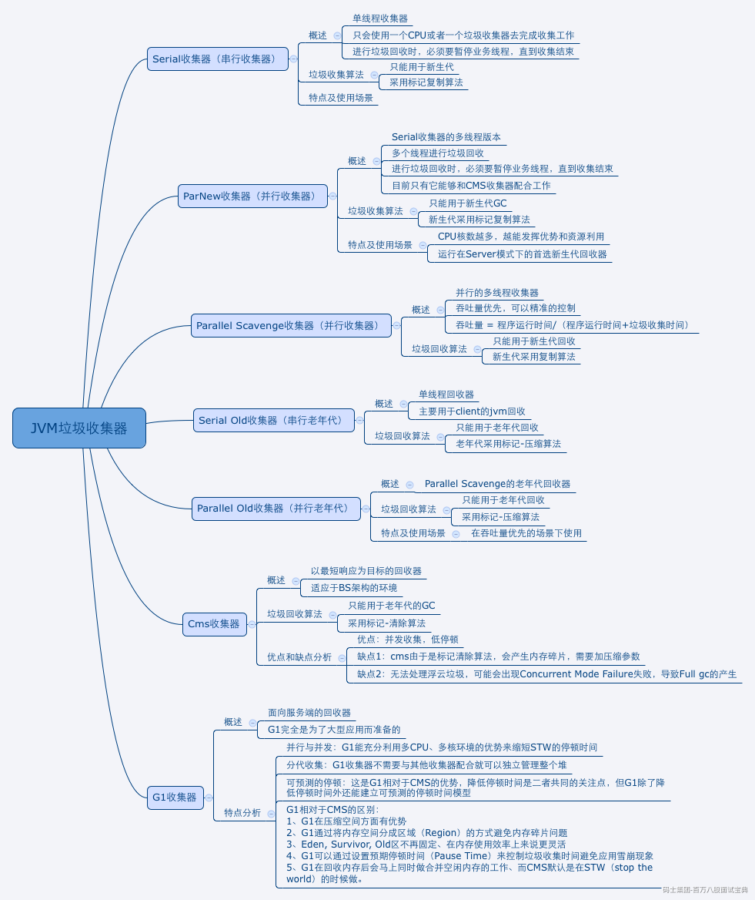

并发 垃圾收集线程 与业务线程一起执行的过程 叫并发 但是这个时候 硬件是单核的 并发不并行

并行 多个垃圾收集线程进行执行 STW

吞吐量 停顿时间 垃圾收集器的好坏的

如果停顿时间在可控制范围之内，那么优先考虑吞吐量 如果吞吐量在极限情况下，优先考虑停顿时间

0-0.5S 之上 设置一个0.5S左右的极限吞吐

优先设置最大吞吐 95% 尽可能降低停顿时间 1%的吞吐可以换来30% 98% 1S 97% 0.7S

怎么并发的 是不是完全并发 不能完全并发 减小停顿时间 并不是让停顿时间消失

垃圾收集线程 与业务线程 如何一起运行

该回收的没回收 不该回收的被回收了 产生垃圾 标记清除算法

我需要把耗时的步骤 全部并发 并且 把不耗时的步骤 STW

如果我们希望垃圾收集时间变短 我们应该怎么办 ？

标记 找出所有的GC root 并且找出所有引用链上的存活对象 并且标记

清除

初始标记：找出所有的GC root，标记直接相关联的第一个对象 STW

并发标记：找出所有的引用链上的剩余对象 耗时 并发执行

重新标记：就是将第二步所产生的垃圾进行二次标记 不耗时 STW

并发清理：清理所有垃圾 耗时 并发执行

G1

1.可以让你停顿时间变短 想多短就多短

1个小时 浏览器

2.某种程度上可以解决空间碎片的问题

Azure C4
