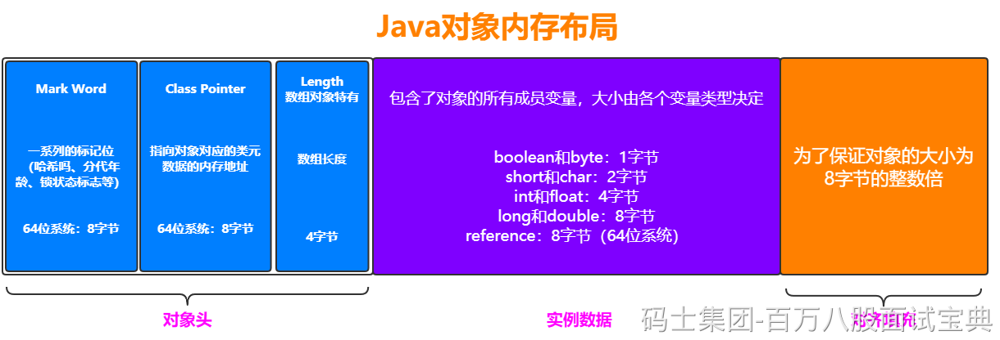
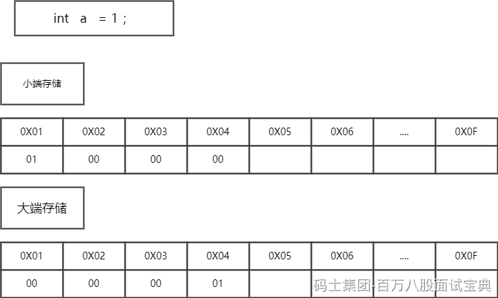
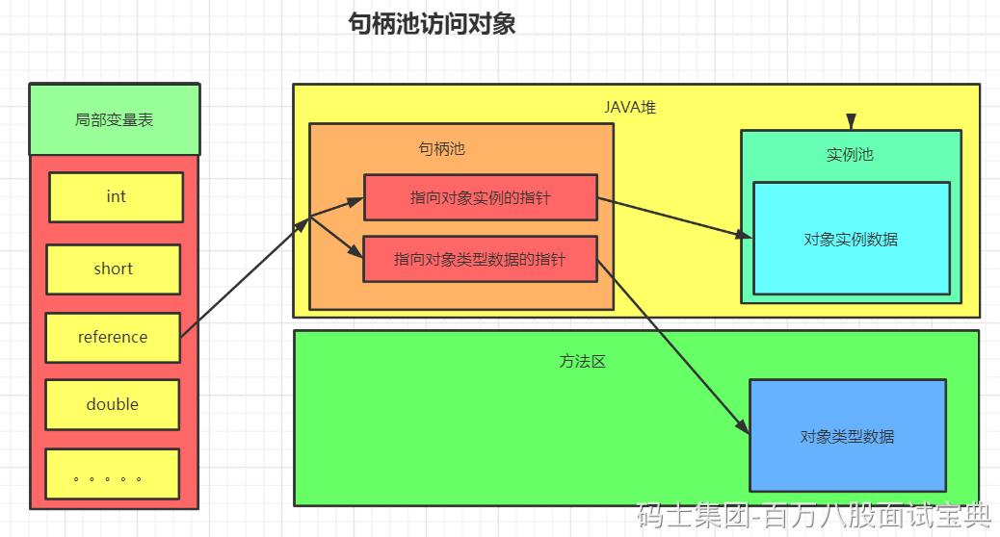
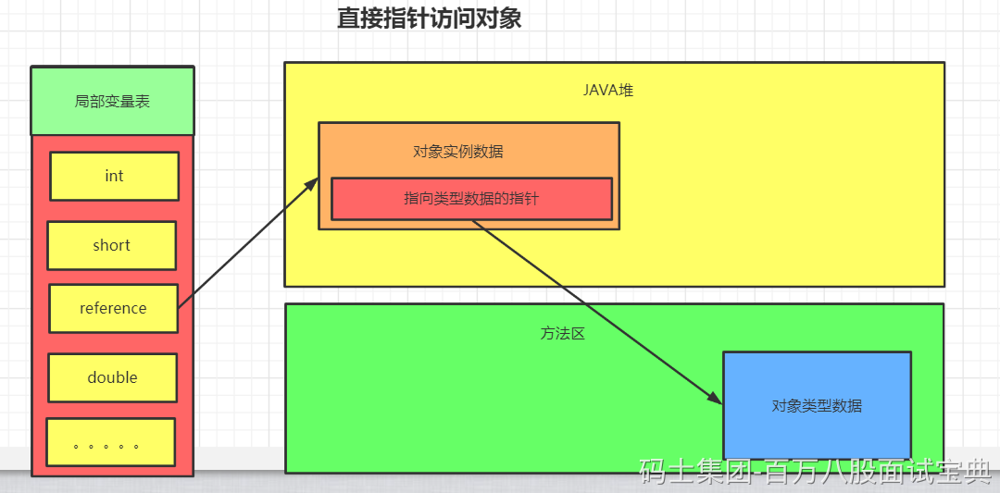
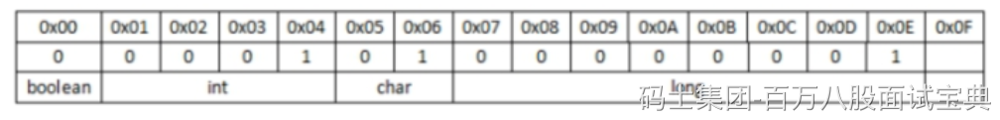
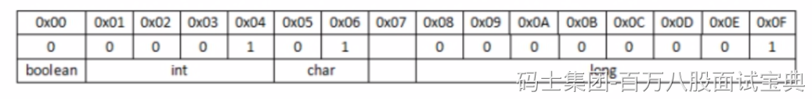
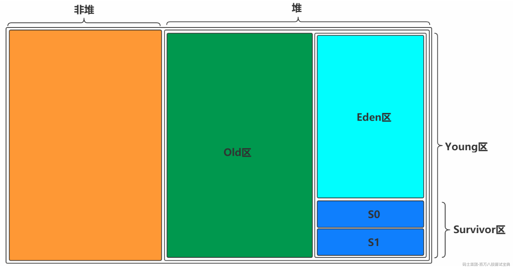
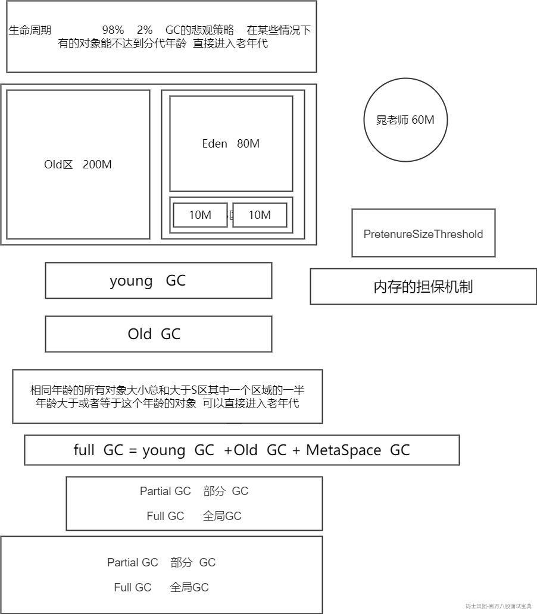
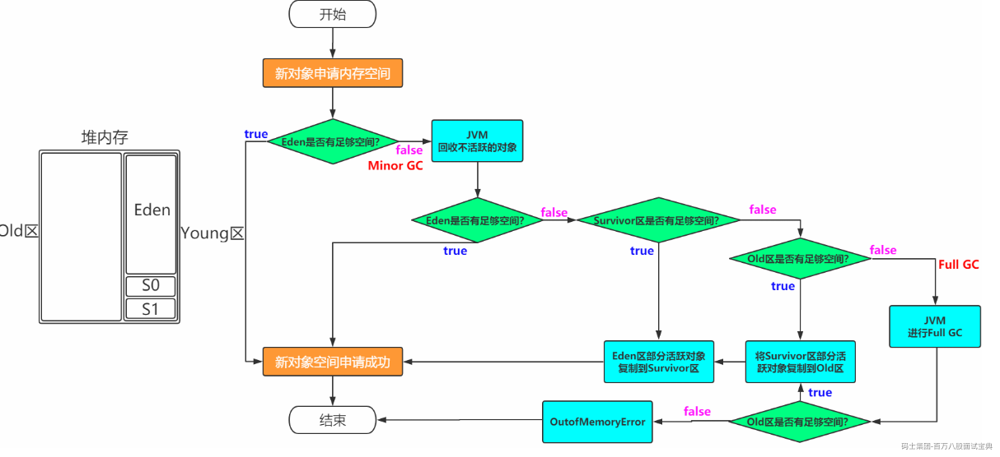
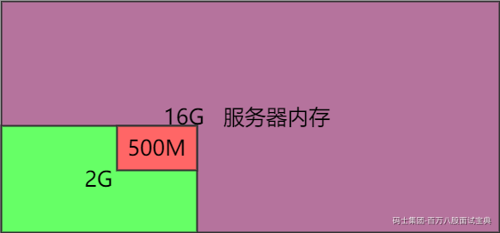

# Java对象内存模型

&#x3e; **一个Java对象在内存中包括3个部分：对象头、实例数据和对齐填充**  
&#x3e;  
&#x3e;

*(⚠️ 图片缺失:源知识库原图已失效)*

数据 内存 -- CPU 寄存器 -127 补码 10000001 - 11111111 32位的处理器

一次能够去处理32个二进制位 4字节的数据 64位操作系统 8字节 2的64次方的寻址空间

指针压缩技术 JDK1.6出现的 开启了指针压缩 什么时候指针压缩会无效 ？？

超过32G指针压缩无效



**小端存储** :便于数据之间的类型转换，例如:long类型转换为int类型时，高地址部分的数据可以直接截掉。

**大端存储** :便于数据类型的符号判断，因为最低地址位数据即为符号位，可以直接判断数据的正负号。

&#x3e; java中使用的是大端存储。

##### 内存模型设计之–Class Pointer

句柄池访问：



直接指针访问对象图解:



**区别:**

**句柄池:**

使用句柄访问对象，会在堆中开辟一块内存作为句柄池，句柄中储存了对象实例数据(属性值结构体) 的内存地址，访问类型数据的内存地址(类信息，方法类型信息)，对象实例数据一般也在heap中开 辟，类型数据一般储存在方法区中。

**优点** :reference存储的是稳定的句柄地址，在对象被移动(垃圾收集时移动对象是非常普遍的行为) 时只会改变句柄中的实例数据指针，而reference本身不需要改变。

**缺点** :增加了一次指针定位的时间开销。

**直接访问:**

直接指针访问方式指reference中直接储存对象在heap中的内存地址，但对应的类型数据访问地址需要 在实例中存储。

**优点** :节省了一次指针定位的开销。

**缺点** :在对象被移动时(如进行GC后的内存重新排列)，reference本身需要被修改

### 内存模型设计之–指针压缩

&#x3e; 指针压缩的目的：  
&#x3e;  
&#x3e; 1. 为了保证CPU普通对象指针(oop)缓存  
&#x3e; 2. 为了减少GC的发生，因为指针不压缩是8字节，这样在64位操作系统的堆上其他资源空间就少了。  
&#x3e;  
&#x3e; 64位操作系统中 内存 **&#x3e; 4G** 默认开启指针压缩技术，内存\*\*&#x3c; 4G\*\*，默认是32位系统默认不开启。内存 **&#x3e; 32G** 指针压缩失效。所以我们通常在部署服务时，JVM内存不要超过32G，因为超过32G就无法开启 指针压缩了。  
&#x3e;  
&#x3e; 内存 &#x3e; 32G指针压缩失效的原因是：4G*8 = 32G**&#x3e;**&#x3e; 32位系统的CPU 最大支持2**32 = 4G ,如果是64位系统，最大支持 2**64， 但是对其填充是按照8字节进行填充，指针压缩可以理解为在32位系统在64位上面使用，因为32位系统的CPU寻址空间最大支持4G，对其填充*8 = 32G，这就是内存&#x3e;32G指针压缩失效的原因。  
&#x3e;  
&#x3e; 关闭指针压缩 : -XX:-UseCompressedOops

2的32次方 4294967296字节 4G 如果现在老项目 32位操作系统 支持 4G以上的

PAE的特殊内核

我进行了指针压缩 4G 8字节对齐

### 内存模型设计之–对齐填充

对齐填充的意义是 **提高CPU访问数据的效率** ，主要针对会存在**该实例对象数据跨内存地址区域存储**的情况。

例如：在没有对齐填充的情况下，内存地址存放情况如下:



因为处理器只能0x00-0x07，0x08-0x0F这样读取数据，所以当我们想获取这个long型的数据时，处理 器必须要读两次内存，第一次(0x00-0x07)，第二次(0x08-0x0F)，然后将两次的结果才能获得真正的数值。

那么在有对齐填充的情况下，内存地址存放情况是这样的:



现在处理器只需要直接一次读取(0x08-0x0F)的内存地址就可以获得我们想要的数据了。

当我们的策略为0时，这个时候我们的排序是 基本类型&#x3e;填充字段&#x3e;引用类型

当我们策略为1时，引用类型&#x3e;基本类型&#x3e;填充字段

策略为2时，父类中的引用类型跟子类中的引用类型放在一起 父类采用策略0 子类采用策略1，

这样操作可以降低空间的开销 ，

## 2.4 JVM内存模型

### 2.4.1 运行时数据区

**上面对运行时数据区描述了很多，其实重点存储数据的是堆和方法区(非堆)，所以内存的设计也着重从这两方面展开(注意这两块区域都是线程共享的)。**

**对于虚拟机栈，本地方法栈，程序计数器都是线程私有的。**

**可以这样理解，JVM运行时数据区是一种规范，而JVM内存模式是对该规范的实现**

### 2.4.2 图形展示

```plain
一块是非堆区，一块是堆区
堆区分为两大块，一个是Old区，一个是Young区
Young区分为两大块，一个是Survivor区（S0+S1），一块是Eden区
S0和S1一样大，也可以叫From和To
```

*(⚠️ 图片缺失:源知识库原图已失效)*



### 2.4.3 对象创建过程

**一般情况下，新创建的对象都会被分配到Eden区，一些特殊的大的对象会直接分配到Old区。**

```plain
我是一个普通的Java对象,我出生在Eden区,在Eden区我还看到和我长的很像的小兄弟,我们在Eden区中玩了挺长时间。有一天Eden区中的人实在是太多了,我就被迫去了Survivor区的“From”区,自从去了Survivor区,我就开始漂了,有时候在Survivor的“From”区,有时候在Survivor的“To”区,居无定所。直到我18岁的时候,爸爸说我成人了,该去社会上闯闯了。于是我就去了年老代那边,年老代里,人很多,并且年龄都挺大的。
```

*(⚠️ 图片缺失:源知识库原图已失效)*

### 什么时候会触发Full GC？

1.之前每次晋升的对象的平均大小 &#x3e; 老年代的剩余空间 基于历史平均水平

2.young GC之后 存活对象超过了老年代的剩余空间 基于下一次可能的剩余空间

3.Meta Space区域空间不足

4.System.gc（）；

方法区 类信息 静态变量 常量 即时编译过后的代码 运行时常量池

JDK1.7之前 Perm space 永久代 持久代 JVM自己的内存 线性整理 会增加垃圾回收的时间

JDK1.8 Meta Space 元空间 元数据区 直接内存 减少内存碎片 节省压缩时间

类的总数 常量池的大小 方法的数量 设置JVM内存 2G



1.动态扩容

分配内存 1.7之前 线性分配

### 2.4.4 常见问题

- **如何理解Minor/Major/Full GC**

```plain
Minor GC:新生代
Major GC:老年代
Full GC:新生代+老年代
```

- **为什么需要Survivor区?只有Eden不行吗？**

```plain
如果没有Survivor,Eden区每进行一次Minor GC,存活的对象就会被送到老年代。
这样一来，老年代很快被填满,触发Major GC(因为Major GC一般伴随着Minor GC,也可以看做触发了Full GC)。
老年代的内存空间远大于新生代,进行一次Full GC消耗的时间比Minor GC长得多。
执行时间长有什么坏处?频发的Full GC消耗的时间很长,会影响大型程序的执行和响应速度。

可能你会说，那就对老年代的空间进行增加或者较少咯。
假如增加老年代空间，更多存活对象才能填满老年代。虽然降低Full GC频率，但是随着老年代空间加大,一旦发生Full GC,执行所需要的时间更长。
假如减少老年代空间，虽然Full GC所需时间减少，但是老年代很快被存活对象填满,Full GC频率增加。

所以Survivor的存在意义,就是减少被送到老年代的对象,进而减少Full GC的发生,Survivor的预筛选保证,只有经历16次Minor GC还能在新生代中存活的对象,才会被送到老年代。
```

- **为什么需要两个Survivor区？**

```plain
最大的好处就是解决了碎片化。也就是说为什么一个Survivor区不行?第一部分中,我们知道了必须设置Survivor区。假设现在只有一个Survivor区,我们来模拟一下流程:
刚刚新建的对象在Eden中,一旦Eden满了,触发一次Minor GC,Eden中的存活对象就会被移动到Survivor区。这样继续循环下去,下一次Eden满了的时候,问题来了,此时进行Minor GC,Eden和Survivor各有一些存活对象,如果此时把Eden区的存活对象硬放到Survivor区,很明显这两部分对象所占有的内存是不连续的,也就导致了内存碎片化。
永远有一个Survivor space是空的,另一个非空的Survivor space无碎片。
```

- **新生代中Eden:S1:S2为什么是8:1:1？**

```plain
新生代中的可用内存：复制算法用来担保的内存为9:1
可用内存中Eden：S1区为8:1
即新生代中Eden:S1:S2 = 8:1:1
现代的商业虚拟机都采用这种收集算法来回收新生代，IBM公司的专门研究表明，新生代中的对象大概98%是“朝生夕死”的
```

- **堆内存中都是线程共享的区域吗？**

```plain
JVM默认为每个线程在Eden上开辟一个buffer区域，用来加速对象的分配，称之为TLAB，全称:Thread Local Allocation Buffer。
对象优先会在TLAB上分配，但是TLAB空间通常会比较小，如果对象比较大，那么还是在共享区域分配。
```
