# 深入运行时数据区

### 计算机体系结构

> **JVM的设计实际上遵循了遵循冯诺依曼计算机结构**

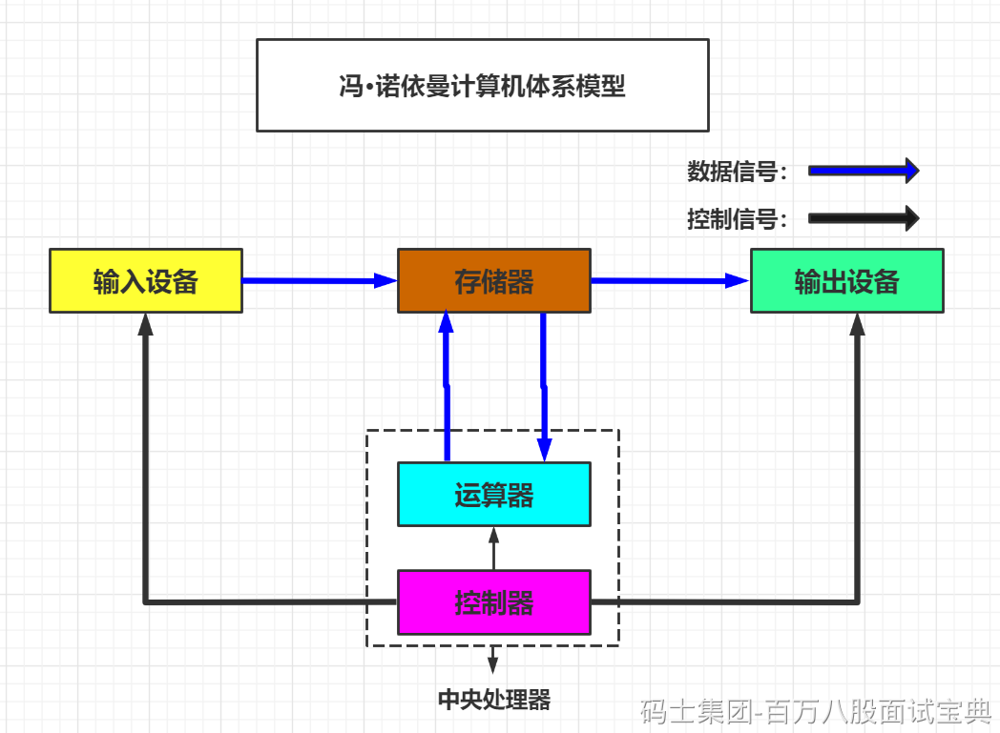

### CPU与内存交互图：

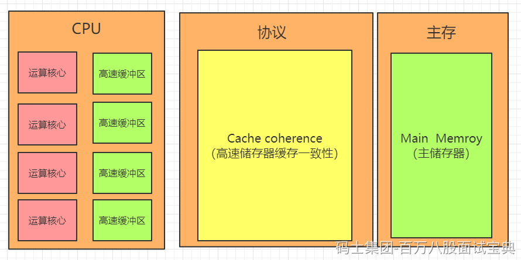

### 硬件一致性协议：

MSI、MESI、MOSI、Synapse、Firely、DragonProtocol

### 摩尔定律

摩尔定律是由英特尔(Intel)创始人之一戈登·摩尔(Gordon Moore)提出来的。其内容为：当价格不变时，集成电路上可容纳的晶体管数目，约每隔18个月便会增加一倍，性能也将提升一倍。换言之，每一美元所能买到的电脑性能，将每隔18个月翻两倍以上。这一定律揭示了信息技术进步的速度。

> 为了使摩尔定律更为准确，在摩尔定律发现后10年，1975年的时候，摩尔又做了一些修改。将翻番的时间从一年半调整为两年。

### 常量池分类：

#### 1.静态常量池

静态常量池是相对于运行时常量池来说的，属于描述class文件结构的一部分

由**字面量**和**符号引用**组成，在类被加载后会将静态常量池加载到内存中也就是运行时常量池

**字面量** ：文本，字符串以及Final修饰的内容

**符号引用** ：类，接口，方法，字段等相关的描述信息。

#### 2.运行时常量池

当静态常量池被加载到内存后就会变成运行时常量池。

> 也就是真正的把文件的内容落地到JVM内存了

#### 3.字符串常量池

\*\*设计理念：\*\*字符串作为最常用的数据类型，为减小内存的开销，专门为其开辟了一块内存区域（字符串常量池）用以存放。

JDK1.6及之前版本，字符串常量池是位于永久代（相当于现在的方法区）。

JDK1.7之后，字符串常量池位于Heap堆中

**面试常问点：（笔试居多）**

下列三种操作最多产生哪些对象

**1.直接赋值**

`String a ="aaaa";`

解析：

最多创建一个字符串对象。

首先“aaaa”会被认为字面量，先在字符串常量池中查找（.equals()）,如果没有找到，在堆中创建“aaaa”字符串对象，并且将“aaaa”的引用维护到字符串常量池中（实际是一个hashTable结构，存放key-value结构数据），再返回该引用；如果在字符串常量池中已经存在“aaaa”的引用，直接返回该引用。

**2.new String()**

`String a =new String("aaaa");`

解析：

最多会创建两个对象。

首先“aaaa”会被认为字面量，先在字符串常量池中查找（.equals()）,如果没有找到，在堆中创建“aaaa”字符串对象，然后再在堆中创建一个“aaaa”对象，返回后面“aaaa”的引用；  
**3.intern()**

```java
String s1 = new String("yzt");
String s2 = s1.intern();
System.out.println(s1 == s2); //false
```

解析：

String中的intern方法是一个 native 的方法，当调用 intern方法时，如果常量池已经包含一个等于此String对象的字符串（用equals(object)方法确定），则返回池中的字符串。否则，将intern返回的引用指向当前字符串 s1(jdk1.6版本需要将s1 复制到字符串常量池里)

常量池在内存中的布局：

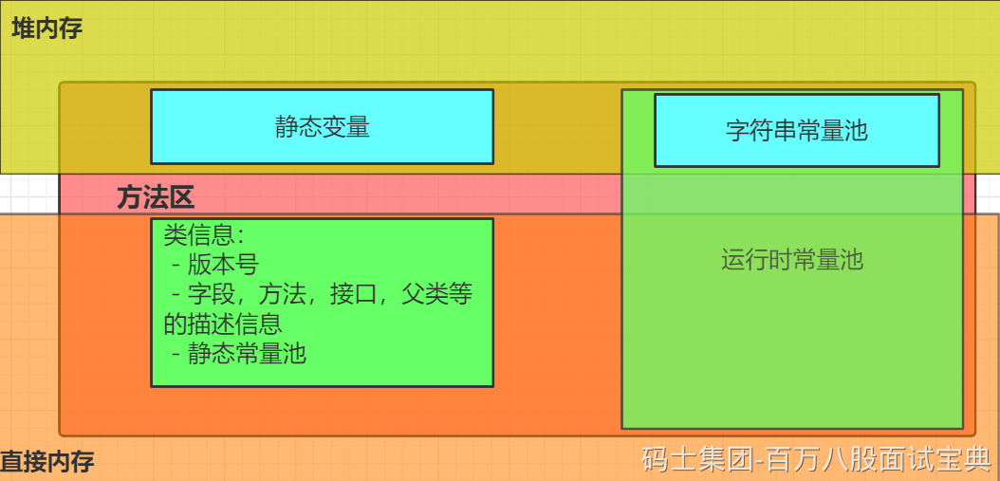

*(⚠️ 图片缺失:源知识库原图已失效)*

## 运行时数据区(Run-Time Data Areas)

```plain
在装载阶段的第(2),(3)步可以发现有运行时数据，堆，方法区等名词
(2)将这个字节流所代表的静态存储结构转化为方法区的运行时数据结构
(3)在Java堆中生成一个代表这个类的java.lang.Class对象，作为对方法区中这些数据的访问入口
说白了就是类文件被类装载器装载进来之后，类中的内容(比如变量，常量，方法，对象等这些数据得要有个去处，也就是要存储起来，存储的位置肯定是在JVM中有对应的空间)
```

### 2.3.1 官网概括

`官网`：<https://docs.oracle.com/javase/specs/jvms/se8/html/index.html>

```plain
The Java Virtual Machine defines various run-time data areas that are used during execution of a program. Some of these data areas are created on Java Virtual Machine start-up and are destroyed only when the Java Virtual Machine exits. Other data areas are per thread. Per-thread data areas are created when a thread is created and destroyed when the thread exits.
```

### 2.3.2 图解

```plain
Each run-time constant pool is allocated from the Java Virtual Machine's method area (§2.5.4).s
```

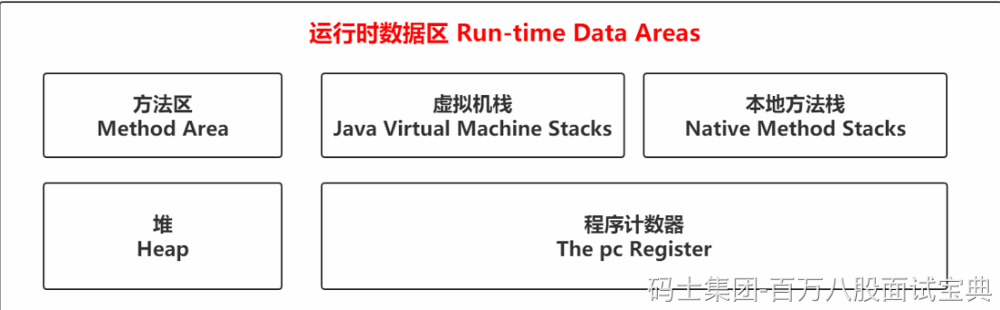

### 2.3.3 初步认识

#### 2.3.3.1 Method Area(方法区)

**（1）方法区是各个线程共享的内存区域，在虚拟机启动时创建**

```plain
The Java Virtual Machine has a method area that is shared among all Java Virtual Machine threads. 
The method area is created on virtual machine start-up. 
```

**（2）虽然Java虚拟机规范把方法区描述为堆的一个逻辑部分，但是它却又一个别名叫做Non-Heap(非堆)，目的是与Java堆区分开来**

```plain
Although the method area is logically part of the heap,......
```

**（3）用于存储已被虚拟机加载的类信息、常量、静态变量、即时编译器编译后的代码等数据**

```plain
It stores per-class structures such as the run-time constant pool, field and method data, and the code for methods and constructors, including the special methods (§2.9) used in class and instance initialization and interface initialization.
```

**（4）当方法区无法满足内存分配需求时，将抛出OutOfMemoryError异常**

```plain
If memory in the method area cannot be made available to satisfy an allocation request, the Java Virtual Machine throws an OutOfMemoryError.
```

> **此时回看装载阶段的第2步，将这个字节流所代表的静态存储结构转化为方法区的运行时数据结构**
>
> **如果这时候把从Class文件到装载的第(1)和(2)步合并起来理解的话，可以画个图**

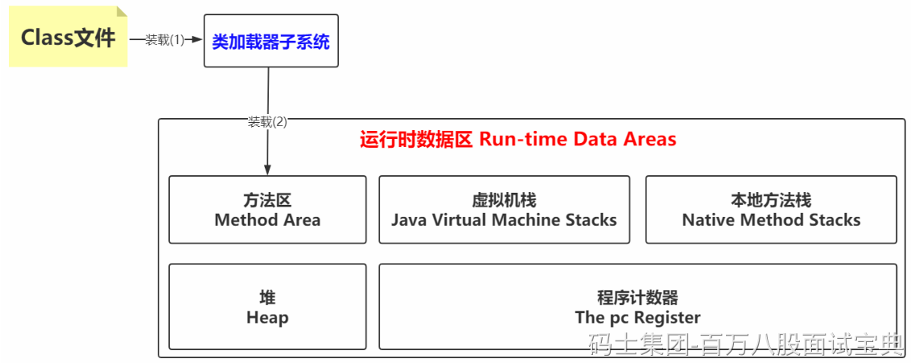

> **值得说明的**

```plain
JVM运行时数据区是一种规范，真正的实现
在JDK 8中就是Metaspace，在JDK6或7中就是Perm Space
```

#### 2.3.3.2 Heap(堆)

**（1）Java堆是Java虚拟机所管理内存中最大的一块，在虚拟机启动时创建，被所有线程共享。**

**（2）Java对象实例以及数组都在堆上分配。**

```plain
The Java Virtual Machine has a heap that is shared among all Java Virtual Machine threads. The heap is the run-time data area from which memory for all class instances and arrays is allocated.
The heap is created on virtual machine start-up.
```

> **此时回看装载阶段的第3步，在Java堆中生成一个代表这个类的java.lang.Class对象，作为对方法区中这些数据的访问入口**

`此时装载(1)(2)(3)的图可以改动一下`

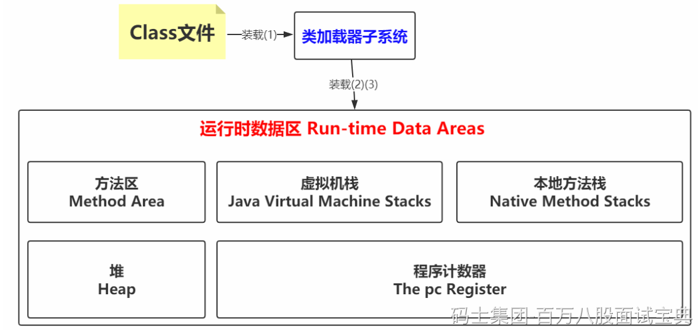

#### 2.3.3.3 Java Virtual Machine Stacks(虚拟机栈)

> **经过上面的分析，类加载机制的装载过程已经完成，后续的链接，初始化也会相应的生效。**
>
> \*\*假如目前的阶段是初始化完成了，后续做啥呢？肯定是Use使用咯，不用的话这样折腾来折腾去有什么意义？那怎样才能被使用到？换句话说里面内容怎样才能被执行？比如通过主函数main调用其他方法，这种方式实际上是main线程执行之后调用的方法，即要想使用里面的各种内容，得要以线程为单位，执行相应的方法才行。\*\***那一个线程执行的状态如何维护？一个线程可以执行多少个方法？这样的关系怎么维护呢？**

**（1）虚拟机栈是一个线程执行的区域，保存着一个线程中方法的调用状态。换句话说，一个Java线程的运行状态，由一个虚拟机栈来保存，所以虚拟机栈肯定是线程私有的，独有的，随着线程的创建而创建。**

```plain
Each Java Virtual Machine thread has a private Java Virtual Machine stack, created at the same time as the thread.
```

**（2）每一个被线程执行的方法，为该栈中的栈帧，即每个方法对应一个栈帧。**

**调用一个方法，就会向栈中压入一个栈帧；一个方法调用完成，就会把该栈帧从栈中弹出。**

```plain
 A Java Virtual Machine stack stores frames (§2.6). 
```

```plain
A new frame is created each time a method is invoked. A frame is destroyed when its method invocation completes.
```

- **图解栈和栈帧**

```plain
void a(){
b();
}
void b(){
c();
}
void c(){

}
```

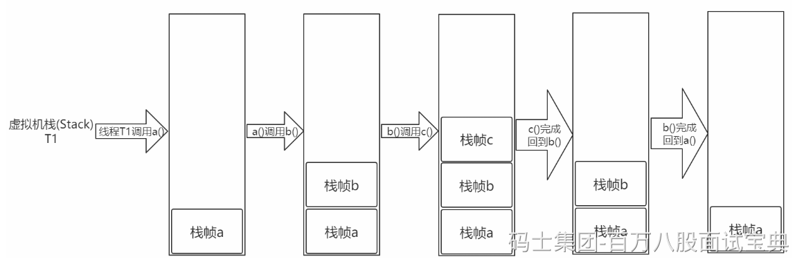

- **栈帧**

`官网`：<https://docs.oracle.com/javase/specs/jvms/se8/html/jvms-2.html#jvms-2.6>

**栈帧：每个栈帧对应一个被调用的方法，可以理解为一个方法的运行空间。**

**每个栈帧中包括局部变量表(Local Variables)、操作数栈(Operand Stack)、指向运行时常量池的引用(A reference to the run-time constant pool)、方法返回地址(Return Address)和附加信息。**

```plain
局部变量表:方法中定义的局部变量以及方法的参数存放在这张表中
局部变量表中的变量不可直接使用，如需要使用的话，必须通过相关指令将其加载至操作数栈中作为操作数使用。
```

```plain
操作数栈:以压栈和出栈的方式存储操作数的
```

```plain
动态链接:每个栈帧都包含一个指向运行时常量池中该栈帧所属方法的引用，持有这个引用是为了支持方法调用过程中的动态连接(Dynamic Linking)。
```

```plain
方法返回地址:当一个方法开始执行后,只有两种方式可以退出，一种是遇到方法返回的字节码指令；一种是遇见异常，并且这个异常没有在方法体内得到处理。
```

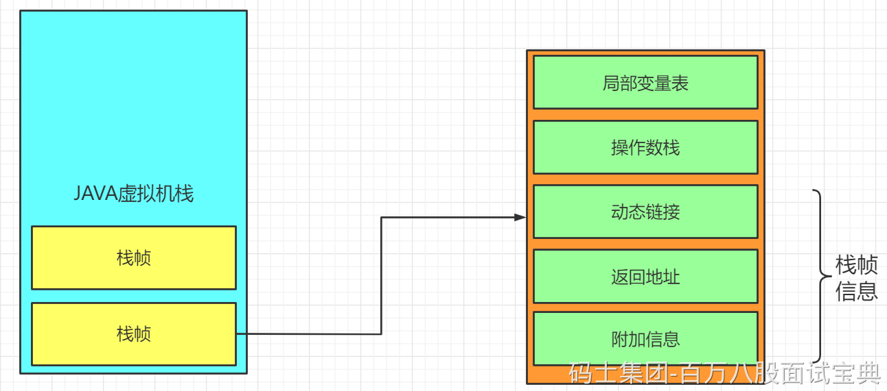

- **结合字节码指令理解栈帧**

> **javap -c Person.class > Person.txt**

```plain
Compiled from "Person.java"
class Person {
...     
 public static int calc(int, int);
  Code:
   0: iconst_3   //将int类型常量3压入[操作数栈]
   1: istore_0   //将int类型值存入[局部变量0]
   2: iload_0    //从[局部变量0]中装载int类型值入栈
   3: iload_1    //从[局部变量1]中装载int类型值入栈
   4: iadd     //将栈顶元素弹出栈，执行int类型的加法，结果入栈
   5: istore_2   //将栈顶int类型值保存到[局部变量2]中
   6: iload_2    //从[局部变量2]中装载int类型值入栈
   7: ireturn    //从方法中返回int类型的数据
...
}
```

`思考`：index的值是0还是1

```plain
On class method invocation, any parameters are passed in consecutive local variables starting from local variable 0. On instance method invocation, local variable 0 is always used to pass a reference to the object on which the instance method is being invoked (this in the Java programming language). Any parameters are subsequently passed in consecutive local variables starting from local variable 1.
```

*(⚠️ 图片缺失:源知识库原图已失效)*

#### 2.3.3.4 The pc Register(程序计数器)

> **我们都知道一个JVM进程中有多个线程在执行，而线程中的内容是否能够拥有执行权，是根据CPU调度来的。**
>
> **假如线程A正在执行到某个地方，突然失去了CPU的执行权，切换到线程B了，然后当线程A再获得CPU执行权的时候，怎么能继续执行呢？这就是需要在线程中维护一个变量，记录线程执行到的位置。**

**如果线程正在执行Java方法，则计数器记录的是正在执行的虚拟机字节码指令的地址；**

**如果正在执行的是Native方法，则这个计数器为空。**

```plain
The Java Virtual Machine can support many threads of execution at once (JLS §17). Each Java Virtual Machine thread has its own pc (program counter) register. At any point, each Java Virtual Machine thread is executing the code of a single method, namely the current method (§2.6) for that thread. If that method is not native, the pc register contains the address of the Java Virtual Machine instruction currently being executed. If the method currently being executed by the thread is native, the value of the Java Virtual Machine's pc register is undefined. The Java Virtual Machine's pc register is wide enough to hold a returnAddress or a native pointer on the specific platform.
```

#### 2.3.3.5 Native Method Stacks(本地方法栈)

**如果当前线程执行的方法是Native类型的，这些方法就会在本地方法栈中执行。**

**那如果在Java方法执行的时候调用native的方法呢？**

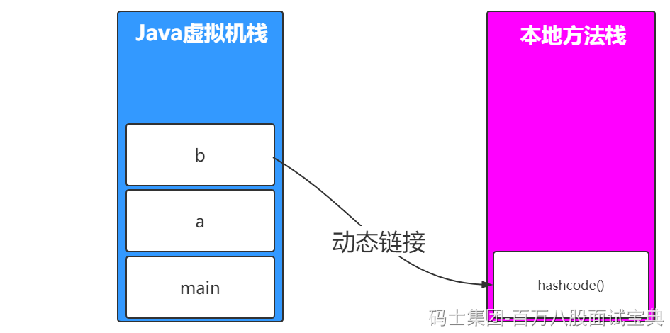

#### 栈指向堆

**如果在栈帧中有一个变量，类型为引用类型，比如Object obj=new Object()，这时候就是典型的栈中元**  
**素指向堆中的对象。**

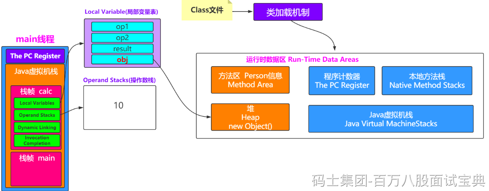

#### 2.3.4.2 方法区指向堆

**方法区中会存放静态变量，常量等数据。如果是下面这种情况，就是典型的方法区中元素指向堆中的对**  
**象。**

```plain
private static Object obj=new Object();
```

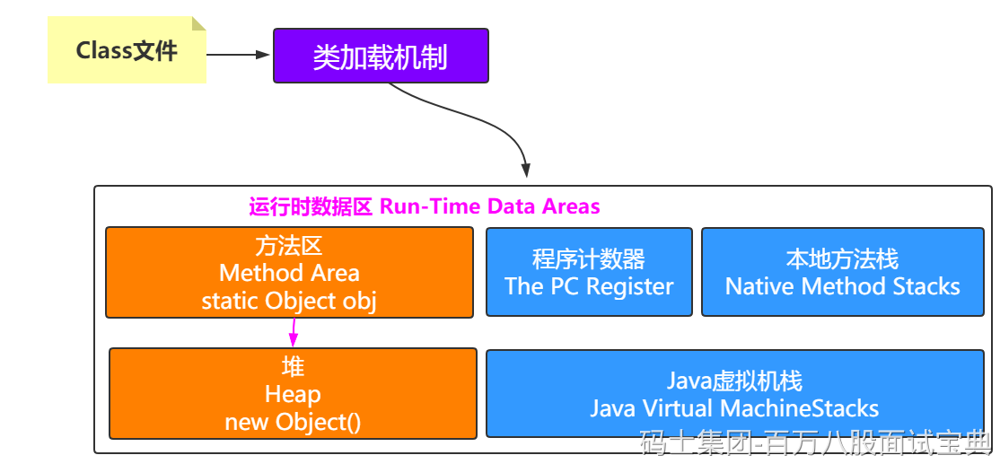

#### 2.3.4.3 堆指向方法区

**What？堆还能指向方法区？**  
**注意，方法区中会包含类的信息，堆中会有对象，那怎么知道对象是哪个类创建的呢？**

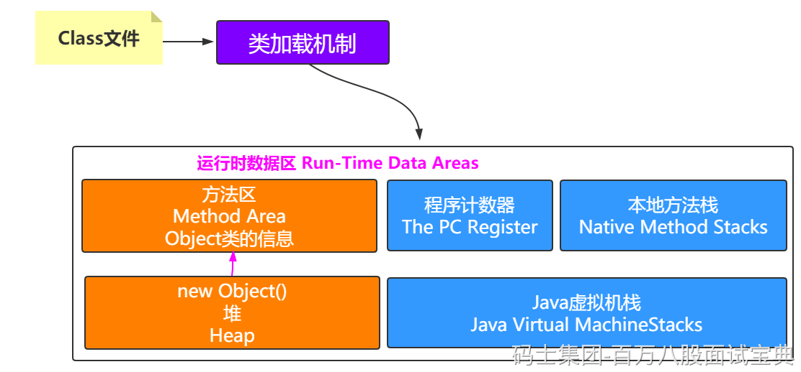

`思考`：

**一个对象怎么知道它是由哪个类创建出来的？怎么记录？这就需要了解一个Java对象的具体信息咯。**

下节课给大家详细讲解对象的内存布局
