## 常用命令

### jps

> 查看java进程

```plain
The jps command lists the instrumented Java HotSpot VMs on the target system. The command is limited to reporting information on JVMs for which it has the access permissions.
```

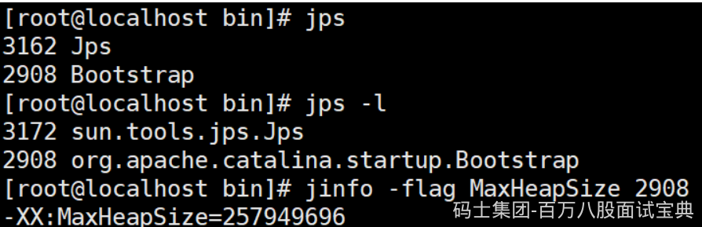

### jinfo

> （1）实时查看和调整JVM配置参数

```plain
The jinfo command prints Java configuration information for a specified Java process or core file or a remote debug server. The configuration information includes Java system properties and Java Virtual Machine (JVM) command-line flags.
```

> （2）查看用法
>
> jinfo -flag name PID 查看某个java进程的name属性的值

```plain
jinfo -flag MaxHeapSize PID 
jinfo -flag UseG1GC PID
```

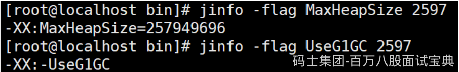

> （3）修改
>
> **参数只有被标记为manageable的flags可以被实时修改**

```plain
jinfo -flag [+|-] PID
jinfo -flag <name>=<value> PID
```

> （4）查看曾经赋过值的一些参数

```plain
jinfo -flags PID
```

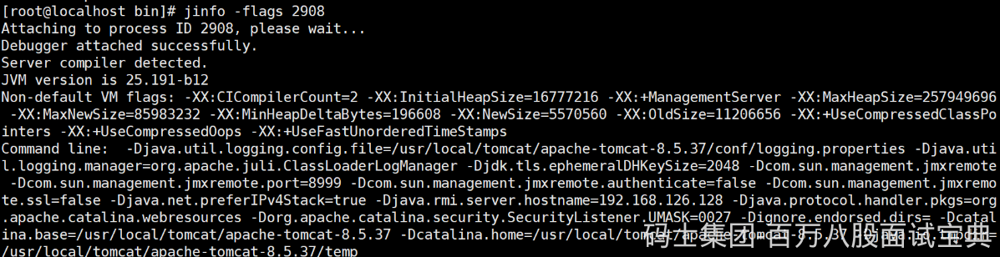

### jstat

> （1）查看虚拟机性能统计信息

```plain
The jstat command displays performance statistics for an instrumented Java HotSpot VM. The target JVM is identified by its virtual machine identifier, or vmid option.
```

> （2）查看类装载信息

```plain
jstat -class PID 1000 10   查看某个java进程的类装载信息，每1000毫秒输出一次，共输出10次
```

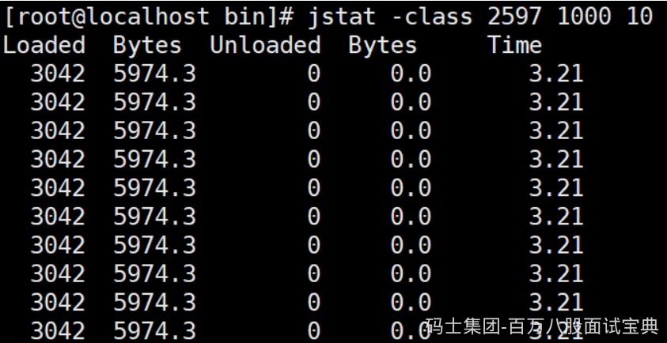

> （3）查看垃圾收集信息

```plain
jstat -gc PID 1000 10
```

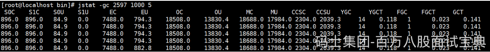

### jstack

> （1）查看线程堆栈信息

```plain
The jstack command prints Java stack traces of Java threads for a specified Java process, core file, or remote debug server.
```

> （2）用法

*(⚠️ 图片缺失:源知识库原图已失效)*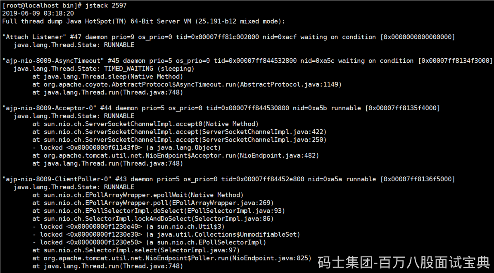

> (4)排查死锁案例

- DeadLockDemo

```java
//运行主类
public class DeadLockDemo
{
    public static void main(String[] args)
    {
        DeadLock d1=new DeadLock(true);
        DeadLock d2=new DeadLock(false);
        Thread t1=new Thread(d1);
        Thread t2=new Thread(d2);
        t1.start();
        t2.start();
    }
}
//定义锁对象
class MyLock{
    public static Object obj1=new Object();
    public static Object obj2=new Object();
}
//死锁代码
class DeadLock implements Runnable{
    private boolean flag;
    DeadLock(boolean flag){
        this.flag=flag;
    }
    public void run() {
        if(flag) {
            while(true) {
                synchronized(MyLock.obj1) {
                    System.out.println(Thread.currentThread().getName()+"----if获得obj1锁");
                    synchronized(MyLock.obj2) {
                        System.out.println(Thread.currentThread().getName()+"----if获得obj2锁");
                    }
                }
            }
        }
        else {
            while(true){
                synchronized(MyLock.obj2) {
                    System.out.println(Thread.currentThread().getName()+"----否则获得obj2锁");
                    synchronized(MyLock.obj1) {
                        System.out.println(Thread.currentThread().getName()+"----否则获得obj1锁");

                    }
                }
            }
        }
    }
}
```

- 运行结果

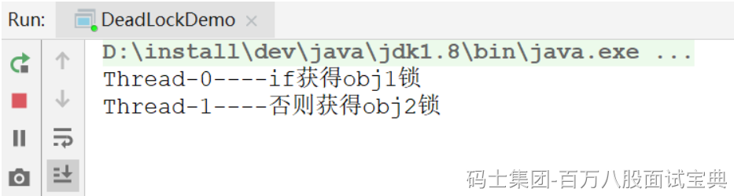

- jstack分析

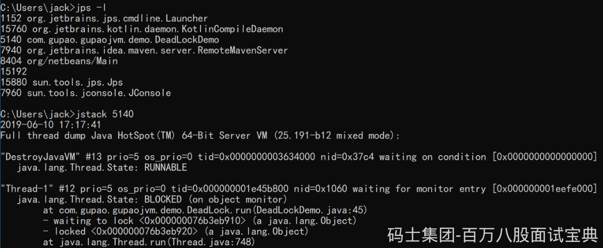

> 把打印信息拉到最后可以发现

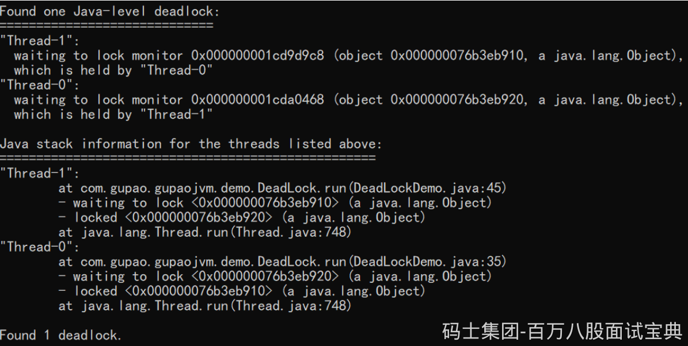

### jmap

> （1）生成堆转储快照

```plain
The jmap command prints shared object memory maps or heap memory details of a specified process, core file, or remote debug server.
```

> （2）打印出堆内存相关信息

```plain
jmap -heap PID
```

```plain
jinfo -flag UsePSAdaptiveSurvivorSizePolicy 35352
-XX:SurvivorRatio=8
```

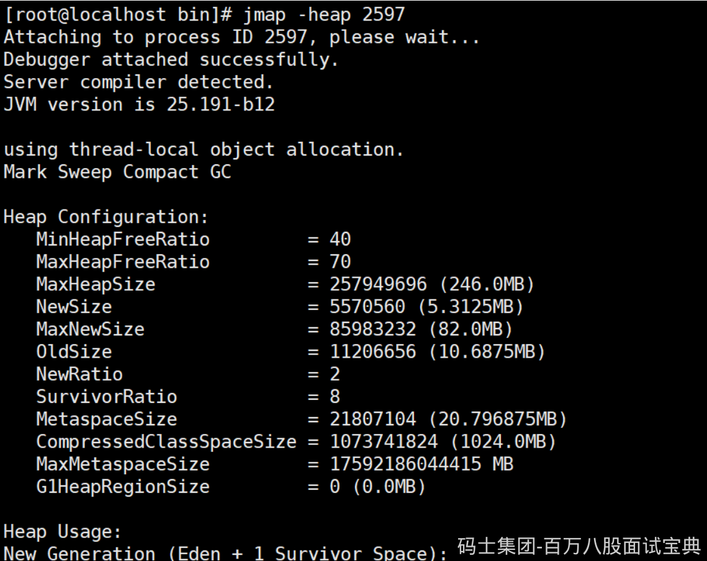

> （3）dump出堆内存相关信息

```plain
jmap -dump:format=b,file=heap.hprof PID
```

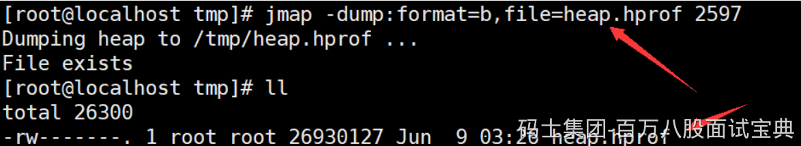

> （4）要是在发生堆内存溢出的时候，能自动dump出该文件就好了

一般在开发中，JVM参数可以加上下面两句，这样内存溢出时，会自动dump出该文件

-XX:+HeapDumpOnOutOfMemoryError -XX:HeapDumpPath=heap.hprof

```plain
设置堆内存大小: -Xms20M -Xmx20M
启动，然后访问localhost:9090/heap，使得堆内存溢出
```

## JVM内部的优化逻辑

### JVM的执行引擎

> javac编译器将Person.java源码文件编译成class文件[我们把这里的编译称为前期编译]，交给JVM运行，因为JVM只能认识class字节码文件。同时在不同的操作系统上安装对应版本的JDK，里面包含了各自屏蔽操作系统底层细节的JVM，这样同一份class文件就能运行在不同的操作系统平台之上，得益于JVM。这也是Write Once，Run Anywhere的原因所在。

> 最终JVM需要把字节码指令转换为机器码，可以理解为是0101这样的机器语言，这样才能运行在不同的机器上，那么由字节码转变为机器码是谁来做的呢？说白了就是谁来执行这些字节码指令的呢？这就是执行引擎

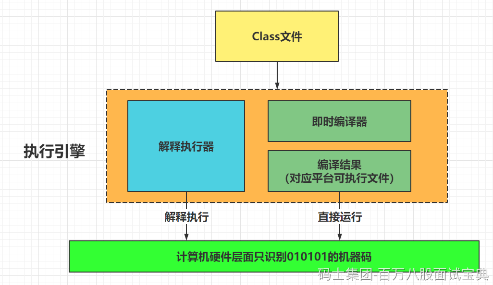

#### 解释执行

Interpreter，解释器逐条把字节码翻译成机器码并执行，跨平台的保证。

刚开始执行引擎只采用了解释执行的，但是后来发现某些方法或者代码块被调用执行的特别频繁时，就会把这些代码认定为“热点代码”。

#### 即时编译器

Just-In-Time compilation(JIT)，即时编译器先将字节码编译成对应平台的可执行文件，运行速度快。即时编译器会把这些热点代码编译成与本地平台关联的机器码，并且进行各层次的优化，保存到内存中。

#### JVM采用哪种方式

JVM采取的是混合模式，也就是解释+编译的方式，对于大部分不常用的代码，不需要浪费时间将其编译成机器码，只需要用到的时候再以解释的方式运行；对于小部分的热点代码，可以采取编译的方式，追求更高的运行效率。

#### 即时编译器类型

（1）HotSpot虚拟机里面内置了两个JIT：C1和C2

> C1也称为Client Compiler，适用于执行时间短或者对启动性能有要求的程序
>
> C2也称为Server Compiler，适用于执行时间长或者对峰值性能有要求的程序

（2）Java7开始，HotSpot会使用分层编译的方式

> 分层编译也就是会结合C1的启动性能优势和C2的峰值性能优势，热点方法会先被C1编译，然后热点方法中的热点会被C2再次编译
>
> -XX:+TieredCompilation开启参数

#### JVM的分层编译5大级别：

**0.解释执行**

**1.简单的C1编译**：仅仅使用我们的C1做一些简单的优化，不会开启Profiling

\*\*2.受限的C1编译代码：\*\*只会执行我们的方法调用次数以及循环的回边次数（多次执行的循环体）Profiling的C1编译

\*\*3.完全C1编译代码：\*\*我们Profiling里面所有的代码。也会被C1执行

\*\*4.C2编译代码：\*\*这个才是优化的级别。

> 级别越高，我们的应用启动越慢，优化下来开销会越高，同样的，我们的峰值性能也会越高

> 通常C2 代码的执行效率要比 C1 代码的高出 30% 以上

#### 分层编译级别：

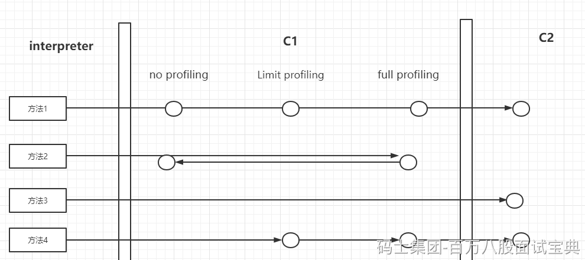

Java 虚拟机内置了 profiling。

> profiling 是指在程序执行过程中，收集能够反映程序执行状态的数据。这里所收集的数据我们称之为程序的 profile。

如果方法的字节码数目比较少（如 getter/setter），而且 3 层的 profiling 没有可收集的数据。

那么，Java 虚拟机断定该方法对于 C1 代码和 C2 代码的执行效率相同。

在这种情况下，Java 虚拟机会在 3 层编译之后，直接选择用 1 层的 C1 编译。

由于这是一个终止状态，因此 Java 虚拟机不会继续用 4 层的 C2 编译。

在 C1 忙碌的情况下，Java 虚拟机在解释执行过程中对程序进行 profiling，而后直接由 4 层的 C2 编译。

在 C2 忙碌的情况下，方法会被 2 层的 C1 编译，然后再被 3 层的 C1 编译，以减少方法在 3 层的执行时间。

> Java 8 默认开启了分层编译。-XX:+TieredCompilation开启参数
>
> 不管是开启还是关闭分层编译，原本用来选择即时编译器的参数 **-client** 和 **-server** 都是无效的。当关闭分层编译的情况下，Java 虚拟机将直接采用 C2。
>
> 如果你希望只是用 C1，那么你可以在打开分层编译的情况下使用参数 **-XX:TieredStopAtLevel=1**。在这种情况下，Java 虚拟机会在解释执行之后直接由 1 层的 C1 进行编译。

#### 热点代码：

在运行过程中会被即时编译的“热点代码” 有两类，即：

- **被多次调用的方法**

- **被多次执行的循环体**

对于第一种，编译器会将整个方法作为编译对象，这也是标准的JIT 编译方式。对于第二种是由循环体出发的，但是编译器依然会以整个方法（而不是单独的循环体）作为编译对象，因为发生在方法执行过程中，称为栈上替换（On Stack Replacement，简称为 OSR 编译，即方法栈帧还在栈上，方法就被替换了）。

#### 如何找到热点代码？

判断一段代码是否是热点代码，是不是需要触发即时编译，这样的行为称为热点探测（Hot Spot Detection），探测算法有两种，分别如下：

- \*\*基于采样的热点探测（Sample Based Hot Spot Detection）：\*\*虚拟机会周期的对各个线程栈顶进行检查，如果某些方法经常出现在栈顶，这个方法就是“热点方法”。好处是实现简单、高效，很容易获取方法调用关系。缺点是很难确认方法的 reduce，容易受到线程阻塞或其他外因扰乱。

- **基于计数器的热点探测（Counter Based Hot Spot Detection）**：为每个方法（甚至是代码块）建立计数器，执行次数超过阈值就认为是“热点方法”。优点是统计结果精确严谨。缺点是实现麻烦，不能直接获取方法的调用关系。

HotSpot 使用的是第二种——基于计数器的热点探测，并且有两类计数器：方法调用计数器（Invocation Counter ）和回边计数器（Back Edge Counter ）。

这两个计数器都有一个确定的阈值，超过后便会触发 JIT 编译。

### java两大计数器：

(1)**首先是方法调用计数器** 。Client 模式下默认阈值是 **1500** 次，在 Server 模式下是 **10000**次，这个阈值可以通过 **-XX：CompileThreadhold** 来人为设定。如果不做任何设置，方法调用计数器统计的并不是方法被调用的绝对次数，而是一个相对的执行频率，即一段时间之内的方法被调用的次数。当超过一定的时间限度，如果方法的调用次数仍然不足以让它提交给即时编译器编译，那么这个方法的调用计数器就会被减少一半，这个过程称为方法调用计数器热度的衰减（Counter Decay），而这段时间就成为此方法的统计的半衰周期（ Counter Half Life Time）。进行热度衰减的动作是在虚拟机进行垃圾收集时顺便进行的，可以使用虚拟机参数 **-XX：CounterHalfLifeTime** 参数设置半衰周期的时间，单位是秒。整个 JIT 编译的交互过程如下图。

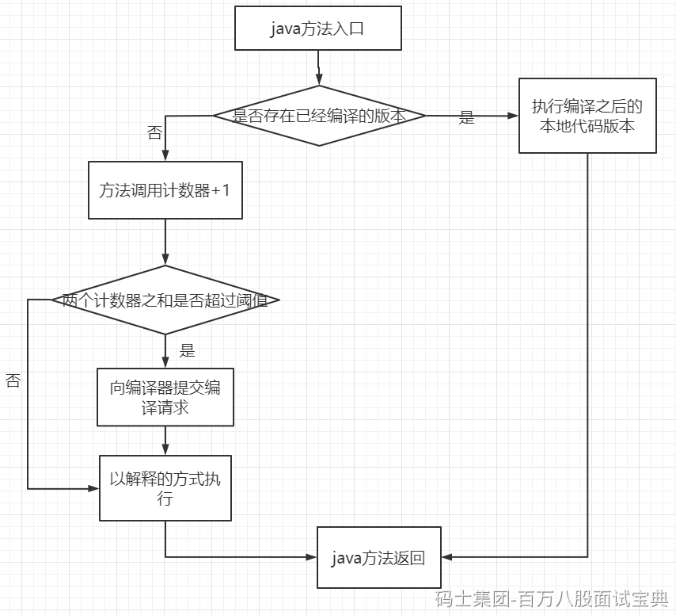

**（2）第二个回边计数器** ，作用是统计一个方法中循环体代码执行的次数，在字节码中遇到控制流向后跳转的指令称为“回边”（ Back Edge ）。显然，建立回边计数器统计的目的就是为了触发 OSR 编译。

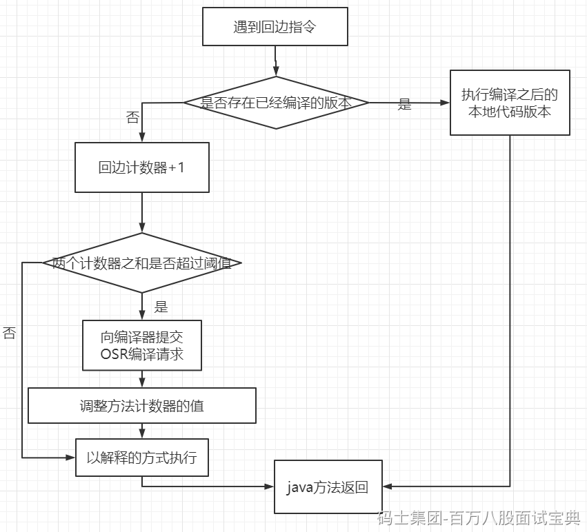

关于这个计数器的阈值， HotSpot 提供了 **-XX：BackEdgeThreshold** 供用户设置，但是当前的虚拟机实际上使用了 **-XX：OnStackReplacePercentage** 来简介调整阈值，计算公式如下：

- 在 **Client** 模式下， 公式为 方法调用计数器阈值（CompileThreshold）X **OSR 比率**（OnStackReplacePercentage）/ **100** 。其中 OSR 比率默认为 **933**，那么，回边计数器的阈值为 **13995**。

- 在 **Server** 模式下，公式为 方法调用计数器阈值（Compile Threashold）X （**OSR 比率**(OnStackReplacePercentage) - 解释器监控比率（InterpreterProfilePercent））/**100**。  
  其中 onStackReplacePercentage 默认值为 **140**，InterpreterProfilePercentage 默认值为 **33**，如果都取默认值，那么 Server 模式虚拟机回边计数器阈值为 **10700** 。

与方法计数器不同，回边计数器没有计数热度衰减的过程，因此这个计数器统计的就是该方法循环执行的绝对次数。当计数器溢出的时候，它还会把方法计数器的值也调整到溢出状态，这样下次再进入该方法的时候就会执行标准编译过程。

可以看到，决定一个方法是否为热点代码的因素有两个：方法的调用次数、循环回边的执行次数。即时编译便是根据这两个计数器的和来触发的。为什么 Java 虚拟机需要维护两个不同的计数器呢？

#### **OSR 编译（不重要，别纠结）**

实际上，除了以方法为单位的即时编译之外，Java 虚拟机还存在着另一种以循环为单位的即时编译，叫做 On-Stack-Replacement（OSR）编译。循环回边计数器便是用来触发这种类型的编译的。

OSR 实际上是一种技术，它指的是在程序执行过程中，动态地替换掉 Java 方法栈桢，从而使得程序能够在非方法入口处进行解释执行和编译后的代码之间的切换。也就是说，我只要遇到回边指令，我就可以触发执行切换。

在不启用分层编译的情况下，触发 OSR 编译的阈值是由参数 -XX:CompileThreshold 指定的阈值的倍数。

该倍数的计算方法为：

**(****OnStackReplacePercentage** **-** **InterpreterProfilePercentage****)**/**100**

其中 -XX:InterpreterProfilePercentage 的默认值为 33，当使用 C1 时 -XX:OnStackReplacePercentage 为 933，当使用 C2 时为 140。

也就是说，默认情况下，C1 的 OSR 编译的阈值为 13500，而 C2 的为 10700。

在启用分层编译的情况下，触发 OSR 编译的阈值则是由参数 -XX:TierXBackEdgeThreshold 指定的阈值乘以系数。

OSR 编译在正常的应用程序中并不多见。它只在基准测试时比较常见，因此并不需要过多了解。

那么这些即时编译器编译后的代码放哪呢？

#### **Code Cache**

JVM生成的native code存放的内存空间称之为Code Cache；JIT编译、JNI等都会编译代码到native code，其中JIT生成的native code占用了Code Cache的绝大部分空间，他是属于非堆内存的。

简而言之，JVM Code Cache （代码缓存）是JVM存储编译成本机代码的字节码的区域。我们将可执行本机代码的每个块称为 `nmethod` 。 `nmethod` 可能是一个完整的或内联的Java方法。

即时（ **JIT** ）编译器是代码缓存区的最大消费者。这就是为什么一些开发人员将此内存称为JIT代码缓存。

#### Code Cache的优化

代码缓存的大小是固定的。一旦它满了，JVM就不会编译任何额外的代码，因为JIT编译器现在处于关闭状态。此外，我们将收到“ `CodeCache is full… The compiler has been disabled` ”警告消息。因此，我们的应用程序的性能最终会下降。为了避免这种情况，我们可以使用以下大小选项调整代码缓存：

- **InitialCodeCacheSize** –初始代码缓存大小，默认为160K

- **ReservedCodeCacheSize** –默认最大大小为48MB

- **CodeCacheExpansionSize** –代码缓存的扩展大小，32KB或64KB

增加ReservedCodeCacheSize可能是一个解决方案，但这通常只是一个临时解决办法。

幸运的是，JVM提供了一个 **UseCodeCache** 刷新选项来控制代码缓存区域的刷新。其默认值为false。当我们启用它时，它会在满足以下条件时释放占用的区域：

- 代码缓存已满；如果该区域的大小超过某个阈值，则会刷新该区域

- 自上次清理以来已过了特定的时间间隔

- 预编译代码不够热。对于每个编译的方法，JVM都会跟踪一个特殊的热度计数器。如果此计数器的值小于计算的阈值，JVM将释放这段预编译代码

#### Code Cache的查看

为了监控Code Cache（代码缓存）的使用情况，我们需要跟踪当前正在使用的内存的大小。

要获取有关代码缓存使用情况的信息，我们可以指定 `–XX:+PrintCodeCache` JVM选项。运行应用程序后，我们将看到类似的输出：

或者直接设置 `-XX:ReservedCodeCacheSize=3000k`，然后重启

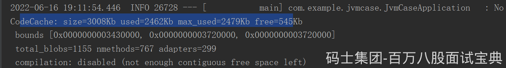

让我们看看这些值的含义：

- 输出中的大小显示内存的最大大小，与 **ReservedCodeCacheSize** 相同

- `used` 是当前正在使用的内存的实际大小

- `max_used` 是已使用的最大尺寸

- `free` 是尚未占用的剩余内存

#### JDK9中的分段代码缓存：

从Java9开始，JVM将代码缓存分为三个不同的段，每个段都包含特定类型的编译代码。更具体地说，有三个部分：

```plain
-XX:nonNMethoddeHeapSize
-XX:ProfiledCodeHeapSize
-XX:nonprofiedCodeHeapSize
```

这种新结构以不同的方式处理各种类型的编译代码，从而提高了整体性能。

例如，将短命编译代码与长寿命代码分离可以提高方法清理器的性能——主要是因为它需要扫描更小的内存区域。

## AOT和Graal VM

在Java9中，引入了AOT(Ahead-Of-Time)编译器

即时编译器是在程序运行过程中，将字节码翻译成机器码。而AOT是在程序运行之前，将字节码转换为机器码

`优势`：这样不需要在运行过程中消耗计算机资源来进行即时编译

`劣势`：AOT 编译无法得知程序运行时的信息，因此也无法进行基于类层次分析的完全虚方法内联，或者基于程序 profile 的投机性优化（并非硬性限制，我们可以通过限制运行范围，或者利用上一次运行的程序 profile 来绕开这两个限制）

#### Graal VM

> `官网`： <https://www.oracle.com/tools/graalvm-enterprise-edition.html>
>
> **GraalVM core features include:**
>
> - GraalVM Native Image, available as an early access feature –– allows scripted applications to be compiled ahead of time into a native machine-code binary
>
> - GraalVM Compiler –– generates compiled code to run applications on a JVM, standalone, or embedded in another system
>
> - Polyglot Capabilities –– supports Java, Scala, Kotlin, JavaScript, and Node.js
>
> - Language Implementation Framework –– enables implementing any language for the GraalVM environment
>
> - LLVM Runtime–– permits native code to run in a managed environment in GraalVM Enterprise

在Java10中，新的JIT编译器Graal被引入

它是一个以Java为主要编程语言，面向字节码的编译器。跟C++实现的C1和C2相比，模块化更加明显，也更加容易维护。

Graal既可以作为动态编译器，在运行时编译热点方法；也可以作为静态编译器，实现AOT编译。

除此之外，它还移除了编程语言之间的边界，并且支持通过即时编译技术，将混杂了不同的编程语言的代码编译到同一段二进制码之中，从而实现不同语言之间的无缝切换。

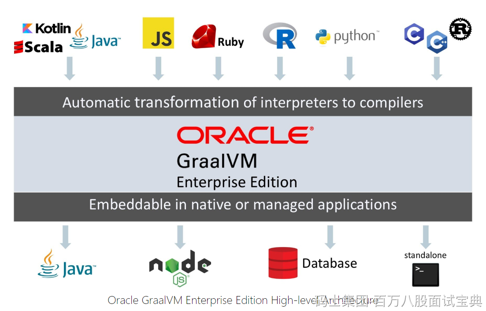

## 重新认知JVM

> 之前我们画过一张图，是从Class文件到类装载器，再到运行时数据区的过程。
>
> 现在咱们把这张图不妨丰富完善一下，展示了JVM的大体物理结构图。

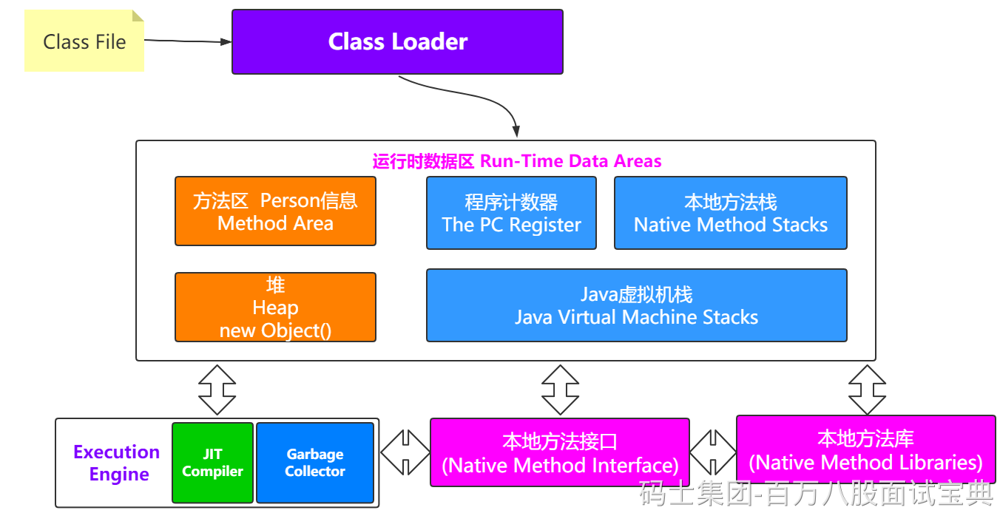

> JVM Architecture： <https://www.oracle.com/technetwork/tutorials/tutorials-1876574.html>
