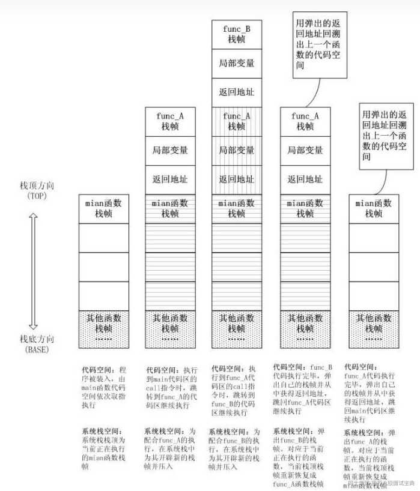
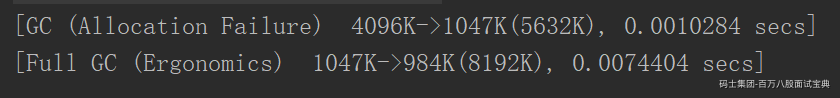
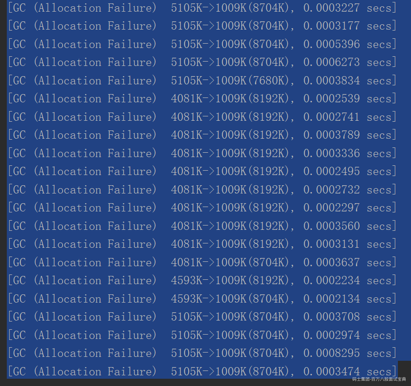
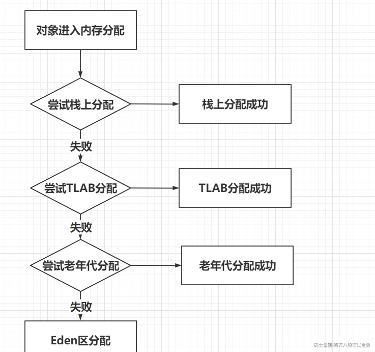
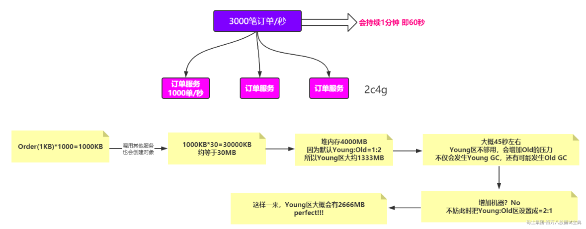

# 运行时优化

## 方法内联

> 方法内联，是指 **JVM在运行时将调用次数达到一定阈值的方法调用替换为方法体本身** ，从而消除调用成本，并为接下来进一步的代码性能优化提供基础，是JVM的一个重要优化手段之一。
>
> **注：**
>
> - **C++的inline属于编译后内联，但是java是运行时内联**

简单通俗的讲就是把方法内部调用的其它方法的逻辑，嵌入到自身的方法中去，变成自身的一部分，之后不再调用该方法，从而节省调用函数带来的额外开支。

### 为什么会出现方法内联呢？

之所以出现方法内联是因为（方法调用）函数调用除了执行自身逻辑的开销外，还有一些不为人知的额外开销。 **这部分额外的开销主要来自方法栈帧的生成、参数字段的压入、栈帧的弹出、还有指令执行地址的跳转** 。比如有下面这样代码：

```java
public static void function_A(int a, int b){
        //do something
        function_B(a,b);
    }
  
    public static void function_B(int c, int d){
        //do something
    }

    public static void main(String[] args){
         function_A(1,2);
    }
```

则代码的执行过程如下：



所以如果java中方法调用嵌套过多或者方法过多，这种额外的开销就越多。

试想一下想get/set这种方法调用：

```java
public int getI() {
        return i;
    }

public void setI(int i) {
        this.i = i;
    }
```

**很可能自身执行逻辑的开销还比不上为了调用这个方法的额外开锁。如果类似的方法被频繁的调用，则真正相对执行效率就会很低，虽然这类方法的执行时间很短。这也是为什么jvm会在热点代码中执行方法内联的原因，这样的话就可以省去调用调用函数带来的额外开支。**

**这里举个内联的可能形式：**

```java
 public int  add(int a, int b , int c, int d){
          return add(a, b) + add(c, d);
    }
  
    public int add(int a, int b){
        return a + b;
    }
```

**内联之后：**

```java
public int  add(int a, int b , int c, int d){
          return a + b + c + d;
    }
```

### 内联条件

一个方法如果满足以下条件就很可能被jvm内联。

- 热点代码。 如果一个方法的执行频率很高就表示优化的潜在价值就越大。那代码执行多少次才能确定为热点代码？这是根据编译器的编译模式来决定的。如果是客户端编译模式则次数是1500，服务端编译模式是10000。次数的大小可以通过-XX:CompileThreshold来调整。

- 方法体不能太大。jvm中被内联的方法会编译成机器码放在code cache中。如果方法体太大，则能缓存热点方法就少，反而会影响性能。热点方法小于325字节的时候，非热点代码35字节以下才会使用这种方式

- 如果希望方法被内联， **尽量用private、static、final修饰** ，这样jvm可以直接内联。如果是public、protected修饰方法jvm则需要进行类型判断，因为这些方法可以被子类继承和覆盖，jvm需要判断内联究竟内联是父类还是其中某个子类的方法。

所以了解jvm方法内联机制之后，会有助于我们工作中写出能让jvm更容易优化的代码，有助于提升程序的性能。

## 逃逸分析

### 什么是“对象逃逸”？

对象逃逸的本质是对象指针的逃逸。

在计算机语言编译器优化原理中，逃逸分析是指分析指针动态范围的方法，它同编译器优化原理的指针分析和外形分析相关联。当变量（或者对象）在方法中分配后，其指针有可能被返回或者被全局引用，这样就会被其他方法或者线程所引用，这种现象称作指针（或者引用）的逃逸(Escape)。通俗点讲，如果一个对象的指针被多个方法或者线程引用时，那么我们就称这个对象的指针（或对象）的逃逸（Escape）。

### **什么是逃逸分析？**

逃逸分析，是一种可以有效减少Java 程序中同步负载和内存堆分配压力的跨函数全局数据流分析算法。通过逃逸分析，Java Hotspot编译器能够分析出一个新的对象的引用的使用范围从而决定是否要将这个对象分配到堆上。 逃逸分析（Escape Analysis）算是目前Java虚拟机中比较前沿的优化技术了。

注意：逃逸分析不是直接的优化手段，而是代码分析手段。

对象逃逸案例：

```java
Xpublic User doSomething1() {
   User user1 = new User ();
   user1 .setId(1);
   user1 .setDesc("xxxxxxxx");
   // ......
   return user1 ;
}
```

对象未逃逸：

```java
public void doSomething2() {
   User user2 = new User ();
   user2 .setId(2);
   user2 .setDesc("xxxxxxxx");
   // ...... 
}
```

### 基于逃逸分析的优化

当判断出对象不发生逃逸时，编译器可以使用逃逸分析的结果作一些代码优化

- 栈上分配：将堆分配转化为栈分配。如果某个对象在子程序中被分配，并且指向该对象的指针永远不会逃逸，该对象就可以在分配在栈上，而不是在堆上。在的垃圾收集的语言中，这种优化可以降低垃圾收集器运行的频率。

- 同步消除：如果发现某个对象只能从一个线程可访问，那么在这个对象上的操作可以不需要同步。

- 分离对象或标量替换。如果某个对象的访问方式不要求该对象是一个连续的内存结构，那么对象的部分（或全部）可以不存储在内存，而是存储在CPU寄存器中。

### 标量替换

\*\*标量：\*\*不可被进一步分解的量，而JAVA的基本数据类型就是标量（比如int，long等基本数据类型） 。

**聚合量：** 标量的对立就是可以被进一步分解的量，称之为聚合量。 在JAVA中对象就是可以被进一步分解的聚合量。

\*\*标量替换：\*\*通过逃逸分析确定该对象不会被外部访问，并且对象可以被进一步分解时，JVM不会创建该对象，而是将该对象成员变量分解若干个被这个方法使用的成员变量所代替，这些代替的成员变量在栈帧或寄存器上分配空间，这样就不会因为没有一大块连续空间导致对象内存不够分配。

### 栈上分配案例：

虚拟机参数：

```java
-XX:+PrintGC -Xms5M -Xmn5M -XX:+DoEscapeAnalysis
```

> -XX:+DoEscapeAnalysis表示开启逃逸分析，JDK8是默认开启的
>
> -XX:+PrintGC 表示打印GC信息
>
> -Xms5M -Xmn5M 设置JVM内存大小是5M

```java
 public static void main(String[] args){
        for(int i = 0; i < 5_000_000; i++){
            createObject();
        }
    }
 
    public static void createObject(){
        new Object();
    }
```

运行结果是没有GC。



```plain
把虚拟机参数改成 -XX:+PrintGC -Xms5M -Xmn5M -XX:-DoEscapeAnalysis。关闭逃逸分析得到结果的部分截图是，说明了进行了GC，并且次数还不少。
```



这说明了JVM在逃逸分析之后，将对象分配在了方法createObject()方法栈上。**方法栈上的对象在方法执行完之后，栈桢弹出，对象就会自动回收。这样的话就不需要等内存满时再触发内存回收。这样的好处是**程序内存回收效率高，并且GC频率也会减少，程序的性能就提高了。

### 同步锁消除

**如果发现某个对象只能从一个线程可访问，那么在这个对象上的操作可以不需要同步** 。

虚拟机配置参数：-XX:+PrintGC -Xms500M -Xmn500M -XX:+DoEscapeAnalysis。配置500M是保证不触发GC。

```java
public static void main(String[] args){
        long start = System.currentTimeMillis();
        for(int i = 0; i < 5_000_000; i++){
            createObject();
        }
        System.out.println("cost = " + (System.currentTimeMillis() - start) + "ms");
    }
 
    public static void createObject(){
        synchronized (new Object()){
 
        }
    }
```

运行结果

```java
 
cost = 6ms
```

把逃逸分析关掉：-XX:+PrintGC -Xms500M -Xmn500M -XX:-DoEscapeAnalysis

运行结果

```plain
cost = 270ms
```

说明了逃逸分析把锁消除了，并在性能上得到了很大的提升。这里说明一下Java的逃逸分析是方法级别的，因为JIT **(** just in time )即时编译器**的即时编译是方法级别。**

### 什么条件下会触发逃逸分析？

对象会先尝试栈上分配，如果不能成功分配，那么就去TLAB，如果还不行，就判定当前的垃圾收集器悲观策略，可不可以直接进入老年代，最后才会进入Eden。



Java的逃逸分析只发在JIT的即时编译中，因为在启动前已经通过各种条件判断出来是否满足逃逸，通过上面的流程图也可以得知对象分配不一定在堆上，所以可知满足逃逸的条件如下，只要满足以下任何一种都会判断为逃逸。

一、对象被赋值给堆中对象的字段和类的静态变量。  
二、对象被传进了不确定的代码中去运行。

对象逃逸的范围有：全局逃逸、参数逃逸、没有逃逸;

TLAB前面的内容讲过，在当前场景下做一个补充：

### TLAB（Thread Local Allocation Buffer）

即线程本地分配缓存区，这是一个线程专用的内存分配区域。  
由于对象一般会分配在堆上，而堆是全局共享的。因此在同一时间，可能会有多个线程在堆上申请空间。因此，每次对象分配都必须要进行同步（虚拟机采用CAS配上失败重试的方式保证更新操作的原子性），而在竞争激烈的场合分配的效率又会进一步下降。JVM使用TLAB来避免多线程冲突，在给对象分配内存时，每个线程使用自己的TLAB，这样可以避免线程同步，提高了对象分配的效率。

每个线程会从Eden分配一大块空间，例如说100KB，作为自己的TLAB。这个start是TLAB的起始地址，end是TLAB的末尾，然后top是当前的分配指针。显然start <= top < end。

当一个Java线程在自己的TLAB中分配到尽头之后，再要分配就会出发一次“TLAB refill”，也就是说之前自己的TLAB就“不管了”（所有权交回给共享的Eden），然后重新从Eden里分配一块空间作为新的TLAB。所谓“不管了”并不是说就让旧TLAB里的对象直接死掉，而是把那块空间的控制权归还给普通的Eden，里面的对象该怎样还是怎样。通常情况下，在TLAB中分配多次才会填满TLAB、触发TLAB refill，这样使用TLAB分配就比直接从共享部分的Eden分配要均摊（amortized）了同步开销，于是提高了性能。其实很多关注多线程性能的malloc库实现也会使用类似的做法，例如TCMalloc。

到触发GC的时候，无论是minor GC还是full GC，要收集Eden的时候里面的空间无论是属于某个线程的TLAB还是不属于任何TLAB都一视同仁，把Eden当作一个整体来收集里面的对象——把活的对象拷贝到survivor space（或者直接晋升到Old Gen）。在GC结束之后，每个Java线程又会重新从Eden分配自己的TLAB。周而复始。

### TLAB分配的对象可以共享吗？

答：只要是Heap上的对象，所有线程都是可以共享的，就看你有没有本事访问到了。在GC的时候只从root sets来扫描对象，而不管你到底在哪个TLAB中。

## 4.1 内存优化

### 4.1.1 内存分配

> 正常情况下不需要设置，那如果是促销或者秒杀的场景呢？
>
> 每台机器配置2c4G，以每秒3000笔订单为例，整个过程持续60秒

*(⚠️ 图片缺失:源知识库原图已失效)*

### 4.1.2 内存溢出(OOM)

> 一般会有两个原因：
>
> （1）大并发情况下
>
> （2）内存泄露导致内存溢出

#### 4.1.2.1 大并发[秒杀]

浏览器缓存、本地缓存、验证码

CDN静态资源服务器

集群+负载均衡

动静态资源分离、限流[基于令牌桶、漏桶算法]

应用级别缓存、接口防刷限流、队列、Tomcat性能优化

异步消息中间件

Redis热点数据对象缓存

分布式锁、数据库锁

5分钟之内没有支付，取消订单、恢复库存等

#### 4.1.2.2 内存泄露导致内存溢出

> ThreadLocal引起的内存泄露，最终导致内存溢出

```plain
public class TLController {
 @RequestMapping(value = "/tl")
 public String tl(HttpServletRequest request) {
     ThreadLocal<Byte[]> tl = new ThreadLocal<Byte[]>();
     // 1MB
     tl.set(new Byte[1024*1024]);
     return "ok";
 }
}
```

（1）上传到阿里云服务器

jvm-case-0.0.1-SNAPSHOT.jar

（2）启动

```plain
java -jar -Xms1000M -Xmx1000M -XX:+HeapDumpOnOutOfMemoryError -XX:HeapDumpPath=jvm.hprof  jvm-case-0.0.1-SNAPSHOT.jar
```

（3）使用jmeter模拟10000次并发

39.100.39.63:8080/tl

（4）top命令查看

```plain
top
top -Hp PID
```

（5）jstack查看线程情况，发现没有死锁或者IO阻塞的情况

```plain
jstack PID
java -jar arthas.jar   --->   thread
```

（6）查看堆内存的使用，发现堆内存的使用率已经高达88.95%

```plain
jmap -heap PID
java -jar arthas.jar   --->   dashboard
```

（7）此时可以大体判断出来，发生了内存泄露从而导致的内存溢出，那怎么排查呢？

```plain
jmap -histo:live PID | more
获取到jvm.hprof文件，上传到指定的工具分析，比如heaphero.io
```
