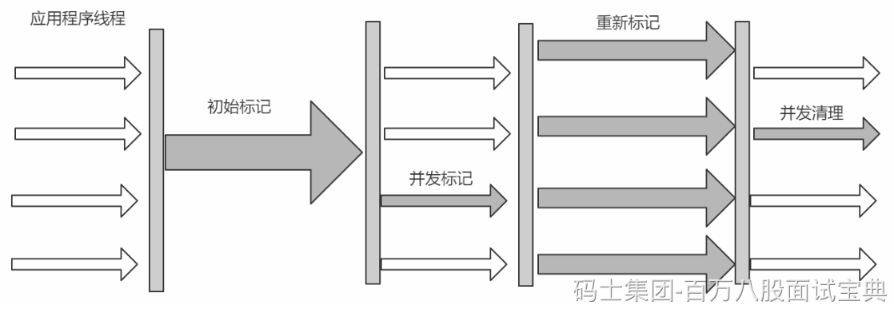
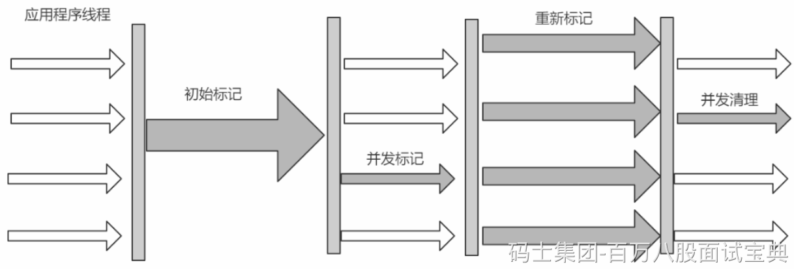
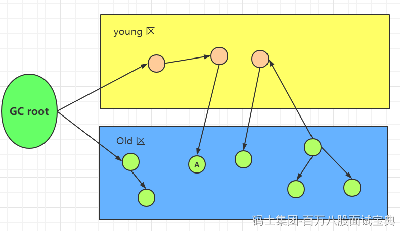

# CMS垃圾收集器深入解析：

回顾一下上节课的CMS的内容

## CMS回收流程

> `官网`： <https://docs.oracle.com/javase/8/docs/technotes/guides/vm/gctuning/cms.html#concurrent_mark_sweep_cms_collector>
>
> CMS(Concurrent Mark Sweep)收集器是一种以获取 `最短回收停顿时间`为目标的收集器。
>
> 采用的是"标记-清除算法",整个过程分为4步

```plain
(1)初始标记 CMS initial mark     标记GC Roots直接关联对象，不用Tracing，速度很快
(2)并发标记 CMS concurrent mark  进行GC Roots Tracing
(3)重新标记 CMS remark           修改并发标记因用户程序变动的内容
(4)并发清除 CMS concurrent sweep 清除不可达对象回收空间，同时有新垃圾产生，留着下次清理称为浮动垃圾
```

> 由于整个过程中，并发标记和并发清除，收集器线程可以与用户线程一起工作，所以总体上来说，CMS收集器的内存回收过程是与用户线程一起并发地执行的。

*(⚠️ 图片缺失:源知识库原图已失效)*

```plain
优点：并发收集、低停顿
缺点：产生大量空间碎片、并发阶段会降低吞吐量
```

## 第一个问题：为什么我的CMS回收流程图上初始标记是单线程，为什么不使用多线程呢？

> 初始化标记阶段是串行的，这是JDK7的行为。JDK8以后默认是并行的，可以通过参数
>
> -XX:+CMSParallelInitialMarkEnabled控制

## CMS的两种模式与一种特殊策略：

### **Backgroud CMS** ：



实际上我们的并发标记还能被整理成两个流程

(1)初始标记  
(2)并发标记  
(3)并发预处理  
(4)可中止的预处理  
(5)重新标记  
(6)并发清除

为什么我们的并发标记细化之后还会额外有两个流程出现呢？

讨论这个问题之前，我们先思考一个问题，假设CMS要进行老年代的垃圾回收，我们如何判断被年轻代的对象引用的老年代对象是可达对象。



**也就是这张图，当老年代被回收的时候，我们如何判断A对象是存活对象。**

答：必须扫描新生代来确定，所以CMS虽然是老年代的垃圾回收器，却需要扫描新生代的原因。

问题2：既然这个时候我需要扫描新生代，那么全量扫描会不会很慢

答：肯定会的 ，但是接踵而来的问题：既然会很慢，我们的停顿时间很长，可是CMS的目标是什么

CMS(Concurrent Mark Sweep)收集器是一种以获取 `最短回收停顿时间`为目标的收集器。这不是与他的设计理念不一致吗？

**思考：怎么让我们的回收变快**

答：肯定是垃圾越少越快。所以我们的CMS想到了一种方式，就是我先进行新生代的垃圾回收，也就是一次young GC，回收完毕之后。是不是我们新生代的对象就变少了，那么我再进行垃圾回收，是不是就变快了。

所以，CMS有两个参数：

**CMSScheduleRemarkEdenSizeThreshold 默认值：2M**

**CMSScheduleRemarkEdenPenetration 默认值：50%**

这两个参数组合起来就是预清理之后，Eden空间使用超过2M的时候启动可中断的并发预清理（CMS-concurrent-abortable-preclean），到Eden空间使用率到达50%的时候中断（但不是结束），进入Remark（重新标记阶段）。

这里面有个概念，老师，为什么并发预处理前面会有可中断几个字呢？什么意思。

可中断意味着，假设你一直在预处理，预处理是干什么，无非就是去帮你把正式应该处理的前置工作给做了。所以他一定干了很多事情，但是这些事情迟早有个头，所以就设置了一个时间对他进行打断。所以，并发预处理的逻辑是当你发生了minor GC ，我就预处理结束了。

**这里有个问题，我怎么知道你什么时候发生minor GC**

答：答案是我不知道，垃圾回收是JVM自动调度的，所以我们无法控制垃圾回收。

那我不可能无限制的执行下去，总要有个结束时间吧

CMS提供了一个参数**CMSMaxAbortablePrecleanTime** ，默认为5S

> 只要到了5S，不管发没发生Minor GC，有没有到CMSScheduleRemardEdenPenetration都会中止此阶段，进入remark。

如果在5S内还是没有执行Minor GC怎么办？

> CMS提供CMSScavengeBeforeRemark参数，使remark前强制进行一次Minor GC。

到这里，新生代策略已经聊完了

接下来老年代的话，有几个重要的点先给大家聊一下。

### 记忆集

当我们进行young gc时，我们的**gc roots除了常见的栈引用、静态变量、常量、锁对象、class对象**这些常见的之外，如果 **老年代有对象引用了我们的新生代对象** ，那么老年代的对象也应该加入gc roots的范围中，但是如果每次进行young gc我们都需要扫描一次老年代的话，那我们进行垃圾回收的代价实在是太大了，因此我们引入了一种叫做记忆集的抽象数据结构来记录这种引用关系。

记忆集是一种用于记录从非收集区域指向收集区域的指针集合的数据结构。

```plain
如果我们不考虑效率和成本问题，我们可以用一个数组存储所有有指针指向新生代的老年代对象。但是如果这样的话我们维护成本就很好，打个比方，假如所有的老年代对象都有指针指向了新生代，那么我们需要维护整个老年代大小的记忆集，毫无疑问这种方法是不可取的。因此我们引入了卡表的数据结构
```

### 卡表

记忆集是我们针对于跨代引用问题提出的思想，而卡表则是针对于该种思想的具体实现。（可以理解为记忆集是结构，卡表是实现类）

[1字节，00001000，1字节，1字节]

```plain
在hotspot虚拟机中，卡表是一个字节数组，数组的每一项对应着内存中的某一块连续地址的区域，如果该区域中有引用指向了待回收区域的对象，卡表数组对应的元素将被置为1，没有则置为0；
```

(1) 卡表是使用一个字节数组实现:CARD\_TABLE[],每个元素对应着其标识的内存区域一块特定大小的内存块,称为"卡页"。hotSpot使用的卡页是2^9大小,即512字节

(2) 一个卡页中可包含多个对象,只要有一个对象的字段存在跨代指针,其对应的卡表的元素标识就变成1,表示该元素变脏,否则为0。GC时,只要筛选本收集区的卡表中变脏的元素加入GC Roots里。

卡表的使用图例


并发标记的时候，A对象发生了所在的引用发生了变化，所以A对象所在的块被标记为脏卡


继续往下到了重新标记阶段，修改对象的引用，同时清除脏卡标记。


**卡表其他作用：**

老年代识别新生代的时候

对应的card table被标识为相应的值（card table中是一个byte，有八位，约定好每一位的含义就可区分哪个是引用新生代，哪个是并发标记阶段修改过的）

### **Foregroud CMS：**

其实这个也是CMS一种收集模式，但是他是并发失败才会走的模式。这里聊到一个概念，什么是并发失败呢？

并发失败官方的描述是：

> 如果 **并发搜集器不能在年老代填满之前完成不可达（unreachable）对象的回收** ，或者 **年老代中有效的空闲内存空间不能满足某一个内存的分配请求** ，此时应用会被暂停，并在此暂停期间开始垃圾回收，直到回收完成才会恢复应用程序。这种无法并发完成搜集的情况就成为 **并发模式失败（concurrent mode failure）** ，而且这种情况的发生也意味着我们需要调节并发搜集器的参数了。

简单来说，也就是我去进行并发标记的时候，内存不够了，这个时候我会进入STW，并且开始全局Full GC.

那么什么时候会进行并发失败呢 换句话说，我们的难道非要满了之后才进行收集

```plain
-XX:CMSInitiatingOccupancyFraction  
-XX:+UseCMSInitiatingOccupancyOnly

注意：-XX:+UseCMSInitiatingOccupancyOnly 只是用设定的回收阈值(上面指定的70%),如果不指定,JVM仅在第一次使用设定值,后续则自动调整.这两个参数表示只有在Old区占了CMSInitiatingOccupancyFraction设置的百分比的内存时才满足触发CMS的条件。注意这只是满足触发CMS GC的条件。至于什么时候真正触发CMS GC，由一个后台扫描线程决定。CMSThread默认2秒钟扫描一次，判断是否需要触发CMS，这个参数可以更改这个扫描时间间隔。
```

看源码公式：

((100 - MinHeapFreeRatio) + (double)( CMSTriggerRatio \* MinHeapFreeRatio) / 100.0) / 100.0

也就是按照默认值

**当老年代达到** ((100 - 40) + (double) 80 \* 40 / 100 ) / 100 = 92 %时，会触发CMS回收。

> 如何避免他的出现：
>
> 为了尽量避免并发模式失败发生，我们可以调节-XX:CMSInitiatingOccupancyFraction=参数，去控制当年老代的内存占用达到多少的时候（N%），便开启并发搜集器开始回收年老代。

### **CMS的标记压缩算法-----MSC（****Mark Sweep Compact****）**

他的回收方式其实就是我们的滑动整理，并且进行整理的时候一般都是两个参数

```plain
-XX:+UseCMSCompactAtFullCollection 
-XX:CMSFullGCsBeforeCompaction=0
这两个参数表示多少次FullGC后采用MSC算法压缩堆内存，0表示每次FullGC后都会压缩，同时0也是默认值
```

碎片问题也是CMS采用的标记清理算法最让人诟病的地方：Backgroud CMS采用的标记清理算法会导致内存碎片问题，从而埋下发生FullGC导致长时间STW的隐患。

所以如果触发了FullGC，无论是否会采用MSC算法压缩堆，那都是ParNew+CMS组合非常糟糕的情况。因为这个时候并发模式已经搞不定了，而且整个过程单线程，完全STW，可能会压缩堆（是否压缩堆通过上面两个参数控制），真的不能再糟糕了！想象如果这时候业务量比较大，由于FullGC导致服务完全暂停几秒钟，甚至上10秒，对用户体验影响得多大。

### 三色标记

在并发标记的过程中，因为标记期间应用线程还在继续跑，对象间的引用可能发生变化，多标和漏标的情况就有可能发生。这里引入“三色标记”来给大家解释下，把Gcroots可达性分析遍历对象过程中遇到的对象， 按照“是否访问过”这个条件标记成以下三种颜色：

**黑色：**

```plain
表示对象已经被垃圾收集器访问过， 且这个对象的所有引用都已经扫描过。 黑色的对象代表已经扫描过， 它是安全存活的， 如果有其他对象引用指向了黑色对象， 无须重新扫描一遍。 黑色对象不可能直接（不经过灰色对象） 指向某个白色对象。
```

**灰色：**

```plain
表示对象已经被垃圾收集器访问过， 但这个对象上至少存在一个引用还没有被扫描过。
```

**白色:**

```plain
表示对象尚未被垃圾收集器访问过。 显然在可达性分析刚刚开始的阶段， 所有的对象都是白色的， 若在分析结束的阶段， 仍然是白色的对象， 即代表不可达。
```

标记过程：

1.初始时，所有对象都在 【白色集合】中；

2.将GC Roots 直接引用到的对象 挪到 【灰色集合】中；

3.从灰色集合中获取对象：

4. 将本对象 引用到的 其他对象 全部挪到 【灰色集合】中；

5. 将本对象 挪到 【黑色集合】里面。

重复步骤3.4，直至【灰色集合】为空时结束。

结束后，仍在【白色集合】的对象即为GC Roots 不可达，可以进行回收


**多标-浮动垃圾**

```plain
在并发标记过程中，如果由于方法运行结束导致部分局部变量(gcroot)被销毁，这个gcroot引用的对象之前又被扫描过 (被标记为非垃圾对象)，那么本轮GC不会回收这部分内存。这部分本应该回收但是没有回收到的内存，被称之为“浮动 垃圾”。浮动垃圾并不会影响垃圾回收的正确性，只是需要等到下一轮垃圾回收中才被清除。

另外，针对并发标记(还有并发清理)开始后产生的新对象，通常的做法是直接全部当成黑色，本轮不会进行清除。这部分 对象期间可能也会变为垃圾，这也算是浮动垃圾的一部分。
```

**漏标-读写屏障**

漏标只有**同时满足**以下两个条件时才会发生：

```plain
条件一：灰色对象 断开了 白色对象的引用；即灰色对象 原来成员变量的引用 发生了变化。

条件二：黑色对象 重新引用了 该白色对象；即黑色对象 成员变量增加了 新的引用。
```

漏标会导致被引用的对象被当成垃圾误删除，这是严重bug，必须解决，有两种解决方案： **增量更新（Incremental Update） 和原始快照（Snapshot At The Beginning，SATB）** 。

**增量更新**就是当黑色对象**插入新的指向**白色对象的引用关系时， 就将这个新插入的引用记录下来， 等并发扫描结束之后， 再将这些记录过的引用关系中的黑色对象为根， 重新扫描一次。 这可以简化理解为， 黑色对象一旦新插入了指向白色对象的引用之后， 它就变回灰色对象了。

**原始快照**就是当灰色对象要**删除指向**白色对象的引用关系时， 就将这个要删除的引用记录下来， 在并发扫描结束之后， 再将这些记录过的引用关系中的灰色对象为根， 重新扫描一次，这样就能扫描到白色的对象，将白色对象直接标记为黑色(目的就是让这种对象在本轮gc清理中能存活下来，待下一轮gc的时候重新扫描，这个对象也有可能是浮动垃圾)

以上**无论是对引用关系记录的插入还是删除， 虚拟机的记录操作都是通过写屏障实现的。**

**写屏障实现原始快照（SATB）：** 当对象B的成员变量的引用发生变化时，比如引用消失（a.b.d = null），我们可以利用写屏障，将B原来成员变量的引用对象D记录下来：

**写屏障实现增量更新：** 当对象A的成员变量的引用发生变化时，比如新增引用（a.d = d），我们可以利用写屏障，将A新的成员变量引用对象D 记录下来：

### CMS标记清除的全局整理：

由于CMS使用的是标记清除算法，而标记清除算法会有大量的内存碎片的产生，所以JVM提供了

**-XX:+UseCMSCompactAtFullCollection**参数用于在全局GC（full GC）后进行一次碎片整理的工作，

由于每次全局GC后都进行碎片整理会较大的影响停顿时间，JVM又提供了参数

**-XX:CMSFullGCsBeforeCompaction**去 **控制在几次全局GC后会进行碎片整理** 。

## CMS常用参数含义：

**-XX:+UseConcMarkSweepGC**

打开CMS GC收集器。JVM在1.8之前默认使用的是Parallel GC，9以后使用G1 GC。

**-XX:+UseParNewGC**

当使用CMS收集器时，默认年轻代使用多线程并行执行垃圾回收（UseConcMarkSweepGC开启后则默认开启）。

**-XX:+CMSParallelRemarkEnabled**

采用并行标记方式降低停顿（默认开启）。

**-XX:+CMSConcurrentMTEnabled**

被启用时，并发的CMS阶段将以多线程执行（因此，多个GC线程会与所有的应用程序线程并行工作）。（默认开启）

**-XX:ConcGCThreads**

定义并发CMS过程运行时的线程数。

**-XX:ParallelGCThreads**

定义CMS过程并行收集的线程数。

**-XX:CMSInitiatingOccupancyFraction**

该值代表老年代堆空间的使用率，默认值为68。当老年代使用率达到此值之后，并行收集器便开始进行垃圾收集，该参数需要配合UseCMSInitiatingOccupancyOnly一起使用，单独设置无效。

**-XX:+UseCMSInitiatingOccupancyOnly**

该参数启用后，参数CMSInitiatingOccupancyFraction才会生效。默认关闭。

**-XX:+CMSClassUnloadingEnabled**

相对于并行收集器，CMS收集器默认不会对永久代进行垃圾回收。如果希望对永久代进行垃圾回收，可用设置-XX:+CMSClassUnloadingEnabled。默认关闭。

**-XX:+CMSIncrementalMode**

开启CMS收集器的增量模式。增量模式使得回收过程更长，但是暂停时间往往更短。默认关闭。

**-XX:CMSFullGCsBeforeCompaction**

设置在执行多少次Full GC后对内存空间进行压缩整理，默认值0。

**-XX:+CMSScavengeBeforeRemark**

在cms gc remark之前做一次ygc，减少gc roots扫描的对象数，从而提高remark的效率，默认关闭。

**-XX:+ExplicitGCInvokesConcurrent**

该参数启用后JVM无论什么时候调用系统GC，都执行CMS GC，而不是Full GC。

**-XX:+ExplicitGCInvokesConcurrentAndUnloadsClasses**

该参数保证当有系统GC调用时，永久代也被包括进CMS垃圾回收的范围内。

**-XX:+DisableExplicitGC**

该参数将使JVM完全忽略系统的GC调用（不管使用的收集器是什么类型）。

**-XX:+UseCompressedOops**

这个参数用于对类对象数据进行压缩处理，提高内存利用率。（默认开启）

**-XX:MaxGCPauseMillis=200**

这个参数用于设置GC暂停等待时间，单位为毫秒，不要设置过低。

## CMS的线程数计算公式

区分young区的parnew gc线程数和old区的cms线程数，分别为以下两参数：

- -XX:ParallelGCThreads=m // STW暂停时使用的GC线程数，一般用满CPU

- -XX:ConcGCThreads=n // GC线程和业务线程并发执行时使用的GC线程数，一般较小

### ParallelGCThreads

其中ParallelGCThreads 参数的默认值是：

- CPU核心数 <= 8，则为 ParallelGCThreads=CPU核心数，比如4C8G取4，8C16G取8

- CPU核心数 > 8，则为 ParallelGCThreads = CPU核心数 \* 5/8 + 3 向下取整

- 16核的情况下，ParallelGCThreads = 13

- 32核的情况下，ParallelGCThreads = 23

- 64核的情况下，ParallelGCThreads = 43

- 72核的情况下，ParallelGCThreads = 48

**ConcGCThreads**

ConcGCThreads的默认值则为：

ConcGCThreads = (ParallelGCThreads + 3)/4 向下取整。

- ParallelGCThreads = 1~4时，ConcGCThreads = 1

- ParallelGCThreads = 5~8时，ConcGCThreads = 2

- ParallelGCThreads = 13~16时，ConcGCThreads = 4

## CMS推荐配置参数：

第一种情况：8C16G左右服务器，再大的服务器可以上G1了 没必要

```plain
-Xmx12g -Xms12g
-XX:ParallelGCThreads=8
-XX:ConcGCThreads=2
-XX:+UseConcMarkSweepGC
-XX:+CMSClassUnloadingEnabled
-XX:+CMSIncrementalMode
-XX:+CMSScavengeBeforeRemark
-XX:+UseCMSInitiatingOccupancyOnly
-XX:CMSInitiatingOccupancyFraction=70
-XX:CMSFullGCsBeforeCompaction=5
-XX:MaxGCPauseMillis=100  // 按业务情况来定
-XX:+ExplicitGCInvokesConcurrent
-XX:+ExplicitGCInvokesConcurrentAndUnloadsClasses
-XX:+PrintGCTimeStamps
-XX:+PrintGCDetails
-XX:+PrintGCDateStamps
```

第二种情况：4C8G

```plain
-Xmx6g -Xms6g
-XX:ParallelGCThreads=4
-XX:ConcGCThreads=1
-XX:+UseConcMarkSweepGC
-XX:+CMSClassUnloadingEnabled
-XX:+CMSIncrementalMode
-XX:+CMSScavengeBeforeRemark
-XX:+UseCMSInitiatingOccupancyOnly
-XX:CMSInitiatingOccupancyFraction=70
-XX:CMSFullGCsBeforeCompaction=5
-XX:MaxGCPauseMillis=100  // 按业务情况来定
-XX:+ExplicitGCInvokesConcurrent
-XX:+ExplicitGCInvokesConcurrentAndUnloadsClasses
-XX:+PrintGCTimeStamps
-XX:+PrintGCDetails
-XX:+PrintGCDateStamps
```

第三种情况：2C4G，这种情况下，也不推荐使用，因为2C的情况下，线程上下文的开销比较大，性能可能还不如你不动的情况，没必要。非要用，给你个配置，你自己玩。

```plain
-Xmx3g -Xms3g
-XX:ParallelGCThreads=2
-XX:ConcGCThreads=1
-XX:+UseConcMarkSweepGC
-XX:+CMSClassUnloadingEnabled
-XX:+CMSIncrementalMode
-XX:+CMSScavengeBeforeRemark
-XX:+UseCMSInitiatingOccupancyOnly
-XX:CMSInitiatingOccupancyFraction=70
-XX:CMSFullGCsBeforeCompaction=5
-XX:MaxGCPauseMillis=100  // 按业务情况来定
-XX:+ExplicitGCInvokesConcurrent
-XX:+ExplicitGCInvokesConcurrentAndUnloadsClasses
-XX:+PrintGCTimeStamps
-XX:+PrintGCDetails
-XX:+PrintGCDateStamps
```
