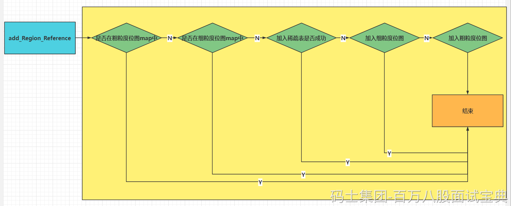
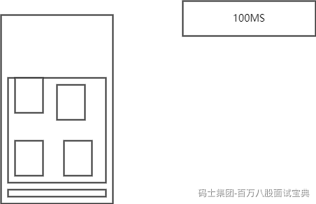

# G1垃圾收集器深入解析：

加入一条索引（记录）的源码的工作流程图如下：



### **CSet（Collection Set 回收集合）**

收集集合(CSet)代表每次GC暂停时回收的一系列目标分区。在任意一次收集暂停中，CSet所有分区都会被释放，内部存活的对象都会被转移到分配的空闲分区中。因此无论是年轻代收集，还是混合收集，工作的机制都是一致的。年轻代收集CSet只容纳年轻代分区，而混合收集会通过启发式算法，在老年代候选回收分区中，筛选出回收收益最高的分区添加到CSet中。

CSet根据两种不同的回收类型分为两种不同CSet。  
1.CSet of Young Collection  
2.CSet of Mix Collection  
CSet of Young Collection 只专注回收 Young Region 跟 Survivor Region ，而CSet of Mix Collection 模式下的CSet 则会通过RSet计算Region中对象的活跃度，

活跃度阈值-XX:G1MixedGCLiveThresholdPercent(默认85%)，只有活跃度高于这个阈值的才会准入CSet，混合模式下CSet还可以通过-XX:G1OldCSetRegionThresholdPercent(默认10%)设置，CSet跟整个堆的比例的数量上限。

### App Thread （用户线程）

这个很简单，App thread 就是执行一个java程序的业务逻辑，实际运行的一些线程。

### Concurrence Refinement Thread（同步优化线程）

这个线程主要用来处理代间引用之间的关系用的。当赋值语句发生后，G1通过Writer Barrier技术，跟G1自己的筛选算法，筛选出此次索引赋值是否是跨区（Region）之间的引用。如果是跨区索引赋值，在线程的内存缓冲区写一条log，一旦日志缓冲区写满，就重新起一块缓冲重新写，而原有的缓冲区则进入全局缓冲区。

Concurrence Refinement Thread 扫描全局缓冲区的日志，根据日志更新各个区（Region）的RSet。这块逻辑跟后面讲到的SATB技术十分相似，但又不同SATB技术主要更新的是存活对象的位图。

Concurrence Refinement Thread（同步优化线程） 可通过

**-XX:G1ConcRefinementThreads (默认等于-XX:ParellelGCThreads)设置。**

如果发现全局缓冲区日志积累较多，G1会调用更多的线程来出来缓冲区日志，甚至会调用App Thread 来处理，造成应用任务堵塞，所以必须要尽量避免这样的现象出现。可以通过阈值

**-XX:G1ConcRefinementGreenZone**

**-XX:G1ConcRefinementYellowZone**

**-XX:G1ConcRefinementRedZone**

这三个参数来设置G1调用线程的数量来处理全局缓存的积累的日志。

## G1垃圾收集器的三种模式

### young GC

young GC的触发条件

Eden区的大小范围 = [ -XX:G1NewSizePercent, -XX:G1MaxNewSizePercent ] = [ 整堆5%, 整堆60% ]  
在[ 整堆5%, 整堆60% ]的基础上，G1会计算下现在Eden区回收大概要多久时间，如果回收时间远远小于参数-XX:MaxGCPauseMills设定的值（默认200ms），那么增加年轻代的region，继续给新对象存放，不会马上做YoungGC。  
G1计算回收时间接近参数-XX:MaxGCPauseMills设定的值，那么就会触发YoungGC。



#### **具体步骤：**

##### 根扫描：

GC并行任务包括根扫描、更新RSet、对象复制，主要逻辑在g1CollectedHeap.cpp G1ParTask类的work方法中；evacuate\_roots方法为根扫描。

```plain
void work(uint worker_id) {
    if (worker_id >= _n_workers) return;  // no work needed this round

    _g1h->g1_policy()->phase_times()->record_time_secs(G1GCPhaseTimes::GCWorkerStart, worker_id, os::elapsedTime());

    {
      ResourceMark rm;
      HandleMark   hm;

      ReferenceProcessor*             rp = _g1h->ref_processor_stw();

      G1ParScanThreadState            pss(_g1h, worker_id, rp);
      G1ParScanHeapEvacFailureClosure evac_failure_cl(_g1h, &pss, rp);

      pss.set_evac_failure_closure(&evac_failure_cl);

      bool only_young = _g1h->g1_policy()->gcs_are_young();

      // Non-IM young GC.
      G1ParCopyClosure<G1BarrierNone, G1MarkNone>             scan_only_root_cl(_g1h, &pss, rp);
      G1CLDClosure<G1MarkNone>                                scan_only_cld_cl(&scan_only_root_cl,
                                                                               only_young, // Only process dirty klasses.
                                                                               false);     // No need to claim CLDs.
      // IM young GC.
      //    Strong roots closures.
      G1ParCopyClosure<G1BarrierNone, G1MarkFromRoot>         scan_mark_root_cl(_g1h, &pss, rp);
      G1CLDClosure<G1MarkFromRoot>                            scan_mark_cld_cl(&scan_mark_root_cl,
                                                                               false, // Process all klasses.
                                                                               true); // Need to claim CLDs.
      //    Weak roots closures.
      G1ParCopyClosure<G1BarrierNone, G1MarkPromotedFromRoot> scan_mark_weak_root_cl(_g1h, &pss, rp);
      G1CLDClosure<G1MarkPromotedFromRoot>                    scan_mark_weak_cld_cl(&scan_mark_weak_root_cl,
                                                                                    false, // Process all klasses.
                                                                                    true); // Need to claim CLDs.

      OopClosure* strong_root_cl;
      OopClosure* weak_root_cl;
      CLDClosure* strong_cld_cl;
      CLDClosure* weak_cld_cl;

      bool trace_metadata = false;

      if (_g1h->g1_policy()->during_initial_mark_pause()) {
        // We also need to mark copied objects.
        strong_root_cl = &scan_mark_root_cl;
        strong_cld_cl  = &scan_mark_cld_cl;
        if (ClassUnloadingWithConcurrentMark) {
          weak_root_cl = &scan_mark_weak_root_cl;
          weak_cld_cl  = &scan_mark_weak_cld_cl;
          trace_metadata = true;
        } else {
          weak_root_cl = &scan_mark_root_cl;
          weak_cld_cl  = &scan_mark_cld_cl;
        }
      } else {
        strong_root_cl = &scan_only_root_cl;
        weak_root_cl   = &scan_only_root_cl;
        strong_cld_cl  = &scan_only_cld_cl;
        weak_cld_cl    = &scan_only_cld_cl;
      }

      pss.start_strong_roots();

      _root_processor->evacuate_roots(strong_root_cl,
                                      weak_root_cl,
                                      strong_cld_cl,
                                      weak_cld_cl,
                                      trace_metadata,
                                      worker_id);

      G1ParPushHeapRSClosure push_heap_rs_cl(_g1h, &pss);
      _root_processor->scan_remembered_sets(&push_heap_rs_cl,
                                            weak_root_cl,
                                            worker_id);
      pss.end_strong_roots();

      {
        double start = os::elapsedTime();
        G1ParEvacuateFollowersClosure evac(_g1h, &pss, _queues, &_terminator);
        evac.do_void();
        double elapsed_sec = os::elapsedTime() - start;
        double term_sec = pss.term_time();
        _g1h->g1_policy()->phase_times()->add_time_secs(G1GCPhaseTimes::ObjCopy, worker_id, elapsed_sec - term_sec);
        _g1h->g1_policy()->phase_times()->record_time_secs(G1GCPhaseTimes::Termination, worker_id, term_sec);
        _g1h->g1_policy()->phase_times()->record_thread_work_item(G1GCPhaseTimes::Termination, worker_id, pss.term_attempts());
      }
      _g1h->g1_policy()->record_thread_age_table(pss.age_table());
      _g1h->update_surviving_young_words(pss.surviving_young_words()+1);

      if (ParallelGCVerbose) {
        MutexLocker x(stats_lock());
        pss.print_termination_stats(worker_id);
      }

      assert(pss.queue_is_empty(), "should be empty");

      // Close the inner scope so that the ResourceMark and HandleMark
      // destructors are executed here and are included as part of the
      // "GC Worker Time".
    }
    _g1h->g1_policy()->phase_times()->record_time_secs(G1GCPhaseTimes::GCWorkerEnd, worker_id, os::elapsedTime());
  }
};
```

**g1RootProcessor.cpp的evacuate\_roots主要逻辑如下**：

```java
void G1RootProcessor::evacuate_roots(OopClosure* scan_non_heap_roots,
                                     OopClosure* scan_non_heap_weak_roots,
                                     CLDClosure* scan_strong_clds,
                                     CLDClosure* scan_weak_clds,
                                     bool trace_metadata,
                                     uint worker_i) {
  // First scan the shared roots.
  double ext_roots_start = os::elapsedTime();
  G1GCPhaseTimes* phase_times = _g1h->g1_policy()->phase_times();

  BufferingOopClosure buf_scan_non_heap_roots(scan_non_heap_roots);
  BufferingOopClosure buf_scan_non_heap_weak_roots(scan_non_heap_weak_roots);

  OopClosure* const weak_roots = &buf_scan_non_heap_weak_roots;
  OopClosure* const strong_roots = &buf_scan_non_heap_roots;

  // CodeBlobClosures are not interoperable with BufferingOopClosures
  G1CodeBlobClosure root_code_blobs(scan_non_heap_roots);

  process_java_roots(strong_roots,
                     trace_metadata ? scan_strong_clds : NULL,
                     scan_strong_clds,
                     trace_metadata ? NULL : scan_weak_clds,
                     &root_code_blobs,
                     phase_times,
                     worker_i);

  // This is the point where this worker thread will not find more strong CLDs/nmethods.
  // Report this so G1 can synchronize the strong and weak CLDs/nmethods processing.
  if (trace_metadata) {
    worker_has_discovered_all_strong_classes();
  }

  process_vm_roots(strong_roots, weak_roots, phase_times, worker_i);
  process_string_table_roots(weak_roots, phase_times, worker_i);
  {
    // Now the CM ref_processor roots.
    G1GCParPhaseTimesTracker x(phase_times, G1GCPhaseTimes::CMRefRoots, worker_i);
    if (!_process_strong_tasks.is_task_claimed(G1RP_PS_refProcessor_oops_do)) {
      // We need to treat the discovered reference lists of the
      // concurrent mark ref processor as roots and keep entries
      // (which are added by the marking threads) on them live
      // until they can be processed at the end of marking.
      _g1h->ref_processor_cm()->weak_oops_do(&buf_scan_non_heap_roots);
    }
  }

  if (trace_metadata) {
    {
      G1GCParPhaseTimesTracker x(phase_times, G1GCPhaseTimes::WaitForStrongCLD, worker_i);
      // Barrier to make sure all workers passed
      // the strong CLD and strong nmethods phases.
      wait_until_all_strong_classes_discovered();
    }

    // Now take the complement of the strong CLDs.
    G1GCParPhaseTimesTracker x(phase_times, G1GCPhaseTimes::WeakCLDRoots, worker_i);
    ClassLoaderDataGraph::roots_cld_do(NULL, scan_weak_clds);
  } else {
    phase_times->record_time_secs(G1GCPhaseTimes::WaitForStrongCLD, worker_i, 0.0);
    phase_times->record_time_secs(G1GCPhaseTimes::WeakCLDRoots, worker_i, 0.0);
  }

  // Finish up any enqueued closure apps (attributed as object copy time).
  buf_scan_non_heap_roots.done();
  buf_scan_non_heap_weak_roots.done();

  double obj_copy_time_sec = buf_scan_non_heap_roots.closure_app_seconds()
      + buf_scan_non_heap_weak_roots.closure_app_seconds();

  phase_times->record_time_secs(G1GCPhaseTimes::ObjCopy, worker_i, obj_copy_time_sec);

  double ext_root_time_sec = os::elapsedTime() - ext_roots_start - obj_copy_time_sec;

  phase_times->record_time_secs(G1GCPhaseTimes::ExtRootScan, worker_i, ext_root_time_sec);

  // During conc marking we have to filter the per-thread SATB buffers
  // to make sure we remove any oops into the CSet (which will show up
  // as implicitly live).
  {
    G1GCParPhaseTimesTracker x(phase_times, G1GCPhaseTimes::SATBFiltering, worker_i);
    if (!_process_strong_tasks.is_task_claimed(G1RP_PS_filter_satb_buffers) && _g1h->mark_in_progress()) {
      JavaThread::satb_mark_queue_set().filter_thread_buffers();
    }
  }

  _process_strong_tasks.all_tasks_completed();
}
```

重点在于三个方法：

//处理java根

process\_java\_roots(closures, phase\_times, worker\_i);

//处理JVM根  
process\_vm\_roots(closures, phase\_times, worker\_i);

//处理String table根  
process\_string\_table\_roots(closures, phase\_times, worker\_i);

###### 处理java根

- 处理所有已加载类的元数据

- 处理所有Java线程当前栈帧的引用和虚拟机内部线程

```java
void G1RootProcessor::process_java_roots(OopClosure* strong_roots,
                                         CLDClosure* thread_stack_clds,
                                         CLDClosure* strong_clds,
                                         CLDClosure* weak_clds,
                                         CodeBlobClosure* strong_code,
                                         G1GCPhaseTimes* phase_times,
                                         uint worker_i) {
  assert(thread_stack_clds == NULL || weak_clds == NULL, "There is overlap between those, only one may be set");
  // 在CLDG上迭代，线程早就已经完成了，先让我们处理强的CLD跟N方法，遇到问题之后处理弱的
  {
    G1GCParPhaseTimesTracker x(phase_times, G1GCPhaseTimes::CLDGRoots, worker_i);
    if (!_process_strong_tasks.is_task_claimed(G1RP_PS_ClassLoaderDataGraph_oops_do)) {
      ClassLoaderDataGraph::roots_cld_do(strong_clds, weak_clds);
    }
  }

  {
    G1GCParPhaseTimesTracker x(phase_times, G1GCPhaseTimes::ThreadRoots, worker_i);
    Threads::possibly_parallel_oops_do(strong_roots, thread_stack_clds, strong_code);
  }
}
```

###### 处理JVM根

- 处理JVM内部使用的引用（Universe和SystemDictionary）

- 处理JNI句柄

- 处理对象锁的引用

- 处理java.lang.management管理和监控相关类的引用

- 处理JVMTI（JVM Tool Interface）的引用

- 处理AOT静态编译的引用

```plain
void G1RootProcessor::process_vm_roots(OopClosure* strong_roots,
                                       OopClosure* weak_roots,
                                       G1GCPhaseTimes* phase_times,
                                       uint worker_i) {
  {
    G1GCParPhaseTimesTracker x(phase_times, G1GCPhaseTimes::UniverseRoots, worker_i);
    if (!_process_strong_tasks.is_task_claimed(G1RP_PS_Universe_oops_do)) {
      Universe::oops_do(strong_roots);
    }
  }

  {
    G1GCParPhaseTimesTracker x(phase_times, G1GCPhaseTimes::JNIRoots, worker_i);
    if (!_process_strong_tasks.is_task_claimed(G1RP_PS_JNIHandles_oops_do)) {
      JNIHandles::oops_do(strong_roots);
    }
  }

  {
    G1GCParPhaseTimesTracker x(phase_times, G1GCPhaseTimes::ObjectSynchronizerRoots, worker_i);
    if (!_process_strong_tasks.is_task_claimed(G1RP_PS_ObjectSynchronizer_oops_do)) {
      ObjectSynchronizer::oops_do(strong_roots);
    }
  }

  {
    G1GCParPhaseTimesTracker x(phase_times, G1GCPhaseTimes::FlatProfilerRoots, worker_i);
    if (!_process_strong_tasks.is_task_claimed(G1RP_PS_FlatProfiler_oops_do)) {
      FlatProfiler::oops_do(strong_roots);
    }
  }

  {
    G1GCParPhaseTimesTracker x(phase_times, G1GCPhaseTimes::ManagementRoots, worker_i);
    if (!_process_strong_tasks.is_task_claimed(G1RP_PS_Management_oops_do)) {
      Management::oops_do(strong_roots);
    }
  }

  {
    G1GCParPhaseTimesTracker x(phase_times, G1GCPhaseTimes::JVMTIRoots, worker_i);
    if (!_process_strong_tasks.is_task_claimed(G1RP_PS_jvmti_oops_do)) {
      JvmtiExport::oops_do(strong_roots);
    }
  }

  {
    G1GCParPhaseTimesTracker x(phase_times, G1GCPhaseTimes::SystemDictionaryRoots, worker_i);
    if (!_process_strong_tasks.is_task_claimed(G1RP_PS_SystemDictionary_oops_do)) {
      SystemDictionary::roots_oops_do(strong_roots, weak_roots);
    }
  }
}
```

###### 处理String table根

- 处理StringTable JVM字符串哈希表的引用

```java
void G1RootProcessor::process_string_table_roots(OopClosure* weak_roots, G1GCPhaseTimes* phase_times,
                                                 uint worker_i) {
  assert(weak_roots != NULL, "Should only be called when all roots are processed");

  G1GCParPhaseTimesTracker x(phase_times, G1GCPhaseTimes::StringTableRoots, worker_i);
  // All threads execute the following. A specific chunk of buckets
  // from the StringTable are the individual tasks.
  StringTable::possibly_parallel_oops_do(weak_roots);
}
```

##### 对象复制

- 判断对象是否在CSet中，如是则判断对象是否已经copy过了

- 如果已经copy过，则直接找到新对象

- 如果没有copy过，则调用copy\_to\_survivor\_space函数copy对象到survivor区

- 修改老对象的对象头，指向新对象地址，并将锁标志位置为11

```java
void G1ParCopyClosure<barrier, do_mark_object>::do_oop_work(T* p) {
  T heap_oop = oopDesc::load_heap_oop(p);

  if (oopDesc::is_null(heap_oop)) {
    return;
  }

  oop obj = oopDesc::decode_heap_oop_not_null(heap_oop);

  assert(_worker_id == _par_scan_state->queue_num(), "sanity");

  const InCSetState state = _g1->in_cset_state(obj);
  if (state.is_in_cset()) {
    oop forwardee;
    markOop m = obj->mark();
    if (m->is_marked()) {
      forwardee = (oop) m->decode_pointer();
    } else {
      forwardee = _par_scan_state->copy_to_survivor_space(state, obj, m);
    }
    assert(forwardee != NULL, "forwardee should not be NULL");
    oopDesc::encode_store_heap_oop(p, forwardee);
    if (do_mark_object != G1MarkNone && forwardee != obj) {
      // If the object is self-forwarded we don't need to explicitly
      // mark it, the evacuation failure protocol will do so.
      mark_forwarded_object(obj, forwardee);
    }

    if (barrier == G1BarrierKlass) {
      do_klass_barrier(p, forwardee);
    }
  } else {
    if (state.is_humongous()) {
      _g1->set_humongous_is_live(obj);
    }
    // The object is not in collection set. If we're a root scanning
    // closure during an initial mark pause then attempt to mark the object.
    if (do_mark_object == G1MarkFromRoot) {
      mark_object(obj);
    }
  }

  if (barrier == G1BarrierEvac) {
    _par_scan_state->update_rs(_from, p, _worker_id);
  }
}
```

###### **copy\_to\_survivor\_space函数**

**copy\_to\_survivor\_space在g1ParScanThreadState.cpp中**

- 根据age判断copy到新生代还是老年代

- 先尝试在PLAB中分配对象

- PLAB分配失败后的逻辑与TLAB类似，先申请一个新的PLAB，在旧PLAB中填充dummy对象，在新PLAB中分配，如果还是失败，则在新生代Region中直接分配

- 如果还是失败，则尝试在老年代Region中重新分配

- age加1，由于锁升级机制，当对象锁状态是轻量级锁或重量级锁时，对象头被修改为指向栈锁记录的指针或者互斥量的指针，修改age需要特殊处理

- 对于字符串去重的处理

- 如果是数组，且数组长度超过ParGCArrayScanChunk（默认50）时，将对象放入队列而不是深度搜索栈中，防止搜索时溢出

```java
oop G1ParScanThreadState::copy_to_survivor_space(InCSetState const state,
                                                 oop const old,
                                                 markOop const old_mark) {
  const size_t word_sz = old->size();
  HeapRegion* const from_region = _g1h->heap_region_containing(old);
  // +1 to make the -1 indexes valid...
  const int young_index = from_region->young_index_in_cset()+1;
  assert( (from_region->is_young() && young_index >  0) ||
         (!from_region->is_young() && young_index == 0), "invariant" );

  uint age = 0;
  InCSetState dest_state = next_state(state, old_mark, age);
  // The second clause is to prevent premature evacuation failure in case there
  // is still space in survivor, but old gen is full.
  if (_old_gen_is_full && dest_state.is_old()) {
    return handle_evacuation_failure_par(old, old_mark);
  }
  HeapWord* obj_ptr = _plab_allocator->plab_allocate(dest_state, word_sz);

  // PLAB allocations should succeed most of the time, so we'll
  // normally check against NULL once and that's it.
  if (obj_ptr == NULL) {
    bool plab_refill_failed = false;
    obj_ptr = _plab_allocator->allocate_direct_or_new_plab(dest_state, word_sz, &plab_refill_failed);
    if (obj_ptr == NULL) {
      obj_ptr = allocate_in_next_plab(state, &dest_state, word_sz, plab_refill_failed);
      if (obj_ptr == NULL) {
        // This will either forward-to-self, or detect that someone else has
        // installed a forwarding pointer.
        return handle_evacuation_failure_par(old, old_mark);
      }
    }
    if (_g1h->_gc_tracer_stw->should_report_promotion_events()) {
      // The events are checked individually as part of the actual commit
      report_promotion_event(dest_state, old, word_sz, age, obj_ptr);
    }
  }

  assert(obj_ptr != NULL, "when we get here, allocation should have succeeded");
  assert(_g1h->is_in_reserved(obj_ptr), "Allocated memory should be in the heap");

#ifndef PRODUCT
  // Should this evacuation fail?
  if (_g1h->evacuation_should_fail()) {
    // Doing this after all the allocation attempts also tests the
    // undo_allocation() method too.
    _plab_allocator->undo_allocation(dest_state, obj_ptr, word_sz);
    return handle_evacuation_failure_par(old, old_mark);
  }
#endif // !PRODUCT

  // We're going to allocate linearly, so might as well prefetch ahead.
  Prefetch::write(obj_ptr, PrefetchCopyIntervalInBytes);

  const oop obj = oop(obj_ptr);
  const oop forward_ptr = old->forward_to_atomic(obj, old_mark, memory_order_relaxed);
  if (forward_ptr == NULL) {
    Copy::aligned_disjoint_words((HeapWord*) old, obj_ptr, word_sz);

    if (dest_state.is_young()) {
      if (age < markOopDesc::max_age) {
        age++;
      }
      if (old_mark->has_displaced_mark_helper()) {
        // In this case, we have to install the mark word first,
        // otherwise obj looks to be forwarded (the old mark word,
        // which contains the forward pointer, was copied)
        obj->set_mark_raw(old_mark);
        markOop new_mark = old_mark->displaced_mark_helper()->set_age(age);
        old_mark->set_displaced_mark_helper(new_mark);
      } else {
        obj->set_mark_raw(old_mark->set_age(age));
      }
      _age_table.add(age, word_sz);
    } else {
      obj->set_mark_raw(old_mark);
    }

    if (G1StringDedup::is_enabled()) {
      const bool is_from_young = state.is_young();
      const bool is_to_young = dest_state.is_young();
      assert(is_from_young == _g1h->heap_region_containing(old)->is_young(),
             "sanity");
      assert(is_to_young == _g1h->heap_region_containing(obj)->is_young(),
             "sanity");
      G1StringDedup::enqueue_from_evacuation(is_from_young,
                                             is_to_young,
                                             _worker_id,
                                             obj);
    }

    _surviving_young_words[young_index] += word_sz;

    if (obj->is_objArray() && arrayOop(obj)->length() >= ParGCArrayScanChunk) {
      // We keep track of the next start index in the length field of
      // the to-space object. The actual length can be found in the
      // length field of the from-space object.
      arrayOop(obj)->set_length(0);
      oop* old_p = set_partial_array_mask(old);
      do_oop_partial_array(old_p);
    } else {
      G1ScanInYoungSetter x(&_scanner, dest_state.is_young());
      obj->oop_iterate_backwards(&_scanner);
    }
    return obj;
  } else {
    _plab_allocator->undo_allocation(dest_state, obj_ptr, word_sz);
    return forward_ptr;
  }
}

```

##### 深度搜索复制

- 并行线程处理完当前任务后，可以窃取其他线程没有处理完的对象

```plain
void G1ParEvacuateFollowersClosure::do_void() {
  EventGCPhaseParallel event;
  G1ParScanThreadState* const pss = par_scan_state();
  pss->trim_queue();
  event.commit(GCId::current(), pss->worker_id(), G1GCPhaseTimes::phase_name(_phase));
  do {
    EventGCPhaseParallel event;
    pss->steal_and_trim_queue(queues());
    event.commit(GCId::current(), pss->worker_id(), G1GCPhaseTimes::phase_name(_phase));
  } while (!offer_termination());
}
```

**具体复制逻辑在trim\_queue函数中**

- 调用do\_oop\_evac复制一般对象，调用do\_oop\_partial\_array处理大数组对象

- 如果对象已经复制，则无需再次复制

- 否则，调用copy\_to\_survivor\_space复制对象

- 更新引用者field地址

- 如果引用者与当前对象不在同一个分区，且引用者不在新生代分区中，则更新RSet信息入队

```plain
inline void G1ParScanThreadState::trim_queue_to_threshold(uint threshold) {
  StarTask ref;
  // Drain the overflow stack first, so other threads can potentially steal.
  while (_refs->pop_overflow(ref)) {
    if (!_refs->try_push_to_taskqueue(ref)) {
      dispatch_reference(ref);
    }
  }

  while (_refs->pop_local(ref, threshold)) {
    dispatch_reference(ref);
  }
}

inline void G1ParScanThreadState::deal_with_reference(oop* ref_to_scan) {
  if (!has_partial_array_mask(ref_to_scan)) {
    do_oop_evac(ref_to_scan);
  } else {
    do_oop_partial_array(ref_to_scan);
  }
}

template <class T> void G1ParScanThreadState::do_oop_evac(T* p) {
  // Reference should not be NULL here as such are never pushed to the task queue.
  oop obj = RawAccess<IS_NOT_NULL>::oop_load(p);

  // Although we never intentionally push references outside of the collection
  // set, due to (benign) races in the claim mechanism during RSet scanning more
  // than one thread might claim the same card. So the same card may be
  // processed multiple times, and so we might get references into old gen here.
  // So we need to redo this check.
  const InCSetState in_cset_state = _g1h->in_cset_state(obj);
  // References pushed onto the work stack should never point to a humongous region
  // as they are not added to the collection set due to above precondition.
  assert(!in_cset_state.is_humongous(),
         "Obj " PTR_FORMAT " should not refer to humongous region %u from " PTR_FORMAT,
         p2i(obj), _g1h->addr_to_region((HeapWord*)obj), p2i(p));

  if (!in_cset_state.is_in_cset()) {
    // In this case somebody else already did all the work.
    return;
  }

  markOop m = obj->mark_raw();
  if (m->is_marked()) {
    obj = (oop) m->decode_pointer();
  } else {
    obj = copy_to_survivor_space(in_cset_state, obj, m);
  }
  RawAccess<IS_NOT_NULL>::oop_store(p, obj);

  assert(obj != NULL, "Must be");
  if (HeapRegion::is_in_same_region(p, obj)) {
    return;
  }
  HeapRegion* from = _g1h->heap_region_containing(p);
  if (!from->is_young()) {
    enqueue_card_if_tracked(p, obj);
  }
}
```

### mixed GC

混合式回收主要分为如下子阶段：

- 初始标记子阶段

- 并发标记子阶段

- 再标记子阶段

- 清理子阶段

- 垃圾回收

#### 是否进入并发标记判定

**g1Policy.cpp**

- YGC最后阶段判断是否启动并发标记

- 判断的依据是分配和即将分配的内存占比是否大于阈值

- 阈值受JVM参数InitiatingHeapOccupancyPercent控制，默认45

```plain
G1IHOPControl* G1Policy::create_ihop_control(const G1Predictions* predictor){
  if (G1UseAdaptiveIHOP) {
    return new G1AdaptiveIHOPControl(InitiatingHeapOccupancyPercent,
                                     predictor,
                                     G1ReservePercent,
                                     G1HeapWastePercent);
  } else {
    return new G1StaticIHOPControl(InitiatingHeapOccupancyPercent);
  }
}

bool G1Policy::need_to_start_conc_mark(const char* source, size_t alloc_word_size) {
  if (about_to_start_mixed_phase()) {
    return false;
  }

  size_t marking_initiating_used_threshold = _ihop_control->get_conc_mark_start_threshold();

  size_t cur_used_bytes = _g1h->non_young_capacity_bytes();
  size_t alloc_byte_size = alloc_word_size * HeapWordSize;
  size_t marking_request_bytes = cur_used_bytes + alloc_byte_size;

  bool result = false;
  if (marking_request_bytes > marking_initiating_used_threshold) {
    result = collector_state()->in_young_only_phase() && !collector_state()->in_young_gc_before_mixed();
    log_debug(gc, ergo, ihop)("%s occupancy: " SIZE_FORMAT "B allocation request: " SIZE_FORMAT "B threshold: " SIZE_FORMAT "B (%1.2f) source: %s",
                              result ? "Request concurrent cycle initiation (occupancy higher than threshold)" : "Do not request concurrent cycle initiation (still doing mixed collections)",
                              cur_used_bytes, alloc_byte_size, marking_initiating_used_threshold, (double) marking_initiating_used_threshold / _g1h->capacity() * 100, source);
  }

  return result;
}

void G1Policy::record_new_heap_size(uint new_number_of_regions) {
  // re-calculate the necessary reserve
  double reserve_regions_d = (double) new_number_of_regions * _reserve_factor;
  // We use ceiling so that if reserve_regions_d is > 0.0 (but
  // smaller than 1.0) we'll get 1.
  _reserve_regions = (uint) ceil(reserve_regions_d);

  _young_gen_sizer->heap_size_changed(new_number_of_regions);

  _ihop_control->update_target_occupancy(new_number_of_regions * HeapRegion::GrainBytes);
}
```

如果需要进行并发标记，则通知并发标记线程

**g1CollectedHeap.cpp**

```plain
void G1CollectedHeap::do_concurrent_mark() {
  MutexLockerEx x(CGC_lock, Mutex::_no_safepoint_check_flag);
  if (!_cm_thread->in_progress()) {
    _cm_thread->set_started();
    CGC_lock->notify();
  }
}
```

### 初始标记

- 初始标记子阶段需要STW。

- 混合式GC的根GC就是YGC的Survivor Region。

- 在GC并发线程组中，调用G1CMRootRegionScanTask

```plain
void G1ConcurrentMark::scan_root_regions() {
  // scan_in_progress() will have been set to true only if there was
  // at least one root region to scan. So, if it's false, we
  // should not attempt to do any further work.
  if (root_regions()->scan_in_progress()) {
    assert(!has_aborted(), "Aborting before root region scanning is finished not supported.");

    _num_concurrent_workers = MIN2(calc_active_marking_workers(),
                                   // We distribute work on a per-region basis, so starting
                                   // more threads than that is useless.
                                   root_regions()->num_root_regions());
    assert(_num_concurrent_workers <= _max_concurrent_workers,
           "Maximum number of marking threads exceeded");

    G1CMRootRegionScanTask task(this);
    log_debug(gc, ergo)("Running %s using %u workers for %u work units.",
                        task.name(), _num_concurrent_workers, root_regions()->num_root_regions());
    _concurrent_workers->run_task(&task, _num_concurrent_workers);

    // It's possible that has_aborted() is true here without actually
    // aborting the survivor scan earlier. This is OK as it's
    // mainly used for sanity checking.
    root_regions()->scan_finished();
  }
}
```

#### G1CMRootRegionScanTask

- while循环遍历根Region列表

- 调用scan\_root\_region，扫描每个根Region

```plain
class G1CMRootRegionScanTask : public AbstractGangTask {
  G1ConcurrentMark* _cm;
public:
  G1CMRootRegionScanTask(G1ConcurrentMark* cm) :
    AbstractGangTask("G1 Root Region Scan"), _cm(cm) { }

  void work(uint worker_id) {
    assert(Thread::current()->is_ConcurrentGC_thread(),
           "this should only be done by a conc GC thread");

    G1CMRootRegions* root_regions = _cm->root_regions();
    HeapRegion* hr = root_regions->claim_next();
    while (hr != NULL) {
      _cm->scan_root_region(hr, worker_id);
      hr = root_regions->claim_next();
    }
  }
};
```

- 执行闭包G1RootRegionScanClosure，遍历整个Region中的对象

#### **G1RootRegionScanClosure具体逻辑在g1OopClosures.inline.hpp**

```plain
inline void G1RootRegionScanClosure::do_oop_work(T* p) {
  T heap_oop = RawAccess<MO_VOLATILE>::oop_load(p);
  if (CompressedOops::is_null(heap_oop)) {
    return;
  }
  oop obj = CompressedOops::decode_not_null(heap_oop);
  _cm->mark_in_next_bitmap(_worker_id, obj);
}
```

#### **G1RootRegionScanClosure**

- 调用mark\_in\_next\_bitmap标记根Region中的对象

```plain
inline void G1RootRegionScanClosure::do_oop_work(T* p) {
  T heap_oop = RawAccess<MO_VOLATILE>::oop_load(p);
  if (CompressedOops::is_null(heap_oop)) {
    return;
  }
  oop obj = CompressedOops::decode_not_null(heap_oop);
  _cm->mark_in_next_bitmap(_worker_id, obj);
}
```

### 并发标记

并发标记子阶段与Mutator同时进行。  
并发标记的入口在G1CMConcurrentMarkingTask的work方法

- 调用do\_marking\_step进行并发标记

- G1ConcMarkStepDurationMillis JVM参数定义了每次并发标记的最大时长，默认10毫秒

```plain
  void work(uint worker_id) {
    assert(Thread::current()->is_ConcurrentGC_thread(), "Not a concurrent GC thread");
    ResourceMark rm;

    double start_vtime = os::elapsedVTime();

    {
      SuspendibleThreadSetJoiner sts_join;

      assert(worker_id < _cm->active_tasks(), "invariant");

      G1CMTask* task = _cm->task(worker_id);
      task->record_start_time();
      if (!_cm->has_aborted()) {
        do {
          task->do_marking_step(G1ConcMarkStepDurationMillis,
                                true  /* do_termination */,
                                false /* is_serial*/);

          _cm->do_yield_check();
        } while (!_cm->has_aborted() && task->has_aborted());
      }
      task->record_end_time();
      guarantee(!task->has_aborted() || _cm->has_aborted(), "invariant");
    }

    double end_vtime = os::elapsedVTime();
    _cm->update_accum_task_vtime(worker_id, end_vtime - start_vtime);
  }

```

#### `void G1CMTask::do_marking_step`主要功能

- 处理STAB队列，STAB的处理模式与DCQS类似

- 扫描全部的灰色对象（没有被完全扫描所有分支的根对象），并对它们的每一个field进行递归并发标记

- 当前任务完成后，窃取其他队列的任务

### 重新标记

由于并发标记子阶段与Mutator应用同时执行，对象引用关系仍然有可能发生变化，因此需要再标记阶段STW后处理完成全部STAB。

再标记子阶段入口在G1CMRemarkTask

- 仍然调用do\_marking\_step函数处理，但是target time为1000000000毫秒，表示任何情况下都要执行完成

```plain
class G1CMRemarkTask : public AbstractGangTask {
  G1ConcurrentMark* _cm;
public:
  void work(uint worker_id) {
    G1CMTask* task = _cm->task(worker_id);
    task->record_start_time();
    {
      ResourceMark rm;
      HandleMark hm;

      G1RemarkThreadsClosure threads_f(G1CollectedHeap::heap(), task);
      Threads::threads_do(&threads_f);
    }

    do {
      task->do_marking_step(1000000000.0 /* something very large */,
                            true         /* do_termination       */,
                            false        /* is_serial            */);
    } while (task->has_aborted() && !_cm->has_overflown());
    // If we overflow, then we do not want to restart. We instead
    // want to abort remark and do concurrent marking again.
    task->record_end_time();
  }

  G1CMRemarkTask(G1ConcurrentMark* cm, uint active_workers) :
    AbstractGangTask("Par Remark"), _cm(cm) {
    _cm->terminator()->reset_for_reuse(active_workers);
  }
};

```

### 并发清除

清理子阶段是指RSet清理、选择回收的Region等，但并不会复制对象和回收Region。清理子阶段仍然需要STW，入口在cleanup方法：

- G1UpdateRemSetTrackingAfterRebuild中将Region的RSet状态置为Complete

- 调用record\_concurrent\_mark\_cleanup\_end选择哪些Region需要回收

```plain
void G1ConcurrentMark::cleanup() {
  assert_at_safepoint_on_vm_thread();

  // If a full collection has happened, we shouldn't do this.
  if (has_aborted()) {
    return;
  }

  G1Policy* g1p = _g1h->g1_policy();
  g1p->record_concurrent_mark_cleanup_start();

  double start = os::elapsedTime();

  verify_during_pause(G1HeapVerifier::G1VerifyCleanup, VerifyOption_G1UsePrevMarking, "Cleanup before");

  {
    GCTraceTime(Debug, gc, phases) debug("Update Remembered Set Tracking After Rebuild", _gc_timer_cm);
    G1UpdateRemSetTrackingAfterRebuild cl(_g1h);
    _g1h->heap_region_iterate(&cl);
  }

  if (log_is_enabled(Trace, gc, liveness)) {
    G1PrintRegionLivenessInfoClosure cl("Post-Cleanup");
    _g1h->heap_region_iterate(&cl);
  }

  verify_during_pause(G1HeapVerifier::G1VerifyCleanup, VerifyOption_G1UsePrevMarking, "Cleanup after");

  // We need to make this be a "collection" so any collection pause that
  // races with it goes around and waits for Cleanup to finish.
  _g1h->increment_total_collections();

  // Local statistics
  double recent_cleanup_time = (os::elapsedTime() - start);
  _total_cleanup_time += recent_cleanup_time;
  _cleanup_times.add(recent_cleanup_time);

  {
    GCTraceTime(Debug, gc, phases) debug("Finalize Concurrent Mark Cleanup", _gc_timer_cm);
    _g1h->g1_policy()->record_concurrent_mark_cleanup_end();
  }
}

```

#### **G1UpdateRemSetTrackingAfterRebuild**

- 调用G1RemSetTrackingPolicy的update\_after\_rebuild方法

```plain
class G1UpdateRemSetTrackingAfterRebuild : public HeapRegionClosure {
  G1CollectedHeap* _g1h;
public:
  G1UpdateRemSetTrackingAfterRebuild(G1CollectedHeap* g1h) : _g1h(g1h) { }

  virtual bool do_heap_region(HeapRegion* r) {
    _g1h->g1_policy()->remset_tracker()->update_after_rebuild(r);
    return false;
  }
};

```

**update\_after\_rebuild在G1RemSetTrackingPolicy类中**

```plain
void G1RemSetTrackingPolicy::update_after_rebuild(HeapRegion* r) {
  assert(SafepointSynchronize::is_at_safepoint(), "should be at safepoint");

  if (r->is_old_or_humongous_or_archive()) {
    if (r->rem_set()->is_updating()) {
      assert(!r->is_archive(), "Archive region %u with remembered set", r->hrm_index());
      r->rem_set()->set_state_complete();
    }
//略去部分代码
}
```

- 将RSet状态置为Complete

#### **g1Policy.cpp**

- 调用CollectionSetChooser rebuild方法选择CSet

- 调用record\_concurrent\_mark\_cleanup\_end，判断CSet中可回收空间占比是否小于阈值

```plain
void G1Policy::record_concurrent_mark_cleanup_end() {
  cset_chooser()->rebuild(_g1h->workers(), _g1h->num_regions());

  bool mixed_gc_pending = next_gc_should_be_mixed("request mixed gcs", "request young-only gcs");
  if (!mixed_gc_pending) {
    clear_collection_set_candidates();
    abort_time_to_mixed_tracking();
  }
  collector_state()->set_in_young_gc_before_mixed(mixed_gc_pending);
  collector_state()->set_mark_or_rebuild_in_progress(false);

  double end_sec = os::elapsedTime();
  double elapsed_time_ms = (end_sec - _mark_cleanup_start_sec) * 1000.0;
  _analytics->report_concurrent_mark_cleanup_times_ms(elapsed_time_ms);
  _analytics->append_prev_collection_pause_end_ms(elapsed_time_ms);

  record_pause(Cleanup, _mark_cleanup_start_sec, end_sec);
}
```

#### **collectionSetChooser.cpp**

- 使用ParKnownGarbageTask并行判断分区的垃圾情况

- 对Region继续排序，从order\_regions函数可以看出，排序依据是gc\_efficiency

```plain
void CollectionSetChooser::rebuild(WorkGang* workers, uint n_regions) {
  clear();

  uint n_workers = workers->active_workers();

  uint chunk_size = calculate_parallel_work_chunk_size(n_workers, n_regions);
  prepare_for_par_region_addition(n_workers, n_regions, chunk_size);

  ParKnownGarbageTask par_known_garbage_task(this, chunk_size, n_workers);
  workers->run_task(&par_known_garbage_task);

  sort_regions();
}

void CollectionSetChooser::sort_regions() {
  // First trim any unused portion of the top in the parallel case.
  if (_first_par_unreserved_idx > 0) {
    assert(_first_par_unreserved_idx <= regions_length(),
           "Or we didn't reserved enough length");
    regions_trunc_to(_first_par_unreserved_idx);
  }
  _regions.sort(order_regions);
  assert(_end <= regions_length(), "Requirement");
#ifdef ASSERT
  for (uint i = 0; i < _end; i++) {
    assert(regions_at(i) != NULL, "Should be true by sorting!");
  }
#endif // ASSERT
  if (log_is_enabled(Trace, gc, liveness)) {
    G1PrintRegionLivenessInfoClosure cl("Post-Sorting");
    for (uint i = 0; i < _end; ++i) {
      HeapRegion* r = regions_at(i);
      cl.do_heap_region(r);
    }
  }
  verify();
}

static int order_regions(HeapRegion* hr1, HeapRegion* hr2) {
  if (hr1 == NULL) {
    if (hr2 == NULL) {
      return 0;
    } else {
      return 1;
    }
  } else if (hr2 == NULL) {
    return -1;
  }

  double gc_eff1 = hr1->gc_efficiency();
  double gc_eff2 = hr2->gc_efficiency();
  if (gc_eff1 > gc_eff2) {
    return -1;
  } if (gc_eff1 < gc_eff2) {
    return 1;
  } else {
    return 0;
  }
}
```

### **计算分区gc\_efficiency逻辑在heapRegion.cpp**

- gc\_efficiency=可回收的字节数 / 预计的回收毫秒数

```plain
void HeapRegion::calc_gc_efficiency() {
  // GC efficiency is the ratio of how much space would be
  // reclaimed over how long we predict it would take to reclaim it.
  G1CollectedHeap* g1h = G1CollectedHeap::heap();
  G1Policy* g1p = g1h->g1_policy();

  // Retrieve a prediction of the elapsed time for this region for
  // a mixed gc because the region will only be evacuated during a
  // mixed gc.
  double region_elapsed_time_ms =
    g1p->predict_region_elapsed_time_ms(this, false /* for_young_gc */);
  _gc_efficiency = (double) reclaimable_bytes() / region_elapsed_time_ms;
}

```

#### **record\_concurrent\_mark\_cleanup\_end**

- 判断CSet中可回收空间占比是否小于阈值

- 阈值受JVM参数 G1HeapWastePercent控制，默认5。只有当可回收空间占比大于阈值时，才会启动混合式GC回收

```plain
bool G1Policy::next_gc_should_be_mixed(const char* true_action_str,
                                       const char* false_action_str) const {
  if (cset_chooser()->is_empty()) {
    log_debug(gc, ergo)("%s (candidate old regions not available)", false_action_str);
    return false;
  }

  // Is the amount of uncollected reclaimable space above G1HeapWastePercent?
  size_t reclaimable_bytes = cset_chooser()->remaining_reclaimable_bytes();
  double reclaimable_percent = reclaimable_bytes_percent(reclaimable_bytes);
  double threshold = (double) G1HeapWastePercent;
  if (reclaimable_percent <= threshold) {
    log_debug(gc, ergo)("%s (reclaimable percentage not over threshold). candidate old regions: %u reclaimable: " SIZE_FORMAT " (%1.2f) threshold: " UINTX_FORMAT,
                        false_action_str, cset_chooser()->remaining_regions(), reclaimable_bytes, reclaimable_percent, G1HeapWastePercent);
    return false;
  }
  log_debug(gc, ergo)("%s (candidate old regions available). candidate old regions: %u reclaimable: " SIZE_FORMAT " (%1.2f) threshold: " UINTX_FORMAT,
                      true_action_str, cset_chooser()->remaining_regions(), reclaimable_bytes, reclaimable_percent, G1HeapWastePercent);
  return true;
}
```

### full GC

当晋升失败、疏散失败、大对象分配失败、Evac失败时，有可能触发Full GC。

JDK10之前，都是单线程，JDK10以及以后 多线程收集

#### 入口

Full GC的入口在g1CollectedHeap.cpp的G1CollectedHeap::do\_full\_collection

- 准备回收，prepare\_collection

- 回收，collect

- 回收后处理，complete\_collection

```plain
bool G1CollectedHeap::do_full_collection(bool explicit_gc,
                                         bool clear_all_soft_refs) {
  assert_at_safepoint_on_vm_thread();

  if (GCLocker::check_active_before_gc()) {
    // Full GC was not completed.
    return false;
  }

  const bool do_clear_all_soft_refs = clear_all_soft_refs ||
      soft_ref_policy()->should_clear_all_soft_refs();

  G1FullCollector collector(this, explicit_gc, do_clear_all_soft_refs);
  GCTraceTime(Info, gc) tm("Pause Full", NULL, gc_cause(), true);

  collector.prepare_collection();
  collector.collect();
  collector.complete_collection();

  // Full collection was successfully completed.
  return true;
}

```

#### 准备阶段

- Full GC应当清理软引用

- 由于Full GC过程中，永久代（元空间）中的方法可能被移动，需要保存bcp字节码指针数据或者转化为bci字节码索引

- 保存轻量级锁和重量级锁的对象头

- 清理和处理对象的派生关系

```plain
void G1FullCollector::prepare_collection() {
  _heap->g1_policy()->record_full_collection_start();

  _heap->print_heap_before_gc();
  _heap->print_heap_regions();

  _heap->abort_concurrent_cycle();
  _heap->verify_before_full_collection(scope()->is_explicit_gc());

  _heap->gc_prologue(true);
  _heap->prepare_heap_for_full_collection();

  reference_processor()->enable_discovery();
  reference_processor()->setup_policy(scope()->should_clear_soft_refs());

  // When collecting the permanent generation Method*s may be moving,
  // so we either have to flush all bcp data or convert it into bci.
  CodeCache::gc_prologue();

  // We should save the marks of the currently locked biased monitors.
  // The marking doesn't preserve the marks of biased objects.
  BiasedLocking::preserve_marks();

  // Clear and activate derived pointer collection.
  clear_and_activate_derived_pointers();
}

```

#### 回收阶段

- phase1 并行标记对象

- phase2 并行准备压缩

- phase3 并行调整指针

- phase4 并行压缩

```plain
void G1FullCollector::collect() {
  phase1_mark_live_objects();
  verify_after_marking();

  // Don't add any more derived pointers during later phases
  deactivate_derived_pointers();

  phase2_prepare_compaction();

  phase3_adjust_pointers();

  phase4_do_compaction();
}
```

#### 并行标记

从GC roots出发，递归标记所有的活跃对象。

- 标记对象，具体逻辑在G1FullGCMarkTask中

- 清理弱引用

- 卸载类的元数据（complete\_cleaning）或仅清理字符串（partial\_cleaning）

- 清理字符串会清理StringTable和字符串去重（JEP 192: String Deduplication in G1）

```plain
void G1FullCollector::phase1_mark_live_objects() {
  // Recursively traverse all live objects and mark them.
  GCTraceTime(Info, gc, phases) info("Phase 1: Mark live objects", scope()->timer());

  // Do the actual marking.
  G1FullGCMarkTask marking_task(this);
  run_task(&marking_task);

  // Process references discovered during marking.
  G1FullGCReferenceProcessingExecutor reference_processing(this);
  reference_processing.execute(scope()->timer(), scope()->tracer());

  // Weak oops cleanup.
  {
    GCTraceTime(Debug, gc, phases) debug("Phase 1: Weak Processing", scope()->timer());
    WeakProcessor::weak_oops_do(_heap->workers(), &_is_alive, &do_nothing_cl, 1);
  }

  // Class unloading and cleanup.
  if (ClassUnloading) {
    GCTraceTime(Debug, gc, phases) debug("Phase 1: Class Unloading and Cleanup", scope()->timer());
    // Unload classes and purge the SystemDictionary.
    bool purged_class = SystemDictionary::do_unloading(scope()->timer());
    _heap->complete_cleaning(&_is_alive, purged_class);
  } else {
    GCTraceTime(Debug, gc, phases) debug("Phase 1: String and Symbol Tables Cleanup", scope()->timer());
    // If no class unloading just clean out strings.
    _heap->partial_cleaning(&_is_alive, true, G1StringDedup::is_enabled());
  }

  scope()->tracer()->report_object_count_after_gc(&_is_alive);
}

```

**G1FullGCMarkTask**

- 如果允许卸载类的元数据，则调用process\_strong\_roots；否则调用process\_all\_roots\_no\_string\_table

- process\_strong\_roots的GC roots仅强根

- process\_all\_roots\_no\_string\_table的GC roots包括弱根、强根，但是不含StringTable

- 遍历标记栈中的所有对象

```plain
void G1FullGCMarkTask::work(uint worker_id) {
  Ticks start = Ticks::now();
  ResourceMark rm;
  G1FullGCMarker* marker = collector()->marker(worker_id);
  MarkingCodeBlobClosure code_closure(marker->mark_closure(), !CodeBlobToOopClosure::FixRelocations);

  if (ClassUnloading) {
    _root_processor.process_strong_roots(
        marker->mark_closure(),
        marker->cld_closure(),
        &code_closure);
  } else {
    _root_processor.process_all_roots_no_string_table(
        marker->mark_closure(),
        marker->cld_closure(),
        &code_closure);
  }

  // Mark stack is populated, now process and drain it.
  marker->complete_marking(collector()->oop_queue_set(), collector()->array_queue_set(), _terminator.terminator());

  // This is the point where the entire marking should have completed.
  assert(marker->oop_stack()->is_empty(), "Marking should have completed");
  assert(marker->objarray_stack()->is_empty(), "Array marking should have completed");
  log_task("Marking task", worker_id, start);
}

void G1RootProcessor::process_strong_roots(OopClosure* oops,
                                           CLDClosure* clds,
                                           CodeBlobClosure* blobs) {
  StrongRootsClosures closures(oops, clds, blobs);

  process_java_roots(&closures, NULL, 0);
  process_vm_roots(&closures, NULL, 0);

  _process_strong_tasks.all_tasks_completed(n_workers());
}

void G1RootProcessor::process_all_roots(OopClosure* oops,
                                        CLDClosure* clds,
                                        CodeBlobClosure* blobs,
                                        bool process_string_table) {
  AllRootsClosures closures(oops, clds);

  process_java_roots(&closures, NULL, 0);
  process_vm_roots(&closures, NULL, 0);

  if (process_string_table) {
    process_string_table_roots(&closures, NULL, 0);
  }
  process_code_cache_roots(blobs, NULL, 0);

  _process_strong_tasks.all_tasks_completed(n_workers());
}

void G1RootProcessor::process_all_roots(OopClosure* oops,
                                        CLDClosure* clds,
                                        CodeBlobClosure* blobs) {
  process_all_roots(oops, clds, blobs, true);
}

void G1RootProcessor::process_all_roots_no_string_table(OopClosure* oops,
                                                        CLDClosure* clds,
                                                        CodeBlobClosure* blobs) {
  assert(!ClassUnloading, "Should only be used when class unloading is disabled");
  process_all_roots(oops, clds, blobs, false);
}

```

#### 准备压缩

计算每个活跃对象应该在什么位置，即计算对象压缩后的新位置指针并写入对象头。

- 调用G1FullGCPrepareTask准备压缩

- 如果任务没有空闲Region，则调用prepare\_serial\_compaction串行合并所有线程的最后一个分区，以避免OOM

```plain
void G1FullCollector::phase2_prepare_compaction() {
  GCTraceTime(Info, gc, phases) info("Phase 2: Prepare for compaction", scope()->timer());
  G1FullGCPrepareTask task(this);
  run_task(&task);

  // To avoid OOM when there is memory left.
  if (!task.has_freed_regions()) {
    task.prepare_serial_compaction();
  }
}

```

#### **G1FullGCPrepareTask**

- 压缩对象具体逻辑在G1FullGCCompactionPoint中实现，执行完成后，对象头存储了对象的新地址

- 如果是大对象分区，且对象已经都死亡，则直接释放分区

```plain
void G1FullGCPrepareTask::work(uint worker_id) {
  Ticks start = Ticks::now();
  G1FullGCCompactionPoint* compaction_point = collector()->compaction_point(worker_id);
  G1CalculatePointersClosure closure(collector()->mark_bitmap(), compaction_point);
  G1CollectedHeap::heap()->heap_region_par_iterate_from_start(&closure, &_hrclaimer);

  // Update humongous region sets
  closure.update_sets();
  compaction_point->update();

  // Check if any regions was freed by this worker and store in task.
  if (closure.freed_regions()) {
    set_freed_regions();
  }
  log_task("Prepare compaction task", worker_id, start);
}

```

#### 调整指针

在上一步计算出所有活跃对象的新位置后，需要修改引用到新地址。

- 调整之前保存的轻量级锁和重量级锁对象的引用地址

- 调整弱根

- 调整全部根对象

- 处理字符串去重逻辑

- 一个region一个region的调整引用地址

```plain
void G1FullCollector::phase3_adjust_pointers() {
  // Adjust the pointers to reflect the new locations
  GCTraceTime(Info, gc, phases) info("Phase 3: Adjust pointers", scope()->timer());

  G1FullGCAdjustTask task(this);
  run_task(&task);
}

```

```plain
void G1FullGCAdjustTask::work(uint worker_id) {
  Ticks start = Ticks::now();
  ResourceMark rm;

  // Adjust preserved marks first since they are not balanced.
  G1FullGCMarker* marker = collector()->marker(worker_id);
  marker->preserved_stack()->adjust_during_full_gc();

  // Adjust the weak roots.

  if (Atomic::add(1u, &_references_done) == 1u) { // First incr claims task.
    G1CollectedHeap::heap()->ref_processor_stw()->weak_oops_do(&_adjust);
  }

  AlwaysTrueClosure always_alive;
  _weak_proc_task.work(worker_id, &always_alive, &_adjust);

  CLDToOopClosure adjust_cld(&_adjust, ClassLoaderData::_claim_strong);
  CodeBlobToOopClosure adjust_code(&_adjust, CodeBlobToOopClosure::FixRelocations);
  _root_processor.process_all_roots(
      &_adjust,
      &adjust_cld,
      &adjust_code);

  // Adjust string dedup if enabled.
  if (G1StringDedup::is_enabled()) {
    G1StringDedup::parallel_unlink(&_adjust_string_dedup, worker_id);
  }

  // Now adjust pointers region by region
  G1AdjustRegionClosure blk(collector()->mark_bitmap(), worker_id);
  G1CollectedHeap::heap()->heap_region_par_iterate_from_worker_offset(&blk, &_hrclaimer, worker_id);
  log_task("Adjust task", worker_id, start);
}

```

#### 移动对象

对象的新地址和引用都已经更新，现在需要把对象移动到新位置

- 具体压缩对象逻辑在G1FullGCCompactTask

- 如果phase2计算位置中使用了串行处理，则移动对象时也要使用串行处理移动每任务最后一个分区的对象

```plain
void G1FullCollector::phase4_do_compaction() {
  // Compact the heap using the compaction queues created in phase 2.
  GCTraceTime(Info, gc, phases) info("Phase 4: Compact heap", scope()->timer());
  G1FullGCCompactTask task(this);
  run_task(&task);

  // Serial compact to avoid OOM when very few free regions.
  if (serial_compaction_point()->has_regions()) {
    task.serial_compaction();
  }
}

```

**G1FullGCCompactTask**

- 迭代处理每个Region

- 调用闭包G1CompactRegionClosure的apply函数移动对象到Region头部

- 如果Region中的全部对象都已清理，则回收该Region

```plain
void G1FullGCCompactTask::work(uint worker_id) {
  Ticks start = Ticks::now();
  GrowableArray<HeapRegion*>* compaction_queue = collector()->compaction_point(worker_id)->regions();
  for (GrowableArrayIterator<HeapRegion*> it = compaction_queue->begin();
       it != compaction_queue->end();
       ++it) {
    compact_region(*it);
  }

  G1ResetHumongousClosure hc(collector()->mark_bitmap());
  G1CollectedHeap::heap()->heap_region_par_iterate_from_worker_offset(&hc, &_claimer, worker_id);
  log_task("Compaction task", worker_id, start);
}

size_t G1FullGCCompactTask::G1CompactRegionClosure::apply(oop obj) {
  size_t size = obj->size();
  HeapWord* destination = (HeapWord*)obj->forwardee();
  if (destination == NULL) {
    // Object not moving
    return size;
  }

  // copy object and reinit its mark
  HeapWord* obj_addr = (HeapWord*) obj;
  assert(obj_addr != destination, "everything in this pass should be moving");
  Copy::aligned_conjoint_words(obj_addr, destination, size);
  oop(destination)->init_mark_raw();
  assert(oop(destination)->klass() != NULL, "should have a class");

  return size;
}

```

整体垃圾回收图太大，加到附件中
