# 1、生产者网络设计

## 架构设计图

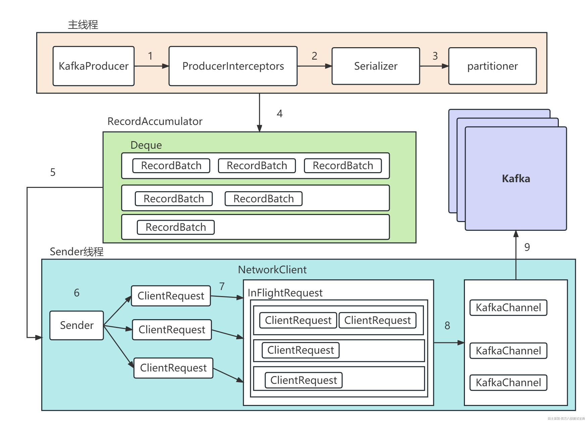

# 2、生产者消息缓存机制

### 1、RecordAccumulator

将消息缓存到RecordAccumulator收集器中, 最后判断是否要发送。这个加入消息收集器，首先得从 Deque 里找到自己的目标分区，如果没有就新建一个批量消息 Deque 加进入

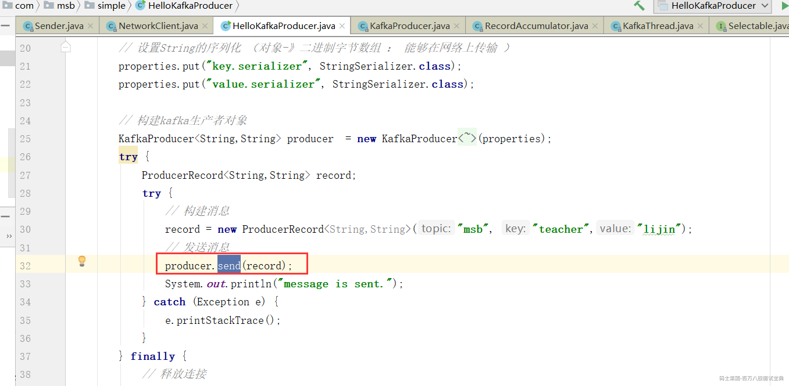

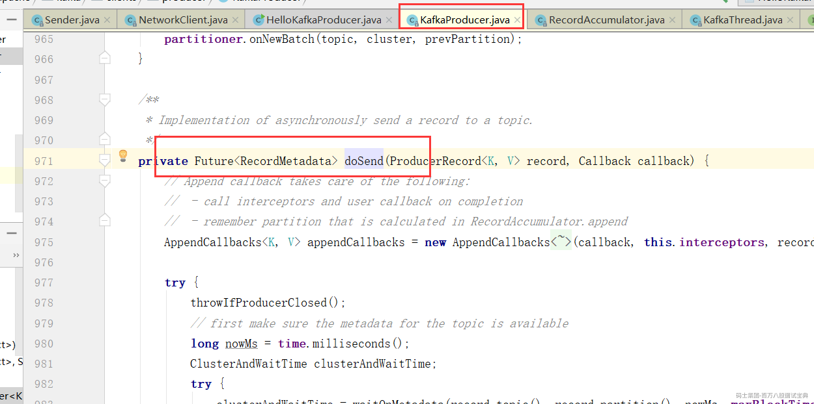

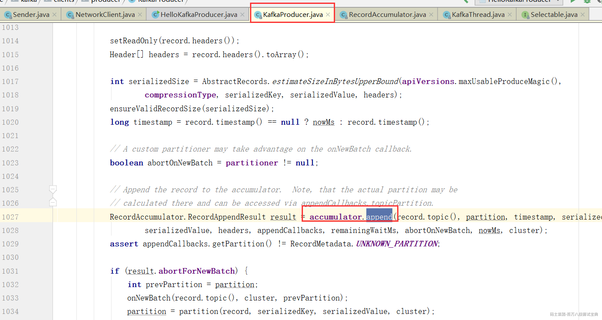

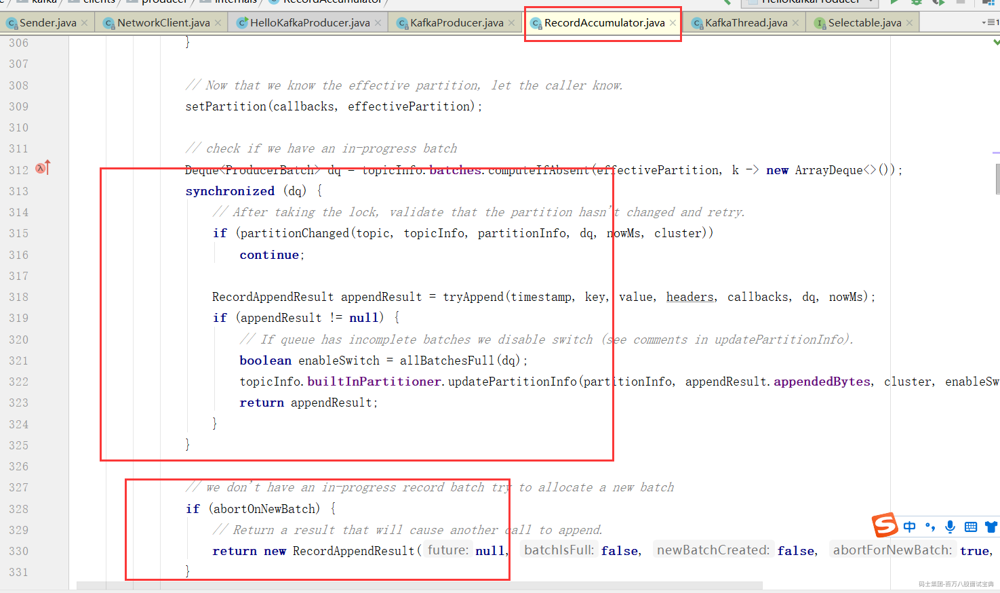

### 2、消息发送时机

如果达到发送阈值（**批次发送的条件为:缓冲区数据大小达到 batch.size 或者 linger.ms 达到上限，哪个先达到就算哪个**），唤醒Sender线程，

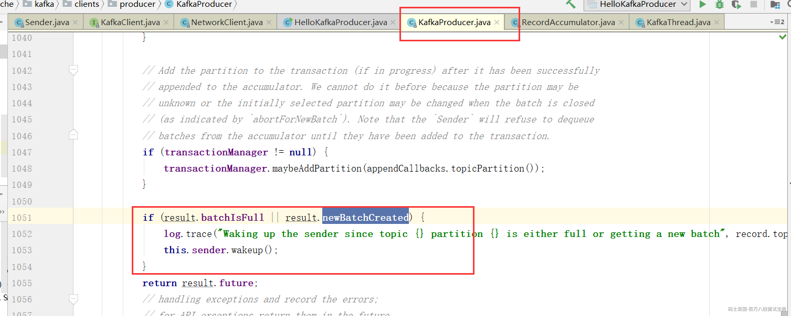

NetWorkClient 将 batch record 转换成 request client 的发送消息体, 并将待发送的数据按 【Broker Id <=> List】的数据进行归类

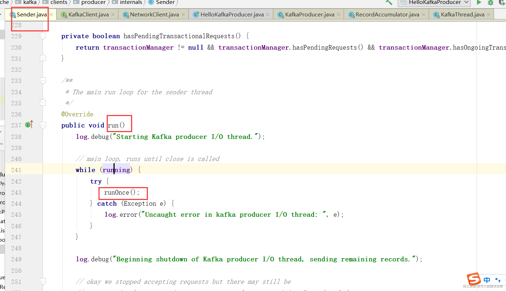

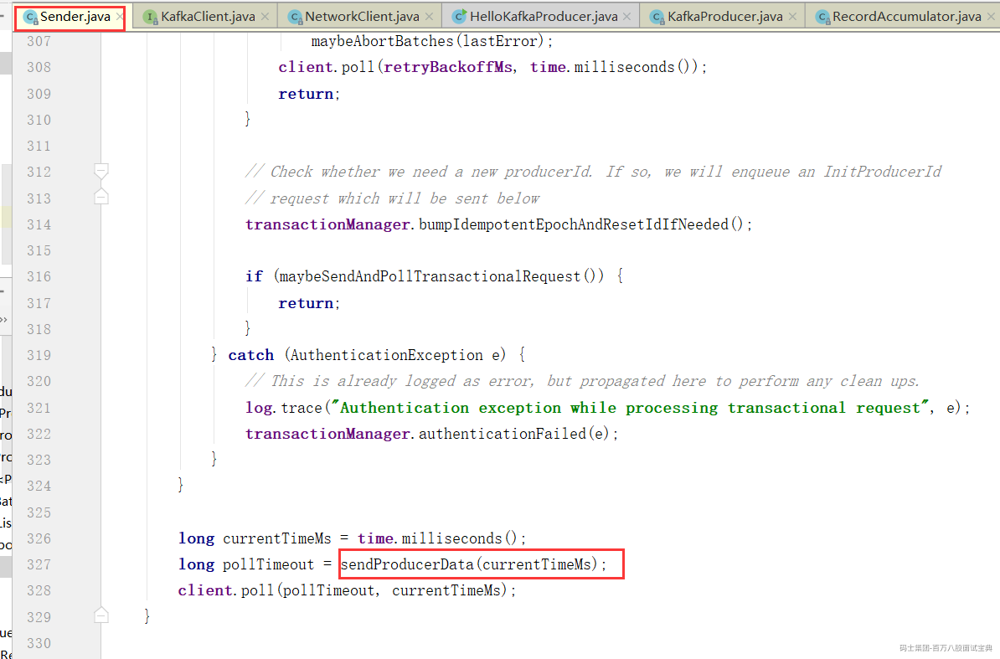

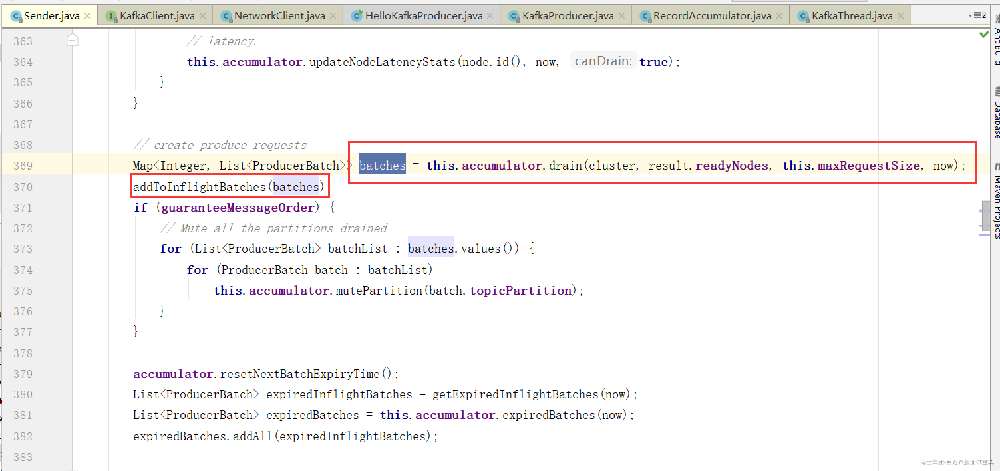

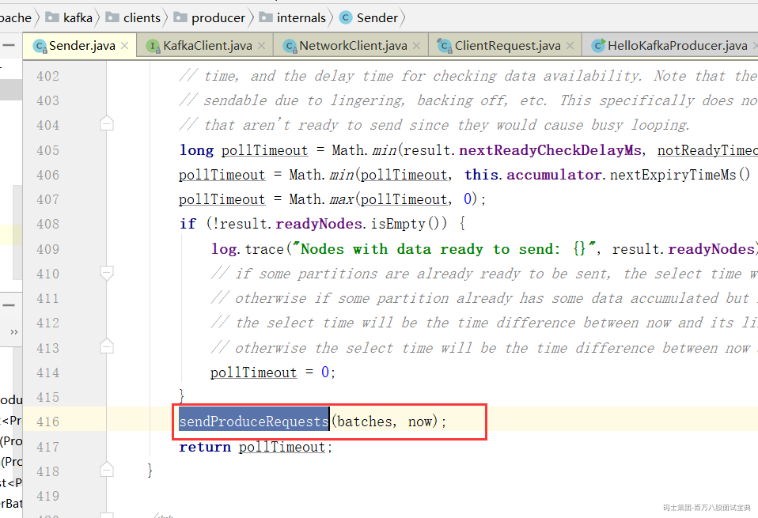

与服务端不同的 Broker 建立网络连接，将对应 Broker 待发送的消息 List 发送出去。

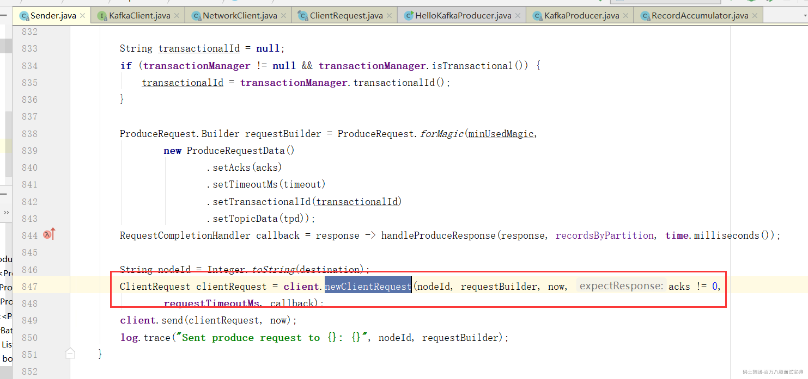

9)、

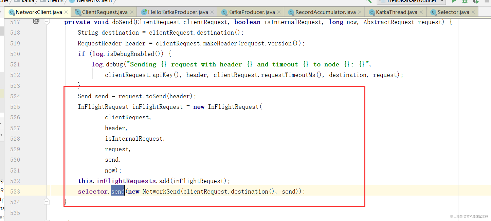

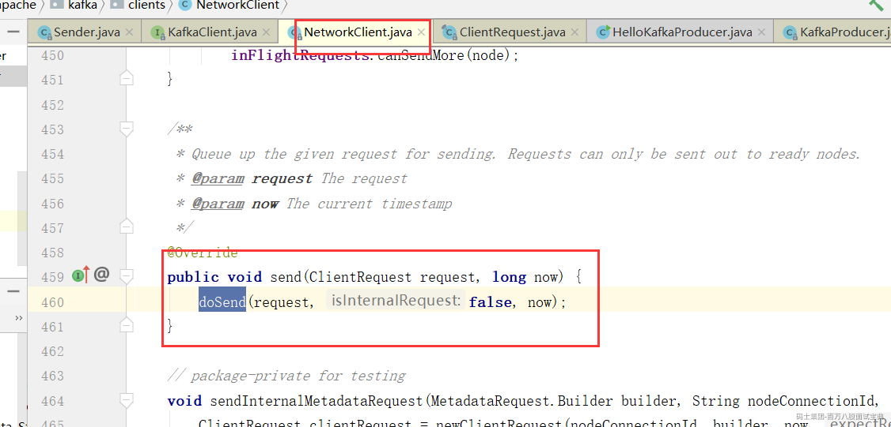

经过几轮跳转

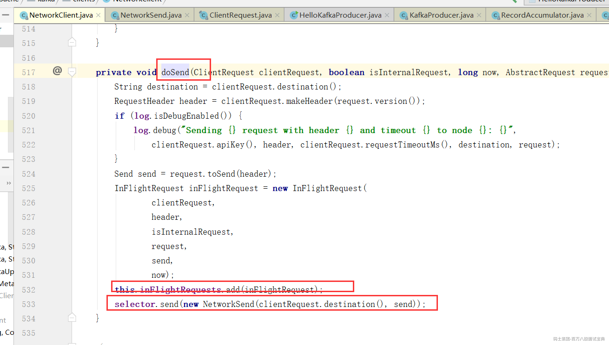

# 3、Kafka通讯组件解析

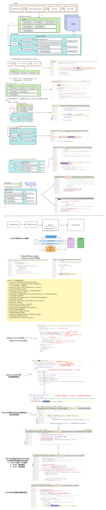
