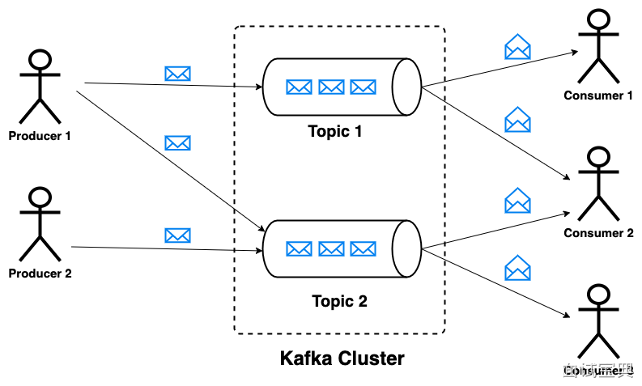

在 Kafka 中，消息的传递过程主要包括三个阶段：生产→存储→消费。以下是每个阶段的核心机制说明。

**1. 生产者发送消息**

- 它首先查询分区元数据（通过 Zookeeper 或 KRaft）以定位对应分区的 leader。
- 使用分区策略（如 key hash 或轮询）选择分区，将消息发送给分区 leader。
- leader 会立即 append 到本地日志并在 ISR 中同步到 follower。生产者根据 `acks` 设置，可等待 leader 或所有同步副本确认（如 `acks=all`）。M

**2. Broker 存储与维护消息**

- follower replica 会不断从 leader 拉取数据并写入 replica log。
- 一旦 follower 同步到 leader offset，leader 会视为已提交，才返回 ack（当使用 all 模式）。
- Broker 支持高吞吐与顺序性，因为采用顺序写与分页机制，保障写入效率与可靠性。B

**3. 消费者主动拉取并确认消息**

- 它携带当前 offset 向 leader broker 发起拉取请求，broker 返回从该 offset 开始的消息批次。
- 消费者处理后，可以选择自动提交 offset（`enable.auto.commit=true`）或手动提交，记录在 `__consumer_offsets` 主题或外部存储。
- 若消费者失败，下次重启可从上一次提交的位置继续消费，实现容错与重复消费控制。S
