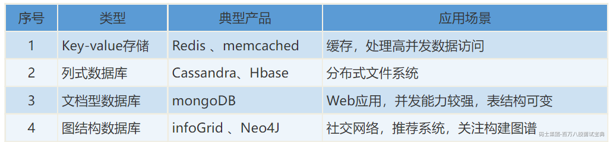
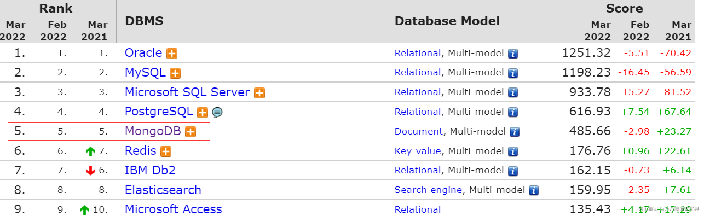
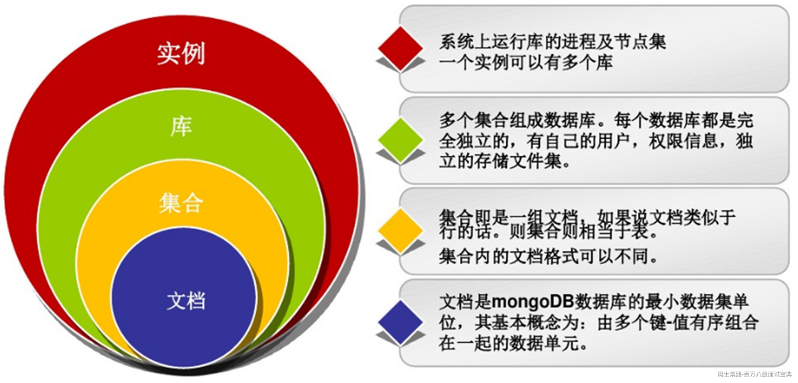
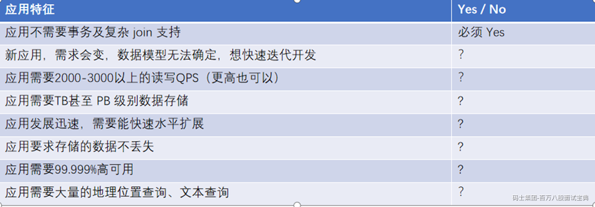

# 1. MongoDb综述

## 1.1. 什么是Nosql

NoSQL：Not Only SQL ,本质也是一种数据库的技术，相对于传统数据库技术，它不会遵循一些约束，比如：sql标准、ACID属性，表结构等。

**Nosql**优点

l 满足对数据库的高并发读写

l 对海量数据的高效存储和访问

l 对数据库高扩展性和高可用性

l 灵活的数据结构，满足数据结构不固定的场景

**Nosql**缺点

l 一般不支持事务

l 实现复杂SQL查询比较复杂

l 运维人员数据维护门槛较高

l 目前不是主流的数据库技术

### 1.1.1. NoSql分类

*(⚠️ 图片缺失:源知识库原图已失效)*

### 1.1.2. 数据库流行程度排行

<https://db-engines.com/en/ranking>

## 1.2. MongoDb概念入门

### 1.2.1. 什么是MongoDB

MongoDB：是一个数据库 ,高性能、无模式、文档性，目前nosql中最热门的数据库，开源产品，基于c++开发。是nosql数据库中功能最丰富，最像关系数据库的。

**特性**

l 面向集合文档的存储：适合存储Bson（json的扩展）形式的数据；

l 格式自由，数据格式不固定，生产环境下修改结构都可以不影响程序运行；

l 强大的查询语句，面向对象的查询语言，基本覆盖sql语言所有能力；

l 完整的索引支持，支持查询计划；

l 支持复制和自动故障转移；

l 支持二进制数据及大型对象（文件）的高效存储；

l 使用分片集群提升系统扩展性；

l 使用内存映射存储引擎，把磁盘的IO操作转换成为内存的操作；

### 1.2.2. MongoDB核心概念

### 1.2.3. 应不应该用MongoDB？

并没有某个业务场景必须要使用 MongoDB才能解决，但使用 MongoDB 通常能让你以更低的成本解决问题（包括学习、开发、运维等成本）

*(⚠️ 图片缺失:源知识库原图已失效)*

如果上述有1个 Yes，可以考虑 MongoDB，2个及以上的 Yes，选择MongoDB绝不会后悔！

### 1.2.4. MongoDB使用场景

MongoDB 的应用已经渗透到各个领域，比如游戏、物流、电商、内容管理、社交、物联网、视频直播等，以下是几个实际的应用案例：

l 游戏场景，使用 MongoDB 存储游戏用户信息，用户的装备、积分等直接以内嵌文档的形式存储，方便查询、更新

l 物流场景，使用 MongoDB 存储订单信息，订单状态在运送过程中会不断更新，以 MongoDB 内嵌数组的形式来存储，一次查询就能将订单所有的变更读取出来。

l 社交场景，使用 MongoDB 存储存储用户信息，以及用户发表的朋友圈信息，通过地理位置索引实现附近的人、地点等功能

l 物联网场景，使用 MongoDB 存储所有接入的智能设备信息，以及设备汇报的日志信息，并对这些信息进行多维度的分析

l 视频直播，使用 MongoDB 存储用户信息、礼物信息等

#### 1.2.4.1. 不使用MongoDB的场景

l 高度事务性系统：例如银行、财务等系统。MongoDB对事物的支持较弱；

l 传统的商业智能应用：特定问题的数据分析，多数据实体关联，涉及到复杂的、高度优化的查询方式；

l 使用sql方便的时候；数据结构相对固定，使用sql进行查询统计更加便利的时候；

#### 1.2.4.2. 谁在使用MongoDB

