# 2. MongoDB应用与开发

## 2.1. MongoDB安装

l **官网下载安装介质：**

[Try MongoDB Atlas Products | MongoDB](https://www.mongodb.com/try/download/community)

选择对应版本


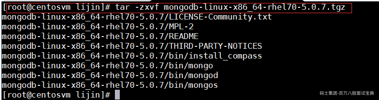

修改环境变量  
vi /etc/profile  
export MONGODB\_HOME=/home/lijin/mongodb  
export PATH=MONGODB\_HOME/bin  
source /etc/profile

创建mongodb存储目录

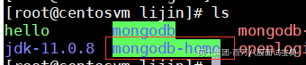

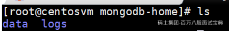

启动命令：

mongod --dbpath /home/lijin/mongodb-home/data --logpath /home/lijin/mongodb-home/logs/mongod.log --fork

客户端连接测试下：


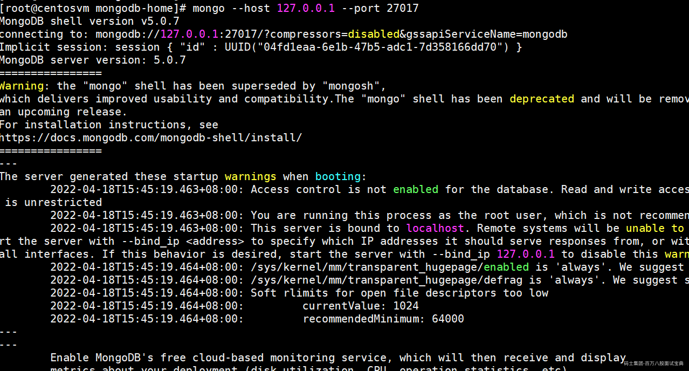

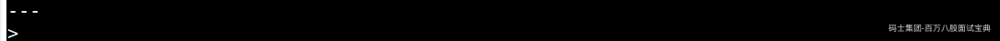

MongoDB默认会创建admin、config、local、test数据库。test库是一个默认的数据库，除了test库外admin、config、local库为系统库。admin库主要存储MongoDB的用户、角色等信息，config库主要存储分片集群基础信息，local库主要存储副本集的元数据。

## 2.2. 使用MongoDB脚本实现增删查改

### 2.2.1.基本操作

**选择和创建数据库的语法格式：**

```plain
use 数据库名称
```

查看有权限查看的所有的数据库命令

```plain
show dbs
或
show databases
```

admin ： 从权限的角度来看，这是"root"数据库。要是将一个用户添加到这个数据库，这个用户自动继承所有数据库的权限。一些特定的服务器端命令也只能从这个数据库运行，比如列出所有的数据库或者关闭服务器。  
local: 这个数据永远不会被复制，可以用来存储限于本地单台服务器的任意集合  
config : 当Mongo用于分片设置时，config数据库在内部使用，用于保存分片的相关信息。

**集合的操作**

新增：

```plain
db.createCollection(name)
```

隐式的方式

```plain
db.test_d.insert({u_id:1,goods_id:1});
```

**集合的查询**

```plain
show tables;
```

**集合的命名规范：**  
集合名不能是空字符串 ""。  
集合名不能含有 \0字符（空字符)，这个字符表示集合名的结尾。  
集合名不能以 "system."开头，这是为系统集合保留的前缀。  
用户创建的集合名字不能含有保留字符。另外千万不要在名字里出现$。

**文档的插入**

```plain
 db.test.insert("")
```

**批量插入**

```plain
db.comment.insertMany([{"id" : 110, "name" : "lijin", "createdatetime" : new Date(), "content" : "今天下雨，天气不好"},{"id" : 110, "name" : "lijin", "createdatetime" : new Date(), "content" : "今天下雨，天气不好"},{"id" : 110, "name" : "lijin", "createdatetime" : new Date(), "content" : "今天下雨，天气不好"},{"id" : 110, "name" : "lijin", "createdatetime" : new Date(), "content" : "今天下雨，天气不好"}
]);
```

**文档的基本查询**

查询数据的语法格式如下：

```plain
db.collection.find(<query>, [projection])
```

**文档的更新**

```plain
db.collection.update(query, update, options)
```

**文档的删除**

```plain
db.collection.remove(条件)
```

```plain
db.collection.remove({_id:"1"})
```

```plain
db.comment.remove({})  删除全部
```

### 2.2.2.复杂操作

**统计查询**

```plain
db.collection.count(query, options)

db.note.count();  --统计所有记录

db.note.count({name:"king"});  --统计name为king的记录条数

```

**分页列表查询**

```plain
db.COLLECTION_NAME.find().limit(NUMBER).skip(NUMBER)
limit()方法来读取指定数量的数据，使用skip()方法来跳过指定数量的数据

db.note.find().limit(3)

db.note.find().skip(3)
```

**分页查询：需求：每页5个**

```plain
db.note.find().skip(0).limit(5)   //第一页
db.note.find().skip(5).limit(5)   //第二页
db.note.find().skip(10).limit(5)   //第三页
```

**排序查询**

```plain
db.集合名称.find().sort(排序方式)          1升序、-1降序

db.note.find().sort({name:-1,id:-1})
```

skip(), limit(), sort()三个放在一起执行的时候，执行的顺序是先 sort(), 然后是 skip()，最后是显示的 limit()，和命令编写顺序无关

```plain
db.note.find().skip(0).limit(5).sort({name:-1,id:-1})
```

**正则表达式**

```plain
db.集合.find({字段:/正则表达式/})           正则表达式是 js的语法
db.note.find({content:/下雨/})               content包含'下雨'的
db.note.find({name:/^k/})                    name是k开头的
```

**比较查询**

```plain
db.集合名称.find({ "field" : { $gt: value }}) // 大于: field > value
db.集合名称.find({ "field" : { $lt: value }}) // 小于: field < value
db.集合名称.find({ "field" : { $gte: value }}) // 大于等于: field >= value
db.集合名称.find({ "field" : { $lte: value }}) // 小于等于: field <= value
db.集合名称.find({ "field" : { $ne: value }}) // 不等于: field != value

db.note.find({id:{$gt:252}})

db.note.find({$and:[{id:{$gt:252}},{id:{$lt:256}}]})
```

**条件连接查询**

```plain
$and:[ {  },{  },{ } ]
```

**包含查询**

```plain
db.note.find({id:{$in: [252,254]}})
```

## 2.3.索引-Index

索引（Index）是帮助MongoDB高效获取数据的数据结构，索引支持在MongoDB中高效地执行查询。如果没有索引，MongoDB必须执行全集合扫描，即扫描集合中的每个文档，以选择与查询语句匹配的文档。这种扫描全集合的查询效率是非常低的，特别在处理大量的数据时，查询可以要花费几十秒甚至几分钟，这对网站的性能是非常致命的。

MongoDB索引使用B树数据结构（确切的说是B-Tree，MySQL是B+Tree）

### 2.3.1.索引的基础知识

B-树索引的构造类似于二叉树，根据键值（Key Value）快速找到数据。注意B-树中的B不是代表二叉(binary)，而是代表平衡(balance)，因为B-树是从最早的平衡二叉树演化而来，但是B-树不是一个二叉树。

在讲二叉树之前，我们必须了解一下**二分查找：**

二分查找法（binary search） 也称为折半查找法，用来查找一组有序的记录数组中的某一记录。

在以下数组中找到数字48对应的下标


通过3次二分查找 就找到了我们所要的数字，而顺序查找需8次。

对于上面10个数来说，顺序查找平均查找次数为（1+2+3+4+5+6+7+8+9+10)/10=5.5次。而二分查找法为(4+3+2+4+3+1+4+3+2+3)/10=2.9次。在最坏的情况下，顺序查找的次数为10，而二分查找的次数为4。

所以为了索引查找的高效性，我们引入了二叉查找树。

#### 2.3.1.1.二叉树

##### **2.3.1.1.1树(Tree)**

N个结点构成的有限集合。

- 树中有一个称为”根(Root)”的特殊结点

- 其余结点可分为M个互不相交的树，称为原来结点的”子树”

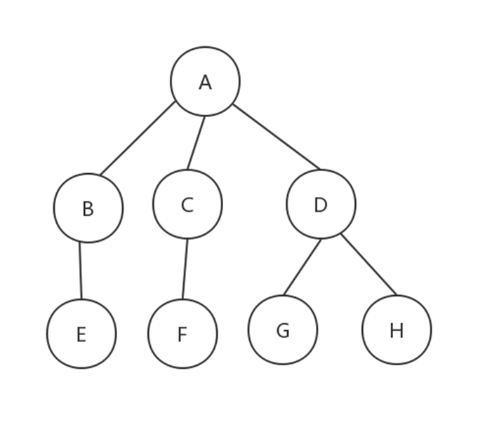

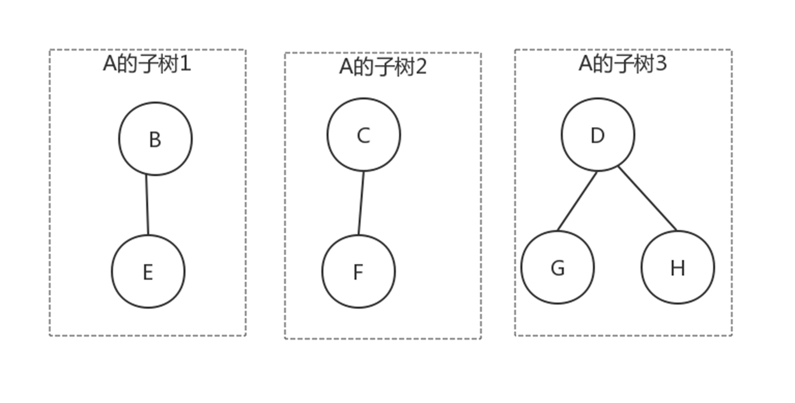

##### **2.3.1.1.2.树与非树**

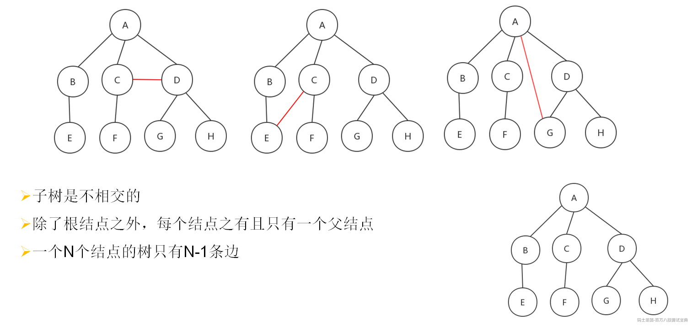

##### **2.3.1.1.3.树的一些基本术语**

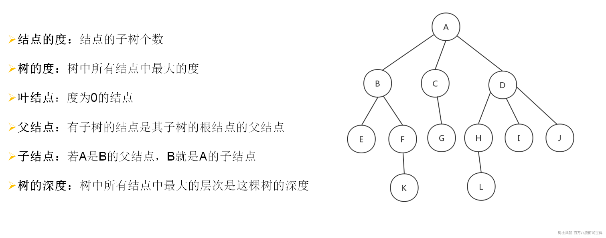

##### **2.3.1.1.4.二叉树**

**度为2的树（也可称之为阶）：**（树的度：树中所有结点中最大的度。结点的度：结点的子树个数）

**子树有左右顺序之分：**

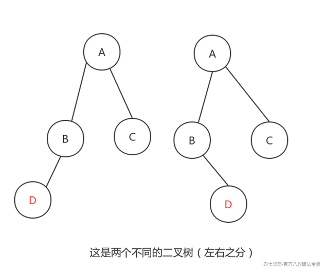

##### 2.3.1.1.5.二叉查找(搜索)树

二叉查找树首先肯定是个二叉树，除此之外还符合以下几点：

- 左子树的所有的值小于根节点的值

- 右子树的所有的值大于或等于根节点的值

- 左、右子树满足以上两点

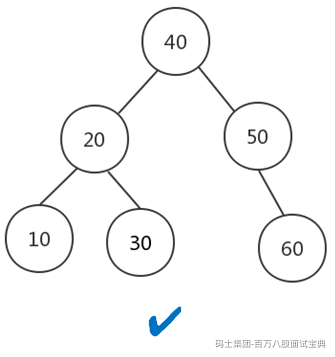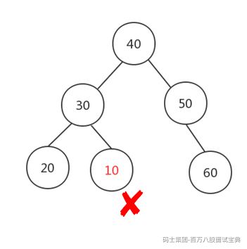

但是二叉查找树，如果设计不良，完全可以变成一颗极不平衡的二叉查找树：

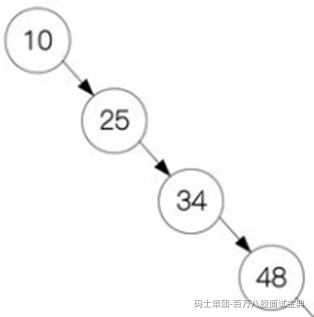

因此若想最大性能地构造一棵二叉查找树，需要这棵二叉查找树是平衡的，从而引出了新的定义——平衡二叉树，或称为AVL树。

##### 2.3.1.1.6.平衡二叉树（AVL-树）

它是一棵二叉排序树，它的左右两个子树的高度差（平衡因子）的绝对值不超过1，并且左右两个子树都是一棵平衡二叉树。

目的：使得树的高度最低，因为树查找的效率决定于树的高度

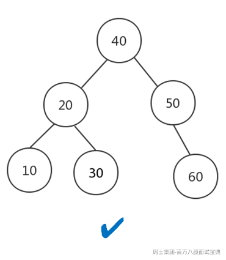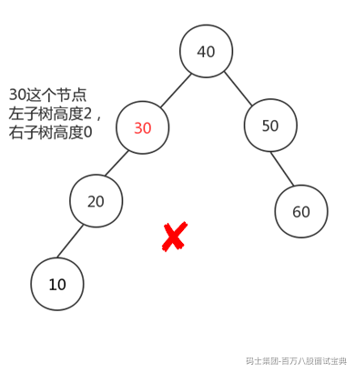

平衡二叉树的查找性能是比较高的，但是维护一棵平衡二叉树的代价是非常大的。通常来说，需要1次或多次左旋和右旋来得到插入、更新和删除后树的平衡性。

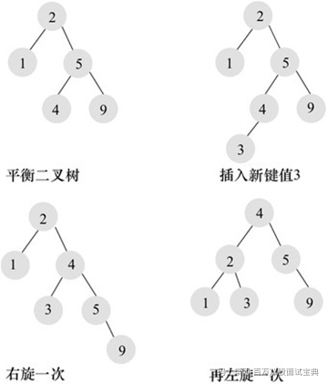

具体树的旋转见：[算法数据结构体系学习班 马士兵教育官网 - IT职业领路人 (mashibing.com)](https://www.mashibing.com/course/339)

章节11-13

#### 2.3.1.2.B-树

B- 树是从平衡二叉查找树演化而来（但B+树不是二叉树，而是一个多叉查找平衡树）。

下图就是一颗平衡二叉查找树

借助网页工具：[Data Structure Visualization (usfca.edu)](https://www.cs.usfca.edu/~galles/visualization/Algorithms.html)

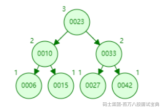

现在我们将其改造成 B- 树

树的阶数表示一个节点最多能有多少个子节点。

每个节点存储了实际的数据，所有的节点都按照排序二叉树来进行排列；


从AVL到B-树的变化可知，如果节点特别多的话，AVL树的高度远远高于B+树。

下图是一颗实际情况下的B-树

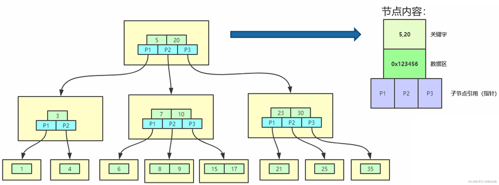

### 2.3.2.索引的类型

#### 2.3.2.1.单字段索引

MongoDB支持在文档的单个字段上创建用户定义的升序/降序索引，称为单字段索引（Single Field Index）。  
对于单个字段索引和排序操作，索引键的排序顺序（即升序或降序）并不重要，因为MongoDB可以在任何方向上遍历索引。


#### 2.3.2.2.复合索引

MongoDB还支持多个字段的用户定义索引，即复合索引（Compound Index）。  
复合索引中列出的字段顺序具有重要意义。例如，如果复合索引由 { userid: 1, score: -1 } 组成，则索引首先按userid正序排序，然后在每个userid的值内，再在按score倒序排序。

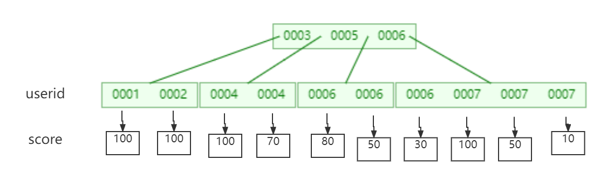

### 2.3.3.索引的管理

**索引的创建**

```plain
db.collection.ensureIndex()	--3.0.0 版本前
db.collection.createIndex(keys, options) --3.0.0 版本及之后
案例：对 note的content字段建立索引
db.note.createIndex({content:1})    --1是按照指定按升序创建索引   -1按降序来创建索引
```

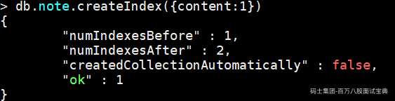

**查看索引**

```plain
db.note.getIndexes();  --查看索引
```

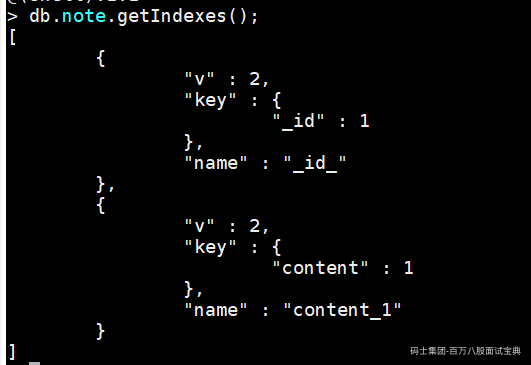

复合索引：对name 和content 同时建立复合（Compound）索引：

```plain
db.note.createIndex({name:1,content:1})
```

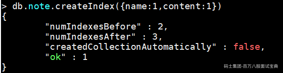

**索引的移除**

```plain
db.collection.dropIndex(index) --移除指定索引
db.collection.dropIndexes()   --移除所有索引
案例：删除note的的content索引
db.note.dropIndex({content:1})
```

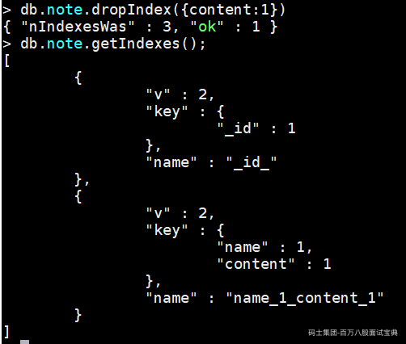

```plain
案例：删除note的所有索引
db.note.dropIndexes()
```

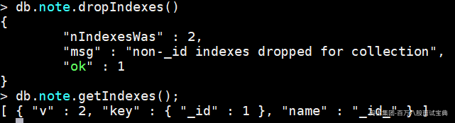

## 2.4.Java客户端及实战

### 2.4.1. 配置及代码

在一个标准的项目中引入pom文件

```plain
<dependency>
    <groupId>junit</groupId>

    <artifactId>junit</artifactId>

    <version>4.12</version>

</dependency>

<dependency>
    <groupId>org.mongodb</groupId>

    <artifactId>mongo-java-driver</artifactId>

    <version>3.12.2</version>

</dependency>

```

演示代码：

```plain
package com.msb.mongo;

import java.math.BigDecimal;
import java.util.ArrayList;
import java.util.Arrays;
import java.util.HashMap;
import java.util.List;
import java.util.Map;
import java.util.function.Consumer;

import com.mongodb.client.ClientSession;
import org.bson.Document;
import org.bson.conversions.Bson;
import org.junit.Before;
import org.junit.Test;

import com.mongodb.MongoClient;
import com.mongodb.client.FindIterable;
import com.mongodb.client.MongoCollection;
import com.mongodb.client.MongoDatabase;
import com.mongodb.client.result.DeleteResult;
import com.mongodb.client.result.UpdateResult;

import static com.mongodb.client.model.Updates.*;
import static com.mongodb.client.model.Filters.*;

//原生java驱动 document的操作方式
public class QuickStartJavaDocTest {
    //数据库
    private MongoDatabase db;
    //文档集合
    private MongoCollection<Document> doc;
    //连接客户端（内置连接池）
    private MongoClient client;
    @Before
    public void init() {
        client = new MongoClient("127.0.0.1", 27017);
        db = client.getDatabase("lijin");
        doc = db.getCollection("users");
    }

    @Test
    public void insertDemo() {
        Document doc1 = new Document();
        doc1.append("username", "lijin");
        doc1.append("country", "china");
        doc1.append("age", 36);
        doc1.append("lenght", 178.75f);
        doc1.append("salary", new BigDecimal("16565.22"));//存金额，使用bigdecimal这个数据类型

        //添加“address”子文档
        Map<String, String> address1 = new HashMap<String, String>();
        address1.put("aCode", "0000");
        address1.put("add", "xxx000");
        doc1.append("address", address1);

        //添加“favorites”子文档，其中两个属性是数组
        Map<String, Object> favorites1 = new HashMap<String, Object>();
        favorites1.put("movies", Arrays.asList("爱死机", "光环"));
        favorites1.put("cites", Arrays.asList("北京", "南京"));
        doc1.append("favorites", favorites1);

        Document doc2 = new Document();
        doc2.append("username", "yan");
        doc2.append("country", "China");
        doc2.append("age", 30);
        doc2.append("lenght", 185.75f);
        doc2.append("salary", new BigDecimal("38888.22"));
        Map<String, String> address2 = new HashMap<>();
        address2.put("aCode", "411000");
        address2.put("add", "我的地址2");
        doc2.append("address", address2);
        Map<String, Object> favorites2 = new HashMap<>();
        favorites2.put("movies", Arrays.asList("西游记", "东游记"));
        favorites2.put("cites", Arrays.asList("西藏", "三亚"));
        doc2.append("favorites", favorites2);

        //使用insertMany插入多条数据
        doc.insertMany(Arrays.asList(doc1, doc2));

    }

    @Test
    public void testFind() {
        final List<Document> ret = new ArrayList<>();
        //block接口专门用于处理查询出来的数据
        Consumer<Document> printDocument = new Consumer<Document>() {
            @Override
            public void accept(Document document) {
                System.out.println(document);
                ret.add(document);
            }
        };
        //select * from users  where favorites.cites has "东莞"、"东京"
        //db.users.find({ "favorites.cites" : { "$all" : [ "东莞" , "东京"]}})
        Bson all = all("favorites.cites", Arrays.asList("东莞", "东京"));//定义数据过滤器，喜欢的城市中要包含"东莞"、"东京"
        FindIterable<Document> find = doc.find(all);

        find.forEach(printDocument);

        System.out.println("------------------>" + String.valueOf(ret.size()));
        ret.removeAll(ret);

        //select * from users  where username like '%s%' and (contry= English or contry = USA)
        // db.users.find({ "$and" : [ { "username" : { "$regex" : ".*c.*"}} , { "$or" : [ { "country" : "English"} , { "country" : "USA"}]}]})

        String regexStr = ".*c.*";
        Bson regex = regex("username", regexStr);//定义数据过滤器，username like '%s%'
        Bson or = or(eq("country", "English"), eq("country", "USA"));//定义数据过滤器，(contry= English or contry = USA)
        Bson and = and(regex, or);
        FindIterable<Document> find2 = doc.find(and);
        find2.forEach(printDocument);
        System.out.println("------------------>" + String.valueOf(ret.size()));

    }

    @Test
    public void testUpdate() {
        //update  users  set age=6 where username = 'lison'
//    	db.users.updateMany({ "username" : "lison"},{ "$set" : { "age" : 6}},true)

        Bson eq = eq("username", "cang");//定义数据过滤器，username = 'cang'
        Bson set = set("age", 8);//更新的字段.来自于Updates包的静态导入
        UpdateResult updateMany = doc.updateMany(eq, set);
        System.out.println("------------------>" + String.valueOf(updateMany.getModifiedCount()));//打印受影响的行数

        //update users  set favorites.movies add "小电影2 ", "小电影3" where favorites.cites  has "东莞"
        //db.users.updateMany({ "favorites.cites" : "东莞"}, { "$addToSet" : { "favorites.movies" : { "$each" : [ "小电影2 " , "小电影3"]}}},true)

        Bson eq2 = eq("favorites.cites", "东莞");//定义数据过滤器，favorites.cites  has "东莞"
        Bson addEachToSet = addEachToSet("favorites.movies", Arrays.asList("小电影2 ", "小电影3"));//更新的字段.来自于Updates包的静态导入
        UpdateResult updateMany2 = doc.updateMany(eq2, addEachToSet);
        System.out.println("------------------>" + String.valueOf(updateMany2.getModifiedCount()));
    }

    @Test
    public void testDelete() {

        //delete from users where username = ‘lison’
        //db.users.deleteMany({ "username" : "lison"} )
        Bson eq = eq("username", "lison");//定义数据过滤器，username='lison'
        DeleteResult deleteMany = doc.deleteMany(eq);
        System.out.println("------------------>" + String.valueOf(deleteMany.getDeletedCount()));//打印受影响的行数

        //delete from users where age >8 and age <25
        //db.users.deleteMany({"$and" : [ {"age" : {"$gt": 8}} , {"age" : {"$lt" : 25}}]})

        Bson gt = gt("age", 8);//定义数据过滤器，age > 8，所有过滤器的定义来自于Filter这个包的静态方法，需要频繁使用所以静态导入
//    	Bson gt = Filter.gt("age",8);

        Bson lt = lt("age", 25);//定义数据过滤器，age < 25
        Bson and = and(gt, lt);//定义数据过滤器，将条件用and拼接
        DeleteResult deleteMany2 = doc.deleteMany(and);
        System.out.println("------------------>" + String.valueOf(deleteMany2.getDeletedCount()));//打印受影响的行数
    }

    @Test
    public void testTransaction() {
//		begin
//		update  users  set lenght= lenght-1  where username = ‘james’
//		update  users  set lenght= lenght+1  where username = ‘lison’
//		commit
        ClientSession clientSession = client.startSession();
        clientSession.startTransaction();
        Bson eq = eq("username", "james");
        Bson inc = inc("lenght", -1);
        doc.updateOne(clientSession,eq,inc);

        Bson eq2 = eq("username", "lison");
        Bson inc2 = inc("lenght", 1);

        doc.updateOne(clientSession,eq2,inc2);

        clientSession.commitTransaction();
        // clientSession.abortTransaction();

    }

}

```

### 2.4.2. 运行实战

**1、创建3个用户，包含以下信息：**

基本信息：姓名、城市，子集合1：地址，子集合2：爱好，等

@Before注解会在运行 @Test之前把mongodb的连接创建好！同时会创建一个users的文档集合doc

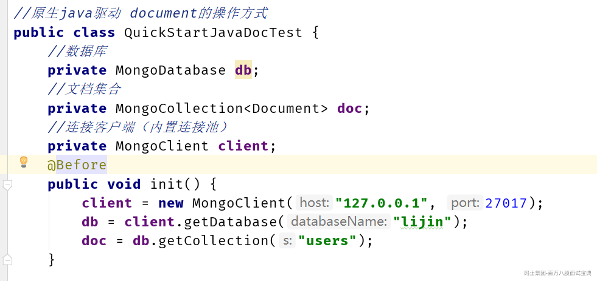

```plain
 @Test
    public void insertDemo() {
        Document doc1 = new Document();
        doc1.append("username", "lijin");
        doc1.append("country", "China");
        doc1.append("age", 36);
        doc1.append("lenght", 178.75f);
        doc1.append("salary", new BigDecimal("16565.22"));//存金额，使用bigdecimal这个数据类型
        Map<String, String> address1 = new HashMap<String, String>();       //添加“address”子文档
        address1.put("aCode", "0000");
        address1.put("add", "xxx000");
        doc1.append("address", address1);
        Map<String, Object> favorites1 = new HashMap<String, Object>();        //添加“favorites”子文档，其中两个属性是数组
        favorites1.put("movies", Arrays.asList("爱死机", "光环"));
        favorites1.put("cites", Arrays.asList("北京", "南京"));
        doc1.append("favorites", favorites1);

        Document doc2 = new Document();
        doc2.append("username", "yan");
        doc2.append("country", "China");
        doc2.append("age", 30);
        doc2.append("lenght", 185.75f);
        doc2.append("salary", new BigDecimal("38888.22"));
        Map<String, String> address2 = new HashMap<>();
        address2.put("aCode", "411000");
        address2.put("add", "我的地址2");
        doc2.append("address", address2);
        Map<String, Object> favorites2 = new HashMap<>();
        favorites2.put("movies", Arrays.asList("西游记", "东游记"));
        favorites2.put("cites", Arrays.asList("西藏", "三亚"));
        doc2.append("favorites", favorites2);

        Document doc3 = new Document();
        doc3.append("username", "mic");
        doc3.append("country", "USA");
        doc3.append("age", 60);
        doc3.append("lenght", 180.75f);
        doc3.append("salary", new BigDecimal("3008888.22"));
        Map<String, String> address3 = new HashMap<>();
        address3.put("aCode", "411000");
        address3.put("add", "我的地址2");
        doc3.append("address", address3);
        Map<String, Object> favorites3 = new HashMap<>();
        favorites3.put("movies", Arrays.asList("卓别林", "牛顿的棺材板"));
        favorites3.put("cites", Arrays.asList("纽约", "洛杉矶"));
        doc3.append("favorites", favorites3);

        //使用insertMany插入多条数据
        doc.insertMany(Arrays.asList(doc1, doc2,doc3));
    }
```

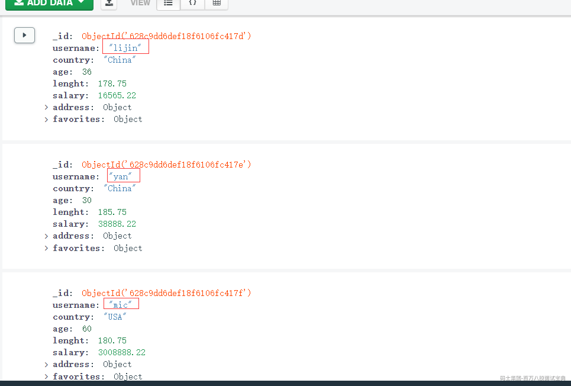

**2、查询user的所有的数据**

```plain
  //查询出文档集合中所有记录
    @Test
    public void testFindAll() {
        Consumer<Document> printDocument = new Consumer<Document>() {
            @Override
            public void accept(Document document) {
                System.out.println(document);
            }
        };
        FindIterable<Document> find = doc.find();
        find.forEach(printDocument);
    }
```

运行结果

```plain
Document{{_id=628c9dd6def18f6106fc417d, username=lijin, country=China, age=36, lenght=178.75, salary=16565.22, address=Document{{add=xxx000, aCode=0000}}, favorites=Document{{movies=[爱死机, 光环], cites=[北京, 南京]}}}}
Document{{_id=628c9dd6def18f6106fc417e, username=yan, country=China, age=30, lenght=185.75, salary=38888.22, address=Document{{add=我的地址2, aCode=411000}}, favorites=Document{{movies=[西游记, 东游记], cites=[西藏, 三亚]}}}}
Document{{_id=628c9dd6def18f6106fc417f, username=mic, country=USA, age=60, lenght=180.75, salary=3008888.22, address=Document{{add=我的地址2, aCode=411000}}, favorites=Document{{movies=[卓别林, 牛顿的棺材板], cites=[纽约, 洛杉矶]}}}}
```

**3、查询user(通过过滤条件1)**

```plain
@Test
    public void testFindFilter1() {
        //block接口专门用于处理查询出来的数据
        Consumer<Document> printDocument = new Consumer<Document>() {
            @Override
            public void accept(Document document) {
                System.out.println(document);
            }
        };
        //定义数据过滤器，喜欢的城市中要包含"北京"、"南京"
        Bson all = all("favorites.cites", Arrays.asList("北京", "南京"));
        FindIterable<Document> find = doc.find(all);
        find.forEach(printDocument);
    }
```

运行结果

```plain
Document{{_id=628c9dd6def18f6106fc417d, username=lijin, country=China, age=36, lenght=178.75, salary=16565.22, address=Document{{add=xxx000, aCode=0000}}, favorites=Document{{movies=[爱死机, 光环], cites=[北京, 南京]}}}}
```

**4、查询user(通过过滤条件2)**

```plain
 //查询出文档集合中的记录（过滤2）
    @Test
    public void testFindFilter2() {
        //block接口专门用于处理查询出来的数据
        Consumer<Document> printDocument = new Consumer<Document>() {
            @Override
            public void accept(Document document) {
                System.out.println(document);
            }
        };
        //定义数据过滤器，country like '%ina%'  and  contry= 北京 or contry = USA)
        String regexStr = ".*ina.*";
        Bson regex = regex("country", regexStr);
        Bson or = or(eq("favorites.cites", "北京"), eq("favorites.cites", "纽约"));
        Bson and = and(regex, or);
        FindIterable<Document> find = doc.find(and);
        find.forEach(printDocument);
    }
```

运行结果

```plain
Document{{_id=628c9dd6def18f6106fc417d, username=lijin, country=China, age=36, lenght=178.75, salary=16565.22, address=Document{{add=xxx000, aCode=0000}}, favorites=Document{{movies=[爱死机, 光环], cites=[北京, 南京]}}}}
```
