# 3. MongoDB高级进阶

## 3.1. MongoDB的复制集

### 3.1.1. 复制集及原理

**MongoDB复制集的主要意义在于实现服务高可用**

**复制集的现实依赖于两个方面的功能:**

- 数据写入时将数据迅速复制到另一个独立节点上

- 在接受写入的节点发生故障时自动选举出一个新的替代节点

**复制集在实现高可用的同时，还有以下作用:**

- 数据分发:将数据从一个区域复制到另一个区域，减少另一个区域的读延迟

- 读写分离:不同类型的压力分别在不同的节点上执行

- 异地容灾:在数据中心故障时候快速切换到异地

**一个典型的复制集由3个以上具有投票权的节点组成:**

- 一个主节点（PRIMARY)︰接受写入操作和选举时投票

- 两个（或多个)从节点(SECONDARY)∶复制主节点上的新数据和选举时投票

- 不推荐使用Arbiter（投票节点)

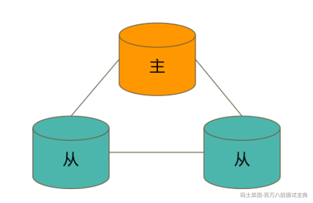

**数据是如何复制的**

- 当一个修改操作，无论是插入、更新或删除，到达主节点时，它对数据的操作将被记录下来（经过一些必要的转换），这些记录称为oplog。

- 从节点通过在主节点上打开一个tailable游标不断获取新进入主节点的oplog，并在自己的数据上回放，以此保持跟主节点的数据一致。不推荐使用Arbiter（投票节点)


**通过选举完成故障恢复**

- 具有投票权的节点之间两两互相发送心跳（2s）

- 当5次心跳未收到时判断为节点失联

- 如果失联的是主节点，从节点会发起选举，选出新的主节点

- 如果失联的是从节点则不会产生新的选举

- 选举基于 RAFT一致性算法实现，选举成功的必要条件是大多数投票节点存活

- 复制集中最多可以有50个节点，但具有投票权的节点最多7个

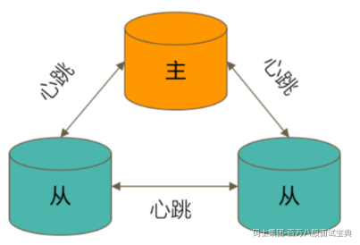

**选举的因素**

整个集群必须有大多数节点存活

被选举为主节点的节点必须：

- 能够与多数节点建立连接

- 具有较新的 oplog

- 具有较高的优先级（如果有配置）

**复制集的常见选项**

复制集节点有以下常见的选配项：

- 是否具有投票权（v 参数）：有则参与投票

- 优先级（priority 参数）：优先级越高的节点越优先成为主节点。优先级为0的节点无法成为主节点

- 隐藏（hidden 参数）：复制数据，但对应用不可见。隐藏节点可以具有投票仅，但优先级必须为0

- 延迟（slaveDelay 参数）：复制 n 秒之前的数据，保持与主节点的时间差

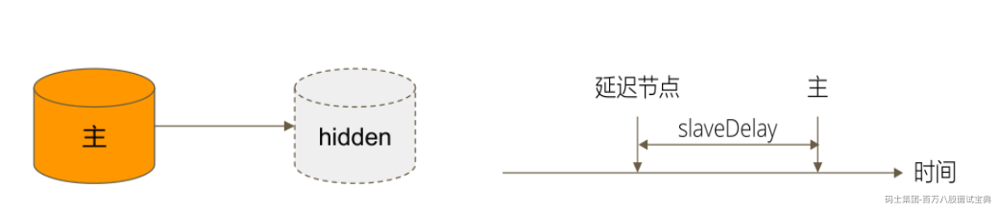

**复制集的注意事项**

关于硬件：

- 因为正常的复制集节点都有可能成为主节点，它们的地位是一样的，因此硬件配置上必须一致；

- 为了保证节点不会同时宕机，各节点使用的硬件必须具有独立性。

关于软件：

- 复制集各节点软件版本必须一致，以避免出现不可预知的问题

增加节点不会增加系统写性能

### 3.1.2. 复制集的搭建过程

我们通过在一台机器上运行3个实例来搭建一个最简单的复制集。  
• 如何启动一个 MongoDB 实例  
• 如何将3个 MongoDB 实例搭建成一个复制集  
• 如何对复制集运行参数做一些常规调整

**1、准备**

● 安装最新的 MongoDB 版本  
● Windows 系统请事先配置好 MongoDB 可执行文件的环境变量  
● Linux 和 Mac 系统请配置 PATH 变量  
● 确保有 10GB 以上的硬盘空间

**2、创建数据目录**

MongoDB 启动时将使用一个数据目录存放所有数据文件。我们将为3个复制集节点创建各自的数据目录。  
● Linux/MacOS:  
mkdir -p /data/db{1,2,3}  
● Windows:  
md c:\data\db1  
md c:\data\db2  
md c:\data\db3

**3、准备配置文件**

复制集的每个mongod进程应该位于不同的服务器。我们现在在一台机器上运行3个进程，因此要  
为它们各自配置：  
● 不同的端口。示例中将使用28017/28018/28019

不同的数据目录。示例中将使用：  
/data/db1或c:\data\db1  
/data/db2或c:\data\db2  
/data/db3或c:\data\db3

不同日志文件路径。示例中将使用：  
/data/db1/mongod.log或c:\data\db1\mongod.log  
/data/db2/mongod.log或c:\data\db2\mongod.log  
/data/db3/mongod.log或c:\data\db3\mongod.log

**Linux/MacOS**

/data/db1/mongod.conf

```plain
systemLog:
  destination: file
  path: /data/db1/mongod.log # log path
  logAppend: true
storage:
  dbPath: /data/db1 # data directory
net:
  bindIp: 0.0.0.0
  port: 28017 # port
replication:
  replSetName: rs0
processManagement:
  fork: true
```

**Windows**

c:\data\db1\mongod.conf

```plain
systemLog:
destination: file
path: c:\data1\mongod.log # 日志文件路径
logAppend: true
storage:
dbPath: c:\data1 # 数据目录
net:
bindIp: 0.0.0.0
port: 28017 # 端口
replication:
replSetName: rs0
```

**4、启动 MongoDB 进程**

**Linux/Mac:**  
mongod -f /data/db1/mongod.conf  
mongod -f /data/db2/mongod.conf  
mongod -f /data/db3/mongod.conf  
注意：如果启用了 SELinux，可能阻止上述进程启动。简单起见请关闭 SELinux。

**Windows:**  
mongod -f c:\data1\mongod.conf  
mongod -f c:\data2\mongod.conf  
mongod -f c:\data3\mongod.conf  
因为 Windows 不支持 fork，以上命令需要在3个不同的窗口执行，执行后不可关闭窗口否则  
进程将直接结束。

**5、配置复制集**

**方法1**

```plain
# mongo --port 28017
> rs.initiate()
> rs.add("centosvm:28018")
> rs.add("centosvm:28019")
```

注意：此方式hostname 需要能被解析

**方法2**

```plain
# mongo --port 28017
> rs.initiate({_id: "rs0",members: [{_id: 0,host: "localhost:28017"}
        ,{_id: 1,host: "localhost:28018"}
        ,{_id: 2,host: "localhost:28019"}]})
```

**6、验证**

MongoDB 主节点进行写入

```plain
# mongo localhost:28017
> db.test.insert({ a:1 })
> db.test.insert({ a:2 });
```

MongoDB 从节点进行读

```plain
# mongo localhost:28018
> rs.slaveOk()
> db.test.find()
> db.test.find()
```

## 3.2.复制集的写策略

### 3.2.1 什么是 writeConcern ？

writeConcern 决定一个写操作落到多少个节点上才算成功。writeConcern 的取值包括：  
• 0：发起写操作，不关心是否成功；  
• 1~n(n为集群最大数据节点数）：写操作需要被复制到指定节点数才算成功；  
• majority：写操作需要被复制到大多数节点上才算成功。  
发起写操作的程序将阻塞到写操作到达指定的节点数为止

**默认行为**

w: “1”

默认的writeConcern，数据写入到Primary就向客户端发送确认

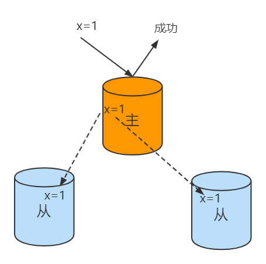

**w: “majority”**

大多数节点确认模式

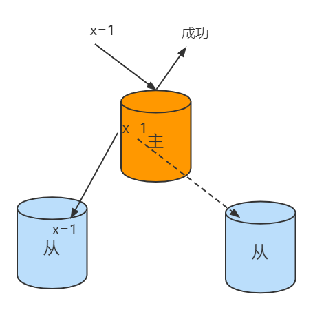

**w: “all”**

全部节点确认模式


j:true

类似于关系数据库中的事务日志。Journaling能够使MongoDB数据库由于意外故障后快速恢复。MongoDB2.4版本后默认开启了Journaling日志功能,mongod实例每次启动时都会检查journal日志文件看是否需要恢复。由于提交journal日志会产生写入阻塞,所以它对写入的操作有性能影响,但对于读没有影响。在生产环境中开启Journaling是很有必要的。

journal 则定义如何才算成功。取值包括：  
• true: 写操作落到 journal 文件中才算成功；  
• false: 写操作到达内存即算作成功。

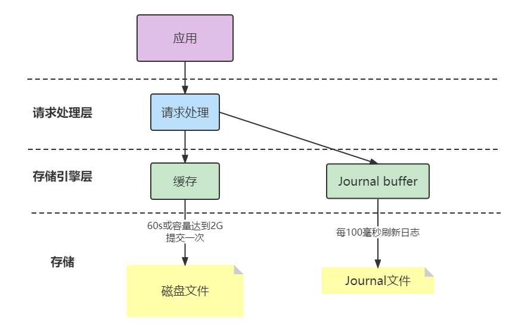

### 3.2.2 writeConcern的意义

对于5个节点的复制集来说，写操作落到多少个节点上才算是安全的？

至少3个节点或者配置majority

### 3.2.3 writeConcern的实战

在复制集测试writeConcern参数

```plain
db.test.insert( {count: 1}, {writeConcern: {w: "majority"}})
db.test.insert( {count: 1}, {writeConcern: {w: 3 }})
db.test.insert( {count: 1}, {writeConcern: {w: 4 }})
```

配置延迟节点，模拟网络延迟（复制延迟）

```plain
conf=rs.conf()
conf.members[2].secondaryDelaySecs = 5   //老版本可能是conf.members[2].slaveDelay = 5
conf.members[2].priority = 0
rs.reconfig(conf)
```

观察复制延迟下的写入，以及timeout参数

```plain
db.test.insert( {count: 1}, {writeConcern: {w: 3}})
db.test.insert( {count: 1}, {writeConcern: {w: 3, wtimeout:3000 }})
```

注意事项

• 虽然多于半数的 writeConcern 都是安全的，但通常只会设置 majority，因为这是等待写入延迟时间最短的选择；  
• 不要设置 writeConcern 等于总节点数，因为一旦有一个节点故障，所有写操作都将失败；  
• writeConcern 虽然会增加写操作延迟时间，但并不会显著增加集群压力，因此无论是否等待，写操作最终都会复制到所有节点上。设置 writeConcern 只是让写操作等待复制后再返回而已；  
• 应对重要数据应用 {w: “majority”}，普通数据可以应用 {w: 1} 以确保最佳性能。

## 3.3.复制集的读策略

### 3.3.1.从哪里读？

在复制集中，读取数据我们需要关注从哪里读的问题，这个问题是由readPreference 来解决


#### **3.3.1.1.什么是 readPreference？**

readPreference 决定使用哪一个节点来满足正在发起的读请求。可选值包括：

primary: 只选择主节点（默认值）；

primaryPreferred：优先选择主节点，如果不可用则选择从节点；

secondary：只选择从节点；

secondaryPreferred：优先选择从节点，如果从节点不可用则选择主节点；

nearest：选择最近的节点；

**适用场景**

**primary/primaryPreferred**

用户下订单后马上将用户转到订单详情页（查询时效性要求）

**secondary/secondaryPreferred**

用户查询自己下过的订单（查询历史订单对时效性通常没有太高要求）

**secondary**

生成报表

报表对时效性要求不高，但资源需求大，可以在从节点单独处理，避免对线上用户造成影响

**nearest**

将用户上传的图片分发到全世界，让各地用户能够就近读取（每个地区的应用选择最近的节点读取数据）

**Tag**

readPreference 只能控制使用一类节点。Tag 则可以将节点选择控制到一个或几个节点。考虑以下场景：  
• 一个 5 个节点的复制集；  
• 3 个节点硬件较好，专用于服务线上客户；  
• 2 个节点硬件较差，专用于生成报表；  
可以使用 Tag 来达到这样的控制目的：  
• 为 3 个较好的节点打上 {purpose: "online"}；  
• 为 2 个较差的节点打上 {purpose: "analyse"}；  
• 在线应用读取时指定 online，报表读取时指定analyse。

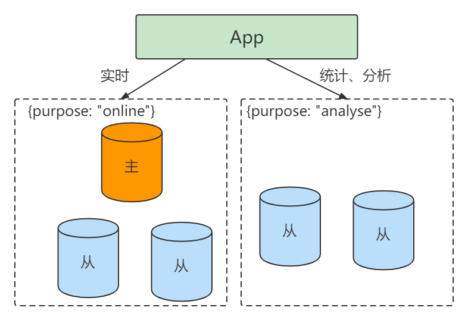

#### 3.3.1.2.readPreference配置

通过 MongoDB 的连接串参数：

```plain
?mongodb://host1:27107,host2:27107,host3:27017/?replicaSet=rs&readPreference=secondary
```

通过 MongoDB 驱动程序 API：

```plain
MongoCollection.withReadPreference(ReadPreference readPref)
```

Mongo Shell：

```plain
db.collection.find({}).readPref( "secondary")
```

#### 3.3.1.3.readPreference实战


•主节点写入 {x:1}, 观察该条数据在各个节点均可见

```plain
db.test.drop()
db.test.insert({x:1})
```

• 在两个从节点分别执行 db.fsyncLock() 来锁定写入（同步）

```plain
db.fsyncLock()
```

• 主节点写入 {x:2}

```plain
db.test.insert({x:2})
```

主节点上

```plain
db.test.find()
```

• 解除从节点锁定 db.fsyncUnlock()

```plain
db.fsyncUnlock()
```

从节点上我们在看

```plain
db.test.find().readPref("secondary")
```

#### 3.3.1.4.readPreference注意事项

指定 readPreference 时也应注意高可用问题。例如将 readPreference 指定 primary，则发生故障转移不存在 primary 期间将没有节点可读。如果业务允许，则应选择 primaryPreferred；

### 3.3.2.怎样的数据可以读？

在复制集中，读取数据我们需要关注什么样的数据可以读？这个问题是由readConcern来解决

#### 3.3.2.1. 什么是 readConcern？

readConcern 决定这个节点上的数据哪些是可读的，类似于关系数据库的隔离级别。可选值包括：

• available：读取所有可用的数据;  
• local：读取所有可用且属于当前分片的数据;  
• majority：读取在大多数节点上提交完成的数据;  
• linearizable：可线性化读取文档;  
• snapshot：读取最近快照中的数据;

#### 3.3.2.2 majority

只读取大多数据节点上都提交了的数据。

以下场景中将一个数据写入一主两从的复制集中。

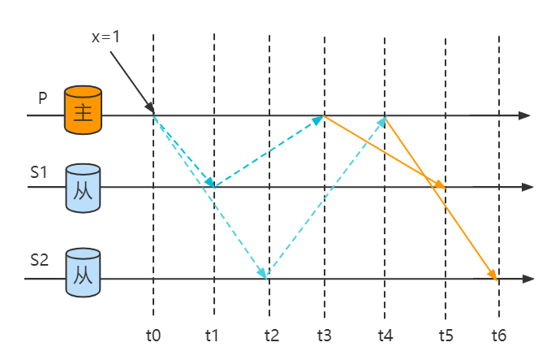

在各节点上不同的时间通过{readConcern: “majority”} 来读取数据

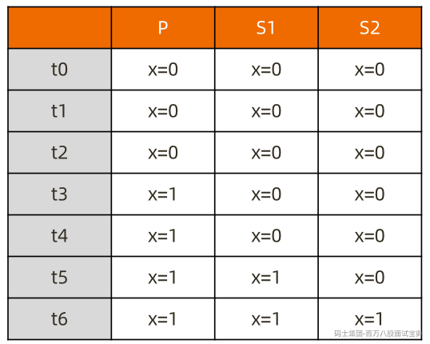

majority如何实现？  
节点上维护多个 x 版本，MVCC 机制

MongoDB 通过维护多个快照来链接不同的版本：  
• 每个被大多数节点确认过的版本都将是一个快照；  
• 快照持续到没有人使用为止才被删除；

#### 3.2.2.3 majority的实战

安装 3 节点复制集(一主两从)。

注意配置文件内 server 参数 enableMajorityReadConcern


将复制集中的两个从节点使用 db.fsyncLock() 锁住写入（模拟同步延迟）

```plain
db.test.save({"x":1})
db.test.find().readConcern("local")
db.test.find().readConcern("majority")

```

在某一个从节点上执行 db.fsyncUnlock()

结论：  
• 使用 local 参数，则可以直接查询到写入数据  
• 使用 majority，只能查询到已经被多数节点确认过的数据  
• update 与 remove 与上同理。

MongoDB 中的回滚：  
• 写操作到达大多数节点之前都是不安全的，一旦主节点崩溃，而从节还没复制到该次操作，刚才的写操作就丢失了；  
• 把一次写操作视为一个事务，从事务的角度，可以认为事务被回滚了。所以从分布式系统的角度来看，事务的提交被提升到了分布式集群的多个节点级别的“提交”，而不再是单个节点上的“提交”。  
**在可能发生回滚的前提下考虑脏读问题：**  
• 如果在一次写操作到达大多数节点前读取了这个写操作，然后因为系统故障该操作回滚了，则发生了脏读问题；使用 {readConcern: “majority”} 可以有效避免脏读

#### 3.3.2.4 snapshot

{readConcern: “snapshot”} 只在多文档事务中生效。

将一个事务的 readConcern设置为 snapshot，将保证在事务中的读：

• 不出现脏读；

• 不出现不可重复读；

• 不出现幻读。

因为所有的读都将使用同一个快照，直到事务提交为止该快照才被释放。

##### **3.3.2.4.1 事务的隔离性**

```plain
db.tx.insertMany([{ x: 1 }, { x: 2 }]);
var session = db.getMongo().startSession();
session.startTransaction();
var coll = session.getDatabase('test').getCollection("tx");
coll.updateOne({x: 1}, {$set: {y: 1}});
coll.findOne({x: 1});
db.tx.findOne({x: 1});
session.abortTransaction();
```

事务内操作 {x:1, y:1}


事务外的操作 {x:1}

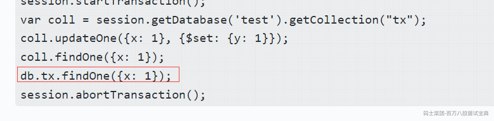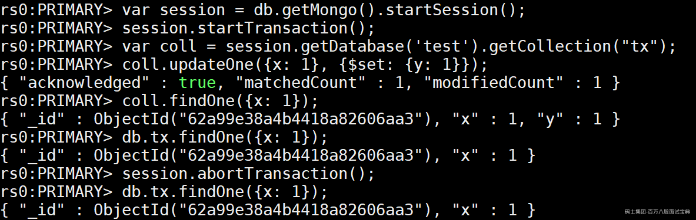

##### 3.3.2.4.2 可重复读Repeatable Read

```plain
var session = db.getMongo().startSession();
session.startTransaction({readConcern: {level: "snapshot"},writeConcern: {w: "majority"}});
var coll = session.getDatabase('test').getCollection("tx");
coll.findOne({x: 1}); 
db.tx.updateOne({x: 1}, {$set: {y: 1}});
db.tx.findOne({x: 1});
coll.findOne({x: 1}); 
session.abortTransaction();
```

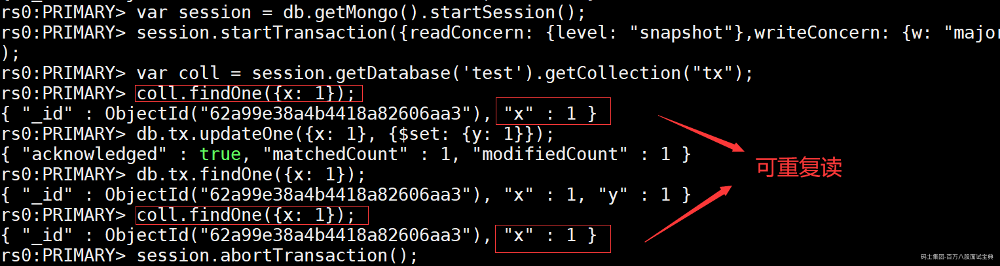

注意事项

- 事务默认必须在 60 秒（可调）内完成，否则将被取消；

- 涉及事务的分片不能使用仲裁节点；

- 事务会影响 chunk 迁移效率。正在迁移的 chunk 也可能造成事务提交失败（重试即可）；

- 多文档事务中的读操作必须使用主节点读；

- readConcern 只应该在事务级别设置，不能设置在每次读写操作上

## 3.4. MongoDB开发注意事项

#### 连接到 MongoDB

关于驱动程序：总是选择与所用之 MongoDB 相兼容的驱动程序。

如果使用第三方框架（如 Spring Data），则还需要考虑框架版本与驱动的兼容性。

关于连接对象 MongoClient：使用 MongoClient 对象连接到 MongoDB 实例时总是应该保证它单例，并且在整个生命周期中都从它获取其他操作对象。

关于连接字符串：连接字符串中可以配置大部分连接选项，建议总是在连接字符串中配置这些选项；

```plain
// 连接到复制集
mongodb://节点1,节点2,节点3…/database?[options]
// 连接到分片集
mongodb://mongos1,mongos2,mongos3…/database?[options]
```

#### 常见连接字符串参数

- maxPoolSize 连接池大小（默认100）

- Max Wait Time 建议设置，自动杀掉太慢的查询

- Write Concern 建议 majority 保证数据安全

- Read Concern 对于数据一致性要求高的场景适当使用

#### 使用域名连接集群

在配置集群时使用域名可以为集群变更时提供一层额外的保护。例如需要将集群整体迁移到新网段，直接修改域名解析即可。  
另外，MongoDB 提供的 mongodb+srv:// 协议可以提供额外一层的保护。该协议允许通过域名解析得到所有 mongos 或节点的地址，而不是写在连接字符串中。

```plain
mongodb+srv://server.example.com/
Record TTL Class Priority Weight Port Target _mongodb._tcp.server.example.com. 86400
IN SRV 0 5 27317 mongodb1.example.com.
_mongodb._tcp.server.example.com. 86400 IN SRV 0 5 27017 mongodb2.example.com.
```

#### 不要在 mongos 前面使用负载均衡

基于前面提到的原因，驱动已经知晓在不同的 mongos 之间实现负载均衡，而复制集则需要根据节点的角色来选择发送请求的目标。如果在 mongos 或复制集上层部署负载均衡：  
• 驱动会无法探测具体哪个节点存活，从而无法完成自动故障恢复；  
• 驱动会无法判断游标是在哪个节点创建的，从而遍历游标时出错；  
结论：不要在 mongos 或复制集上层放置负载均衡器，让驱动处理负载均衡和自动故障恢复。

#### 关于查询及索引

● 每一个查询都必须要有对应的索引  
● 尽量使用覆盖索引 Covered Indexes （可以避免读数据文件）  
● 使用 projection 来减少返回到客户端的的文档的内容

#### 关于写入

● 在 update 语句里只包括需要更新的字段  
● 尽可能使用批量插入来提升写入性能  
● 使用TTL自动过期日志类型的数据

#### 关于文档结构

● 防止使用太长的字段名（浪费空间）  
● 防止使用太深的数组嵌套（超过2层操作比较复杂）  
● 不使用中文，标点符号等非拉丁字母作为字段名

#### 处理分页问题

尽可能不要计算总页数，特别是数据量大和查询条件不能完整命中索引时。  
考虑以下场景：假设集合总共有 1000w 条数据，在没有索引的情况下考虑以下查询：

```plain
db.coll.find({x: 100}).limit(50);
db.coll.count({x: 100});
```

• 前者只需要遍历前 n 条，直到找到 50 条队伍 x=100 的文档即可结束；  
• 后者需要遍历完 1000w 条找到所有符合要求的文档才能得到结果。  
为了计算总页数而进行的 count() 往往是拖慢页面整体加载速度的原因

避免使用skip/limit形式的分页，特别是数据量大的时候；  
\*\*替代方案：\*\*使用查询条件+唯一排序条件；  
例如：

```plain
第一页：db.posts.find({}).sort({_id: 1}).limit(20);
第二页：db.posts.find({_id: {$gt: <第一页最后一个_id>}}).sort({_id: 1}).limit(20);
第三页：db.posts.find({_id: {$gt: <第二页最后一个_id>}}).sort({_id: 1}).limit(20);
……
```

#### 关于事务

使用事务的原则：  
• 无论何时，事务的使用总是能避免则避免；  
• 模型设计先于事务，尽可能用模型设计规避事务；  
• 不要使用过大的事务（尽量控制在 1000 个文档更新以内）；  
• 当必须使用事务时，尽可能让涉及事务的文档分布在同一个分片上，这将有效地提高效率；
