# 4. MongoDB分片集群

## 4.1. 分片集群机制及原理

### 4.1.1. MongoDB常见部署架构

单节点：用于开发与测试（整体占比20%左右）


复制集：高可用（整体占比70%左右）

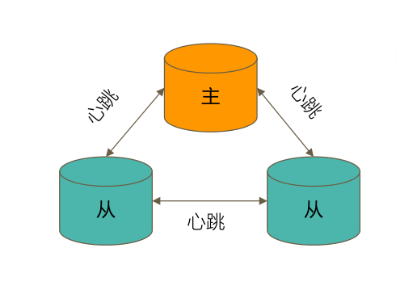

分片集群：横向扩展（整体占比10%左右）

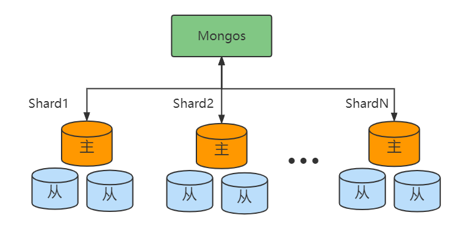

### 4.1.2. 为什么要使用分片集群

以下场景中推荐使用分片集群：

- MongoDB数据容量日益增大，访问性能日渐降低

- 系统上线异常火爆，需要支撑更多的并发用户

- MongoDB已有10TB 数据，发生故障，恢复时间漫长

- 系统的访问用户针对全球（需要做地理分布数据）

### 4.1.3. 分片集群数据分布方式

#### 4.1.3.1. 基于范围

按照数据的范围进行分片划分（如下图，min~-75，-75 ~ 25 ，25 ~175这些都是范围）

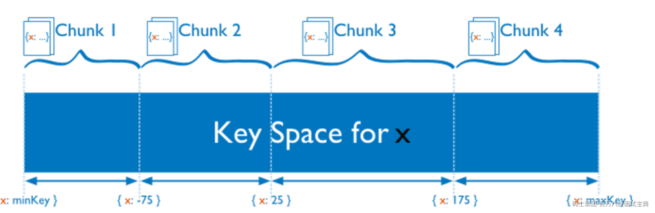

**优点：** 采用范围查询性能好，可以优化业务的读操作。

**缺点：** 数据分布不均匀（容易有热点问题），比如如果是以主键划分范围，而主键是自增ID的话，那么大量的写入操作的数据极容易落到一个分片，导致热点问题。

#### 4.1.3.2. 基于哈希

按照数据的hash值来进行分片

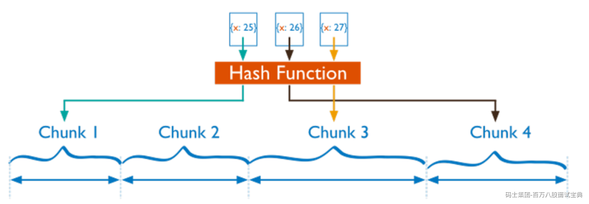

**优点：** 数据分布均匀，针对写入操作是比较优化的，适用：日志、物联网等高并发场景。

**缺点：** 范围查询效率低

#### 4.1.3.3. 自定义Zone

根据节点定义一个Zone,比如国际区号：1开头的读写美国的服务器，86开头的读写中国的服务器，方便完成国际化的全球项目的部署。

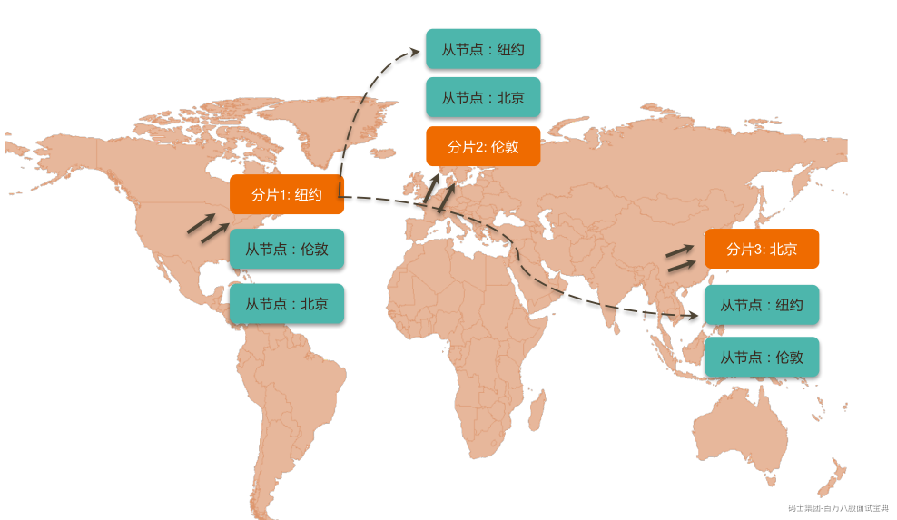

### 4.1.4. 完整的分片集群

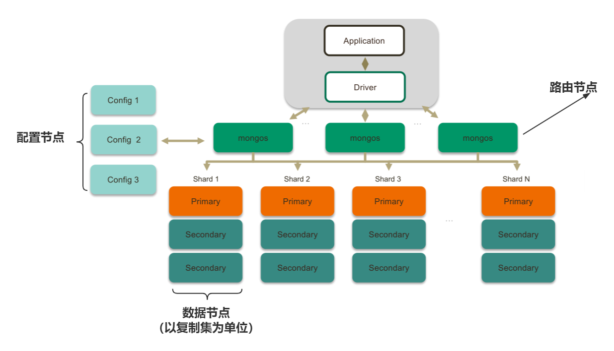

**路由节点（mongos）**  
提供集群单一入口（可以有多个，理论上只需要使用一个，建议至少2个达到高可用）

功能：转发应用端请求，选择合适数据节点进行读写，合并多个数据节点的返回

**配置（目录）节点**

搭建：就是普通的复制集架构，一般1主2从提供高可用。

提供集群元数据存储，分片数据分布的映射（哪些数据放在哪个分片集群）

配置节点中比较重要的就是Shared这张表，里面存储分片中数据的范围。

（mongos在启动的时候会把配置节点的数据加载到自己的内存当中，方便快的进行数据的比对，完成数据的分发处理）

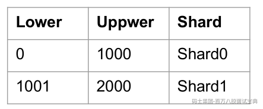

**数据节点（mongod）**

- 以复制集为单位（避免单点故障）

- 分片之间数据不重复

- 横向扩展

- 最大1024分片

- 所有分片在一起才可完整工作

### 4.1.5. 分片集群特点

- 应用全透明，无特殊处理

- 数据自动均衡

- 动态扩容，无须下线

- 基于三种分片方式

**总结：** 分片集群可以有效解决性能瓶颈及系统扩容问题！

分片额外消耗较多，管理复杂，能不分片尽量不要分片 ！

## 4.2. 如何用好分片集群

### 4.2.1. 合理的架构

**分片的大小**

分片的基本标准：

- 数据：数据量不超过3TB，尽可能保持在2TB一个片

- 索引：常用索引必须容纳进内存

按照以上标准初步确定分片后，还需要考虑业务压力，随着压力增大，CPU、RAM、磁盘中的任何一项出现瓶颈时，都可以通过添加更多分片来解决

**如何划分**

一般的分片的划分可以按照以下规则：

- 分片数量=所需存储总量/单台服务器容量 10TB /2TB =5

- 分片数量=工作集大小/单台服务器内存容量 400GB /(256G \* 0.6)=3

- 分片数量= 并发量总数/(单服务器并发量*0.7) 30000/ (9000* \* 0.7) =6

分片数量取以上三个的的最大值 6

### 4.2.2. 正确的姿势

分片集群中的概念

• **片键 shard key：** 文档中的一个字段  
• **文档 doc ：** 包含 shard key 的一行数据  
• **块 Chunk ：** 包含 n 个文档  
• **分片 Shard：** 包含 n 个 chunk  
• **集群 Cluster：** 包含 n 个分片


**片键效率的主要因素**

• 取值基数（Cardinality）  
• 取值分布；  
• 分散写，集中读；  
• 被尽可能多的业务场景用到；  
• 避免单调递增或递减的片键；

**一个系统的分片案例(邮件系统)**

```plain
{
_id: ObjectId(),
user: 123,
time: Date(),
subject: "...",
recipients: [],
body: "...",
attachments: []
}
```

**片键：{ \_id: 1}**


这种主键的分片方式：基数还可以，但是写分布不均匀，定向查询也满足不了。

**片键：{ \_id: ”hashed”}**

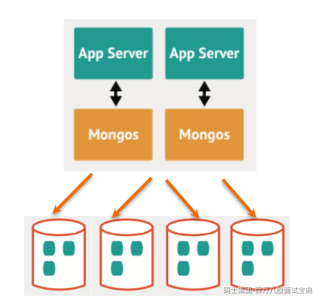

这种主键hash的分片方式：基数还可以，但是写分布均匀，但是满足不了定向查询的需求。

**片键：{ user\_id: 1}**

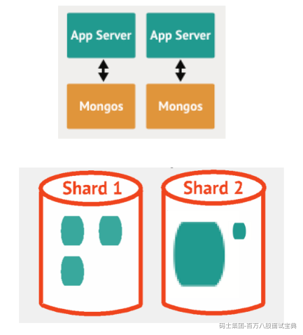

这种主键user\_id的分片方式：基数不行，写分布均匀，定向查询的需求效率高。

**片键：{ user\_id: 1, time:1}**

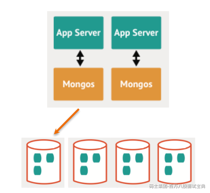

这种主键user\_id+time的分片方式是最优的：基数不错，写分布均匀，定向查询的需求效率高。

### 4.2.3. 足够的资源

mongos 与 config 通常消耗很少的资源，可以选择低规格虚拟机；

资源的重点在于 shard 服务器：

• 需要足以容纳热数据索引的内存；  
• 正确创建索引后 CPU 通常不会成为瓶颈，除非涉及非常多的计算；  
• 磁盘尽量选用 SSD；

即使项目初期已经具备了足够的资源，仍然需要考虑在合适的时候扩展。建议监控各项资源使用情况，无论哪一项达到60%以上，则开始考虑扩展。

- 扩展需要新的资源，申请新资源需要时间

- 扩展后数据需要均衡，均衡需要时间。应保证新数据入库速度慢于均衡速度

- 均衡需要资源，如果资源即将或已经耗尽，均衡也是会很低效的

## 4.3. 分片集群搭建及扩容

学习如何搭建一个2分片的分片集群

环境要求：3台 Linux 虚拟机（推荐4核8G）

**整体实战过程**

- 配置域名解析

- 准备分片目录

- 创建第一个分片复制集并初始化

- 创建 config 复制集并初始化

- 初始化分片集群，加入第一个分片

- 创建分片表

- 加入第二个分片(模拟扩容)

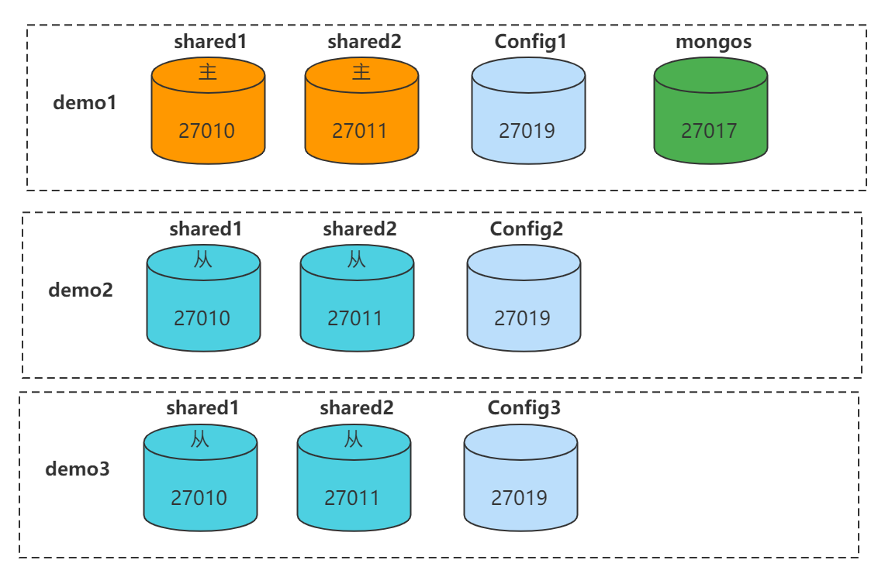

### 4.3.1.准备工作

#### 1、配置域名解析

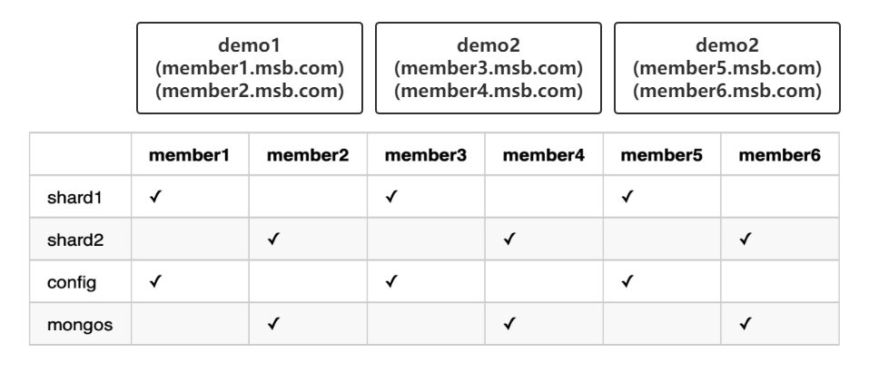

在3台虚拟机上分别执行以下3条命令，注意替换实际 IP 地址

```plain
echo "192.168.1.25 demo1 member1.msb.com member2.msb.com" >> /etc/hosts
echo "192.168.1.26 demo2 member3.msb.com member4.msb.com" >> /etc/hosts
echo "192.168.1.27 demo3 member5.msb.com member6.msb.com" >> /etc/hosts
```

#### 2、准备分片目录

在各服务器上创建数据目录，我们使用 `/data`，请按自己需要修改为其他目录

在member1 / member3 / member5 上执行以下命令：

```plain
mkdir -p /data/shard1/
mkdir -p /data/config/
```

在member2 / member4 / member6 上执行以下命令：

```plain
mkdir -p /data/shard2/
mkdir -p /data/mongos/
```

### 4.3.2.搭建分片

#### 1、搭建shard1

在 `member1`/`member3`/`member5`上执行以下命令。

```plain
mongod --bind_ip 0.0.0.0 --replSet shard1 --dbpath /data/shard1 --logpath /data/shard1/mongod.log --port 27010 --fork --shardsvr --wiredTigerCacheSizeGB 1
```

注意以下参数：

- `shardsvr`: 表示这不是一个普通的复制集，而是分片集的一部分；

- `wiredTigerCacheSizeGB`: 该参数表示MongoDB能够使用的缓存大小。默认值为 `(RAM - 1GB) / 2`。

- 不建议配置超过默认值，有OOM的风险；

- 因为我们当前测试会在一台服务器上运行多个实例，因此配置了较小的值；

- `bind_ip`: 生产环境中强烈建议不要绑定外网IP，此处为了方便演示绑定了所有IP地址。类似的道理，生产环境中应开启认证 `--auth`，此处为演示方便并未使用；

用这三个实例搭建shard1复制集：

- 任意连接到一个实例，例如我们连接到 `member1.msb.com`：

```plain
mongo --host member1.msb.com:27010
```

- 初始化 `shard1`复制集。我们使用如下配置初始化复制集：

```plain
rs.initiate({
    _id: "shard1",
    "members" : [
        {
            "_id": 0,
            "host" : "member1.msb.com:27010"
        },
        {
            "_id": 1,
            "host" : "member3.msb.com:27010"
        },
        {
            "_id": 2,
            "host" : "member5.msb.com:27010"
        }
    ]
});
```

#### 2、搭建config

与 `shard1`类似的方式，我们可以搭建 `config`服务器。在 `member1`/`member3`/`member5`上执行以下命令：

- 运行 `config`实例：

```plain
mongod --bind_ip 0.0.0.0 --replSet config --dbpath /data/config --logpath /data/config/mongod.log --port 27019 --fork --configsvr --wiredTigerCacheSizeGB 1
```

- 连接到 `member1`：

```plain
mongo --host member1.msb.com:27019
```

- 初始化 `config`复制集：

```plain
rs.initiate({
    _id: "config",
    "members" : [
        {
            "_id": 0,
            "host" : "member1.msb.com:27019"
        },
        {
            "_id": 1,
            "host" : "member3.msb.com:27019"
        },
        {
            "_id": 2,
            "host" : "member5.msb.com:27019"
        }
    ]
});
```

#### 3、搭建mongos

mongos的搭建比较简单，我们在 `member2`/`member4`/`member6`上搭建3个mongos。注意以下参数：

- `configdb`: 表示config使用的集群地址；

开始搭建：

- 运行mongos进程：

```plain
mongos --bind_ip 0.0.0.0 --logpath /data/mongos/mongos.log --port 27017 --configdb config/member1.msb.com:27019,member3.msb.com:27019,member5.msb.com:27019 --fork
```

- 连接到任意一个mongos，此处我们使用 `member1`：

```plain
mongo --host member1.msb.com:27017
```

- 将 `shard1`加入到集群中：

```plain
sh.addShard("shard1/member1.msb.com:27010,member3.msb.com:27010,member5.msb.com:27010");
```

#### 4、测试分片集

上述示例中我们搭建了一个只有1个分片的分片集。在继续之前我们先来测试一下这个分片集。

- 连接到分片集：

```plain
mongo --host member1.msb.com:27017
```

```plain
sh.status();
```

- 创建一个分片表：

```plain
sh.enableSharding("foo");
sh.shardCollection("foo.bar", {_id: 'hashed'});
sh.status();
```

- 任意写入若干数据：

```plain
use foo
for (var i = 0; i < 10000; i++) {
    db.bar.insert({i: i});
}
```

#### 5、向分片集加入新的分片

下面我们搭建 `shard2`并将其加入分片集中，观察发生的效果。

使用类似 `shard1`的方式搭建 `shard2`。在 `member2`/`member4`/`member6`上执行以下命令：

```plain
mongod --bind_ip 0.0.0.0 --replSet shard2 --dbpath /data/shard2 --logpath /data/shard2/mongod.log --port 27011 --fork --shardsvr --wiredTigerCacheSizeGB 1
```

用这三个实例搭建 `shard2`复制集：

- 任意连接到一个实例，例如我们连接到 `member2.msb.com`：

```plain
mongo --host member2.msb.com:27011
```

- 初始化 `shard2`复制集。我们使用如下配置初始化复制集：

```plain
rs.initiate({
    _id: "shard2",
    "members" : [
        {
            "_id": 0,
            "host" : "member2.msb.com:27011"
        },
        {
            "_id": 1,
            "host" : "member4.msb.com:27011"
        },
        {
            "_id": 2,
            "host" : "member6.msb.com:27011"
        }
    ]
});
```

- 连接到任意一个mongos。此处使用 `member1`：

```plain
mongo --host member1.msb.com:27017
```

- 将 `shard2`加入到集群中：

```plain
sh.addShard("shard2/member2.msb.com:27011,member4.msb.com:27011,member6.msb.com:27011");
```

- 观察 `sh.status()`：

```plain
sh.status();
```

可以发现原本 `shard1`上的两个chunk被均衡到了 `shard2`上，这就是MongoDB的自动均衡机制。
