## 1、为什么要使用消息队列

其实就是问问你消息队列都有哪些使用场景，然后你项目里具体是什么场景，说说你在这个场景里用消息队列是什么？

面试官问你这个问题，期望的一个回答是说，你们公司有个什么业务场景，这个业务场景有个什么技术挑战，如果不用MQ可能会很麻烦，但是你现在用了MQ之后带给了你很多的好处。消息队列的常见使用场景，其实场景有很多，但是比较核心的有3个：解耦、异步、削峰。

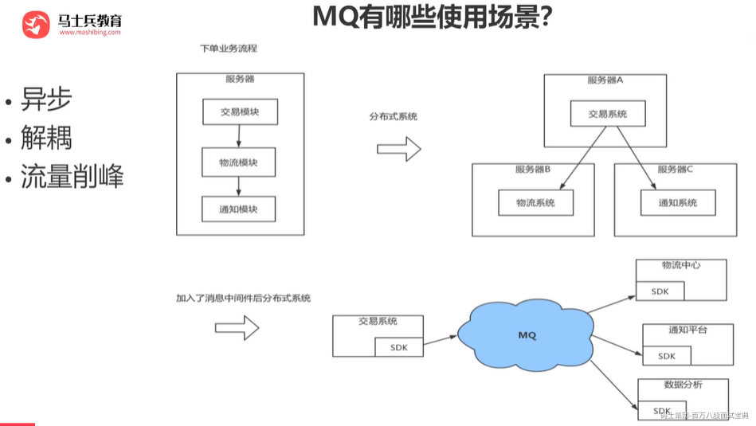

#### 解耦

A系统发送个数据到BCD三个系统，接口调用发送，那如果E系统也要这个数据呢？那如果C系统现在不需要了呢？现在A系统又要发送第二种数据了呢？而且A系统要时时刻刻考虑BCDE四个系统如果挂了咋办？要不要重发？我要不要把消息存起来？

你需要去考虑一下你负责的系统中是否有类似的场景，就是一个系统或者一个模块，调用了多个系统或者模块，互相之间的调用很复杂，维护起来很麻烦。但是其实这个调用是不需要直接同步调用接口的，如果用MQ给他异步化解耦，也是可以的，你就需要去考虑在你的项目里，是不是可以运用这个MQ去进行系统的解耦。

#### 异步

A系统接收一个请求，需要在自己本地写库，还需要在BCD三个系统写库，自己本地写库要30ms，BCD三个系统分别写库要300ms、450ms、200ms。最终请求总延时是30 + 300 + 450 + 200 = 980ms，接近1s。

异步后，BCD三个系统分别写库的时间，A系统就不再考虑了。

#### 削峰

每天0点到16点，A系统风平浪静，每秒并发请求数量就100个。结果每次一到16点~23点，每秒并发请求数量突然会暴增到1万条。但是系统最大的处理能力就只能是每秒钟处理1000个请求啊。怎么办？需要我们进行流量的削峰，让系统可以平缓的处理突增的请求。

## 2、使用消息队列有什么优点？有什么缺点？

### 优点

- 解耦：消息队列可以将应用程序之间的耦合度降低。当一个应用程序将消息写入队列时，它并不需要知道消息将被哪个应用程序处理，只需要知道消息被处理了。

- 异步：消息队列可以提供异步处理的能力，使得一些不需要实时处理的操作可以在后台处理。

- 可靠性和扩展性：消息队列系统可以保证消息传递的可靠性，避免消息丢失或重复。同时，它们也支持扩展性，可以应对大量消息和用户的需求。

- 解决高并发：消息队列可以在高并发的环境中使用，通过分流来保证系统的稳定性。

### 缺点

1. 配置复杂：消息队列系统一般需要进行配置和调优，可以将更多的开销放在了部署和设置上。

2. 稳定性：消息队列的稳定性可能受到网络延迟、高负载等因素的影响，需要进行监控和调整。

3. 一致性问题  
   A系统处理完了直接返回成功了，人都以为你这个请求就成功了；但是问题是，要是BCD三个系统那里，BD两个系统写库成功了，结果C系统写库失败了，你这数据就不一致了。所以消息队列实际是一种非常复杂的架构，你引入它有很多好处，但是也得针对它带来的坏处做各种额外的技术方案和架构来规避掉。

总之，使用消息队列可以提高应用程序之间的解耦、异步处理能力、可靠性和扩展性，但是需要花费时间和精力进行配置和维护。

## 3、RabbitMQ中的AMQP是什么？

### **AMQP**

是应用层协议的一个开放标准,为面向消息的中间件设计。基于此协议的客户端与消息中间件可传递消息，并不受客户端/中间件不同产品，不同的开发语言等条件的限制。目标是实现一种在全行业广泛使用的标准消息中间件技术，以便降低企业和系统集成的开销，并且向大众提供工业级的集成服务。主要实现有 RabbitMQ。

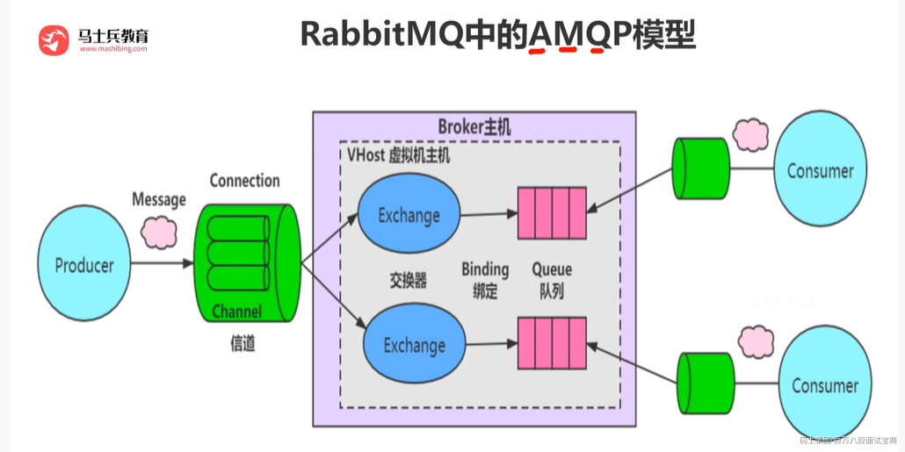

### 客户端与RabbitMQ的通讯

#### 连接

首先作为客户端（无论是生产者还是消费者），你如果要与RabbitMQ通讯的话，你们之间必须创建一条TCP连接，当然同时建立连接后，客户端还必须发送一条“问候语”让彼此知道我们都是符合AMQP的语言的，比如你跟别人打招呼一般会说“你好！”，你跟国外的美女一般会说“hello!”一样。你们确认好“语言”之后，就相当于客户端和RabbitMQ通过“认证”了。你们之间可以创建一条AMQP的信道。

#### 信道

概念：信道是生产者/消费者与RabbitMQ通信的渠道。信道是建立在TCP连接上的虚拟连接，什么意思呢？就是说rabbitmq在一条TCP上建立成百上千个信道来达到多个线程处理，这个TCP被多个线程共享，每个线程对应一个信道，信道在RabbitMQ都有唯一的ID ,保证了信道私有性，对应上唯一的线程使用。

疑问：为什么不建立多个TCP连接呢？原因是rabbit保证性能，系统为每个线程开辟一个TCP是非常消耗性能，每秒成百上千的建立销毁TCP会严重消耗系统。所以rabbitmq选择建立多个信道（建立在tcp的虚拟连接）连接到rabbit上。

从技术上讲，这被称之为“多路复用”，对于执行多个任务的多线程或者异步应用程序来说，它非常有用。

### 虚拟主机

虚拟消息服务器，vhost，本质上就是一个mini版的mq服务器，有自己的队列、交换器和绑定，最重要的，自己的权限机制。Vhost提供了逻辑上的分离，可以将众多客户端进行区分，又可以避免队列和交换器的命名冲突。Vhost必须在连接时指定，rabbitmq包含缺省vhost：“/”，通过缺省用户和口令guest进行访问。

rabbitmq里创建用户，必须要被指派给至少一个vhost，并且只能访问被指派内的队列、交换器和绑定。Vhost必须通过rabbitmq的管理控制工具创建。

### 交换器类型

共有四种direct,fanout,topic,headers，其种headers(几乎和direct一样)不实用，可以忽略。

#### Direct

路由键完全匹配，消息被投递到对应的队列， direct交换器是默认交换器。声明一个队列时，会自动绑定到默认交换器，并且以队列名称作为路由键：channel->basic\_public($msg,’’,’queue-name’)

#### Fanout

消息广播到绑定的队列，不管队列绑定了什么路由键，消息经过交换器，每个队列都有一份。

#### Topic

通过使用“*”和“#”通配符进行处理，使来自不同源头的消息到达同一个队列，”.”将路由键分为了几个标识符，“*”匹配1个，“#”匹配一个或多个。

## 4、RabbitMQ如何做到消息不丢失？

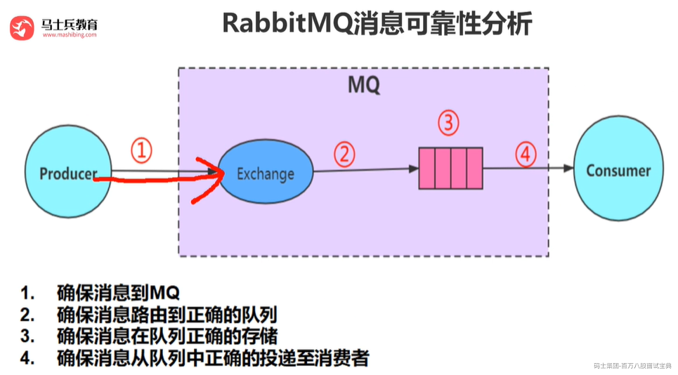

1. 持久化

在发送消息时，可以设置消息属性 `delivery_mode` 为 2，表示该消息需要被持久化，即将消息保存到磁盘中，即使 RabbitMQ 服务器宕机也能够保证消息不会丢失。可以在创建队列时将 `durable` 属性设置为 `True`，表示该队列也需要被持久化，以便在 RabbitMQ 服务器宕机后能够重新创建队列和绑定。

2. 确认机制

在 RabbitMQ 中，消费者通过 `basic.ack` 命令向 RabbitMQ 服务器确认已经消费了某条消息。如果消费者在处理消息时发生错误或宕机，RabbitMQ 服务器会重新将消息发送给其他消费者。在确认消息之前，RabbitMQ 会将消息保存在内存中，只有在收到消费者的确认消息后才会删除消息。

3. 发布者确认

RabbitMQ 支持发布者确认（Publisher Confirm）机制，即发布者在将消息发送到队列后，等待 RabbitMQ 服务器的确认消息。如果 RabbitMQ 成功将消息保存到队列中，会返回一个确认消息给发布者。如果 RabbitMQ 服务器无法将消息保存到队列中，会返回一个 Nack（Negative Acknowledgement）消息给发布者。通过发布者确认机制，可以确保消息被成功发送到 RabbitMQ 服务器。

4. 备份队列

RabbitMQ 支持备份队列（Alternate Exchange）机制，即在消息发送到队列之前，先将消息发送到备份队列中。如果主队列无法接收消息，RabbitMQ 会将消息发送到备份队列中。备份队列通常是一个交换机，可以在创建队列时通过 `x-dead-letter-exchange` 属性来指定备份队列。

## 5、Kafka如何做到消息不丢失？

Kafka 通过多种机制来确保消息不丢失，包括副本机制、ISR（In-Sync Replicas）机制、ACK 机制等。

1. 副本机制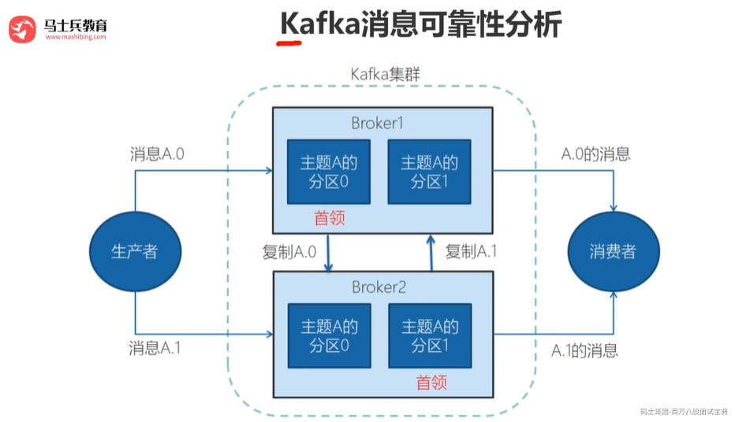

Kafka 通过副本机制来确保消息不会丢失。在 Kafka 中，每个分区都可以配置多个副本，每个副本保存分区的完整副本，当一个副本宕机时，Kafka 会自动将副本切换到其他可用的副本上。因此，即使其中一个副本宕机，也能够保证消息不会丢失。

2. ISR 机制

在 Kafka 中，副本分为 Leader 副本和 Follower 副本。Leader 副本负责处理消息，Follower 副本只是简单地复制 Leader 副本的数据。当 Follower 副本落后于 Leader 副本时，Kafka 会将 Follower 副本从 ISR 中移除。只有当 Follower 副本与 Leader 副本的差距不大时，才会将 Follower 副本重新加入 ISR，确保消息不会丢失。

3. ACK 机制

在 Kafka 中，生产者发送消息时可以指定 `acks` 参数，表示生产者等待的确认数。`acks` 参数有三个取值：

- `acks=0` 表示生产者不等待确认消息，直接将消息发送到 Kafka 集群。这种方式可能会导致消息丢失，不建议使用。

- `acks=1` 表示生产者在 Leader 副本收到消息后，就将消息视为发送成功。如果 Leader 副本在发送消息后立即宕机，消息可能会丢失。如果 Follower 副本成功复制了消息，但 Leader 副本在宕机前没有来得及将消息写入磁盘，则这条消息将会丢失。

- `acks=all` 表示生产者在所有 ISR 副本都确认接收到消息后，才将消息视为发送成功。这种方式可以最大程度地确保消息不会丢失，但是会降低消息发送的性能。

通过上述机制的使用，可以最大程度地确保 Kafka 中的消息不会丢失。需要根据实际场景选择合适的参数配置来平衡消息发送的性能和可靠性。

## 6、RocketMQ如何做到消息不丢失？

RocketMQ 通过多种机制来确保消息不丢失，包括刷盘机制、消息拉取机制、ACK 机制等。

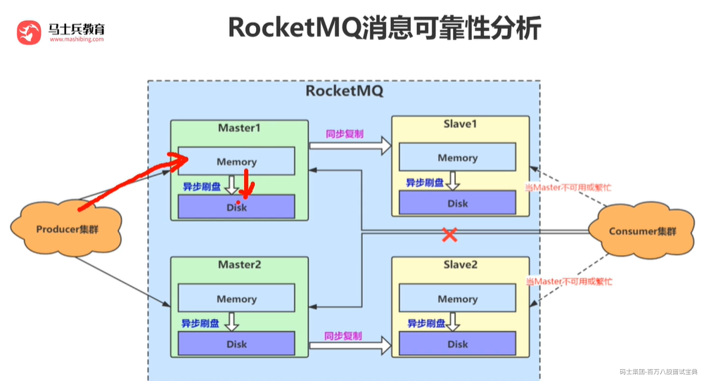

1. 刷盘机制

RocketMQ 中的消息分为内存消息和磁盘消息，内存消息在 Broker 内存中进行读写，磁盘消息则保存在磁盘上。RocketMQ 支持同步刷盘和异步刷盘两种方式，通过刷盘机制可以确保消息在 Broker 宕机时不会丢失。在同步刷盘模式下，消息写入磁盘时，会等待磁盘的写入完成才返回写入成功的响应。在异步刷盘模式下，消息写入磁盘后立即返回写入成功的响应，但是不等待磁盘写入完成

3. ACK 机制

在 RocketMQ 中，Producer 发送消息后，Broker 会返回 ACK 确认信号，表示消息已经成功发送。如果 Broker 没有收到 ACK 确认信号，就会尝试重新发送该消息，直到消息被确认为止。

RocketMQ 采用主从复制机制，每个消息队列都有一个主节点和多个从节点，主节点负责消息的写入和读取，从节点负责备份数据。当主节点宕机时，从节点会自动接管主节点的工作，确保消息不会丢失

3. 消息存储机制

RocketMQ 默认使用双写模式来存储消息，即将消息同时写入内存和磁盘中，然后再将内存中的消息异步刷盘到磁盘中。这种方式可以保证消息的可靠性，即使系统宕机，也能够尽可能地保证消息不会丢失。

除此之外，RocketMQ 还提供了多种机制来保证消息不丢失，例如事务消息、延迟消息、顺序消息等，这些机制可以根据业务需求进行选择和使用。

需要注意的是，为了确保消息的可靠性，RocketMQ 的发送消息的速度可能会受到一定的限制，需要在消息可靠性和性能之间进行权衡。

## 7、讲一讲Kafka与RocketMQ中存储设计的异同？

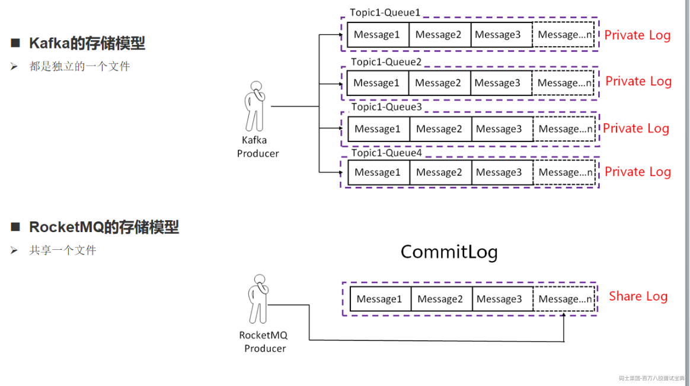

**Kafka 中文件的布局是以 Topic/partition ，每一个分区一个物理文件夹，在分区文件级别实现文件顺序写，如果一个Kafka集群中拥有成百上千个主题，每一个主题拥有上百个分区，消息在高并发写入时，其IO操作就会显得零散（** **消息分散的落盘策略会导致磁盘IO竞争激烈成为瓶颈** **），其操作相当于随机IO，即 Kafka 在消息写入时的IO性能会随着 topic 、分区数量的增长，其写入性能会先上升，然后下降。**

**而RocketMQ在消息写入时追求极致的顺序写，所有的消息不分主题一律顺序写入 commitlog 文件，并不会随着 topic 和 分区数量的增加而影响其顺序性。**

在消息发送端，消费端共存的场景下，随着Topic数的增加Kafka吞吐量会急剧下降，而RocketMQ则表现稳定。因此Kafka适合Topic和消费端都比较少的业务场景，而RocketMQ更适合多Topic，多消费端的业务场景。

## 8、讲一讲Kafka与RocketMQ中零拷贝技术的运用

**什么是零拷贝?**

零拷贝(英语: Zero-copy) 技术是指计算机执行操作时，CPU不需要先将数据从某处内存复制到另一个特定区域。这种技术通常用于通过网络传输文件时节省CPU周期和内存带宽。

➢零拷贝技术可以减少数据拷贝和共享总线操作的次数，消除传输数据在存储器之间不必要的中间拷贝次数，从而有效地提高数据传输效率

➢零拷贝技术减少了用户进程地址空间和内核地址空间之间因为上:下文切换而带来的开销

可以看出没有说不需要拷贝，只是说减少冗余[不必要]的拷贝。

下面这些组件、框架中均使用了零拷贝技术：Kafka、Netty、Rocketmq、Nginx、Apache。

**传统数据传送机制**

比如：读取文件，再用socket发送出去，实际经过四次copy。

伪码实现如下：

buffer = File.read()

Socket.send(buffer)

1、第一次：将磁盘文件，读取到操作系统内核缓冲区；

2、第二次：将内核缓冲区的数据，copy到应用程序的buffer；

3、第三步：将application应用程序buffer中的数据，copy到socket网络发送缓冲区(属于操作系统内核的缓冲区)；

4、第四次：将socket buffer的数据，copy到网卡，由网卡进行网络传输。

*(⚠️ 图片缺失:源知识库原图已失效)*

分析上述的过程，虽然引入DMA来接管CPU的中断请求，但四次copy是存在“不必要的拷贝”的。实际上并不需要第二个和第三个数据副本。应用程序除了缓存数据并将其传输回套接字缓冲区之外什么都不做。相反，数据可以直接从读缓冲区传输到套接字缓冲区。

显然，第二次和第三次数据copy 其实在这种场景下没有什么帮助反而带来开销(DMA拷贝速度一般比CPU拷贝速度快一个数量级)，这也正是零拷贝出现的背景和意义。

打个比喻：200M的数据，读取文件，再用socket发送出去，实际经过四次copy（2次cpu拷贝每次100ms ，2次DMS拷贝每次10ms）

传统网络传输的话：合计耗时将有220ms

**mmap内存映射（RocketMQ使用的）**

硬盘上文件的位置和应用程序缓冲区(application buffers)进行映射（建立一种一一对应关系），由于mmap()将文件直接映射到用户空间，所以实际文件读取时根据这个映射关系，直接将文件从硬盘拷贝到用户空间，只进行了一次数据拷贝，不再有文件内容从硬盘拷贝到内核空间的一个缓冲区。

mmap内存映射将会经历：3次拷贝: 1次cpu copy，2次DMA copy；

打个比喻：200M的数据，读取文件，再用socket发送出去，如果是使用MMAP实际经过三次copy（1次cpu拷贝每次100ms ，2次DMS拷贝每次10ms）合计只需要120ms

从数据拷贝的角度上来看，就比传统的网络传输，性能提升了近一倍。


**RocketMQ源码中的MMAP运用**

RocketMQ源码中，使用MappedFile这个类类进行MMAP的映射

*(⚠️ 图片缺失:源知识库原图已失效)*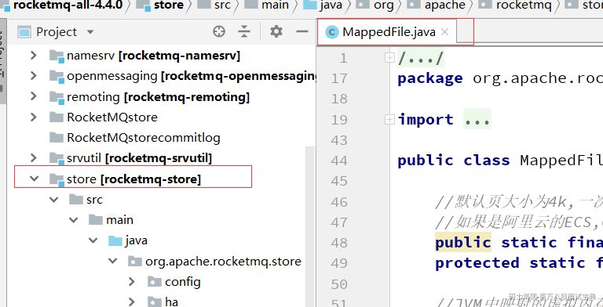

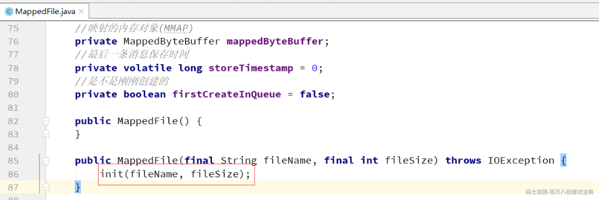

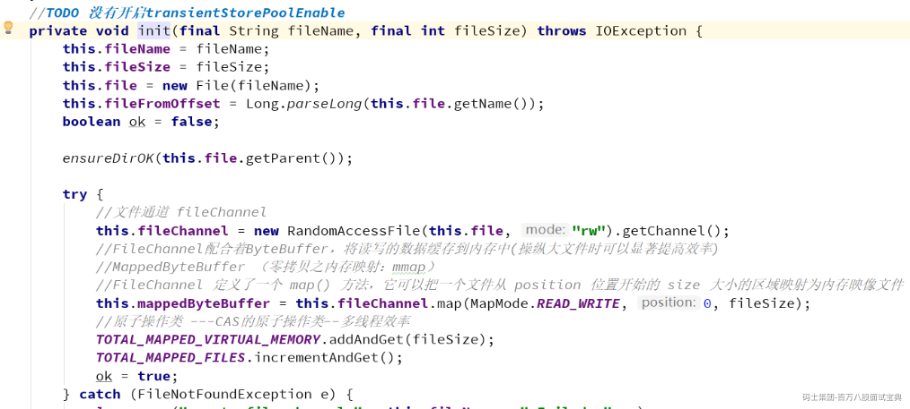

***Kafka中的零拷贝***

Kafka两个重要过程都使用了零拷贝技术，且都是操作系统层面的狭义零拷贝，一是Producer生产的数据存到broker，二是 Consumer从broker读取数据。

Producer生产的数据持久化到broker，采用mmap文件映射，实现顺序的快速写入；

Customer从broker读取数据，采用sendfile，将磁盘文件读到OS内核缓冲区后，直接转到socket buffer进行网络发送。

***sendfile***

linux 2.1支持的sendfile

当调用sendfile()时，DMA将磁盘数据复制到kernel buffer，然后将内核中的kernel buffer直接拷贝到socket buffer。在硬件支持的情况下，甚至数据都并不需要被真正复制到socket关联的缓冲区内。取而代之的是，只有记录数据位置和长度的描述符被加入到socket缓冲区中，DMA模块将数据直接从内核缓冲区传递给协议引擎，从而消除了遗留的最后一次复制。

一旦数据全都拷贝到socket buffer，sendfile()系统调用将会return、代表数据转化的完成。socket buffer里的数据就能在网络传输了。

sendfile会经历：3次拷贝，1次CPU copy ，2次DMA copy；硬件支持的情况下，则是2次拷贝，0次CPU copy， 2次DMA copy。

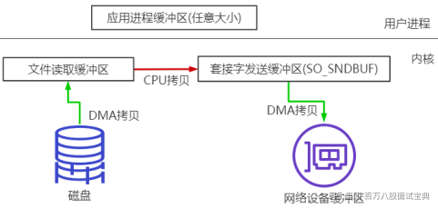

*(⚠️ 图片缺失:源知识库原图已失效)*

*(⚠️ 图片缺失:源知识库原图已失效)*

## 9、有没有读过RocketMQ源码，分享一下？

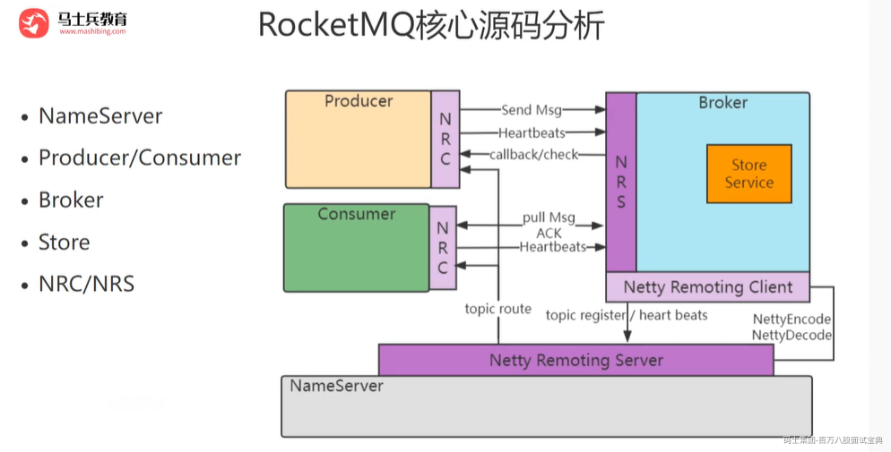

RocketMQ的源码是非常的多，我们没有必要把RocketMQ所有的源码都读完，所以我们把核心、重点的源码进行解读，RocketMQ核心流程如下：

- 启动流程  
  RocketMQ服务端由两部分组成NameServer和Broker，NameServer是服务的注册中心，Broker会把自己的地址注册到NameServer，生产者和消费者启动的时候会先从NameServer获取Broker的地址，再去从Broker发送和接受消息。

- 消息生产流程  
  Producer将消息写入到RocketMQ集群中Broker中具体的Queue。

- 消息消费流程  
  Comsumer从RocketMQ集群中拉取对应的消息并进行消费确认。

## 10、NameServer设计亮点

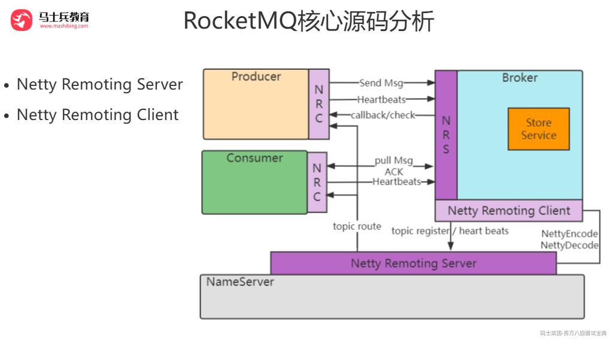

#### 存储基于内存

NameServer存储以下信息：

**topicQueueTable**：Topic消息队列路由信息，消息发送时根据路由表进行负载均衡

**brokerAddrTable**：Broker基础信息，包括brokerName、所属集群名称、主备Broker地址

**clusterAddrTable**：Broker集群信息，存储集群中所有Broker名称

**brokerLiveTable**：Broker状态信息，NameServer每次收到心跳包是会替换该信息

**filterServerTable**：Broker上的FilterServer列表，用于类模式消息过滤。

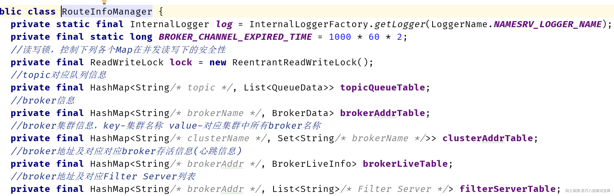

NameServer的实现基于内存，NameServer并不会持久化路由信息，持久化的重任是交给Broker来完成。这样设计可以提高NameServer的处理能力。

### 消息写入流程

RocketMQ使用Netty处理网络，broker收到消息写入的请求就会进入SendMessageProcessor类中processRequest方法。

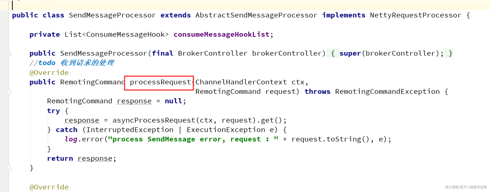

最终进入DefaultMessageStore类中asyncPutMessage方法进行消息的存储

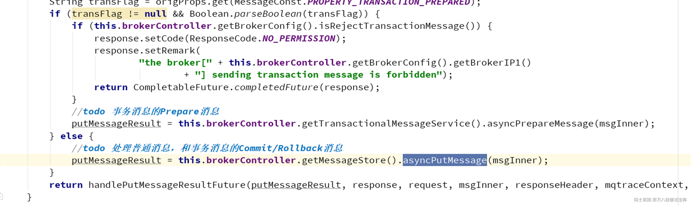

然后消息进入commitlog类中的asyncPutMessage方法进行消息的存储

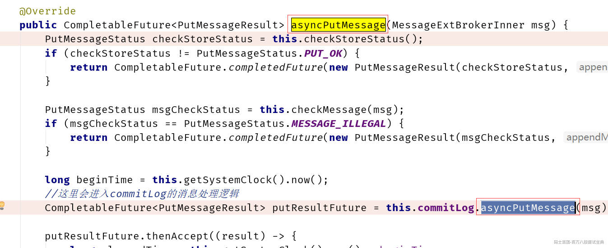

整个存储设计层次非常清晰，大致的层次如下图：

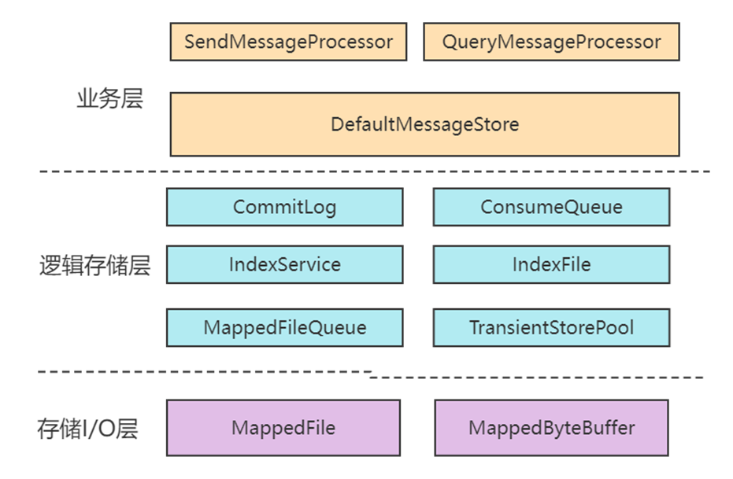

业务层：也可以称之为网络层，就是收到消息之后，一般交给SendMessageProcessor来分配（交给哪个业务来处理）。DefaultMessageStore，这个是存储层最核心的入口。

存储逻辑层：主要负责各种存储的逻辑，里面有很多跟存储同名的类。

存储I/O层：主要负责存储的具体的消息与I/O处理。

#### Commitlog写入时使用可重入锁还是自旋锁？

RocketMQ在写入消息到CommitLog中时，使用了锁机制，即同一时刻只有一个线程可以写CommitLog文件。CommitLog 中使用了两种锁，一个是自旋锁，另一个是重入锁。源码如下：

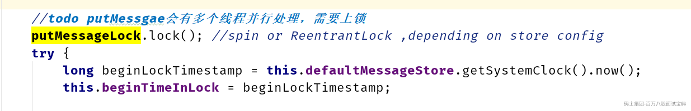

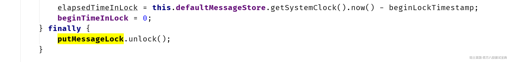

这里注意lock锁的标准用法是try-finally处理（防止死锁问题）

另外这里锁的类型可以自主配置。

RocketMQ 官方文档优化建议：异步刷盘建议使用自旋锁，同步刷盘建议使用重入锁，调整Broker配置项useReentrantLockWhenPutMessage，默认为false；

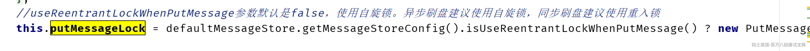

同步刷盘时，锁竞争激烈，会有较多的线程处于等待阻塞等待锁的状态，如果采用自旋锁会浪费很多的CPU时间，所以“同步刷盘建议使用重入锁”。

异步刷盘是间隔一定的时间刷一次盘，锁竞争不激烈，不会存在大量阻塞等待锁的线程，偶尔锁等待就自旋等待一下很短的时间，不要进行上下文切换了，所以采用自旋锁更合适。

## 11、分布式事物消息以及在RocketMQ的运用及原理

### 什么是分布式事务？

业务场景：用户A转账100元给用户B，这个业务比较简单，具体的步骤：  
1、用户A的账户先扣除100元  
2、再把用户B的账户加100元


如果在同一个数据库中进行，事务可以保证这两步操作，要么同时成功，要么同时不成功。这样就保证了转账的数据一致性。  
但是在微服务架构中，因为各个服务都是独立的模块，都是远程调用，都没法在同一个事务中，都会遇到分布式事务问题。

### RocketMQ的解决方案


RocketMQ采用两阶段提交，把扣款业务和加钱业务异步化，在A系统扣款成功后，发送“扣款成功消息”到消息中间件；B系统中加钱业务订阅“扣款成功消息”，再对用户进行加钱。

#### 具体的处理方案


1. 生产者发送半消息（half message）到RocketMQ服务器

2. RocketMQ服务器向生产者返回半消息的提交结果

3. 生产者执行本地的事务1）这里如果是标记为可提交状态（commit），消费者监听主题即可立马消费（TransactionTopic主题），消费者进行事务处理，提交。2）如果这里标记为回滚，那么消费者就看不到这条消息，整个事务都是回滚的3）当然本地事务中还有一种情况，那就是没执行完，这个时候，可以提交UNKNOW,交给事务回查机制。 如果是事务回查中，生产者本地事务执行成功了，则提交commit，消费者监听主题即可立马消费，消费者进行事务处理，提交。 如果这里标记为回滚，那么消费者就看不到这条消息，整个事务都是回滚的。 当然本地事务中还有一种情况，那就是还没执行完，这个时候还是可以继续提交UNKNOW,交给事务回查机制（过段时间继续进入事务回查）。


### RocketMQ分布式事务方案中的异常处理

#### 事务回查失败的处理机制

在生产者有可能是要进行定时的事务回查的，所以在这个过程中有可能生产者宕机导致这条分布式事务消息不能正常进行。那么在RocketMQ中的生产者分组就会发挥作用


也就是如果在进行分布式事务回查中（RocketMQ去调用生产者客户端）某一台生产者宕机了，这个时候只要还有一台分组名相同的生产者在运行，那么就可以帮助之前宕机的生产者完成事务回查。


#### 消费者失败补偿机制

虽然在消费者采用最大可能性的方案（重试的机制）确保这条消息能够执行成功，从而确保消费者事务的确保执行。但是还是有可能会发生消费者无法执行事务的情况，这个时候就必须要使用事务补偿方案。

业务场景：用户A转账100元给用户B，这个业务比较简单，具体的步骤：  
1、用户A的账户先扣除100元----生产者成功执行了  
2、再把用户B的账户加100元----消费者一直加100元失败。

那么就需要去通知生产者把之前扣除100元的操作进行补偿回滚操作。


## 12、如何在MQ中实现消息的顺序性，分析相关的设计与实现细节！

为了保证消息的顺序性，通常需要遵循以下规则：

- **单线程生产** ：确保生产者以单线程方式发送消息，避免并发发送导致消息乱序。

- **单线程消费** ：确保消费者以单线程方式消费消息，避免并发消费导致消息乱序。

- **单个队列** ：将所有消息发送到同一个队列中，确保消息的顺序性。

- **单个生产者/消费者** ：避免多个生产者或消费者同时操作同一个队列，导致消息顺序混乱。

### RabbitMQ

消息重试机制可以确保消息在消费失败后重新入队，从而保证消息的顺序性。

如果消费者处理消息失败，将消息重新放回队列头部，确保消息顺序不变。

#### **事务消息**

事务消息可以确保消息的发送和业务逻辑的原子性，从而保证消息的顺序性。

如果对消息顺序性要求极高，且可以接受性能损失，可以选择 **事务消息** 。

#### **RPC 模式**

RPC 模式可以确保消息的顺序性，通过同步调用方式实现。

如果需要同步调用并保证顺序性，可以选择 **RPC 模式** 。

### Kafka和RocketMQ

在 Kafka 和RocketMQ中，一个分区/队列只能被同一个消费者组中的一个消费者消费。通过限制消费者组的消费者数量，可以确保消息的顺序性。

Kafka中：

`max.in.flight.requests.per.connection`：\*\*控制每个连接上未确认的请求数量。设置为1

RocketMQ中：  
选用顺序的消费者方法或者类。

# 13、使用MQ的延迟消息实现限时订单

## RabbitMQ

RabbitMQ本身不支持延迟消息，但可以通过死信队列（DLX）和消息TTL（Time-To-Live）来实现延迟效果。

1. **创建普通队列和死信队列** ：

- 创建一个普通队列，并设置消息的TTL（即消息的存活时间）。

- 创建一个死信队列，用于接收超时的消息。

2. **绑定死信队列** ：

- 在普通队列中配置死信交换器（DLX），当消息在普通队列中过期后，会被转发到死信队列。

3. **发送延迟消息** ：

- 当用户下单时，将订单信息发送到普通队列，并设置消息的TTL为订单的超时时间（如30分钟）。

4. **处理超时订单** ：

- 消费者监听死信队列，当消息从普通队列过期并进入死信队列时，消费者会收到该消息，表示订单超时，可以进行取消订单等操作。

## RocketMQ：延时消息

RocketMQ原生支持延迟消息，可以直接设置消息的延迟级别来实现订单超时处理。在RocketMQ5的版本中可以设置任意的延迟时间。

```plain
// 设置延迟级别，3对应10分钟，4对应30分钟
        msg.setDelayTimeLevel(4);
```

- 在RocketMQ 5.x中，发送消息时可以通过 `setDelayTimeMs`方法设置任意的延迟时间（以毫秒为单位）。

- 例如，设置延迟30分钟，可以将延迟时间设置为 `30 * 60 * 1000`毫秒。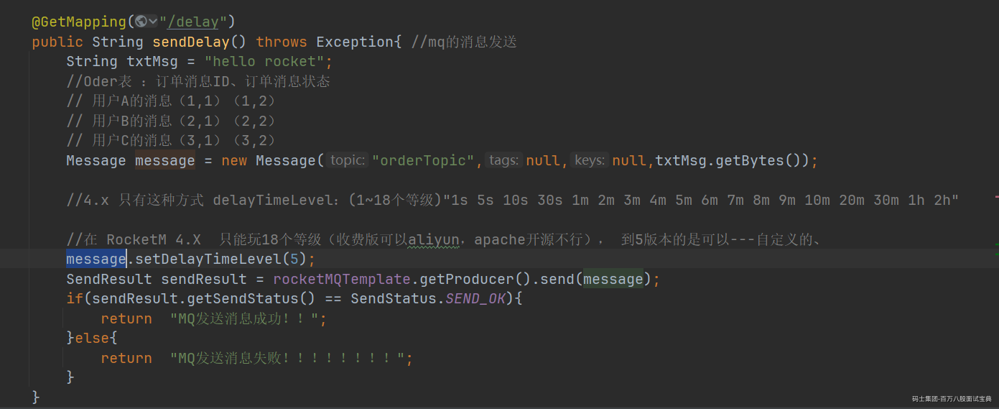

```plain
 Message message = provider.newMessageBuilder()
                .setTopic("order_topic")
                .setBody(body)
                .setDelayTimeMs(30 * 60 * 1000) // 设置延迟时间（30分钟）
                .build();
```
