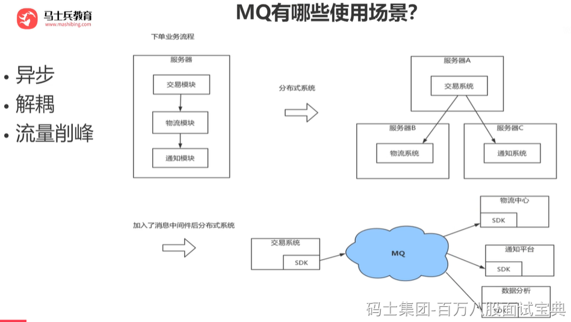

其实就是问问你消息队列都有哪些使用场景，然后你项目里具体是什么场景，说说你在这个场景里用消息队列是什么？

面试官问你这个问题，期望的一个回答是说，你们公司有个什么业务场景，这个业务场景有个什么技术挑战，如果不用MQ可能会很麻烦，但是你现在用了MQ之后带给了你很多的好处。消息队列的常见使用场景，其实场景有很多，但是比较核心的有3个：解耦、异步、削峰。

#### 解耦

A系统发送个数据到BCD三个系统，接口调用发送，那如果E系统也要这个数据呢？那如果C系统现在不需要了呢？现在A系统又要发送第二种数据了呢？而且A系统要时时刻刻考虑BCDE四个系统如果挂了咋办？要不要重发？我要不要把消息存起来？

你需要去考虑一下你负责的系统中是否有类似的场景，就是一个系统或者一个模块，调用了多个系统或者模块，互相之间的调用很复杂，维护起来很麻烦。但是其实这个调用是不需要直接同步调用接口的，如果用MQ给他异步化解耦，也是可以的，你就需要去考虑在你的项目里，是不是可以运用这个MQ去进行系统的解耦。

#### 异步

A系统接收一个请求，需要在自己本地写库，还需要在BCD三个系统写库，自己本地写库要30ms，BCD三个系统分别写库要300ms、450ms、200ms。最终请求总延时是30 + 300 + 450 + 200 = 980ms，接近1s。

异步后，BCD三个系统分别写库的时间，A系统就不再考虑了。

#### 削峰

每天0点到16点，A系统风平浪静，每秒并发请求数量就100个。结果每次一到16点~23点，每秒并发请求数量突然会暴增到1万条。但是系统最大的处理能力就只能是每秒钟处理1000个请求啊。怎么办？需要我们进行流量的削峰，让系统可以平缓的处理突增的请求。
