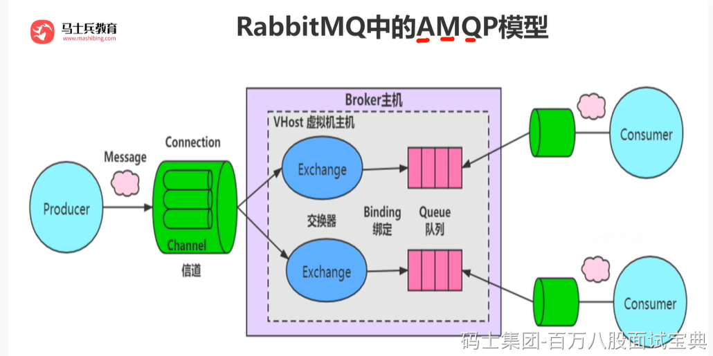

### **AMQP**

是应用层协议的一个开放标准,为面向消息的中间件设计。基于此协议的客户端与消息中间件可传递消息，并不受客户端/中间件不同产品，不同的开发语言等条件的限制。目标是实现一种在全行业广泛使用的标准消息中间件技术，以便降低企业和系统集成的开销，并且向大众提供工业级的集成服务。主要实现有 RabbitMQ。

### 客户端与RabbitMQ的通讯

#### 连接

首先作为客户端（无论是生产者还是消费者），你如果要与RabbitMQ通讯的话，你们之间必须创建一条TCP连接，当然同时建立连接后，客户端还必须发送一条“问候语”让彼此知道我们都是符合AMQP的语言的，比如你跟别人打招呼一般会说“你好！”，你跟国外的美女一般会说“hello!”一样。你们确认好“语言”之后，就相当于客户端和RabbitMQ通过“认证”了。你们之间可以创建一条AMQP的信道。

#### 信道

概念：信道是生产者/消费者与RabbitMQ通信的渠道。信道是建立在TCP连接上的虚拟连接，什么意思呢？就是说rabbitmq在一条TCP上建立成百上千个信道来达到多个线程处理，这个TCP被多个线程共享，每个线程对应一个信道，信道在RabbitMQ都有唯一的ID ,保证了信道私有性，对应上唯一的线程使用。

疑问：为什么不建立多个TCP连接呢？原因是rabbit保证性能，系统为每个线程开辟一个TCP是非常消耗性能，每秒成百上千的建立销毁TCP会严重消耗系统。所以rabbitmq选择建立多个信道（建立在tcp的虚拟连接）连接到rabbit上。

从技术上讲，这被称之为“多路复用”，对于执行多个任务的多线程或者异步应用程序来说，它非常有用。

### 虚拟主机

虚拟消息服务器，vhost，本质上就是一个mini版的mq服务器，有自己的队列、交换器和绑定，最重要的，自己的权限机制。Vhost提供了逻辑上的分离，可以将众多客户端进行区分，又可以避免队列和交换器的命名冲突。Vhost必须在连接时指定，rabbitmq包含缺省vhost：“/”，通过缺省用户和口令guest进行访问。

rabbitmq里创建用户，必须要被指派给至少一个vhost，并且只能访问被指派内的队列、交换器和绑定。Vhost必须通过rabbitmq的管理控制工具创建。

### 交换器类型

共有四种direct,fanout,topic,headers，其种headers(几乎和direct一样)不实用，可以忽略。

#### Direct

路由键完全匹配，消息被投递到对应的队列， direct交换器是默认交换器。声明一个队列时，会自动绑定到默认交换器，并且以队列名称作为路由键：channel->basic\_public($msg,’’,’queue-name’)

#### Fanout

消息广播到绑定的队列，不管队列绑定了什么路由键，消息经过交换器，每个队列都有一份。

#### Topic

通过使用“*”和“#”通配符进行处理，使来自不同源头的消息到达同一个队列，”.”将路由键分为了几个标识符，“*”匹配1个，“#”匹配一个或多个。
