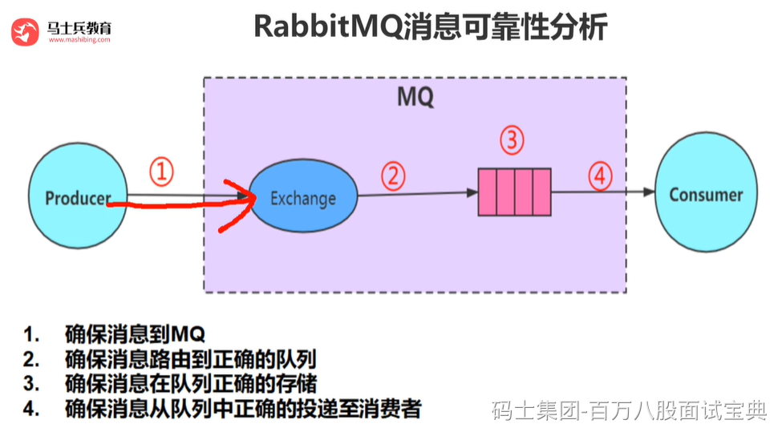

1. 持久化

在发送消息时，可以设置消息属性 `delivery_mode` 为 2，表示该消息需要被持久化，即将消息保存到磁盘中，即使 RabbitMQ 服务器宕机也能够保证消息不会丢失。可以在创建队列时将 `durable` 属性设置为 `True`，表示该队列也需要被持久化，以便在 RabbitMQ 服务器宕机后能够重新创建队列和绑定。

1. 确认机制

在 RabbitMQ 中，消费者通过 `basic.ack` 命令向 RabbitMQ 服务器确认已经消费了某条消息。如果消费者在处理消息时发生错误或宕机，RabbitMQ 服务器会重新将消息发送给其他消费者。在确认消息之前，RabbitMQ 会将消息保存在内存中，只有在收到消费者的确认消息后才会删除消息。

1. 发布者确认

RabbitMQ 支持发布者确认（Publisher Confirm）机制，即发布者在将消息发送到队列后，等待 RabbitMQ 服务器的确认消息。如果 RabbitMQ 成功将消息保存到队列中，会返回一个确认消息给发布者。如果 RabbitMQ 服务器无法将消息保存到队列中，会返回一个 Nack（Negative Acknowledgement）消息给发布者。通过发布者确认机制，可以确保消息被成功发送到 RabbitMQ 服务器。

1. 备份队列

RabbitMQ 支持备份队列（Alternate Exchange）机制，即在消息发送到队列之前，先将消息发送到备份队列中。如果主队列无法接收消息，RabbitMQ 会将消息发送到备份队列中。备份队列通常是一个交换机，可以在创建队列时通过 `x-dead-letter-exchange` 属性来指定备份队列。
