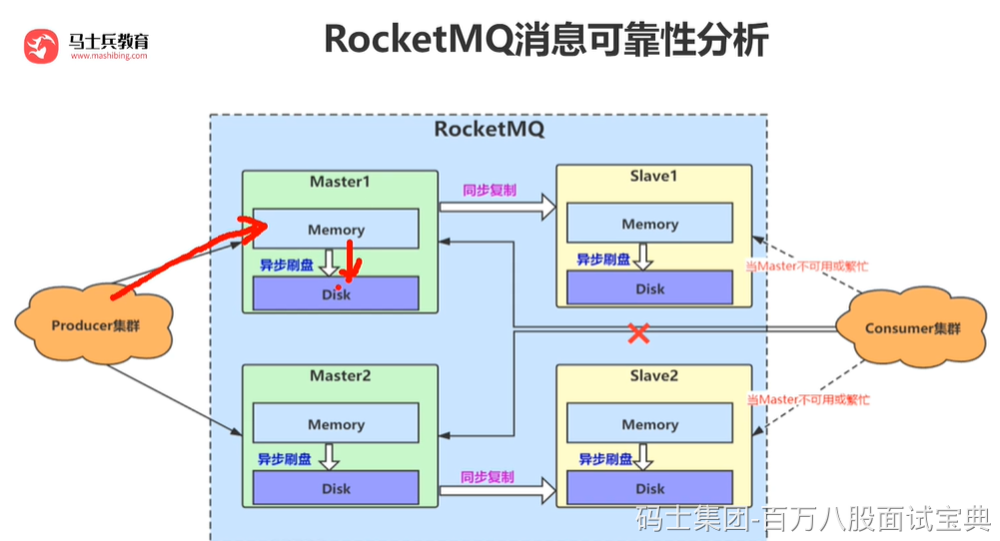

RocketMQ 通过多种机制来确保消息不丢失，包括刷盘机制、消息拉取机制、ACK 机制等。

1. 刷盘机制

RocketMQ 中的消息分为内存消息和磁盘消息，内存消息在 Broker 内存中进行读写，磁盘消息则保存在磁盘上。RocketMQ 支持同步刷盘和异步刷盘两种方式，通过刷盘机制可以确保消息在 Broker 宕机时不会丢失。在同步刷盘模式下，消息写入磁盘时，会等待磁盘的写入完成才返回写入成功的响应。在异步刷盘模式下，消息写入磁盘后立即返回写入成功的响应，但是不等待磁盘写入完成

1. ACK 机制

在 RocketMQ 中，Producer 发送消息后，Broker 会返回 ACK 确认信号，表示消息已经成功发送。如果 Broker 没有收到 ACK 确认信号，就会尝试重新发送该消息，直到消息被确认为止。

RocketMQ 采用主从复制机制，每个消息队列都有一个主节点和多个从节点，主节点负责消息的写入和读取，从节点负责备份数据。当主节点宕机时，从节点会自动接管主节点的工作，确保消息不会丢失

1. 消息存储机制

RocketMQ 默认使用双写模式来存储消息，即将消息同时写入内存和磁盘中，然后再将内存中的消息异步刷盘到磁盘中。这种方式可以保证消息的可靠性，即使系统宕机，也能够尽可能地保证消息不会丢失。

除此之外，RocketMQ 还提供了多种机制来保证消息不丢失，例如事务消息、延迟消息、顺序消息等，这些机制可以根据业务需求进行选择和使用。

需要注意的是，为了确保消息的可靠性，RocketMQ 的发送消息的速度可能会受到一定的限制，需要在消息可靠性和性能之间进行权衡。
