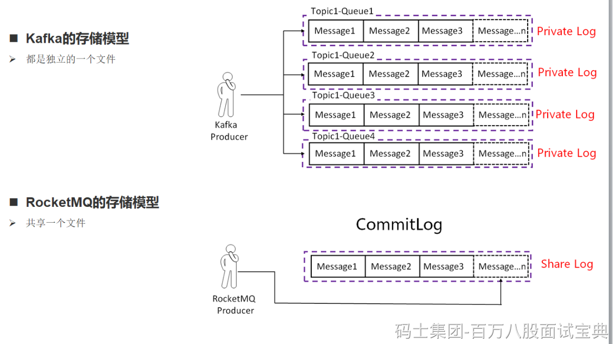

**Kafka 中文件的布局是以 Topic/partition ，每一个分区一个物理文件夹，在分区文件级别实现文件顺序写，如果一个Kafka集群中拥有成百上千个主题，每一个主题拥有上百个分区，消息在高并发写入时，其IO操作就会显得零散（****消息分散的落盘策略会导致磁盘IO竞争激烈成为瓶颈****），其操作相当于随机IO，即 Kafka 在消息写入时的IO性能会随着 topic 、分区数量的增长，其写入性能会先上升，然后下降。**

**而RocketMQ在消息写入时追求极致的顺序写，所有的消息不分主题一律顺序写入 commitlog 文件，并不会随着 topic 和 分区数量的增加而影响其顺序性。**

在消息发送端，消费端共存的场景下，随着Topic数的增加Kafka吞吐量会急剧下降，而RocketMQ则表现稳定。因此Kafka适合Topic和消费端都比较少的业务场景，而RocketMQ更适合多Topic，多消费端的业务场景。
