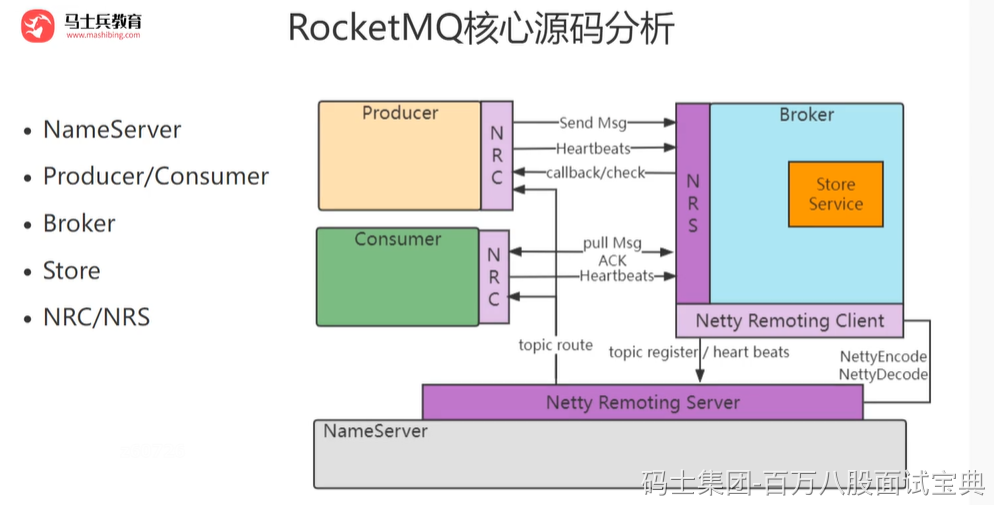

RocketMQ的源码是非常的多，我们没有必要把RocketMQ所有的源码都读完，所以我们把核心、重点的源码进行解读，RocketMQ核心流程如下：

- 启动流程RocketMQ服务端由两部分组成NameServer和Broker，NameServer是服务的注册中心，Broker会把自己的地址注册到NameServer，生产者和消费者启动的时候会先从NameServer获取Broker的地址，再去从Broker发送和接受消息。
- 消息生产流程Producer将消息写入到RocketMQ集群中Broker中具体的Queue。
- 消息消费流程Comsumer从RocketMQ集群中拉取对应的消息并进行消费确认。
