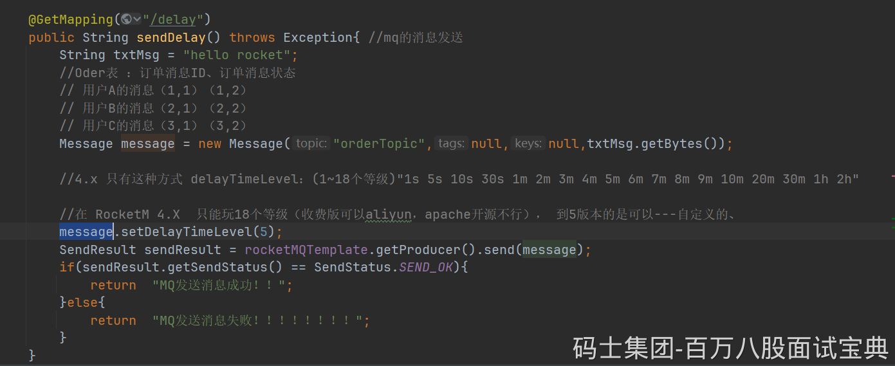

## RabbitMQ

RabbitMQ本身不支持延迟消息，但可以通过死信队列（DLX）和消息TTL（Time-To-Live）来实现延迟效果。

1. **创建普通队列和死信队列** ：

- 创建一个普通队列，并设置消息的TTL（即消息的存活时间）。
- 创建一个死信队列，用于接收超时的消息。

2. **绑定死信队列** ：

- 在普通队列中配置死信交换器（DLX），当消息在普通队列中过期后，会被转发到死信队列。

3. **发送延迟消息** ：

- 当用户下单时，将订单信息发送到普通队列，并设置消息的TTL为订单的超时时间（如30分钟）。

4. **处理超时订单** ：

- 消费者监听死信队列，当消息从普通队列过期并进入死信队列时，消费者会收到该消息，表示订单超时，可以进行取消订单等操作。

## RocketMQ：延时消息

RocketMQ原生支持延迟消息，可以直接设置消息的延迟级别来实现订单超时处理。在RocketMQ5的版本中可以设置任意的延迟时间。

```plain
// 设置延迟级别，3对应10分钟，4对应30分钟
        msg.setDelayTimeLevel(4);
```

- 在RocketMQ 5.x中，发送消息时可以通过 `setDelayTimeMs`方法设置任意的延迟时间（以毫秒为单位）。
- 例如，设置延迟30分钟，可以将延迟时间设置为 `30 * 60 * 1000`毫秒。



```plain
Message message = provider.newMessageBuilder()
                .setTopic("order_topic")
                .setBody(body)
                .setDelayTimeMs(30 * 60 * 1000) // 设置延迟时间（30分钟）
                .build();
```
