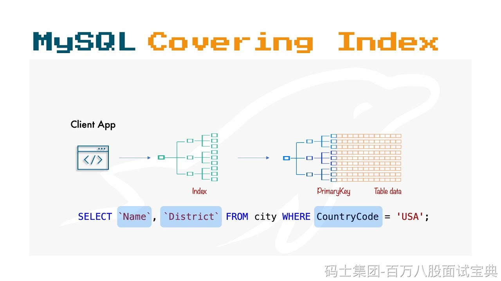

覆盖索引（covering index）并不是一种新的索引类型，而是指某个针对查询语句设计的多列索引，**索引本身已包含查询所需的所有列**，因此查询可以只读索引而无需访问数据表。M

# **工作原理**：

InnoDB 会在二级索引里存储索引列以及主键（clustered index）的值。如果查询需要的列恰好都在该索引中，MySQL 执行查询时只需要扫描索引 leaf 节点，无需回表取数据，显著提升效率。S

# **主要优势：**

- **减少磁盘 I/O**：无需访问数据页，降低读盘次数。
- **加快响应速度**：索引页比数据页更小、更适合缓存，查询更快。
- **优化排序与分组**：索引中列已排序，可直接用于 `ORDER BY` 或 `GROUP BY`。B

# **适用场景：**

- 查询只访问索引列，如 `SELECT a, b FROM t WHERE a = ? AND b = ?`，索引 `(a, b)` 就可覆盖。
- 查询在 `WHERE`、SELECT、JOIN 或排序所需列，最好全部能被同一个复合索引覆盖。

# **局限与注意事项：**

- **索引膨胀**：覆盖索引存储了更多列，索引体积大，对写操作成本高，如 `INSERT/UPDATE` 更慢。
- **设计须匹配查询**：若查询增加列，即使原有索引再多列，也失去覆盖优势；需要适时调整索引结构。
- **索引顺序约束**：覆盖索引必须满足左前缀原则，列顺序应与查询条件及 SELECT 列顺序一致。

# **示例说明：**

```sql
CREATE INDEX idx_on(a, b, c);
SELECT a, b FROM t WHERE a=? AND b=?;  -- 覆盖，无回表  
SELECT a, b, c FROM t WHERE a=?;      -- 也可覆盖，列都在索引
SELECT a, b, d FROM t WHERE a=?;      -- 不覆盖，d 不在索引，需要回表
```

-
