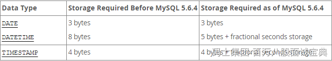
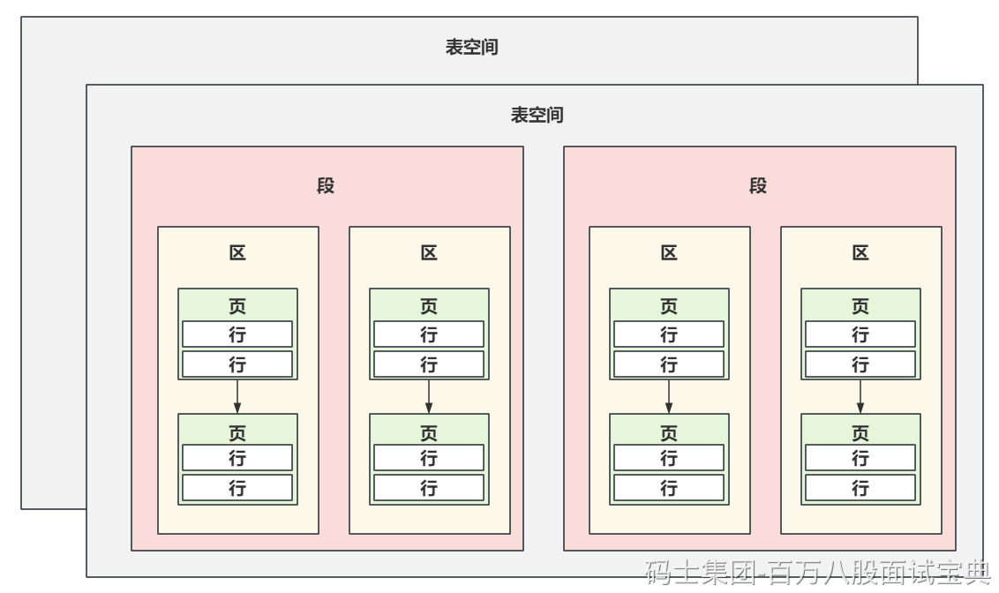
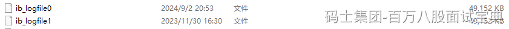
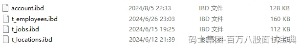
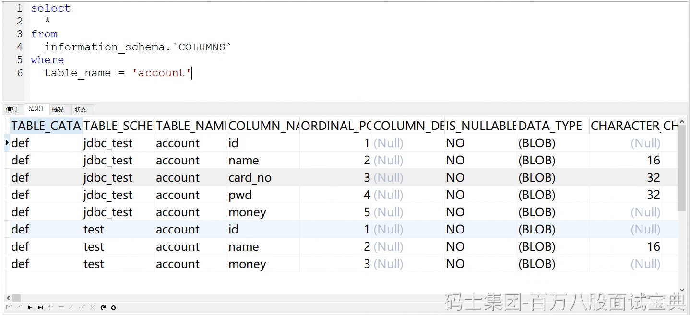
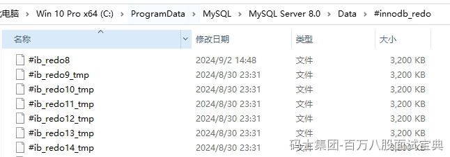
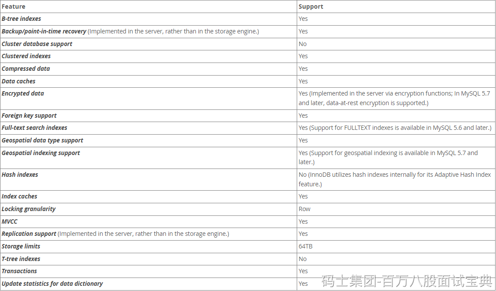

# MySQL突击班（第一天）

## 一、MySQL中常见数据类型的基本区别

> MySQL中咱们聊常见的数值、字符串、时间类型。
>
> 对于每个类型的数据的大小和一些基本区别先去掌握一下。
>
> **数值类型：**
>
> - 整型：主要分为了5个整型的数据类型。MySQL中的整型常用的这5种，其中根据字节咱们就可以大致对应到Java中的具体类型，其中3byte几乎很少用到。他们的区别就是存储的范围大小不一样，一般在使用数据类型的时候，**如果可以用小的，就用小的**！
>
> - 浮点型：MySQL中常见的浮点类型就三，Float，Double， **Decimal** 其中Float和Double可以在图中很直观的看到他俩的区别。其中Float还有一个小细节，如果声明时，长度指定的太长，Float也会占用8字节，当长度25~53之间的时候。其中Decimal他并没有明确的指定他占用的大小，会根据声明时指定的(M,D)来决定大小。 decimal(18,9) [999999999.999999999]。根据官方文档可以看出，decimal中的数值是分别将整数和小数做计算。其中9个位置占4字节，细粒度的看这个表，剩余的位置，按照这个图算。  如果现在指定decimal(12,7)，整体的数字有12个长度，整数位5个（3字节），小数位7个（4字节），一共7个字节。一般推荐使用Decimal，他存储的数值相对更精准一些，而且可以根据你需要的范围大小占用不同的空间。
>
> **字符串类型：**
>
> - **char：** 固定长度的字符串，你指定的长度是固定的占用字节的大小。  
>   其中，在官方文档中可以看到，char(M)，需要占用 **M × w个字节** ，w是你声明的字符集类型，其中常用的是utf8mb4，这哥们就代表w是4字节，如果用utf8mb3，w就代表是3字节。
>
> - **varchar：** 可变长度的字符串，会根据你输入的内容长度来计算占用空间的字节大小。如果你写入的字符串的实际大小是0~255，那么他额外追加1个字节。如果你写入的字符串空间超过了255个字节，那需要额外追加2个字节。对于占用空间大小，当varchar大小超过了255后，其实Text和varchar没啥区别。从占用空间的维度来说，如果固定这个字段的长度一定会超过255，你有用text也一样。
>
> **时间类型：**
>
> - date：存储年月日
>
> - datetime：存储年月日 时分秒
>
> - timestamp：存储年月日 时分秒
>
> 通过官方文档看到了一个细节，MySQL中的时间类型里，time，datetime，timestamp可以存储时间，并且可以精准到秒的后6位，也就是微秒单位。想精准到秒的后几位，是需要额外的空间存储的。
>
> 
>
> 其次，关于这哥三的空间占用大小，可以看这个图。
>
> 5.6.4的版本是一个分界点~fractional seconds storage的意思就是如果你要精确到秒的后几位，他需要额外占用空间，这个是上面聊的。
>
> 
>
> datetime和timestamp的区别：
>
> - 关于存储范围的情况
>
> - datetime：用到死，到这 `'1000-01-01 00:00:00.000000' to '9999-12-31 23:59:59.499999'`
>
> - timestamp：用到十几年后，`'1970-01-01 00:00:01.000000'` to `'2038-01-19 03:14:07.499999'`
>
> - 时区的区别
>
> - timestamp：你写入的值会从当前时区转换为UTC进行存储，在查询时，会将UTC类型转换为当前系统的时区。
>
> - datetime：不会关注时区的问题，你写入什么，他就存储什么，检索也一样。
>
> 默认情况下，每个连接的当前时区是服务器的时间，时间可以根据每个连接去设置，只要你保证时区不变，其实也没啥问题。如果你连接的时区变化了，你存储的是timestamp类型，那你再用别的时区查询这个值时，会发生变化。

## 二、MySQL中InnoDB逻辑存储结构（常识性的概念）

MySQL中的逻辑存储结构如图：

> - 表空间：已经覆盖了咱们所有的数据和索引，比如系统表在系统表空间，还有默认表空间…………
>
> - 段：多个段，组成表空间……
>
> - 区：多个区，组成段……一般每个区通常的大小是1MB。
>
> - **页：默认64个连续的页，组成一个区。每个页的默认大小是16kb。**
>
> - 行：多行数据都在页里…………
>
> 其次，MySQL每次去磁盘中读取数据到内存时，每次至少会将一个页的数据加载到内存中。
>
> 也就是说，在数据库中，不论是读一行，还是读多行，都需要将一个或多个页的数据加载到内存中（Buffer Pool）。页就是MySQL一次IO读取的最小单位。
>
> 连续的页在针对一些范围查询时，效果更佳。

## 三、MySQL中的物理存储结构

### 3.1、5.7 版本

#### 3.1.1、InnoDB存储引擎

> - 表数据：InnoDB的存储引擎，会将表数据和索引放在一个文件里。就是ibd
>
> - 表结构：表结构会放在这个frm的文件中
>
> - 重做日志（redo log）：用于做崩溃恢复的重要日志之一……
>
> 系统元数据：**这个是存储MySQL系统元数据的，和存储引擎无关！！！！**
>
> 

#### 3.1.2、MyISAM存储引擎

> - 表数据：在MyISAM中，数据和索引是分开存放的。其中MYD是存储数据的，MYI是存储索引的。
>
> - 表结构：和InnoDB一样，读是在frm文件中的
>
> - **重做日志：redo log是InnoDB特有的，MyISAM没有。。。。。。**
>
> 系统元数据：这个是MySQL服务的，无关存储引擎。

### 3.2、8.0 版本

#### 3.2.1 InnoDB存储引擎

> - 表数据：InnoDB中，数据和索引一样还是存在一个文件中。依然是.ibd文件中。
>
> - 表结构：在8.0中，frm文件被直接剔除掉了，表结构被直接放到了系统表中。
>
> - 重做日志：redo log，依然存在，存放在这个位置

#### 3.2.2 MyISAM存储引擎

> - 表数据：和5.7一样，依然是其中MYD是存储数据的，MYI是存储索引的。
>
> - 表结构：也是放到了系统元数据中，也就是information\_schame库里。

#### 3.2.3 为啥砍掉frm文件？

> - MySQL8.0推出了一个原子性的DDL操作。针对个原子操作，可以利用information\_schame这个库来操作，来确保表定义信息的一致性和可靠性。
>
> - 可以基于information\_schame库来统一管理表结构信息。
>
> - 使用了information\_schame之后，甚至可以对表结构来做一些加密操作。
>
> - 备份数据时，不需要再去单独的备份frm文件了，元数据库中就有。
>
> - ………………

## 四、MySQL常见的存储引擎和区别

MySQL中最常见的自然就是InnoDB。

除此之外就是MyISAM，5.1版本时，那也是默认的存储引擎。。。

主要来聊这两个存储引擎的区别，区别其实特别多……………………

在8.x的InnoDB和MyISAM中，支持的特性区别。

> - 关于聚簇索引的支持，InnoDB支持聚簇索引，MyISAM不支持聚簇索引
>
> - 关于数据缓存的支持，InnoDB支持数据缓存扔Buffer Pool，MyISAM不支持。
>
> - 关于外键的支持，InnoDB支持外键，MyISAM不支持外键。
>
> - 关于Hash索引，InnoDB和MyISAM都不支持。但是InnoDB支持一个AHI的自适应hash索引。
>
> - 关于锁的支持，InnoDB支持行锁，而MyISAM只支持表锁。
>
> - 关于MVCC，InnoDB支持，MyISAM不支持。
>
> - 关于存储容量的限制，InnoDB可以支持到64TB，而MyISAM支持到256TB
>
> - 关于事务，InnoDB支持，MyISAM不支持。

InnoDB：

MyISAM：

