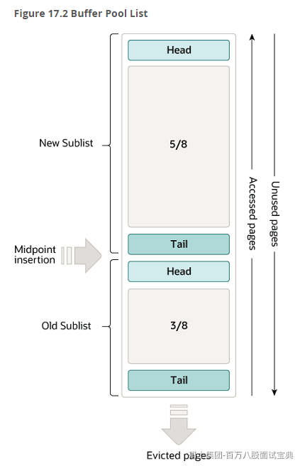
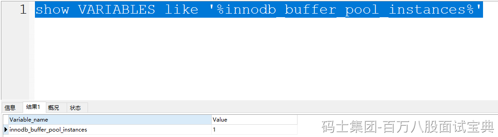
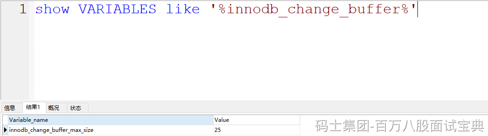
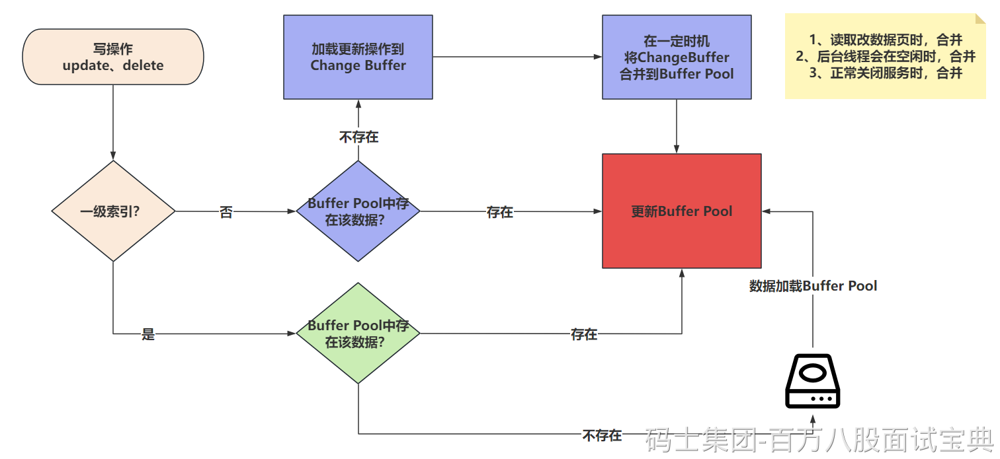
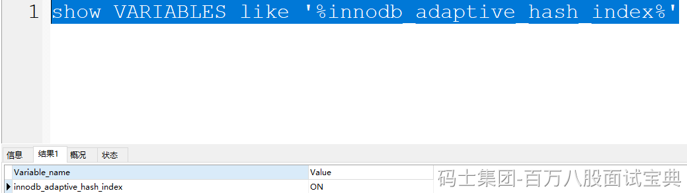
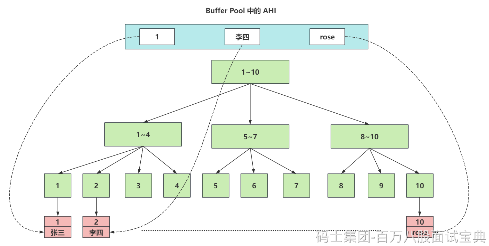
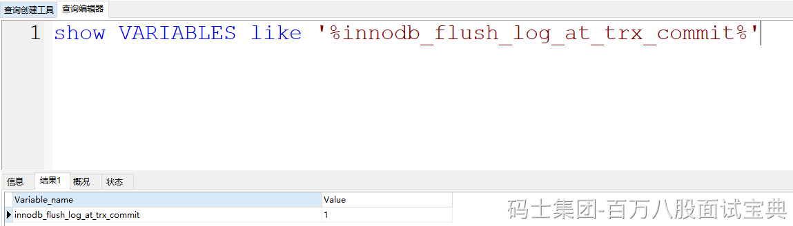
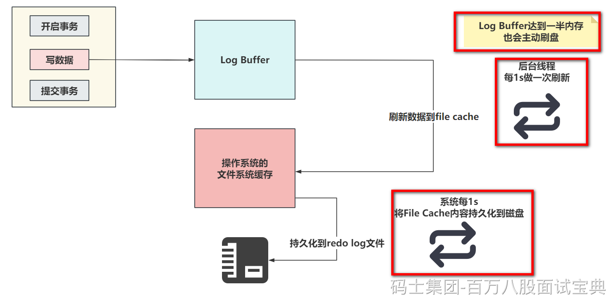
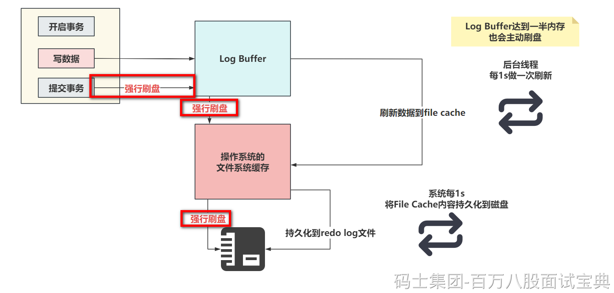

# MySQL突击班（第二天）

## 一、Buffer Pool

### 1.1 Buffer Pool是个啥？

> Buffer Pool（缓冲区、缓冲池）是MySQL主存中的一个区域。InnoDB在访问表数据时，会将数据从磁盘中拉取到Buffer Pool。而这个数据明面上就是多行数据，其实就是以页的形式存在的。他的目的就是为了加快查询和写入的速度。基于官方文档，可以看到，MySQL一般占用服务器的80%左右的内存。
>
> MySQL可以利用缓冲池实现优化的一个点。

### 1.2 Buffer Pool的存储结构和内存淘汰机制

> Buffer Pool毕竟是存在在内存里面的，内存空间有限，所以无法将所有数据都扔进来，需要提供一些机制实现内存淘汰的策略。
>
> 存储结构是将整个Buffer Pool分为了两大块区域。
>
> - New SubList：占用Buffer Pool的5/8的大小
>
> - Old SubList：占用Buffer Pool的3/8的大小
>
> 内部的数据都是页，页直接是基于 **链表连接** 的。
>
> 其次关于数据写入和淘汰的策略其实也很简单，他使用的机制是 **LRU** （最近最少使用的就被干掉！）
>
> 当需要将从磁盘中获取的页存储到Buffer Pool时，会先将这个页的数据存放到Old SubList的head位置。
>
> 当某个页的数据被操作（读写）了，就会放到New SubList的head位置。
>
> 如果某个页没有被操作（读写），慢慢的就会被放到Old SubList的tail位置。
>
> 当我需要再次将一个新的页，存放到Buffer Pool时，如果空间不足，会将Old SubList的tail位置的页淘汰掉
>
> 

### 1.3 Buffer Pool的线程问题？

> Buffer Pool是整个MySQL在InnoDB中的一个共享的内存区域，多个线程在和MySQL交互时，都会操作这个Buffer Pool的结构，会出现多线程操作临界资源（共享东西~），可能会有线程安全问题。
>
> 因为每次操作Buffer Pool中的页时，都需要将页的位置做一些移动，如果多个线程同时移动，可能会导致指针出问题。
>
> 即便这种内存动指针的操作贼快，甚至可能就是毫秒甚至是微秒级别的，但是依然存在问题。
>
> 所以线程在操作Buffer Pool时，需要基于锁的形式，拿到锁之后，才能去动Buffer Pool中的页……
>
> So，**Buffer Pool其实是可以支持多实例的**。MySQL支持的。
>
> MySQL中可以基于参数 `innodb_buffer_pool_instances` 去设置Buffer Pool实例的个数，默认是一个，最大可以设置为64个。并且多Buffer Pool实例需要至少给Buffer Pool设置1G的空闲才会生效。
>
> 
>
> 他是将数据基于hash的形式，分散到不同的Buffer Pool实例中。多个Buffer Pool的数据是不同的！！

## 二、Change Buffer

### 2.1 Change Buffer是个啥？

> Change Buffer是针对MySQL中，使用二级索引（非聚簇索引）去写数据时优化的一个策略。是在进行DML操作时的一个优化。
>
> 如果写的是 **非聚簇索引** ，并且对应的 **数据页没有在Buffer Pool** ，此时他不会立即将磁盘中的数据库页加载到Buffer Pool中。而是先将写操作扔到Change Buffer中，做一个缓冲。
>
> 等后面，要修改的这个数据页被读取时，再将Change Buffer中的记录合并到Buffer Pool中。**这样就是为了减少磁盘IO次数，提高性能。**
>
> **一级索引不会触发Change Buffer，一级索引速度快，直接把磁盘数据扔到Buffer Pool中，然后内存修改即可。**
>
> Change Buffer占用的是Buffer Pool的空间，默认占用25%，最大允许到50%。可以根据配置来进行调整。一般25%足够了，除非你的MySQL写多读少，可以适当调大Change Buffer的比例。
>
> 
>
> 二级索引修改整体流程：
>
> - 更新一条记录时，当该记录在Buffer Pool缓冲区中时，直接在Buffer Pool中修改对应的页，一次内存操作。（end）
>
> - 如果该记录不在Buffer Pool缓冲区中时，在不影响数据一致性的前提下，InnoDB会将这些更新操作缓存在Change Buffer中，不去磁盘做IO操作。。
>
> - 当下次查询到该记录时，会将这个记录扔到Buffer Pool，然后Change Buffer会将和这个也有关的操作合并，进行修改。
>
> 

### 2.2 数据到ChangeBuffer后，MySQL宕机了咋整？

> 首先要清楚，当一个事务提交时，InnoDB会将事务的所有更改记录写到redo log（重做日志）中，包括哪些写入到Change Buffer中的内容。咱们的保障是基于redo log实现的，即便宕机，redo log也有完整的信息。当前MySQL还会基于bin log利用2PC的形式，确保数据一致性。

## 三、AHI

### 3.1 AHI是个啥？

> AHI（自适应Hash索引，Adaptive Hash Index），他是InnoDB存储特有的。是一个为了优化查询操作的特殊功能。
>
> 当AHI发现某些索引值使用的非常的频繁，建立hash索引来提升查询的效率。
>
> AHI也是存储再Buffer Pool中的，会在Buffer Pool中开辟一片区域，建议这种自适应hash索引。
>
> 而且AHI默认是开启的。
>
> 
>
> 画一个图，掌握这种AHI是啥效果。
>
> 
>
> AHI的一些参数，不需要做任何调整，默认即可。 在生成AHI的自适应Hash索引后，查询效率可以从B+Tree结构的 `O(logn)` 提升到 `O(1)` 的效率。

## 四、Log Buffer

> Log Buffer是存储要写入到磁盘上的日志文件的一片内存区域。主要是redo log。
>
> 默认占用16M的大小。可以用过 `innodb_log_buffer_size` 参数调整。
>
> 他的目的很简单，就是在你做写操作时，尽量减少日志写入磁盘时的IO损耗，减少IO的次数……

## 五、redo log

### 5.1 redo log是个啥？

> redo log（重做日志）是InnoDB独有的。它让MySQL用于了崩溃回复的能力（一般配合bin log）。也就是MySQL宕机后，他可以根据redo log来恢复近期的数据，保证之前还没有写入到磁盘中的数据不会丢失，保证持久性和完整性。
>
> 

### 5.2 redo log如何保证数据的完整。

> 首先，现在知道一个事情，MySQL写操作不会立即将数据落到磁盘上，无论是数据还是日志。
>
> 比如数据，他优先走Change Buffer以及Buffer Pool的内存中，也是MySQL优化的手段，减少IO的消耗。
>
> 所有，为了保证数据的完整和持久性，在修改Change Buffer和Buffer Pool中的数据时，数据会优先落到redo log中。
>
> 写入的流程，如下
>
> 
>
> 我只需要知道第4步的触发时机即可。
>
> **redo log大概存储表空间号 + 数据页号 + 偏移量 + 具体修改的数据………………**
>
> 而Log Buffer中的数据刷到磁盘中，一般主要由这个参数控制
>
> 
>
> 他的默认值是1。他可以提供三种值：
>
> - 0： 设置为0的时候，表示每次事务提交不刷盘……
>
> - 1： （默认值）设置为1的时候，表示每次事务提交后，会立即进行刷盘操作……
>
> - 2：设置为2的时候，标识每次事务提交，我需要将Log Buffer中的数据刷到系统内存中……
>
> 就用1，别用别的，别的会导致丢失数据…………
>
> 刷盘的流程大致长这样
>
> 
>
> 下面详细的把，0，1，2的配置的刷盘套路各画一个图。
>
> - 当设置为0的时候，没有任何机制会主动刷新，只能靠后台提供的一个线程，每一秒刷新Log Buffer数据到File Cache
>
> - 当设置为1的时候，只要提交事务，就一定会确保Log Buffer中的数据，落到File Cache并且，必须序列化到本地磁盘文件
>
> - 设置为2时，提交事务后，会确保Log Buffer的数据，一定要了File Cache中。
