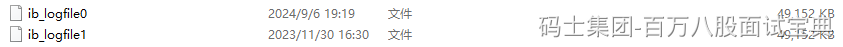
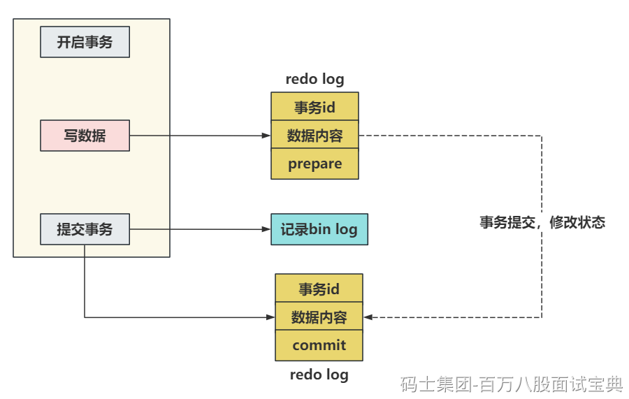
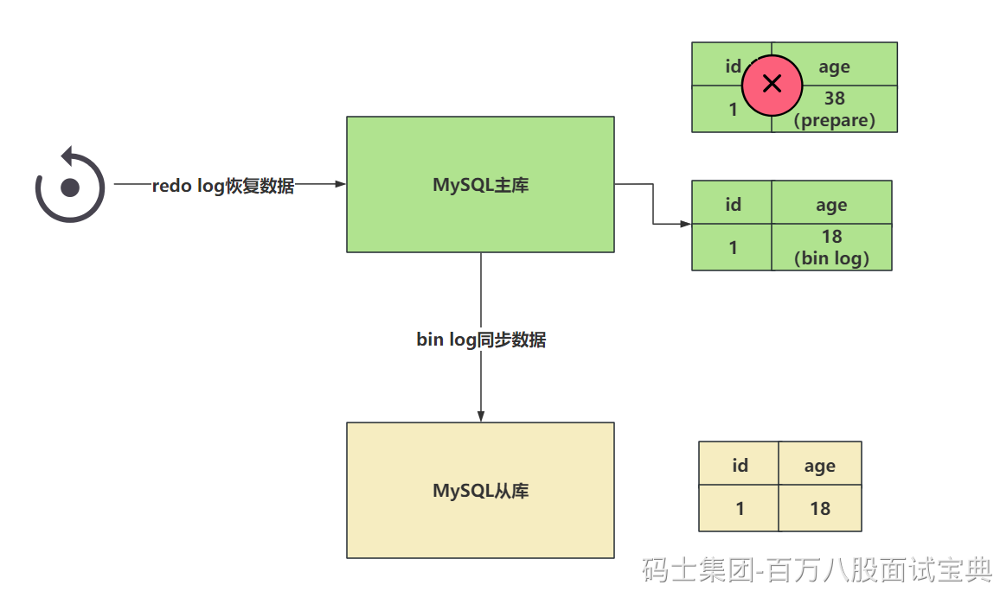
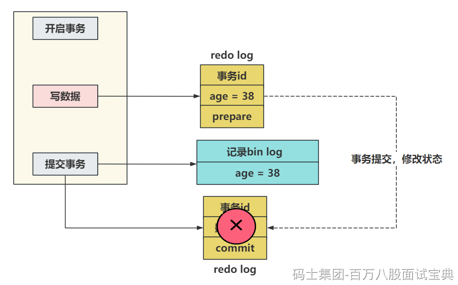
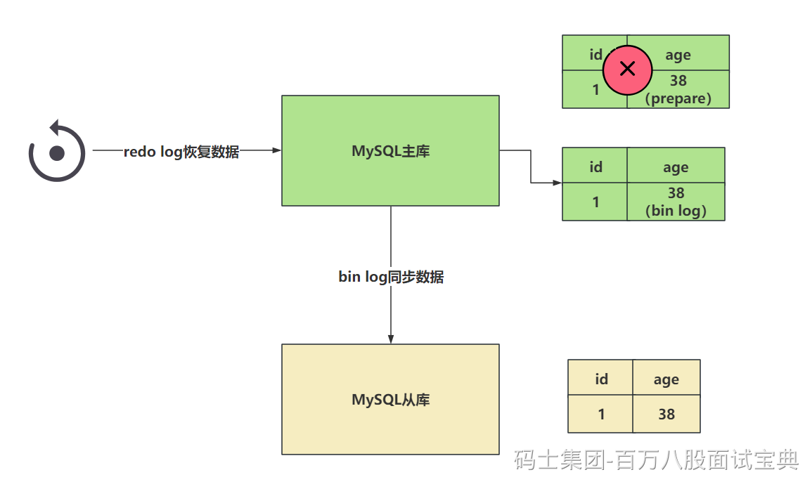

# MySQL-突击班（第三天）

## 一、redo log

> 昨日已经聊了redo log是干嘛的，以及他的持久化流程

### 1.1 redo log以什么形式存储的。

> redo log可以在本地磁盘中直接看到
>
> 
>
> 通过这个文件，可以看到，redo log是一个文件组的形式存在的，5.7里默认是2个文件，可以配置为多个文件。每个文件的大小是一样的。
>
> 默认情况下，可以看到，我现在环境里的redo log都存满了，默认大小是48M。
>
> 
>
> 其实在写入数据到redo log文件中时，为了提升他的写入性能，他的特点是 **顺序写** 的操作。
>
> 在写redo log文件的时候，他会有两个指针
>
> - write pos（应该没问题）：是记录当前要写入的位置，一边写入，这个指针一边往后移动
>
> - check point：记录当前要擦除的位置，一边删，一边往后移。
>
> 比如，模拟两个文件组的形式。
>
> 

### 1.2 数据为何不直接落到具体的表中，而是优先写入到redo log

> 首先第一点，通过1.1里面聊的内容，知道了redo log是顺序写的操作，他不需要在内存中去做寻址操作，就沿着write pos去写就完事了，省去了寻址操作，速度自然快一些。
>
> 如果你要直接落到具体的表中，表再磁盘中的位置是随机的，你需要做各种寻址操作，这样的操作会影响到你提交事务的效率。
>
> 而且，如果你要回滚事务，还得再做这种寻址操作…………

## 二、bin log

### 2.1 bin log干啥的？

> bin log不是属于某一个存储引擎的日志，他是MySQL服务层的一个日志文件。
>
> 可以在MySQL官方文档里看到全程Binary Log
>
> 
>
> bin log是逻辑日志，记录的内容是你执行的一个语句的原始逻辑，类似给 **ID = 1这一行的 age字段 加1。**
>
> MySQL数据库的 **数据备份，主从同步，崩溃恢复** 这些操作都基于bin log去实现的，需要依赖bin log做数据的同步，保证数据的一致性。

### 2.2 bin log的日志存储形式

> 通过官方文档可以看到，bin log提供了三种格式来存储信息。 通过 binlog\_format指定存储的形式
>
> 
>
> **statement：** 如果指定statement记录，会记录的内容是 **SQL语句的原文** ，比如你在修改语句中涉及到了一些函数，比如 **now()**，在恢复数据时，如果是基于statement形式存储的bin log恢复的话，可能会造成重新执行 **now()** 函数，会斗导致时间会更新为当前系统时间，和原数据的时间 **不一致** 。
>
> **row（默认）：** 这个是默认的，他记录的内容不但具备SQL语句的内容，还会记录 **当前行的具体数据** ，他不会有函数之后的时间不一致的问题。 他记录的内容 **不会存在不一致** 的问题，但是他需要记录的内容更多，**占用的空间也会更大** ，自然同步的时候，需要的时间也就更多……
>
> **mixed：** mixed类似是在statement和row中做了一个 **权衡** ，如果设置为mixed，他会基于MySQL服务自行判断，当前数据是否会引起不一致的问题，如果没有不一致问题，用statement方式，如果可能存在不一致的问题，那就使用row。

### 2.3 bin log的存储数据的时机？

> bin log存储日志文件到磁盘的套路和redo log有点类似，在InnoDB中，也会和事务挂钩，同时bin log也有一个binlog cache的东西。在事务提交后，会将binlog cache中的内容存储到bin log文件中。
>
> 因为一个事务中的bin log不能拆，无论多大的事务，也要保证一次性写入，所以MySQL会给每一个线程分配一块binlog cache的空间。
>
> binlog cache的大小咱们可以自己指定，发现，binlog\_cache\_size的空间不大，就32kb，如果一个长事务，或者涉及 到操作的数据比较大，一个binlog\_cache\_size的空间不足，怎么办？
>
> 不用怕，如果查过了binlog\_cache\_size的空间，他会自动再次扩容内存，但是会有一个限制，不能超过max\_binlog\_cache\_size这个参数的值，但是这个参数的值，贼大，基本不用考虑长事务或者数据量大的操作导致binlog\_cache\_size爆炸的问题………… 当然，咱们也要尽可能的规避这种长事务的情况……
>
> 

---

> 关于binlog cache的整体写入文件系统的流程：
>
> 
>
> 关于binlog cache中的数据什么时候写入到磁盘，是根据配置决定的：
>
> 
>
> 整个同步的配置默认值是1，在官方也看到可以设置为0
>
> - 0：设置为0时，表示每次提交事务都只会做write操作，将binlog cache中的数据甩到系统的内存中，至于系统什么时候执行fsync持久化到磁盘，由系统自行控制。
>
> - 1（默认值）：设置为1时，标识每次提交事务都会执行fsync操作，确保binlog cache中的数据一定能落到本地的磁盘中。数据是完整的。
>
> - 最后一个方式就是可以设置为大于1的值N，几都成。这种方式每次提交事务都会做write操作，当积累了N个事务才会主动的去做fsync操作。最惨的情况，就是丢失了N个事务的数据。优点就是，可以解决一部分IO瓶颈的问题。

## 三、两阶段提交

### 3.1 MySQL为啥要有2PC？

> 看到这个词，第一个想到的应当是分布式事务的一些解决方案。在MySQL中也存在一个类似的问题，也是关于数据不一致的点。在恢复数据时，单单看redo log或者单看bin log都会存在问题。恢复时，这哥俩都需要看一下，其中以bin log为主。
>
> redo log让InnoDB存储引擎拥有了崩溃恢复的能力。
>
> bin log保证MySQL集群架构的数据一致性。
>
> 虽然他们都属于持久化的保证，但是侧重点还有一些不同的。
>
> 举个栗子：
>
> 在执行更新操作时，并且有事务操作时，会记录redo log和bin log两个文件，redo log在事务的执行过程中就会 **不断的写入** 。而bin log只有 **提交事务的时候写入** ，才会执行write操作以及fsync的操作落到磁盘中。
>
> 
>
> 如果redo log和bin log在记录日志时，他们之间的数据不一致，会出现问题？
>
> 举个具体的栗子：
>
> 现在执行update语句，假设id = 1的一行数据，字段age是18，在执行修改操作，将age修改为38。
>
> `SQL：update table set age = 38 where id = 1`
>
> 假设redo log在没提交事务的时候，就将 **age = 38** 持久化到了redo log文件中
>
> 但是因为事务没正常提交，发生了异常，数据没有落到bin log中，bin log还是之前的 **age = 18** 。
>
> 
>
> 之后，MySQL崩溃了。此时重启MySQL需要恢复数据。
>
> 此时主库和从库可能就会出现数据不一致的问题。
>
> 
>
> 此时就需要2PC来帮助咱们解决这个问题。。。

### 3.2 MySQL的两阶段提交如何解决的上述问题？

> 原理非常的简单，就是将redo log的写入拆成了两个部署 **prepare** 和 **commit** ，这就是两阶段提交。
>
> 事务还未提交时，redo log中的数据是prepare阶段，而当你真正的提交了事务之后数据才是commit阶段。
>
> 
>
> 在知道两阶段提交的效果之后，写入bin log时发生异常也不会与影响。
>
> 因为MySQL根据redo log日志恢复时，查看一下redo log中的提交状态， **如果是prepare阶段，并且在bin log中没有对应内容** ，这个数据会被回滚。
>
> 下一个例子，如果现在redo log在设置日志状态为commit时，出现了异常，但是bin log正常的写入到了系统文件中。
>
> 现在出现了这个情况，redo log存储了age = 38，但是是prepare阶段。 bin log中存储了age = 38。
>
> 这种情况，就是发现age = 38再redo log是prepare阶段，但是发现bin log中有完整的数据，那么此时这个数据不会回滚，会按照bin log的数据同步。
>
> 
>
> **在恢复数据时，以bin log为主。**

## 四、undo log

### 4.1 undo log干啥的？

> undo log属于InnoDB存储引擎的一个日志文件。
>
> 存储数据的一些历史版本，一方面是为了做事务回滚时，可以找到需要 **回滚** 到的数据内容，另一个方面是**MVCC**的多版本并发控制操作时，需要读取快照信息，就要在undo log里面去读。
>
> 事务的四大特性，有一个是原子性，具体来说 **原子性是指数据库的一系列操作，要么全部成功，要么全部失败，不可能出现部分成功的情况。**
>
> 咱们知道如果要保证事务的原子性，就需要在出现异常时，对已经执行的修改操作进行回滚，在MySQL中，回复机制就是通过 undo log（回滚日志）实现。
>
> 为了确保即便数据库宕机，也能恢复到之前的版本，undo log在事务还未提交时，数据就已经落到磁盘中了。

### 4.2 事务的四大特性（常识，必会！）

> 原子性： **原子性是指数据库的一系列操作，要么全部成功，要么全部失败，不可能出现部分成功的情况。**
>
> 一致性： **事务提交后，预期的结果和最终的结果是一致的。/ 事务的结果必须使数据库从一个正确状态转为为另一个正确状态。/ 事务开始前后，数据库中的数据必须满足所有定义的完整性约束条件。**
>
> 隔离性： **每个事务都是相互隔离，独立存在的，事务之间的并发操作不会影响到彼此。具体隔离成啥样，得看事务的隔离级别。**
>
> 持久性：**事务提交后，做的修改是永久性的，会保存到磁盘中。**

### 4.3 事务的并发会产生的问题（常识，必会！）

> 脏读：**读到了其他活跃事务，未commit的数据。**
>
> 不可重复读： **在一次事务中，多次查询同一数据，结果不一致（因为其他事务修改了这个数据）。**
>
> 幻读、虚读：**在一次事务中，多次查询同一数据，结果不一致（因为其他事务增删了这个数据）。**

### 4.4 MySQL的事务隔离级别（常识，必会！）

> **读未提交（Read Uncommitted）：** 会读到未提交事务的数据。（啥问题都不能解决）
>
> **读已提交（Read Committed，RC）：** 可以读到已提交事务的数据。（能解决脏读）
>
> **可重复读（Repeatable Read，RR）：** MySQL的默认隔离级别。（能解决脏读和不可重复读）
>
> **串行化（Serializable）：** 啥问题都能解决，但是事务之间并发会上锁。
