# MySQL-突击班（第四天）

## 一、MVCC

### 1.1 MVCC是个啥？

> MVCC（Multi Version Concurrency Control），多版本并发控制。
>
> 他就是一种提升并发能力的技术。 最早的时候操作，基本只有读读是可以并发执行的。只要涉及到了写操作，那就必须要阻塞。
>
> 但是引入了MVCC之后，咱们可以做到读写，写读的并发。但是写写依然是互斥的。
>
> 在MVCC内部，是基于InnoDB通过undo log保存的数据记录的版本信息来实现的。每个事务读到的数据版本可能会不一样。在同一个事务中，用户只能看到当前事务创建快照前就已经提供了的数据，以及事务本身操作的数据。
>
> MVCC在 Read Committed以及Repeatable Read中才会使用到。
>
> MVCC的实现是基于三点来玩的：**隐藏字段、undo log、Read View** 这三者配合实现的。

### 1.2 隐藏字段是个啥？

> InnoDB向数据库中存储的每一行添加了三个字段：
>
> **DB\_TRX\_ID：** 标识最近一次对当前行数据做修改（Insert，Update）的事务ID。至于delete操作，属于Update。事务ID是递增的~~
>
> **DB\_ROLL\_PTR：** 回滚指针，undo log中记录的多个版本之间，使用DB\_ROLL\_PTR来连接上。
>
> **DB\_ROW\_ID：** 如果表里没有主键，没有非空唯一索引，那么这个隐藏字段会作为聚簇索引存在。这玩应和MVCC关系不大，了解即可。
>
> 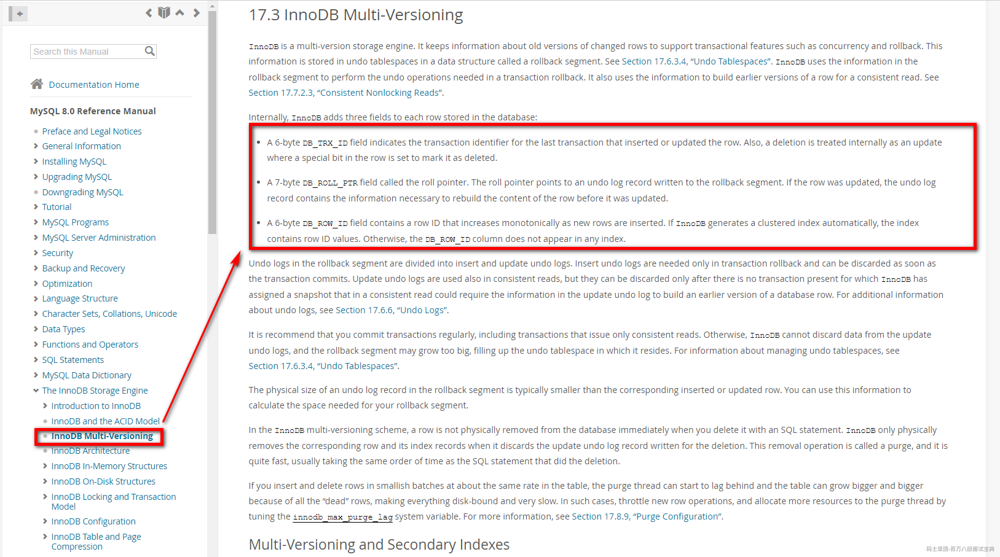

### 1.3 undo log存储的数据结构

> 比如现在有一张user表，里面有id，name两个字段。现在数据存在一条，id = 1，name = 张三
>
> 如果，现在长这样
>
> 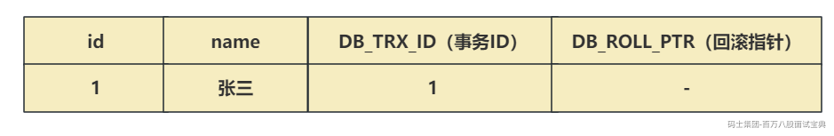
>
> 现在有一个事务ID为2，要修改这个数据，将name修改为李四
>
> - 获取互斥锁
>
> - 需要先将当前数据行复制到undo log中，作为旧版本。
>
> - 复制完毕后，将张三修改为李四，并且将DB\_TRX\_ID修改为2，并且将回滚指针指向undo log里的旧版本
>
> - 提交事务后，释放锁。
>
> 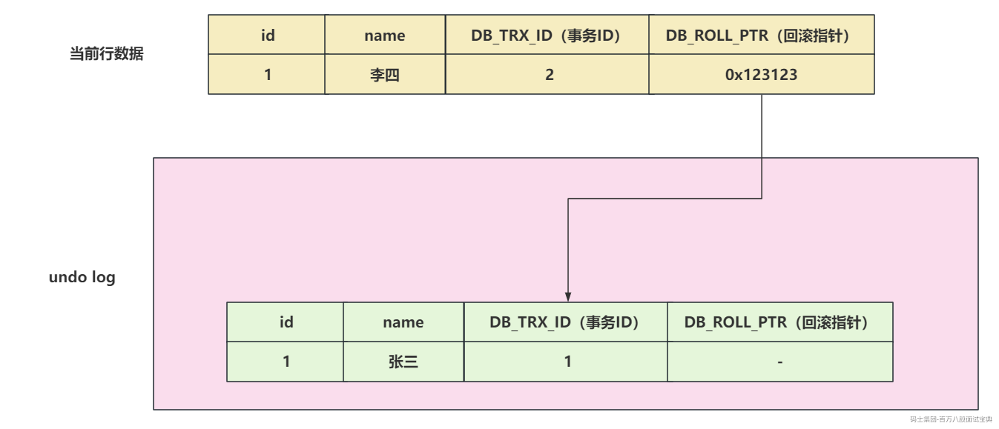
>
> 现在又来了一个事务ID为3，修改这行数据，将李四修改为王五
>
> - 获取互斥锁
>
> - 需要先将当前数据行复制到undo log中，作为旧版本。
>
> - 复制完毕后，将李四修改为王五，并且将DB\_TRX\_ID修改为3，并且将回滚指针指向undo log里的旧版本
>
> - 提交事务，释放锁
>
> 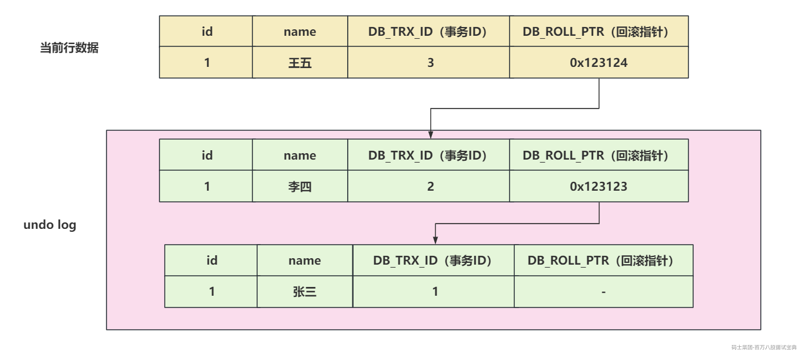

### 1.4 Read View内部结构存储了个啥？

> Read View其实和快照是一个意思。
>
> Read View是读操作中的可见性判断的核心，也就是当前事务能不能读取undo log中的某行数据以及当前行数据。Read View内部还维护的很多的属性以及逻辑。
>
> 在开启事务后， **执行第一个select操作后** ，会创建一个Read View，也就是快照。
>
> 在Read View中会保存不应该被当前事务看到的，其他 **活跃事务的列表** 。
>
> 当用户在这个事务中要读取某行记录时，InnoDB会将该行的 **DB\_TRX\_ID** 和 **Read View** 中的一些变量去做比较，判断当前数据能否查看到。
>
> 要查看一下Read View 里面的存储结构信息。
>
> <https://github.com/facebook/mysql-8.0/blob/8.0/storage/innobase/include/read0types.h>
>
> 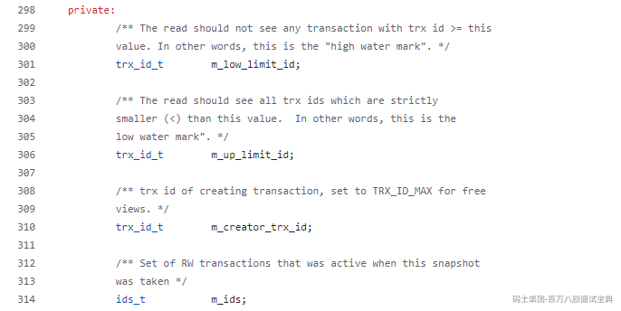
>
> 这四个属性中，分别聊一下：
>
> - **m\_creator\_trx\_id：** 当前事务的TRX\_ID，也就是事务ID
>
> - 人话：当前事务的ID，当前事务要创建这个Read View快照。
>
> - **m\_ids：** 创建快照时，处于活跃事务的ID集合。
>
> - 人话：未提交事务的事务的集合。因为事务没提交，所以这里的数据是不可见的。并且活跃事务列表不会记录当前事务。
>
> - **m\_low\_limit\_id：** 读取时不应看到任何trx id>=此值的事务。换句话说，这是“高水位线”
>
> - 人话：当前行数据的事务ID，大于等于m\_low\_limit\_id，数据是不可见的。说白了，当前事务在创建Read View快照时，这个事务他还没开始呢，他的数据必然是不可见的。通过查看m\_low\_limit\_id的赋值，**可以得知他是还未被分配的事务的最小事务ID** ，**其实就是最大活跃事务 + 1。**
>
> - **m\_up\_limit\_id：** 读取应该看到所有严格小于（<）此值的trx id。换句话说，这是低水位线”
>
> - 人话： **他是活跃事务列表中的最小事务ID** ，比这个事务ID还要小的值，他事务必然已经提交了，所以如果当前行数据的事务ID 小于 m\_up\_limit\_id，我是可见的。如果活跃事务列表为空，m\_up\_limit\_id = m\_low\_limit\_id。
>
> 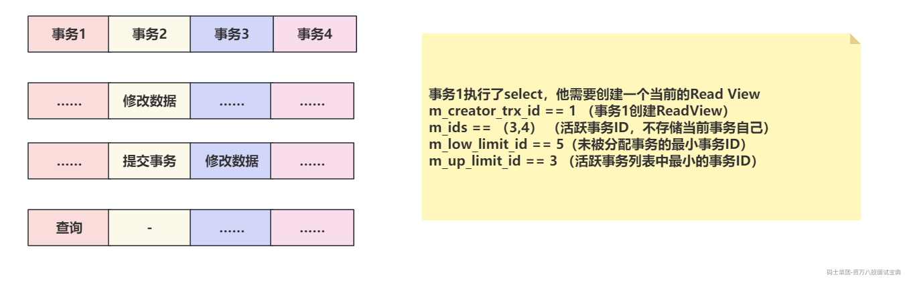
>
> **在RC的隔离级别下，每次执行select操作时，都会创建一个全新的Read View。**
>
> **在RR的隔离级别下，只有第一次select操作时，会创建Read View，后续再查询，都基于第一次的Read View做可见性判断。**

### 1.5 ReadView可见性判断的逻辑

> 在源码中，可以看到可见性判断的逻辑
>
> 各种例子：
>
> 1、id < up\_limit\_id，直接可见。
>
> 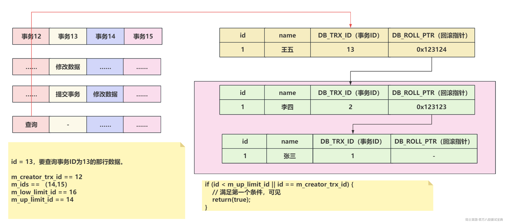
>
> 2、RC隔离级别下，第二次查询会重新创建Read View，可以读取到刚刚提交事务的数据
>
> 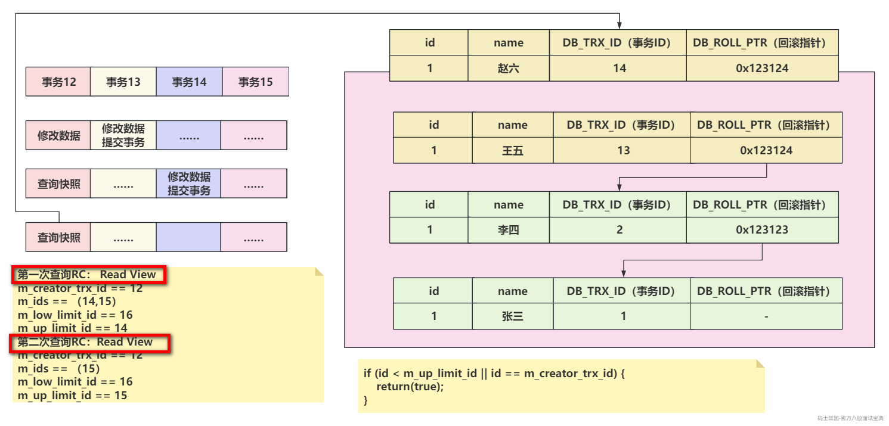
>
> 3、RR隔离级别下，第二次查询不会重新构建Read View，新数据不可见。
>
> 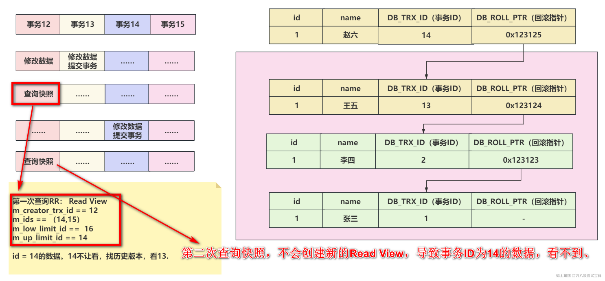
>
> 4、当前行事务ID不在活跃事务列表中。
>
> 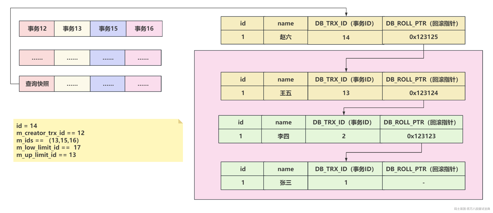

```plain
// id参数，是你想查看的那行数据的事务ID
bool changes_visible(
    trx_id_t		id, const table_name_t&	name) const MY_ATTRIBUTE((warn_unused_result)){
    ut_ad(id > 0);
    // m_up_limit_id 是活跃事务的最小id，如果当前行的事务ID，小于m_up_limit_id，说明这个事务必然已经提交了，这个数据是可见的。
    // 如果当前行的事务ID和当前创建ReadView的事务ID相等，说明就是当前事务修改的数据，必然可见。
    if (id < m_up_limit_id || id == m_creator_trx_id) {
        return(true);
    }

    check_trx_id_sanity(id, name);
    // 当前行的事务ID，大于了m_low_limit_id，必然不可见。创建Read View的时候，m_low_limit_id这个事务还没有呢。
    if (id >= m_low_limit_id) {
        return(false);
    // 没有活跃事务，并且当前行数据的事务ID，还小于m_low_limit_id，那这个数据必然可见。
    } else if (m_ids.empty()) {
        return(true);
    }

    const ids_t::value_type*	p = m_ids.data();
    // 如果上述情况都不满足，无法判断可见还是不可见，此时需要拿着当前行的事务ID，以及活跃事务列表开始判断。
    // 1、如果我发现当前行的事务ID，在活跃事务列表中。此时在Read View来说，这个事务没提交，不可见。
    // 2、如果我发现当前行的事务ID，不在活跃事务列表中，说明创建Read View时候，你就提交了，可见。
    return(!std::binary_search(p, p + m_ids.size(), id));
}
```

---

|  |  |
| --- | --- |
| 事务A | 事务B |
| 查询数据 |  |
|  | 修改了这个数据，并且提交事务 |
| 再次查询数据 |  |

事务A，能传到事务B提交的数据么？

面试被问到的话，先问是RC还是RR的隔离级别。~~~

## 二、MySQL主从同步的原理

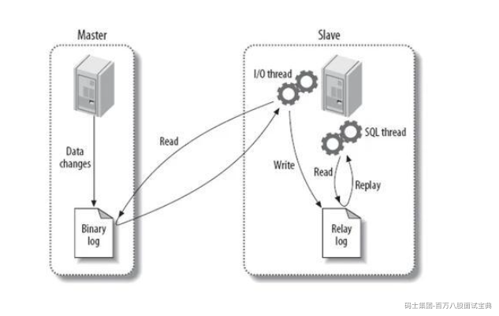

> MySQL的主从同步的过程中，要从几个维度聊。
>
> - 你的Master在做写操作时，会将写操作记录到bin log中。
>
> - 你的Slave从库会监听Master节点中的bin log的变化，如果有变化。
>
> - Slave需要主动的找Master节点要bin log中的数据，发起请求
>
> - Master会将bin log的内容发送给Slave。
>
> - Slave接收到bin log信息后，不会立即同步，会扔到relay log中缓冲一下。
>
> - Slave再从Relay log中将数据同步到Slave中。

## 三、MySQL主从同步必然有延迟，怎么办？

只能尽量的减少延迟，想解决的话，同步的成本很高。

如果必须要数据强一致，那就不能用主从的效果，自己搞一个众生平等的套路。

让写数据的时，同步写到多个MySQL节点中，都成功才成功！但是这样，写操作的效率必然大打折扣！（基本没有这么干的）

但是一般情况下，大多是尽可能的提升主从同步的效率。。。

- 优化查询等其他操作，让出服务器资源，避免影响同步时的资源被占用…………

- 规避大事务，别一次同步大量数据，这个成本也高…………

- MySQL从库同步时，可以指定多线程同步，提升效率：<https://dev.mysql.com/doc/refman/8.0/en/replication-options-replica.html#sysvar_replica_parallel_workers> （搜workers）

- bin log同步可以指定具体的库，减少不必要的同步操作。<https://dev.mysql.com/doc/refman/8.0/en/replication-options-replica.html#--replicate-do-db> （搜do-db）

- 服务器的资源给力点，网络的带宽大一点，磁盘必然上固态，多多监控一下，如果有延迟时间长的点，排查一下………………

- 半同步复制的套路………………
