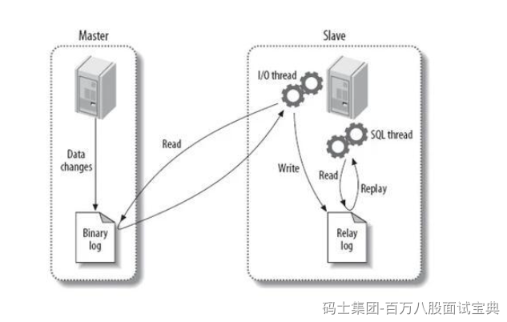

> MySQL的主从同步的过程中，要从几个维度聊。
>
> - 你的Master在做写操作时，会将写操作记录到bin log中。
> - 你的Slave从库会监听Master节点中的bin log的变化，如果有变化。
>
> - Slave需要主动的找Master节点要bin log中的数据，发起请求
> - Master会将bin log的内容发送给Slave。
>
> - Slave接收到bin log信息后，不会立即同步，会扔到relay log中缓冲一下。
> - Slave再从Relay log中将数据同步到Slave中。
