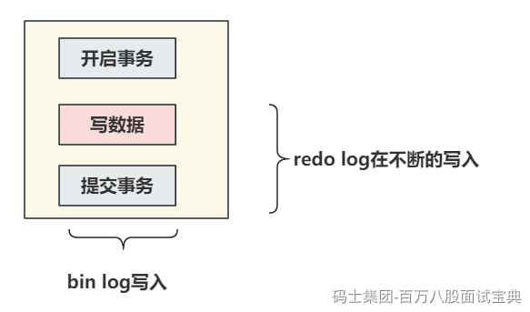
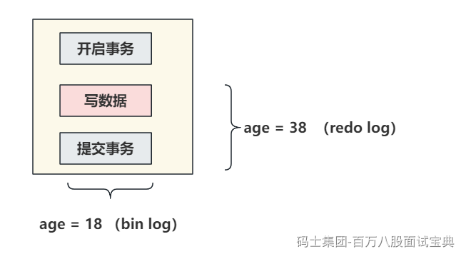
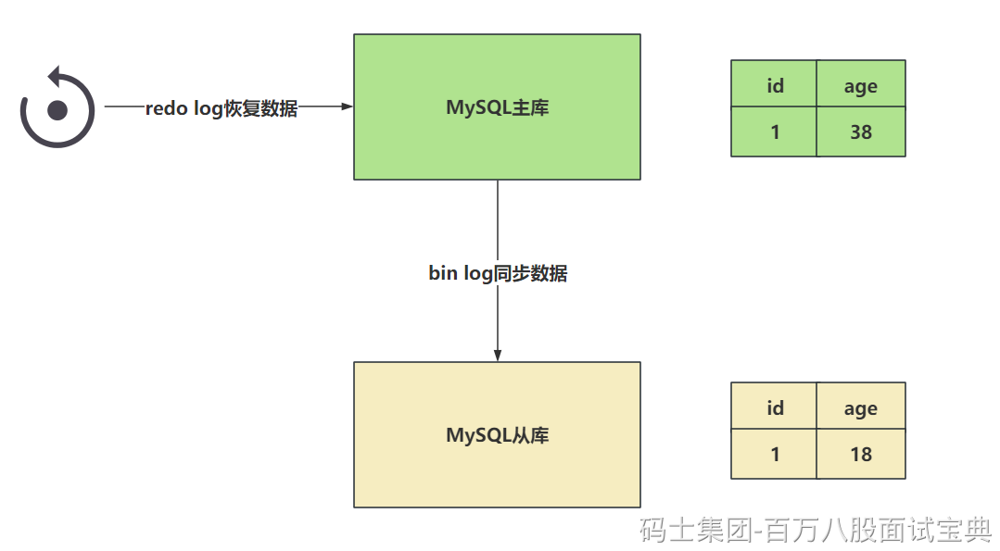

### MySQL为啥要有2PC？

> 看到这个词，第一个想到的应当是分布式事务的一些解决方案。在MySQL中也存在一个类似的问题，也是关于数据不一致的点。在恢复数据时，单单看redo log或者单看bin log都会存在问题。恢复时，这哥俩都需要看一下，其中以bin log为主。
>
> redo log让InnoDB存储引擎拥有了崩溃恢复的能力。
>
> bin log保证MySQL集群架构的数据一致性。
>
> 虽然他们都属于持久化的保证，但是侧重点还有一些不同的。
>
> 举个栗子：
>
> 在执行更新操作时，并且有事务操作时，会记录redo log和bin log两个文件，redo log在事务的执行过程中就会 **不断的写入** 。而bin log只有 **提交事务的时候写入** ，才会执行write操作以及fsync的操作落到磁盘中。
>
> 
>
> 如果redo log和bin log在记录日志时，他们之间的数据不一致，会出现问题？
>
> 举个具体的栗子：
>
> 现在执行update语句，假设id = 1的一行数据，字段age是18，在执行修改操作，将age修改为38。
>
> `SQL：update table set age = 38 where id = 1`
>
> 假设redo log在没提交事务的时候，就将 **age = 38** 持久化到了redo log文件中
>
> 但是因为事务没正常提交，发生了异常，数据没有落到bin log中，bin log还是之前的 **age = 18** 。
>
> 
>
> 之后，MySQL崩溃了。此时重启MySQL需要恢复数据。
>
> 此时主库和从库可能就会出现数据不一致的问题。
>
> 
>
> 此时就需要2PC来帮助咱们解决这个问题。。。

### MySQL的两阶段提交如何解决的上述问题？

> 原理非常的简单，就是将redo log的写入拆成了两个部署 **prepare** 和 **commit** ，这就是两阶段提交。
>
> 事务还未提交时，redo log中的数据是prepare阶段，而当你真正的提交了事务之后数据才是commit阶段。
>
> 
>
> 在知道两阶段提交的效果之后，写入bin log时发生异常也不会与影响。
>
> 因为MySQL根据redo log日志恢复时，查看一下redo log中的提交状态， **如果是prepare阶段，并且在bin log中没有对应内容** ，这个数据会被回滚。
>
> 下一个例子，如果现在redo log在设置日志状态为commit时，出现了异常，但是bin log正常的写入到了系统文件中。
>
> 现在出现了这个情况，redo log存储了age = 38，但是是prepare阶段。 bin log中存储了age = 38。
>
> 这种情况，就是发现age = 38再redo log是prepare阶段，但是发现bin log中有完整的数据，那么此时这个数据不会回滚，会按照bin log的数据同步。
>
> 
>
> **在恢复数据时，以bin log为主。**
