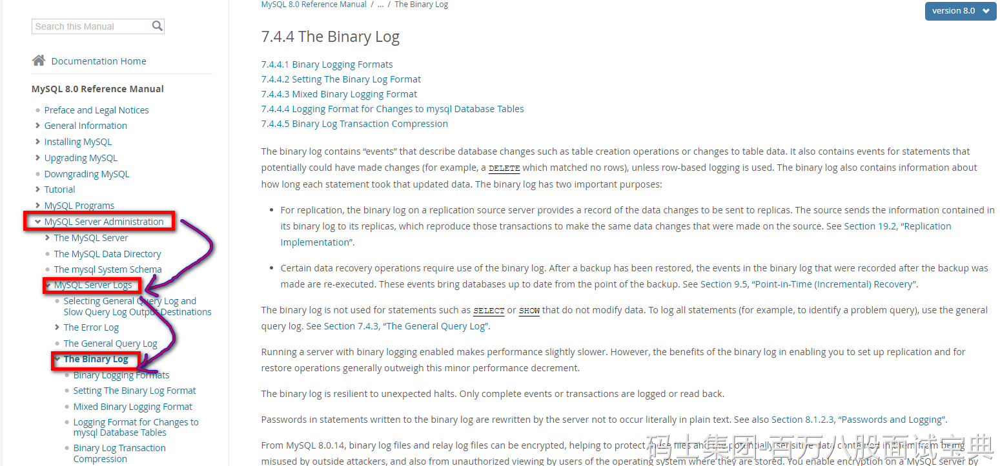

bin log不是属于某一个存储引擎的日志，他是MySQL服务层的一个日志文件。

可以在MySQL官方文档里看到全程Binary Log

bin log是逻辑日志，记录的内容是你执行的一个语句的原始逻辑，类似给 **ID = 1这一行的 age字段 加1。**

MySQL数据库的 **数据备份，主从同步，崩溃恢复** 这些操作都基于bin log去实现的，需要依赖bin log做数据的同步，保证数据的一致性。
