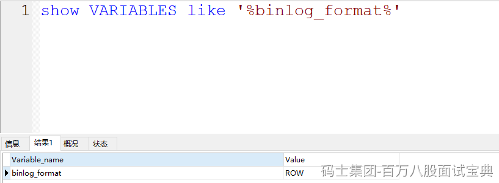

通过官方文档可以看到，bin log提供了三种格式来存储信息。 通过 binlog\_format指定存储的形式

**statement：** 如果指定statement记录，会记录的内容是 **SQL语句的原文** ，比如你在修改语句中涉及到了一些函数，比如 **now()**，在恢复数据时，如果是基于statement形式存储的bin log恢复的话，可能会造成重新执行 **now()** 函数，会斗导致时间会更新为当前系统时间，和原数据的时间 **不一致** 。

**row（默认）：** 这个是默认的，他记录的内容不但具备SQL语句的内容，还会记录 **当前行的具体数据** ，他不会有函数之后的时间不一致的问题。 他记录的内容 **不会存在不一致** 的问题，但是他需要记录的内容更多，**占用的空间也会更大** ，自然同步的时候，需要的时间也就更多……

**mixed：** mixed类似是在statement和row中做了一个 **权衡** ，如果设置为mixed，他会基于MySQL服务自行判断，当前数据是否会引起不一致的问题，如果没有不一致问题，用statement方式，如果可能存在不一致的问题，那就使用row。
