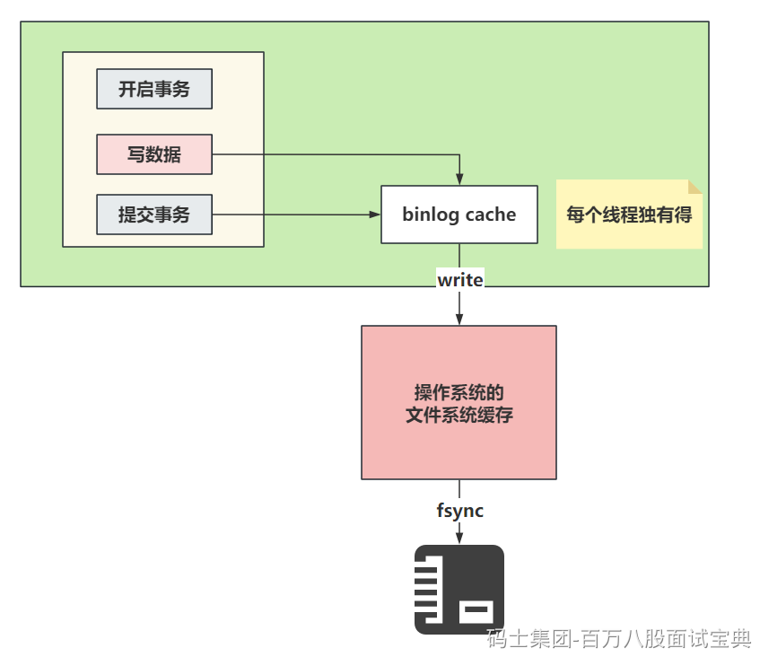

> bin log存储日志文件到磁盘的套路和redo log有点类似，在InnoDB中，也会和事务挂钩，同时bin log也有一个binlog cache的东西。在事务提交后，会将binlog cache中的内容存储到bin log文件中。
>
> 因为一个事务中的bin log不能拆，无论多大的事务，也要保证一次性写入，所以MySQL会给每一个线程分配一块binlog cache的空间。
>
> binlog cache的大小咱们可以自己指定，发现，binlog\_cache\_size的空间不大，就32kb，如果一个长事务，或者涉及 到操作的数据比较大，一个binlog\_cache\_size的空间不足，怎么办？
>
> 不用怕，如果查过了binlog\_cache\_size的空间，他会自动再次扩容内存，但是会有一个限制，不能超过max\_binlog\_cache\_size这个参数的值，但是这个参数的值，贼大，基本不用考虑长事务或者数据量大的操作导致binlog\_cache\_size爆炸的问题………… 当然，咱们也要尽可能的规避这种长事务的情况……
>
> 

---

> 关于binlog cache的整体写入文件系统的流程：
>
> 
>
> 关于binlog cache中的数据什么时候写入到磁盘，是根据配置决定的：
>
> 
>
> 整个同步的配置默认值是1，在官方也看到可以设置为0
>
> - 0：设置为0时，表示每次提交事务都只会做write操作，将binlog cache中的数据甩到系统的内存中，至于系统什么时候执行fsync持久化到磁盘，由系统自行控制。
> - 1（默认值）：设置为1时，标识每次提交事务都会执行fsync操作，确保binlog cache中的数据一定能落到本地的磁盘中。数据是完整的。
> - 最后一个方式就是可以设置为大于1的值N，几都成。这种方式每次提交事务都会做write操作，当积累了N个事务才会主动的去做fsync操作。最惨的情况，就是丢失了N个事务的数据。优点就是，可以解决一部分IO瓶颈的问题。
