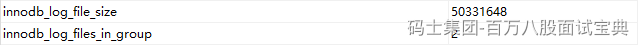
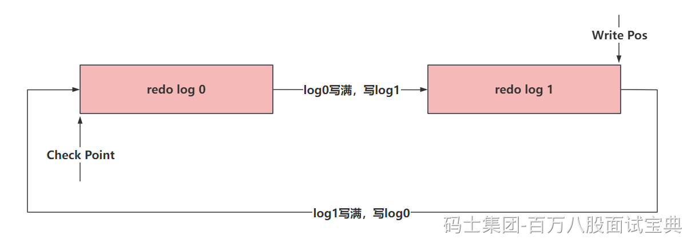

redo log可以在本地磁盘中直接看到

通过这个文件，可以看到，redo log是一个文件组的形式存在的，5.7里默认是2个文件，可以配置为多个文件。每个文件的大小是一样的。

默认情况下，可以看到，我现在环境里的redo log都存满了，默认大小是48M。

其实在写入数据到redo log文件中时，为了提升他的写入性能，他的特点是 **顺序写** 的操作。

在写redo log文件的时候，他会有两个指针

- write pos（应该没问题）：是记录当前要写入的位置，一边写入，这个指针一边往后移动
- check point：记录当前要擦除的位置，一边删，一边往后移。

比如，模拟两个文件组的形式。

