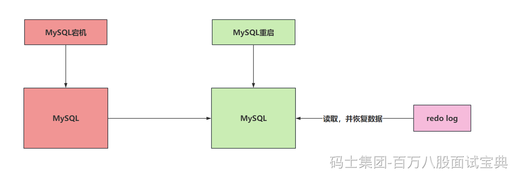
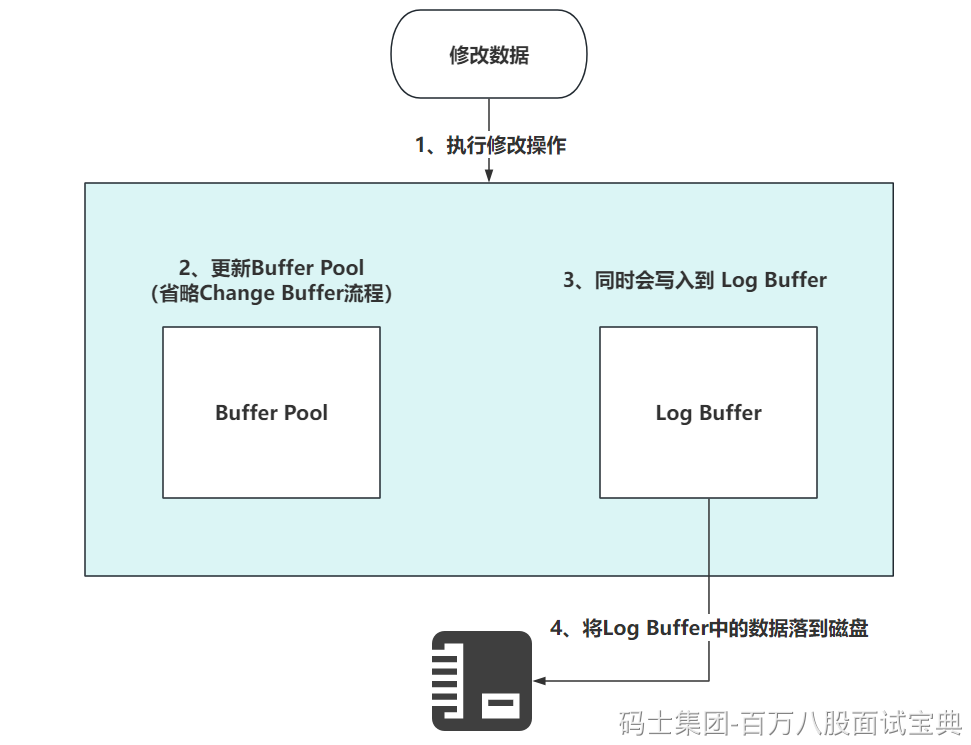
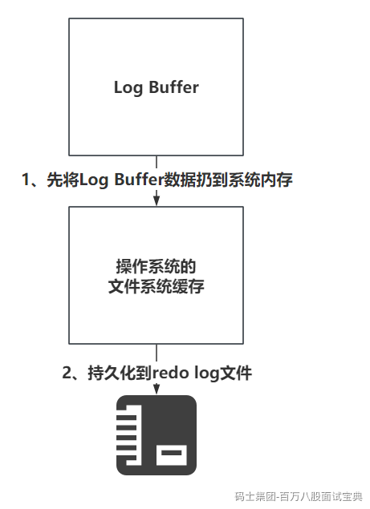
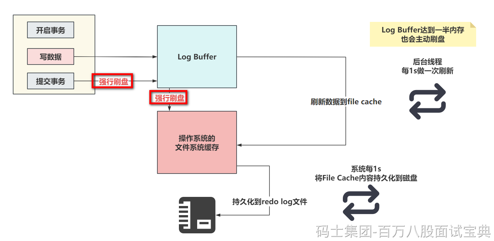

### redo log是个啥？

> redo log（重做日志）是InnoDB独有的。它让MySQL用于了崩溃回复的能力（一般配合bin log）。也就是MySQL宕机后，他可以根据redo log来恢复近期的数据，保证之前还没有写入到磁盘中的数据不会丢失，保证持久性和完整性。
>
> 

### redo log如何保证数据的完整。

> 首先，现在知道一个事情，MySQL写操作不会立即将数据落到磁盘上，无论是数据还是日志。
>
> 比如数据，他优先走Change Buffer以及Buffer Pool的内存中，也是MySQL优化的手段，减少IO的消耗。
>
> 所有，为了保证数据的完整和持久性，在修改Change Buffer和Buffer Pool中的数据时，数据会优先落到redo log中。
>
> 写入的流程，如下
>
> 
>
> 我只需要知道第4步的触发时机即可。
>
> **redo log大概存储表空间号 + 数据页号 + 偏移量 + 具体修改的数据………………**
>
> 而Log Buffer中的数据刷到磁盘中，一般主要由这个参数控制
>
> 
>
> 他的默认值是1。他可以提供三种值：
>
> - 0： 设置为0的时候，表示每次事务提交不刷盘……
> - 1： （默认值）设置为1的时候，表示每次事务提交后，会立即进行刷盘操作……
> - 2：设置为2的时候，标识每次事务提交，我需要将Log Buffer中的数据刷到系统内存中……
>
> 就用1，别用别的，别的会导致丢失数据…………
>
> 刷盘的流程大致长这样
>
> 
>
> 下面详细的把，0，1，2的配置的刷盘套路各画一个图。
>
> - 当设置为0的时候，没有任何机制会主动刷新，只能靠后台提供的一个线程，每一秒刷新Log Buffer数据到File Cache
> - 当设置为1的时候，只要提交事务，就一定会确保Log Buffer中的数据，落到File Cache并且，必须序列化到本地磁盘文件
> - 设置为2时，提交事务后，会确保Log Buffer的数据，一定要了File Cache中。
