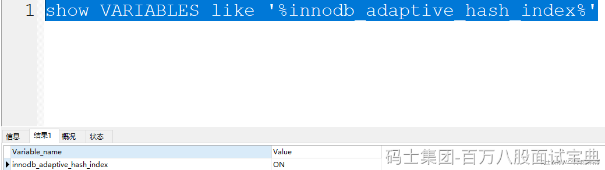
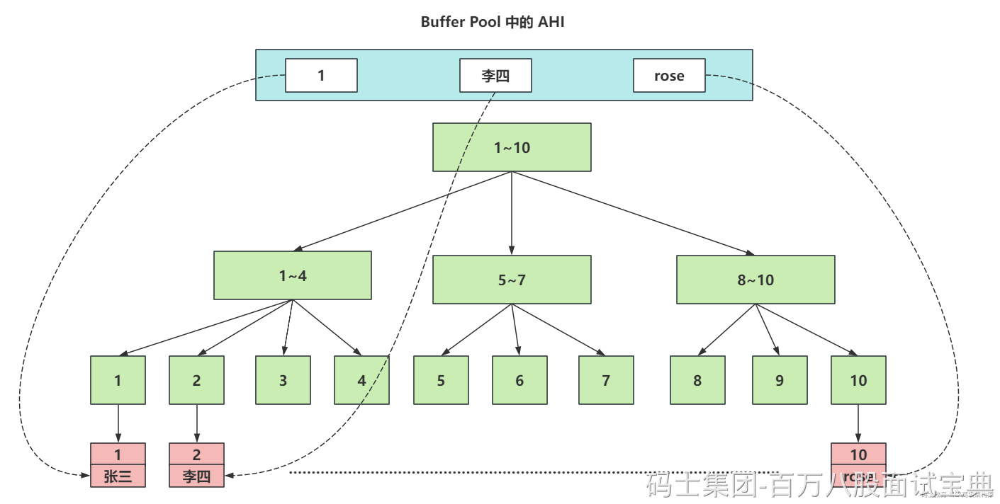

### ​

> AHI（自适应Hash索引，Adaptive Hash Index），他是InnoDB存储特有的。是一个为了优化查询操作的特殊功能。
>
> 当AHI发现某些索引值使用的非常的频繁，建立hash索引来提升查询的效率。
>
> AHI也是存储再Buffer Pool中的，会在Buffer Pool中开辟一片区域，建议这种自适应hash索引。
>
> 而且AHI默认是开启的。
>
> 
>
> 画一个图，掌握这种AHI是啥效果。
>
> 
>
> AHI的一些参数，不需要做任何调整，默认即可。 在生成AHI的自适应Hash索引后，查询效率可以从B+Tree结构的 `O(logn)` 提升到 `O(1)` 的效率。
