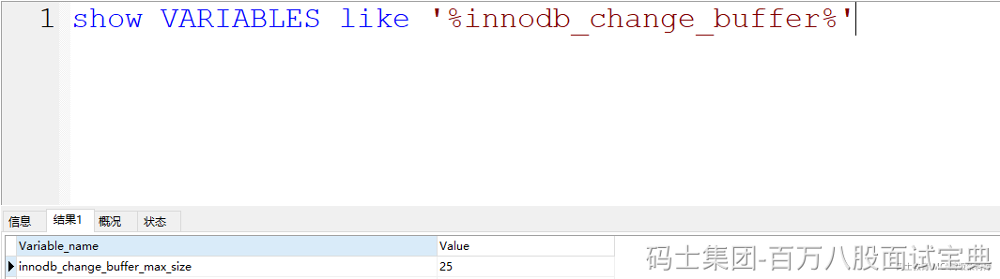
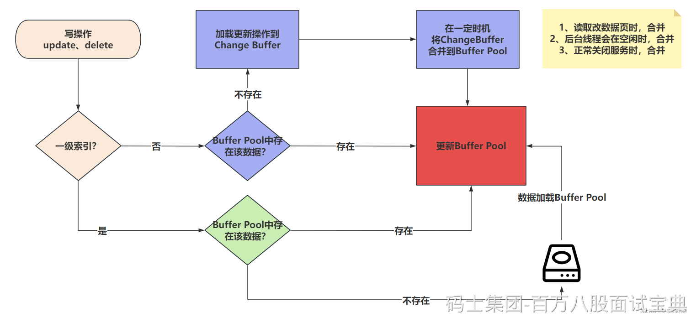

### Change Buffer是个啥？

> Change Buffer是针对MySQL中，使用二级索引（非聚簇索引）去写数据时优化的一个策略。是在进行DML操作时的一个优化。
>
> 如果写的是 **非聚簇索引** ，并且对应的 **数据页没有在Buffer Pool** ，此时他不会立即将磁盘中的数据库页加载到Buffer Pool中。而是先将写操作扔到Change Buffer中，做一个缓冲。
>
> 等后面，要修改的这个数据页被读取时，再将Change Buffer中的记录合并到Buffer Pool中。**这样就是为了减少磁盘IO次数，提高性能。**
>
> **一级索引不会触发Change Buffer，一级索引速度快，直接把磁盘数据扔到Buffer Pool中，然后内存修改即可。**
>
> Change Buffer占用的是Buffer Pool的空间，默认占用25%，最大允许到50%。可以根据配置来进行调整。一般25%足够了，除非你的MySQL写多读少，可以适当调大Change Buffer的比例。
>
> 
>
> 二级索引修改整体流程：
>
> - 更新一条记录时，当该记录在Buffer Pool缓冲区中时，直接在Buffer Pool中修改对应的页，一次内存操作。（end）
> - 如果该记录不在Buffer Pool缓冲区中时，在不影响数据一致性的前提下，InnoDB会将这些更新操作缓存在Change Buffer中，不去磁盘做IO操作。。
> - 当下次查询到该记录时，会将这个记录扔到Buffer Pool，然后Change Buffer会将和这个也有关的操作合并，进行修改。
>
> 

### 数据到ChangeBuffer后，MySQL宕机了咋整？

> 首先要清楚，当一个事务提交时，InnoDB会将事务的所有更改记录写到redo log（重做日志）中，包括哪些写入到Change Buffer中的内容。咱们的保障是基于redo log实现的，即便宕机，redo log也有完整的信息。当前MySQL还会基于bin log利用2PC的形式，确保数据一致性。
