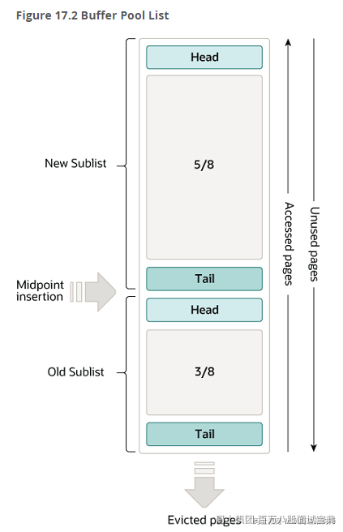

> Buffer Pool毕竟是存在在内存里面的，内存空间有限，所以无法将所有数据都扔进来，需要提供一些机制实现内存淘汰的策略。
>
> 存储结构是将整个Buffer Pool分为了两大块区域。
>
> - New SubList：占用Buffer Pool的5/8的大小
> - Old SubList：占用Buffer Pool的3/8的大小
>
> 内部的数据都是页，页直接是基于 **链表连接** 的。
>
> 其次关于数据写入和淘汰的策略其实也很简单，他使用的机制是 **LRU** （最近最少使用的就被干掉！）
>
> 当需要将从磁盘中获取的页存储到Buffer Pool时，会先将这个页的数据存放到Old SubList的head位置。
>
> 当某个页的数据被操作（读写）了，就会放到New SubList的head位置。
>
> 如果某个页没有被操作（读写），慢慢的就会被放到Old SubList的tail位置。
>
> 当我需要再次将一个新的页，存放到Buffer Pool时，如果空间不足，会将Old SubList的tail位置的页淘汰掉
>
> 
