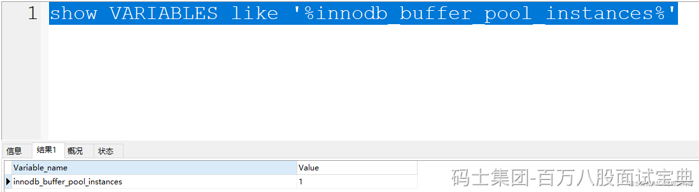

Buffer Pool是整个MySQL在InnoDB中的一个共享的内存区域，多个线程在和MySQL交互时，都会操作这个Buffer Pool的结构，会出现多线程操作临界资源（共享东西~），可能会有线程安全问题。

因为每次操作Buffer Pool中的页时，都需要将页的位置做一些移动，如果多个线程同时移动，可能会导致指针出问题。

即便这种内存动指针的操作贼快，甚至可能就是毫秒甚至是微秒级别的，但是依然存在问题。

所以线程在操作Buffer Pool时，需要基于锁的形式，拿到锁之后，才能去动Buffer Pool中的页……

So，**Buffer Pool其实是可以支持多实例的**。MySQL支持的。

MySQL中可以基于参数 `innodb_buffer_pool_instances` 去设置Buffer Pool实例的个数，默认是一个，最大可以设置为64个。并且多Buffer Pool实例需要至少给Buffer Pool设置1G的空闲才会生效。

他是将数据基于hash的形式，分散到不同的Buffer Pool实例中。多个Buffer Pool的数据是不同的！！
