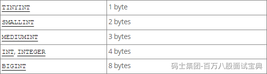
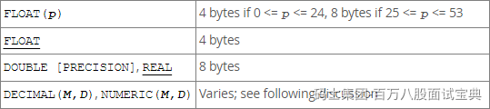
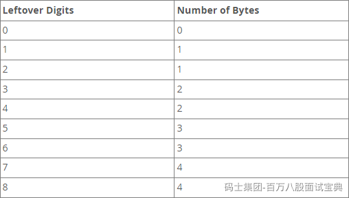

MySQL中咱们聊常见的数值、字符串、时间类型。

对于每个类型的数据的大小和一些基本区别先去掌握一下。

**数值类型：**

- 整型：主要分为了5个整型的数据类型。MySQL中的整型常用的这5种，其中根据字节咱们就可以大致对应到Java中的具体类型，其中3byte几乎很少用到。他们的区别就是存储的范围大小不一样，一般在使用数据类型的时候，**如果可以用小的，就用小的**！
- 浮点型：MySQL中常见的浮点类型就三，Float，Double， **Decimal** 其中Float和Double可以在图中很直观的看到他俩的区别。其中Float还有一个小细节，如果声明时，长度指定的太长，Float也会占用8字节，当长度25~53之间的时候。其中Decimal他并没有明确的指定他占用的大小，会根据声明时指定的(M,D)来决定大小。 decimal(18,9) [999999999.999999999]。根据官方文档可以看出，decimal中的数值是分别将整数和小数做计算。其中9个位置占4字节，细粒度的看这个表，剩余的位置，按照这个图算。  如果现在指定decimal(12,7)，整体的数字有12个长度，整数位5个（3字节），小数位7个（4字节），一共7个字节。一般推荐使用Decimal，他存储的数值相对更精准一些，而且可以根据你需要的范围大小占用不同的空间。

**字符串类型：**

- **char：** 固定长度的字符串，你指定的长度是固定的占用字节的大小。  
  其中，在官方文档中可以看到，char(M)，需要占用 **M × w个字节** ，w是你声明的字符集类型，其中常用的是utf8mb4，这哥们就代表w是4字节，如果用utf8mb3，w就代表是3字节。
- **varchar：** 可变长度的字符串，会根据你输入的内容长度来计算占用空间的字节大小。如果你写入的字符串的实际大小是0~255，那么他额外追加1个字节。如果你写入的字符串空间超过了255个字节，那需要额外追加2个字节。对于占用空间大小，当varchar大小超过了255后，其实Text和varchar没啥区别。从占用空间的维度来说，如果固定这个字段的长度一定会超过255，你有用text也一样。

**时间类型：**

- date：存储年月日
- datetime：存储年月日 时分秒
- timestamp：存储年月日 时分秒

通过官方文档看到了一个细节，MySQL中的时间类型里，time，datetime，timestamp可以存储时间，并且可以精准到秒的后6位，也就是微秒单位。想精准到秒的后几位，是需要额外的空间存储的。

其次，关于这哥三的空间占用大小，可以看这个图。

5.6.4的版本是一个分界点~fractional seconds storage的意思就是如果你要精确到秒的后几位，他需要额外占用空间，这个是上面聊的。

datetime和timestamp的区别：

- 关于存储范围的情况

- datetime：用到死，到这 `'1000-01-01 00:00:00.000000' to '9999-12-31 23:59:59.499999'`
- timestamp：用到十几年后，`'1970-01-01 00:00:01.000000'` to `'2038-01-19 03:14:07.499999'`

- 时区的区别

- timestamp：你写入的值会从当前时区转换为UTC进行存储，在查询时，会将UTC类型转换为当前系统的时区。
- datetime：不会关注时区的问题，你写入什么，他就存储什么，检索也一样。

默认情况下，每个连接的当前时区是服务器的时间，时间可以根据每个连接去设置，只要你保证时区不变，其实也没啥问题。如果你连接的时区变化了，你存储的是timestamp类型，那你再用别的时区查询这个值时，会发生变化。
