# MyBatisPlus


> MyBatis-Plus (opens new window)（简称 MP）是一个 MyBatis (opens new window) 的增强工具，在 MyBatis 的基础上只做增强不做改变，为简化开发、提高效率而生。

**官网地址：**<https://baomidou.com/>

# 一、入门案例

## 1.准备表结构和数据

  准备如下的表结构和相关数据

```plain
DROP TABLE IF EXISTS user;

CREATE TABLE user
(
    id BIGINT(20) NOT NULL COMMENT '主键ID',
    name VARCHAR(30) NULL DEFAULT NULL COMMENT '姓名',
    age INT(11) NULL DEFAULT NULL COMMENT '年龄',
    email VARCHAR(50) NULL DEFAULT NULL COMMENT '邮箱',
    PRIMARY KEY (id)
);

```

插入对应的相关数据

```sql
DELETE FROM user;

INSERT INTO user (id, name, age, email) VALUES
(1, 'Jone', 18, 'test1@baomidou.com'),
(2, 'Jack', 20, 'test2@baomidou.com'),
(3, 'Tom', 28, 'test3@baomidou.com'),
(4, 'Sandy', 21, 'test4@baomidou.com'),
(5, 'Billie', 24, 'test5@baomidou.com');

```

## 2. 创建项目

  创建一个SpringBoot项目，然后引入相关的依赖，首先是父依赖

```xml
<parent>
        <groupId>org.springframework.boot</groupId>

        <artifactId>spring-boot-starter-parent</artifactId>

        <version>2.6.6</version>

        <relativePath/> <!-- lookup parent from repository -->
    </parent>

```

具体的其他的依赖

```xml
<!-- spring-boot-starter-web 的依赖 -->
        <dependency>
            <groupId>org.springframework.boot</groupId>

            <artifactId>spring-boot-starter-web</artifactId>

        </dependency>

        <dependency>
            <groupId>org.springframework.boot</groupId>

            <artifactId>spring-boot-starter-test</artifactId>

            <scope>test</scope>

        </dependency>

        <!-- 引入MyBatisPlus的依赖 -->
        <dependency>
            <groupId>com.baomidou</groupId>

            <artifactId>mybatis-plus-boot-starter</artifactId>

            <version>3.5.1</version>

        </dependency>

        <!-- 数据库使用MySQL数据库 -->
        <dependency>
            <groupId>mysql</groupId>

            <artifactId>mysql-connector-java</artifactId>

        </dependency>

        <!-- 数据库连接池 Druid -->
        <dependency>
            <groupId>com.alibaba</groupId>

            <artifactId>druid</artifactId>

            <version>1.1.14</version>

        </dependency>

        <!-- lombok依赖 -->
        <dependency>
            <groupId>org.projectlombok</groupId>

            <artifactId>lombok</artifactId>

        </dependency>

```

## 3.配置信息

  然后我们需要在application.properties中配置数据源的相关信息

```properties
spring.datasource.driverClassName=com.mysql.cj.jdbc.Driver
spring.datasource.url=jdbc:mysql://localhost:3306/mp?serverTimezone=UTC&useUnicode=true&characterEncoding=utf-8&useSSL=true
spring.datasource.username=root
spring.datasource.password=123456

spring.datasource.type=com.alibaba.druid.pool.DruidDataSource
```

然后我们需要在SpringBoot项目的启动类上配置Mapper接口的扫描路径

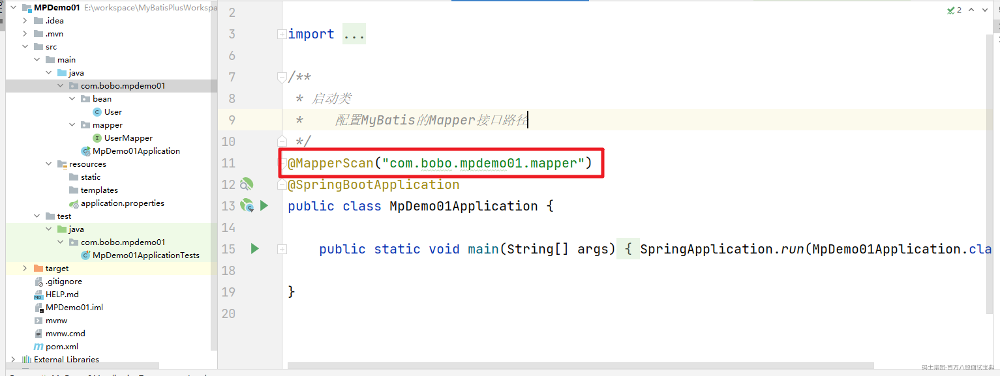

## 4.添加User实体

  添加user的实体类

```java
@ToString
@Data
public class User {
    private Long id;
    private String name;
    private Integer age;
    private String email;
}
```

## 5.创建Mapper接口

  在MyBatisPlus中的Mapper接口需要继承BaseMapper.

```java
/**
 * MyBatisPlus中的Mapper接口继承自BaseMapper
 */
public interface UserMapper extends BaseMapper<User> {
}
```

## 6.测试操作

  然后来完成对User表中数据的查询操作

```java
@SpringBootTest
class MpDemo01ApplicationTests {

    @Autowired
    private UserMapper userMapper;

    @Test
    void queryUser() {
        List<User> users = userMapper.selectList(null);
        for (User user : users) {
            System.out.println(user);
        }
    }

}

```

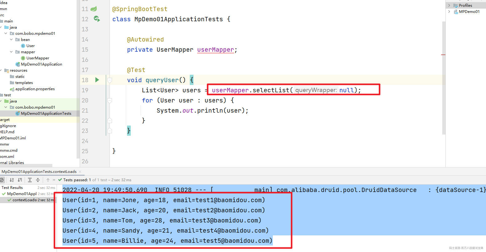

## 7.日志输出

  为了便于学习我们可以指定日志的实现StdOutImpl来处理

```properties
# 指定日志输出
mybatis-plus.configuration.log-impl=org.apache.ibatis.logging.stdout.StdOutImpl
```

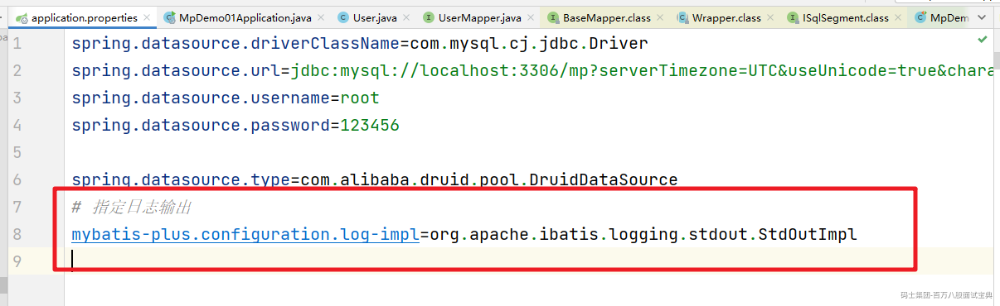

然后操作数据库的时候就可以看到对应的日志信息了：

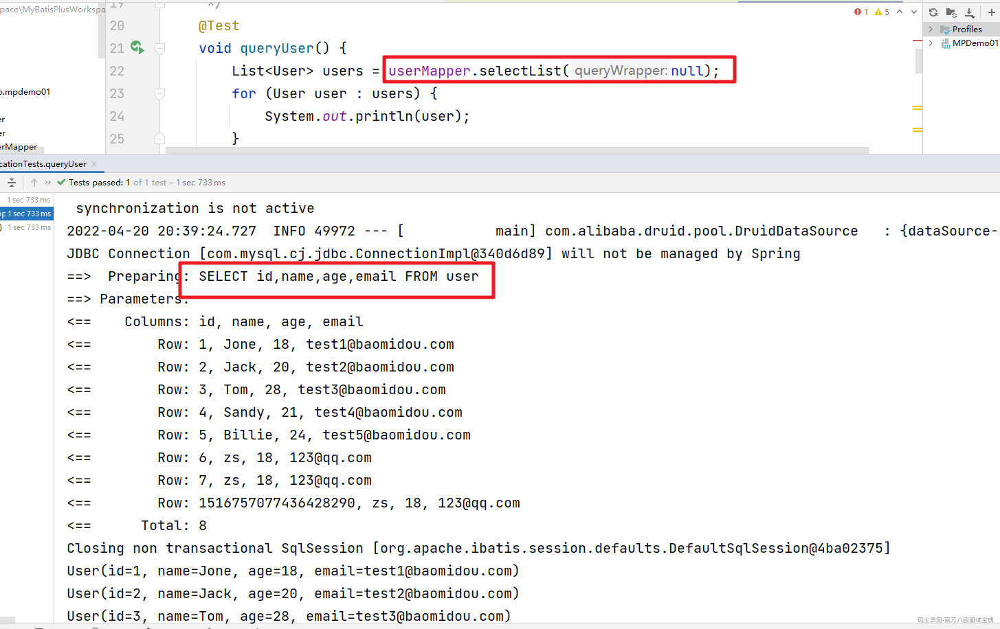

# 二、CRUD操作

## 1.插入用户

  先来看看插入用户的操作，在MyBatisPlus中给我们提供一个insert()方法来实现。

```java
    /**
     * 添加用户信息
     */
    @Test
    void addUser() {
        User user = new User(null, "zs", 18, "123@qq.com");
        int i = userMapper.insert(user);
        System.out.println("i = " + i);
    }
```

插入成功后生成的id是一长串数字：

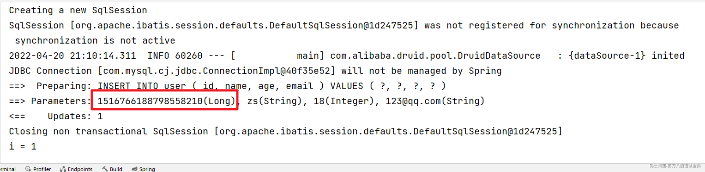

注意：在MyBatisPlus中插入数据的时候，如果id为空，默认会通过雪花算法来生成id

## 2.更新用户

  然后来看看MyBatisPlus中的更新操作。

```java
    /**
     * 更新用户信息
     */
    @Test
    void updateUser() {
        User user = new User(6l, "zs", 20, "123@qq.com");
        int i = userMapper.updateById(user);
    }
```

## 3.删除用户

  删除用户的方法在MyBatisPLUS中提供的有多个

### 3.1 根据id删除

```java
    @Test
    void deleteUser() {
        User user = new User(6l, "zs", 20, "123@qq.com");
        userMapper.deleteById(6l);
    }
```

### 3.2 批量删除

  MyBatisPlus中也支持批量删除的操作

```java
    /**
     * 批量删除
     */
    @Test
    void deleteBathUser() {
        int i = userMapper.deleteBatchIds(Arrays.asList(1l, 2l, 3l, 4l));
        System.out.println("受影响的行数:" + i);
    }
```

### 3.3 通过Map删除

根据 columnMap 条件，删除记录

```java
    /**
     * 根据 columnMap 条件，删除记录
     */
    @Test
    void deleteMapUser() {
        Map<String,Object> map = new HashMap<>();
        map.put("age",18);
        map.put("name","tom");
        int i = userMapper.deleteByMap(map);
        System.out.println("受影响的行数:" + i);
    }
```

## 4.查询操作

### 4.1 根据id查询

  首先我们可以根据id来查询单条记录

```java
    @Test
    void queryUserById() {
        User user = userMapper.selectById(1l);
        System.out.println(user);
    }
```

### 4.2 根据id批量查询

  然后也可以通过类似于SQL语句中的in关键字来实现多id的查询

```java
    @Test
    void queryUserByBatchId() {
        List<User> users = userMapper.selectBatchIds(Arrays.asList(1l, 2l, 3l));
        users.forEach(System.out::println);
    }
```

### 4.3 通过Map查询

  也可以把需要查询的字段条件封装到一个Map中来查询

```java
    @Test
    void queryUserByMap() {
        Map<String,Object> map = new HashMap<>();
        map.put("age",18);
        map.put("name","tom");
        List<User> users = userMapper.selectByMap(map);
        users.forEach(System.out::println);
    }
```

### 4.4 查询所有数据

  也可以通过selectList方法来查询所有的数据

```java
    /**
     * 查询用户信息
     */
    @Test
    void queryUser() {
        List<User> users = userMapper.selectList(null);
        for (User user : users) {
            System.out.println(user);
        }
    }
```

当然在selectList中需要我们传递进去一个Wrapper对象，这个是一个条件构造器，这个在后面会详细的讲解。

# 三、CRUD接口

官网地址：<https://baomidou.com/pages/49cc81/#service-crud-%E6%8E%A5%E5%8F%A3>

官网说明：

> - 通用 Service CRUD 封装IService(opens new window)接口，进一步封装 CRUD 采用 get 查询单行 remove 删除 list 查询集合 page 分页 前缀命名方式区分 Mapper 层避免混淆，
>
> - 泛型 T 为任意实体对象
>
> - 建议如果存在自定义通用 Service 方法的可能，请创建自己的 IBaseService 继承 Mybatis-Plus 提供的基类
>
> - 对象 Wrapper 为 条件构造器

在MyBatis-Plus中有一个接口 IService和其实现类 ServiceImpl，封装了常见的业务层逻辑

## 1.Service的使用

  要使用CRUD的接口，那么我们自定义的Service接口需要继承IService接口。

```java
/**
 * User对应的Service接口
 * 要使用MyBatisPlus的Service完成CRUD操作，得继承IService
 */
public interface IUserService extends IService<User> {
}

```

对应的Service实现得继承ServiceImpl同时指定mapper和实体对象。

```java
/**
 * Service的实现类
 * 必须继承ServiceImpl 并且在泛型中指定 对应的Mapper和实体对象
 */
@Service
public class UserService extends ServiceImpl<UserMapper, User> implements IUserService {
}
```

## 2.查询操作

  通过Service中提供的count方法可以查询总的记录数。get方法，List方法等

```java
    @Autowired
    private IUserService userService;

    @Test
    void getUserCount() {
        long count = userService.count();
        System.out.println("count = " + count);
    }
```

## 3.批量插入

  在service中给我们提供了批量插入的方法

```java
    @Test
    void saveBatchUser() {
        List<User> list = new ArrayList<>();
        for (int i = 0; i < 10; i++) {
            User user = new User(null,"a"+i,10+i,"aaa@163.com");
            list.add(user);
        }
        // 批量插入
        userService.saveBatch(list);
        // batchSize:50
        // userService.saveBatch(list,50);
    }
```

还有saveOrUpdate等方法，可自行应用。

# 四、常用注解

## 1.@TableName

> 经过以上的测试，在使用MyBatis-Plus实现基本的CRUD时，我们并没有指定要操作的表，只是在  
> Mapper接口继承BaseMapper时，设置了泛型User，而操作的表为user表  
> 由此得出结论，MyBatis-Plus在确定操作的表时，由BaseMapper的泛型决定，即实体类型决  
> 定，且默认操作的表名和实体类型的类名一致

如果表名和我们的实体类的名称不一致的话，在执行相关操作的时候会抛出对应的异常，比如数据库的表我们该为T\_USER,然后执行查询操作。

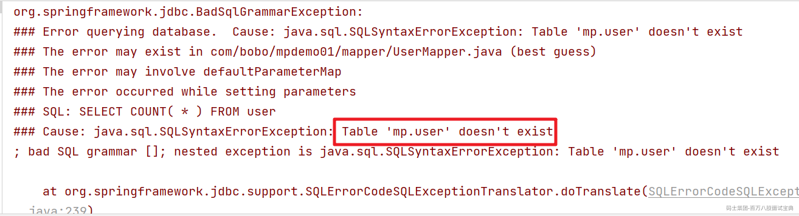

这时我们就可以通过@TableName来解决这个问题。

```java
/**
 * @TableName 标识实体类对应的表名
 */
@TableName("t_user")
@AllArgsConstructor
@ToString
@Data
public class User {

    private Long id;
    private String name;
    private Integer age;
    private String email;
}
```

  在开发的过程中，我们经常遇到以上的问题，即实体类所对应的表都有固定的前缀，例如t\_或tbl\_ 此时，可以使用MyBatis-Plus提供的全局配置，为实体类所对应的表名设置默认的前缀，那么就不需要在每个实体类上通过@TableName标识实体类对应的表.

```properties
# 指定日志输出
mybatis-plus.configuration.log-impl=org.apache.ibatis.logging.stdout.StdOutImpl
# 配置MyBatis-Plus操作表的默认前缀
mybatis-plus.global-config.db-config.table-prefix=t_
```

## 2.@TableId

  我们可以通过@TableId注解来显示的指定哪个属性为主键对应的属性，在前面的例子中默认id就是，如果我们的主键字段不是id，比如uid的话，把实体user中的id改为uid，同时表结构中的id字段也修改为uid字段。我们来看看效果。执行插入操作。

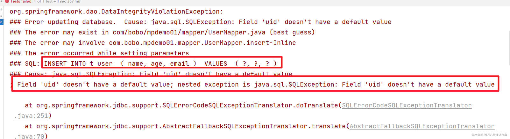

  可以看到抛出了一个 `Field 'uid' doesn't` 的异常，这时我们可以在User实体的uid属性上添加@TableId即可。

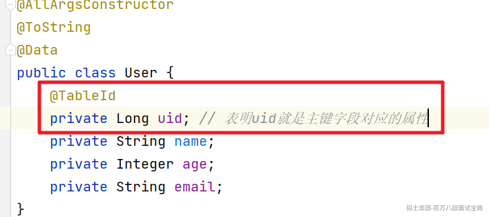

  @TableId中的value值在实体类中的字段和表结构的字段一致的情况下我们不用添加，但如果不一致，@TableId中的value我们需要设置表结构中的主键字段。

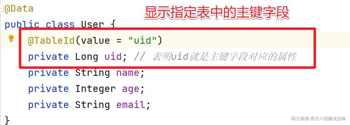

@TableId中还有一个比较重要的属性是Type。Type是用来定义主键的生成策略的。以下是官网截图

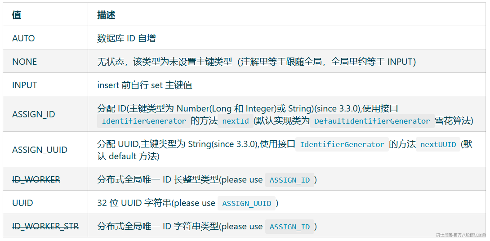

这个可以在@TableId中配置，也可以在配置文件中统一配置全局的生成策略。

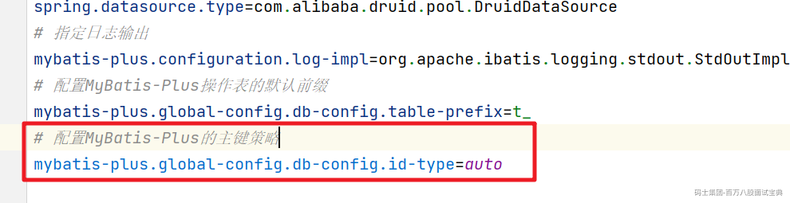

当然配置主键自增得在表结构中的字段要设置自动增长才行

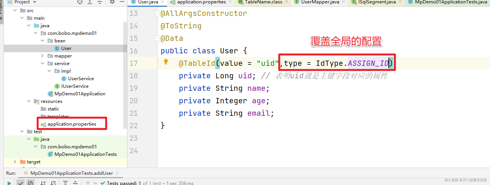

## 3.@TableField

  @TableField注解的作用是当实体类中的属性和表结构中的字段名称不一致的情况下来设置对应关系的，当然，在MyBatis-Plus中针对实体中是userName而表结构中是user\_name这种情况会自动帮助我们完成驼峰命名法的转换。

```java
@AllArgsConstructor
@ToString
@Data
public class User {
    @TableId(value = "uid",type = IdType.ASSIGN_ID)
    private Long uid; // 表明uid就是主键字段对应的属性
    @TableField("name") // 表结构中的name属性和name属性对应
    private String name;
    private Integer age;
    private String email;
}
```

## 4.@TableLogic

  @TableLogic是用来完成 `逻辑删除`操作的

|  |  |
| --- | --- |
| 删除类型 | 描述 |
| 逻辑删除 | 假删除，将对应数据中代表是否被删除字段的状态修改为“被删除状态”，&#x3c;br />之后在数据库中仍旧能看到此条数据记录 |
| 物理删除 | 真实删除，将对应数据从数据库中删除，之后查询不到此条被删除的数据 |

效果演示：先在表中创建一个is\_deleted字段

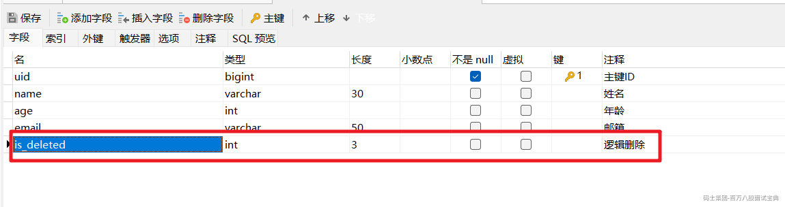

对应的在实体类中添加一个isDeleted属性

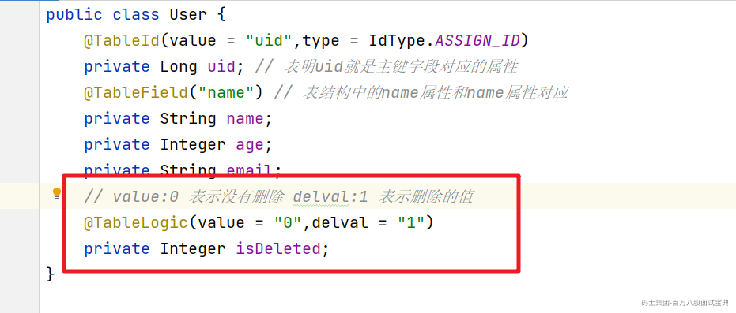

然后我们调用删除功能

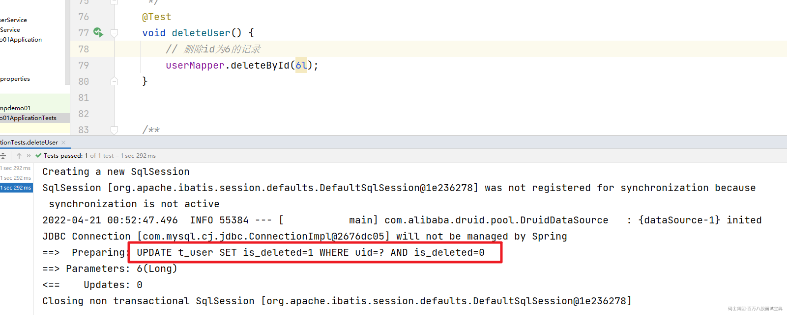

可以看到我们调用了deleteById方法，但是真实执行的是Update方法，实现了逻辑删除的场景。

**当然也可以在属性文件中配置全局的**

```plain
# 配置逻辑删除
mybatis-plus.global-config.db-config.logic-delete-field=is_deleted
mybatis-plus.global-config.db-config.logic-delete-value=1
mybatis-plus.global-config.db-config.logic-not-delete-value=0
```

# 五、条件构造器

  当我们需要对单表的CURD做复杂条件处理的时候我们就需要借助Wrapper接口来处理，也就是通过条件构造器来处理。

## 1.Wrapper接口

  Wrapper接口是条件构造的抽象类，是最顶级的类

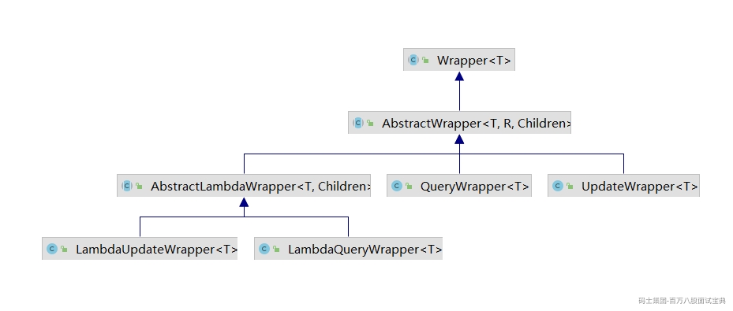

对应的作用描述

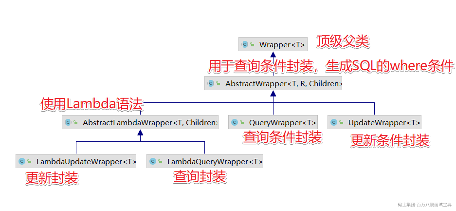

## 2.QueryWrapper

  首先来看看QueryWrapper的使用，针对where后的条件封装。

### 2.1 查询条件

```java
    /**
     * 查询用户姓名中包含 o 的年龄大于20岁，且邮箱不为null的记录
     */
    @Test
    void queryUser() {
        QueryWrapper<User> wrapper = new QueryWrapper<>();
        wrapper.like("name","o")
                .gt("age",20)
                .isNotNull("email");
        List<User> users = userMapper.selectList(wrapper);
        users.forEach(System.out::println);
    }
```

### 2.2 排序条件

  QueryWrapper也可以封装排序的条件

```java
    /**
     * 根据年龄升序然后根据id降序
     */
    @Test
    void queryUser() {
        QueryWrapper<User> wrapper = new QueryWrapper<>();
        wrapper.orderByAsc("age")
                .orderByDesc("uid");
        List<User> users = userMapper.selectList(wrapper);
        users.forEach(System.out::println);
    }
```

### 2.3 删除条件

  QueryWrapper也可以封装删除操作的条件

```java
    /**
     * 删除所有年龄小于18岁的用户
     */
    @Test
    void deleteUser() {
        QueryWrapper<User> wrapper = new QueryWrapper<>();
        wrapper.le("age",18);
        int i = userMapper.delete(wrapper);
        System.out.println(i);
    }
```

### 2.4 组合条件

  在封装条件的时候我们可以同时有多个条件组合，类似于 and 和 or的操作，这时QueryWrapper也能很轻松的处理。

```java
    /**
     * 查询出年龄大于20并且姓名中包含的有'o'或者邮箱地址为空的记录
     */
    @Test
    void queryUser() {
        QueryWrapper<User> wrapper = new QueryWrapper<>();
        wrapper.gt("age",20)
                .like("name","o")
                .or() // 默认是通过and连接 显示加上 or()方法表示or连接
                .isNotNull("email");
        List<User> users = userMapper.selectList(wrapper);
        users.forEach(System.out::println);
    }

    @Test
    void queryUser1() {
        QueryWrapper<User> wrapper = new QueryWrapper<>();
        wrapper.and((i)->{
            i.gt("age",20).like("name","o");
        }).or((i)->{
                    i.isNotNull("email");
                });
        List<User> users = userMapper.selectList(wrapper);
        users.forEach(System.out::println);
    }
```

### 2.5 查询特定的字段

  特殊情况我们需要查询特定的字段，这时可以通过select方法来处理

```plain
    /**
     * 查询出年龄大于20并且姓名中包含的有'o'或者邮箱地址为空的记录
     */
    @Test
    void queryUser() {
        QueryWrapper<User> wrapper = new QueryWrapper<>();
        wrapper.gt("age",20)
                .like("name","o")
                .or() // 默认是通过and连接 显示加上 or()方法表示or连接
                .isNotNull("email")
                .select("uid","name","age") // 指定特定的字段
        ;
        //selectMaps()返回Map集合列表，通常配合select()使用，避免User对象中没有被查询到的列值为null
        List<Map<String, Object>> maps = userMapper.selectMaps(wrapper);
        maps.forEach(System.out::println);
    }
```

### 2.6 实现子查询

  单表查询中对子查询的需求也是有的，我们来看看如何实现。

```java
    /**
     * 子查询
     * SELECT uid,name,age,email,is_deleted 
     * FROM t_user 
     * WHERE ( 
     *          uid IN (select uid from t_user where uid < 5)
     *      )
     */
    @Test
    void queryUser() {
        QueryWrapper<User> wrapper = new QueryWrapper<>();
        wrapper.inSql("uid","select uid from t_user where uid < 5")
        ;
        List<Map<String, Object>> maps = userMapper.selectMaps(wrapper);
        maps.forEach(System.out::println);
    }
```

## 3.UpdateWrapper

  当我们需要组装更新的字段数据的时候，可以通过UpdateWrapper来实现。

```java
    /**
     * 更新用户Tom的age和邮箱信息
     * UPDATE t_user SET age=?,email=? WHERE (name = ?)
     */
    @Test
    void updateUser() {
        UpdateWrapper<User> wrapper = new UpdateWrapper<>();
        wrapper.set("age",25)
                .set("email","bobo@qq.com")
                .eq("name","Tom");
        int update = userMapper.update(null, wrapper);
        System.out.println("update = " + update);
    }
```

## 4.动态SQL

  实际开发中，用户的查询条件都是动态的，我们需要根据不同的输入条件来动态的生成对应的SQL语句，这时我们来看看在MyBatisPlus中是如何处理的。

```java
    @Test
    void queryUser1() {
        String  name = "Tom";
        Integer age = null;
        String email = null;
        QueryWrapper<User> wrapper = new QueryWrapper<>();
        if(!StringUtils.isEmpty(name)){
            wrapper.eq("name",name);
        }
        if(age != null && age > 0){
            wrapper.eq("age",age);
        }
        if(!StringUtils.isEmpty(email)){
            wrapper.eq("email",email);
        }
        List<User> users = userMapper.selectList(wrapper);
        users.forEach(System.out::println);
    }
```

上面的代码是通过if来一个个判断的，看起来代码比较复杂，其实大家在前面看相关的API的时候会注意到都会有一个Condition参数

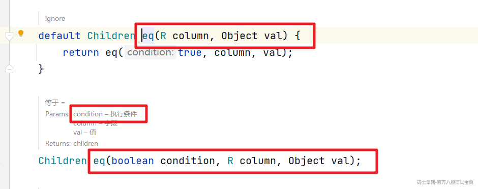

我们可以用这个参数来实现对应的动态SQL处理

```java
    @Test
    void queryUser2() {
        String  name = "Tom";
        Integer age = null;
        String email = null;
        QueryWrapper<User> wrapper = new QueryWrapper<>();
        wrapper.eq(StringUtils.isNotBlank(name),"name",name)
                .eq(age!=null && age > 0 ,"age" ,age)
                .eq(StringUtils.isNotBlank(email),"email",email);
        List<User> users = userMapper.selectList(wrapper);
        users.forEach(System.out::println);
    }
```

# 六、分页插件

  在MyBatisPlus中集成了分页插件，我们不需要单独的引入，只需要添加对应的配置类

```java
@Configuration
@MapperScan("com.bobo.mpdemo01.mapper")
public class MyBatisPlusConfig {

    /**
     * 新的分页插件,一缓和二缓遵循mybatis的规则,
     * 需要设置 MybatisConfiguration#useDeprecatedExecutor = false 避免缓存出现问题(该属性会在旧插件移除后一同移除)
     */
    @Bean
    public MybatisPlusInterceptor mybatisPlusInterceptor() {
        MybatisPlusInterceptor interceptor = new MybatisPlusInterceptor();
        interceptor.addInnerInterceptor(new PaginationInnerInterceptor(DbType.MYSQL));
        return interceptor;
    }

}
```

然后就可以测试操作了

```java
    @Test
    void queryPage() {
        Page<User> page = new Page<>(1,5);
        Page<User> userPage = userMapper.selectPage(page, null);
        System.out.println("userPage.getCurrent() = " + userPage.getCurrent());
        System.out.println("userPage.getSize() = " + userPage.getSize());
        System.out.println("userPage.getTotal() = " + userPage.getTotal());
        System.out.println("userPage.getPages() = " + userPage.getPages());
        System.out.println("userPage.hasPrevious() = " + userPage.hasPrevious());
        System.out.println("userPage.hasNext() = " + userPage.hasNext());
    }
```

# 七、代码生成器

添加依赖

```xml
<dependency>
            <groupId>com.baomidou</groupId>

            <artifactId>mybatis-plus-generator</artifactId>

            <version>3.5.2</version>

        </dependency>

        <dependency>
            <groupId>org.freemarker</groupId>

            <artifactId>freemarker</artifactId>

        </dependency>

```

快速生成：

```java
/**
 * 代码生成器
 */
public class MyFastAutoGenerator {
    public static void main(String[] args) {

        FastAutoGenerator.create("jdbc:mysql://localhost:3306/mp?serverTimezone=UTC&useUnicode=true&characterEncoding=utf-8&useSSL=true"
                , "root", "123456")
                .globalConfig(builder -> {
                    builder.author("boge") // 设置作者
                            //.enableSwagger() // 开启 swagger 模式
                            .fileOverride() // 覆盖已生成文件
                            .outputDir("D://MyBatisPlus"); // 指定输出目录
                })
                .packageConfig(builder -> {
                    builder.parent("com.bobo.mp") // 设置父包名
                            .moduleName("system") // 设置父包模块名
                            .pathInfo(Collections.singletonMap(OutputFile.xml, "D://")); // 设置mapperXml生成路径
                })
                .strategyConfig(builder -> {
                    builder.addInclude("t_user") // 设置需要生成的表名
                            .addTablePrefix("t_", "c_"); // 设置过滤表前缀
                })
                .templateEngine(new FreemarkerTemplateEngine()) // 使用Freemarker引擎模板，默认的是Velocity引擎模板
                .execute();

    }
}

```
