# Neo4J超详细教程


# 一、Neo4J相关介绍

## 1.为什么需要图数据库

  随着社交、电商、金融、零售、物联网等行业的快速发展，现实社会织起了了一张庞大而复杂的关系  
网，传统数据库很难处理关系运算。大数据行业需要处理的数据之间的关系随数据量呈几何级数增长，  
急需一种支持海量复杂数据关系运算的数据库，图数据库应运而生。  
世界上很多著名的公司都在使用图数据库，比如：

- 社交领域：Facebook, Twitter，Linkedin用它来管理社交关系，实现好友推荐

- 零售领域：eBay，沃尔玛使用它实现商品实时推荐，给买家更好的购物体验

- 金融领域：摩根大通，花旗和瑞银等银行在用图数据库做风控处理

- 汽车制造领域：沃尔沃，戴姆勒和丰田等顶级汽车制造商依靠图数据库推动创新制造解决方案

- 电信领域：Verizon, Orange和AT&T 等电信公司依靠图数据库来管理网络，控制访问并支持客户  
  360

- 酒店领域：万豪和雅高酒店等顶级酒店公司依使用图数据库来管理复杂且快速变化的库存  
  图数据库并非指存储图片的数据库，而是以图数据结构存储和查询数据。

  图数据库是基于图论实现的一种NoSQL数据库，其数据存储结构和数据查询方式都是以图论为基础的，  
图数据库主要用于存储更多的连接数据.

  图论〔Graph Theory〕是数学的一个分支。它以图为研究对象图论中的图是由若干给定的点及连  
接两点的线所构成的图形，这种图形通常用来描述某些事物之间的某种特定关系，用点代表事物，  
用连接两点的线表示相应两个事物间具有这种关系。

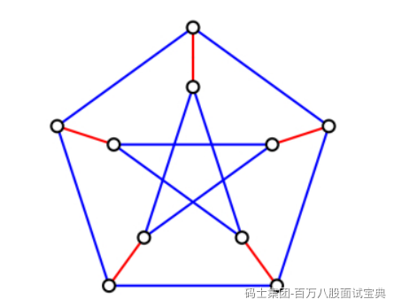

### 方案1：Google+

  使用 Google+（GooglePlus）应用程序来了解现实世界中 Graph 数据库的需求。 观察下面的图表。

在这里，我们用圆圈表示了 Google+应用个人资料。

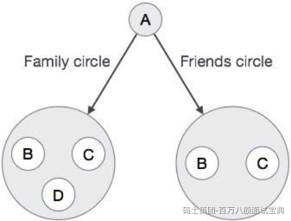

在上图中，轮廓“A”具有圆圈以连接到其他轮廓：家庭圈（B，C，D）和朋友圈（B，C）。

再次，如果我们打开配置文件“B”，我们可以观察以下连接的数据。

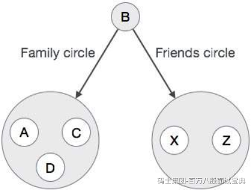

  像这样，这些应用程序包含大量的结构化，半结构化和非结构化的连接数据。 在 RDBMS 数据库中表示这种非结构化连接数据并不容易。

  如果我们在 RDBMS 数据库中存储这种更多连接的数据，那么检索或遍历是非常困难和缓慢的。

  所以要表示或存储这种更连接的数据，我们应该选择一个流行的图数据库。

  图形DBMS非常容易地存储这种更多连接的数据。 它将每个配置文件数据作为节点存储在内部，它与相邻节点连接的节点，它们通过关系相互连接。

  他们存储这种连接的数据与上面的图表中的相同，这样检索或遍历是非常容易和更快的。

### 方案2：Facebook

  利用 Facebook 应用程序了解现实世界中 Graph 数据库的需求。

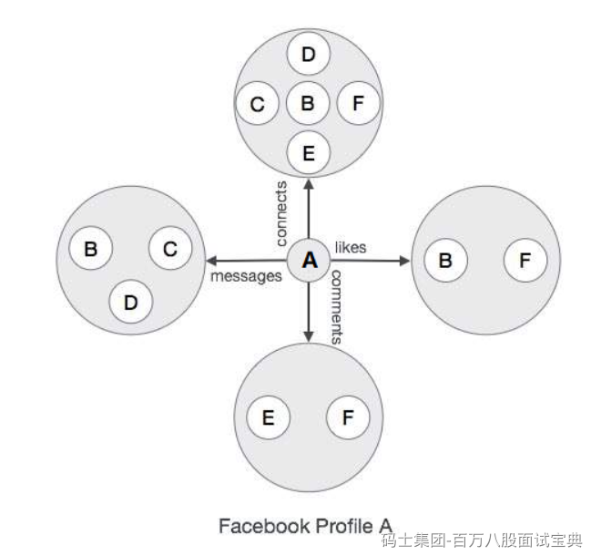

  在上面的图中，Facebook Profile“A”已经连接到他的朋友，喜欢他的一些朋友，发送消息给他的一些朋友，跟随他喜欢的一些名人。

  这意味着大量的连接数据配置文件A.如果我们打开其他配置文件，如配置文件B，我们将看到类似的大量的连接数据。

**注-** 通过观察上述两个应用程序，它们有很多更多的连接数据。 它是非常容易存储和检索，这种更连接的数据与图形数据库。

## 2.特定和优势

  关系查询性能对比 在数据关系中心，图形数据库在查询速度方面非常高效，即使对于深度和复杂的查询  
也是如此。在关系型数据库和图数据库(Neo4j)之间进行了实验：在一个社交网络里找到最大深度为5的  
朋友的朋友，他们的数据集包括100万人，每人约有50个朋友。  
实验结果如下：

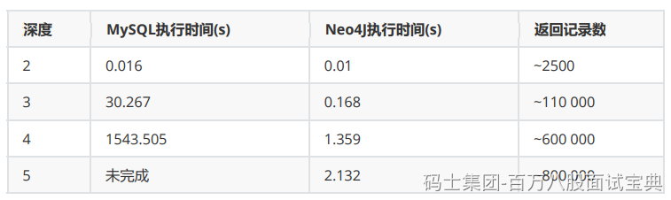

对比关系型数据库

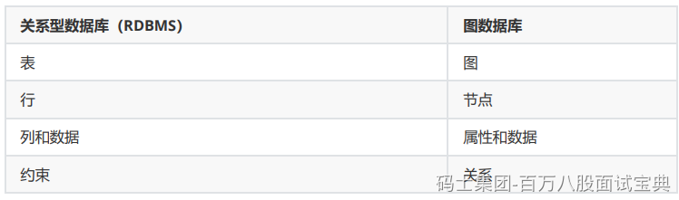

各种NOSQL对比

|  |  |  |  |  |
| --- | --- | --- | --- | --- |
| 分类 | 数据模型 | 优势 | 劣势 | 举例 |
| 键值对数据库 | 哈希表 | 查找速度快 | 数据无结构化，通常只被当作字符串或者二进制数据 | Redis |
| 列存储数据库 | 列式数据存储 | 查找速度快；支持分布横向扩展；数据压缩率高 | 功能相对受限 | HBase |
| 文档型数据库 | 键值对扩展 | 数据结构要求不严格；表结构可变；不需要预先定义表结构 | 查询性能不高，缺乏统一的查询语法 | MongoDB |
| 图数据库 | 节点和关系组成的图 | 利用图结构相关算法(最短路径、节点度关系查找等) | 可能需要对整个图做计算，不利于图数据分布存储 | Neo4j |

## 3.什么是Neo4j

  Neo4j是一个开源的NoSQL图形数据库，2003 年开始开发，使用 scala和java 语言，2007年开始发布。

- 是世界上最先进的图数据库之一，提供原生的图数据存储，检索和处理；

- 采用属性图模型（Property graph model），极大的完善和丰富图数据模型；

- 专属查询语言 Cypher，直观，高效；

官网： <https://neo4j.com/>  
Neo4j的特性：

- SQL就像简单的查询语言Neo4j CQL

- 它遵循属性图数据模型

- 它通过使用Apache Lucence支持索引

- 它支持UNIQUE约束

- 它包含一个用于执行CQL命令的UI：Neo4j数据浏览器

- 它支持完整的ACID（原子性，一致性，隔离性和持久性）规则

- 它采用原生图形库与本地GPE（图形处理引擎）

- 它支持查询的数据导出到JSON和XLS格式

- 它提供了REST API，可以被任何编程语言（如Java，Spring，Scala等）访问

- 它提供了可以通过任何UI MVC框架（如Node JS）访问的Java脚本

- 它支持两种Java API：Cypher API和Native Java API来开发Java应用程序

Neo4j的优点：

- 它很容易表示连接的数据

- 检索/遍历/导航更多的连接数据是非常容易和快速的

- 它非常容易地表示半结构化数据

- Neo4j CQL查询语言命令是人性化的可读格式，非常容易学习

- 使用简单而强大的数据模型

- 它不需要复杂的连接来检索连接的/相关的数据，因为它很容易检索它的相邻节点或关系细节没有  
  连接或索引

## 4.Neo4j数据模型

### 图论基础

  图是一组节点和连接这些节点的关系，图形以属性的形式将数据存储在节点和关系中，属性是用于表示  
数据的键值对。  
  在图论中，我们可以表示一个带有圆的节点，节点之间的关系用一个箭头标记表示。  
最简单的可能图是单个节点：

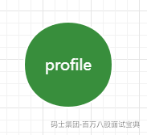

我们可以使用节点表示社交网络（如Google+（GooglePlus）个人资料），它不包含任何属性。向  
Google+个人资料添加一些属性：

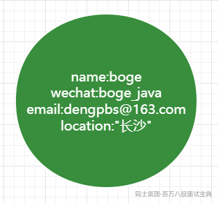

在两个节点之间创建关系：

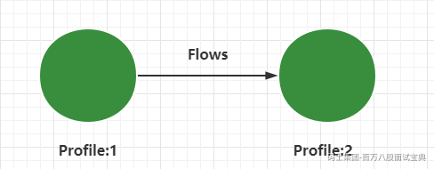

此处在两个配置文件之间创建关系名称“跟随”。 这意味着 Profile-I 遵循 Profile-II。

### 属性图模型

Neo4j图数据库遵循属性图模型来存储和管理其数据。

- 属性图模型规则

- 表示节点，关系和属性中的数据

- 节点和关系都包含属性

- 关系连接节点

- 属性是键值对

- 节点用圆圈表示，关系用方向键表示。

- 关系具有方向：单向和双向。

- 每个关系包含“开始节点”或“从节点”和“到节点”或“结束节点”

  在属性图数据模型中，关系应该是定向的。如果我们尝试创建没有方向的关系，那么它将抛出一个错误  
消息。在Neo4j中，关系也应该是有方向性的。如果我们尝试创建没有方向的关系，那么Neo4j会抛出一  
个错误消息，“关系应该是方向性的”。

  Neo4j图数据库将其所有数据存储在节点和关系中，我们不需要任何额外的RDBMS数据库或NoSQL数据  
库来存储Neo4j数据库数据，它以图的形式存储数据。Neo4j使用本机GPE（图形处理引擎）来使用它的  
本机图存储格式。  
图数据库数据模型的主要构建块是：

- 节点

- 关系

- 属性

简单的属性图的例子：

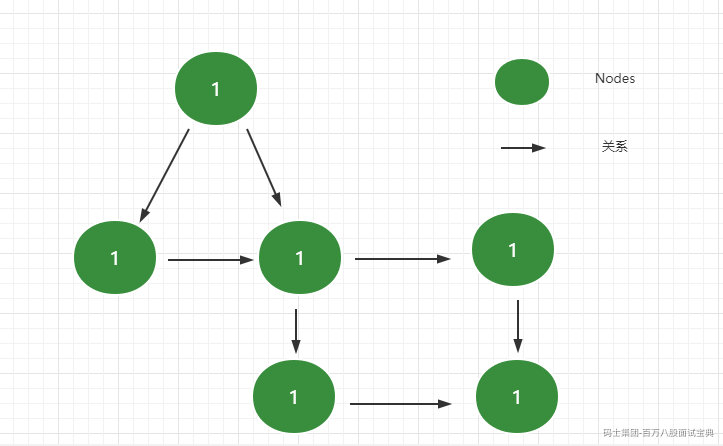

  这里我们使用圆圈表示节点。 使用箭头表示关系，关系是有方向性的。 我们可以用Properties（键值  
对）来表示Node的数据。 在这个例子中，我们在Node的Circle中表示了每个Node的Id属性。

### Neo4j的构建元素

Neo4j图数据库主要有以下构建元素：

- 节点

- 属性

- 关系

- 标签

- 数据浏览器

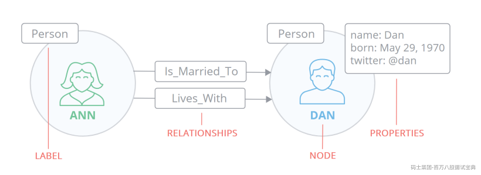

有一个或多个标签，用于描述其在图表中的作用  
**属性**  
  属性（Property）是用于描述图节点和关系的键值对。其中Key是一个字符串，值可以通过使用任何

- Neo4j数据类型来表示

- 属性是命名值，其中名称（或键）是字符串

- 属性可以被索引和约束

- 可以从多个属性创建复合索引

**关系**  
  关系（Relationship）同样是图数据库的基本元素。当数据库中已经存在节点后，需要将节点连接起来  
构成图。关系就是用来连接两个节点，关系也称为图论的边(Edge) ,其始端和末端都必须是节点，关系不  
能指向空也不能从空发起。关系和节点一样可以包含多个属性，但关系只能有一个类型(Type) 。  
关系连接两个节点  
关系是方向性的  
节点可以有多个甚至递归的关系  
关系可以有一个或多个属性（即存储为键/值对的属性）

基于方向性，Neo4j关系被分为两种主要类型：

- 单向关系

- 双向关系

**标签**  
  标签（Label）将一个公共名称与一组节点或关系相关联， 节点或关系可以包含一个或多个标签。 我们  
可以为现有节点或关系创建新标签， 我们可以从现有节点或关系中删除标签。  
标签用于将节点分组  
一个节点可以具有多个标签  
对标签进行索引以加速在图中查找节点  
本机标签索引针对速度进行了优化

**Neo4j Browser**  
  一旦我们安装Neo4j，我们就可以访问Neo4j数据浏览器

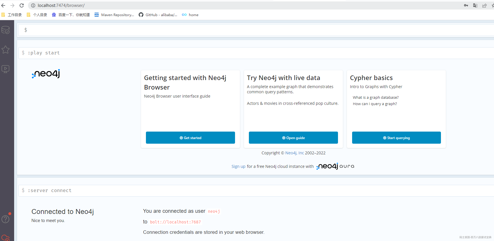

## 5.软件安装

下载地址：<https://neo4j.com/download-center/>  
安装方式：

- Neo4j Enterprise Server

- Neo4j Community Server

- Neo4j Desktop

下载相关软件

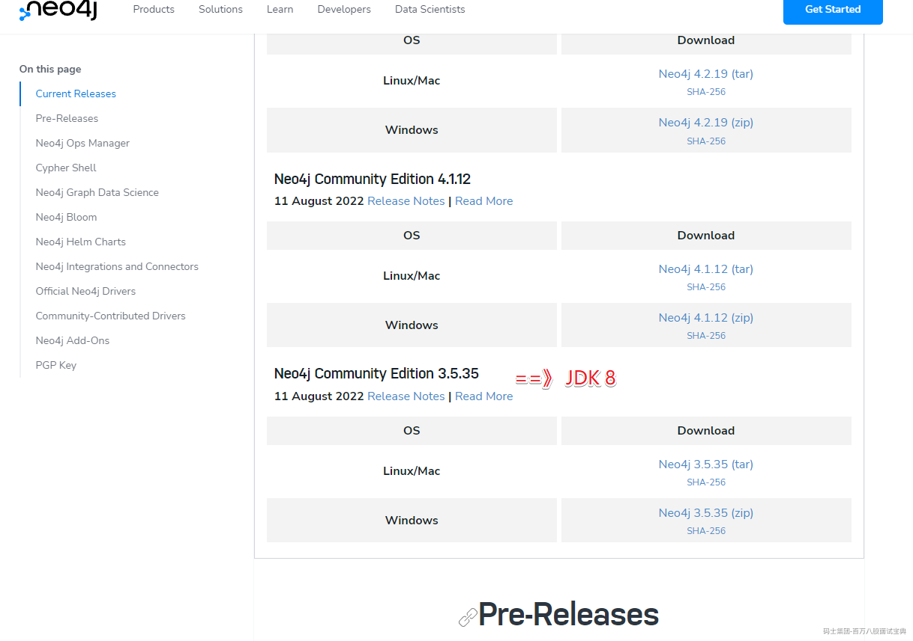

解压缩即可

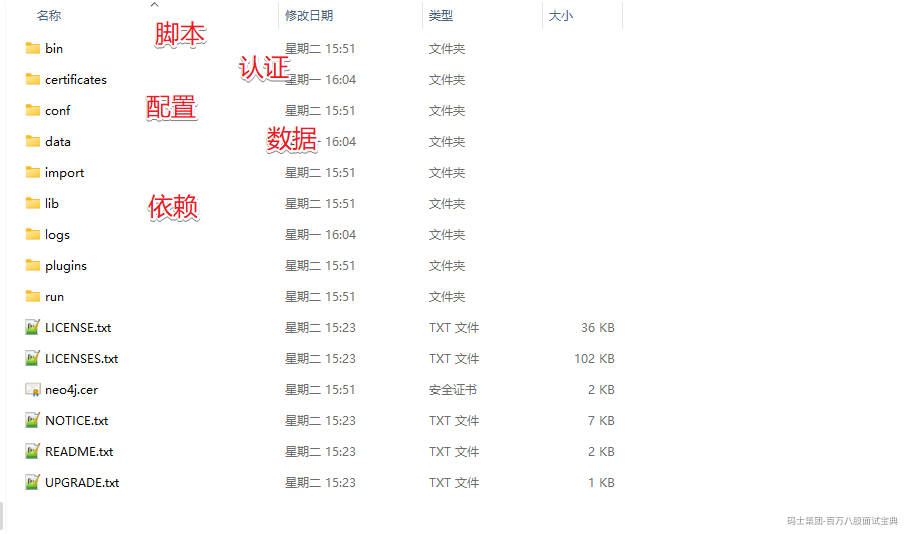

相关的指令

> console: 直接启动 neo4j 服务器  
> install-service | uninstall-service | update-service ： 安装/卸载/更新 neo4j 服务  
> start/stop/restart/status: 启动/停止/重启/状态  
> -V 输出更多信息

进入到bin目录，执行

```plain
neo4j console
```

在浏览器中访问<http://localhost:7474>  
使用用户名neo4j和默认密码neo4j进行连接，然后会提示更改密码。  
Neo4j Browser是开发人员用来探索Neo4j数据库、执行Cypher查询并以表格或图形形式查看结果的工  
具。

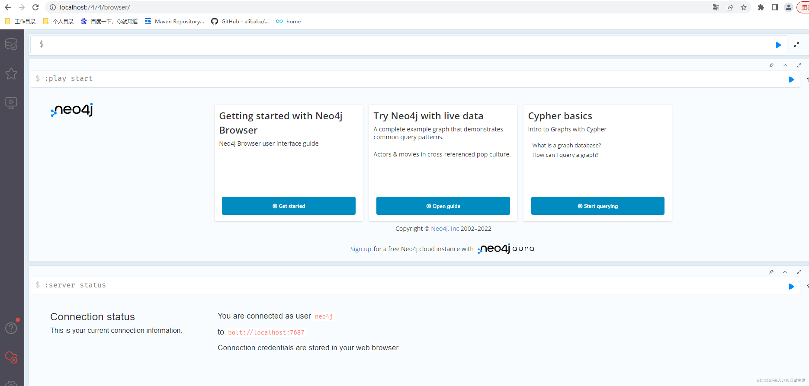

当然也可以通过 Docker 来安装

拉取镜像

```plain
docker pull neo4j:3.5.22-community
```

运行镜像

```plain
docker run -d -p 7474:7474 -p 7687:7687 --name neo4j \
-e "NEO4J_AUTH=neo4j/123456" \
-v /usr/local/soft/neo4j/data:/data \
-v /usr/local/soft/neo4j/logs:/logs \
-v /usr/local/soft/neo4j/conf:/var/lib/neo4j/conf \
-v /usr/local/soft/neo4j/import:/var/lib/neo4j/import \
neo4j:3.5.22-community

```

# 二、CQL语句

## 1.CQL简介

  Neo4j的Cypher语言是为处理图形数据而构建的，CQL代表Cypher查询语言。像Oracle数据库具有查询  
语言SQL，Neo4j具有CQL作为查询语言。

- 它是Neo4j图形数据库的查询语言。

- 它是一种声明性模式匹配语言

- 它遵循SQL语法。

- 它的语法是非常简单且人性化、可读的格式。

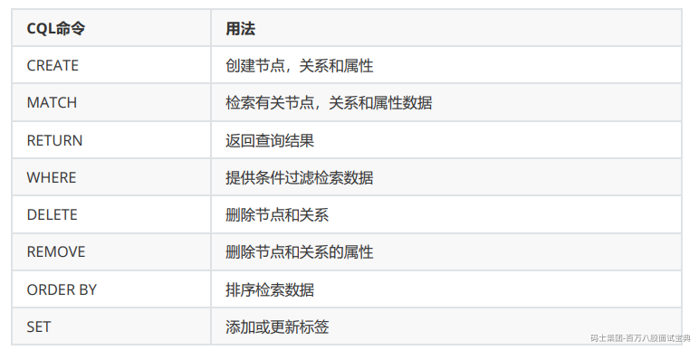

## 2.CREATE 命令

Neo4j使用CQL“CREATE”命令

- 创建没有属性的节点

- 使用属性创建节点

- 在没有属性的节点之间创建关系

- 使用属性创建节点之间的关系

- 为节点或关系创建单个或多个标签

语法命令

```plain
CREATE (<node-name>:<label-name>)
```

语法说明

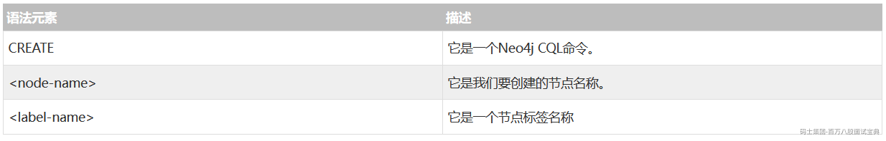

注意事项 -

1、Neo4j数据库服务器使用此&#x3c;node-name>将此节点详细信息存储在Database.As中作为Neo4j DBA或Developer，我们不能使用它来访问节点详细信息。

2、Neo4j数据库服务器创建一个&#x3c;label-name>作为内部节点名称的别名。作为Neo4j DBA或Developer，我们应该使用此标签名称来访问节点详细信息。

## 3.MATCH 命令

Neo4j CQL MATCH 命令用于

- 从数据库获取有关节点和属性的数据

- 从数据库获取有关节点，关系和属性的数据

语法格式：

```plain
MATCH 
(
   <node-name>:<label-name>
)
```

语法说明：

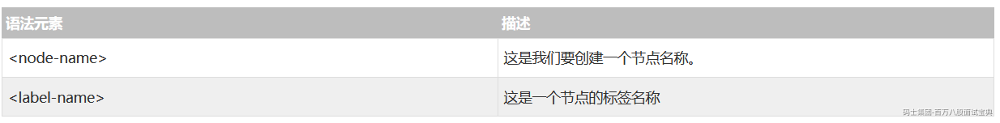

## 4.RETURN 子句

Neo4j CQL RETURN子句用于 -

- 检索节点的某些属性

- 检索节点的所有属性

- 检索节点和关联关系的某些属性

- 检索节点和关联关系的所有属性

语法结构

```plain
RETURN 
   <node-name>.<property1-name>,
   ........
   <node-name>.<propertyn-name>
```

语法说明:

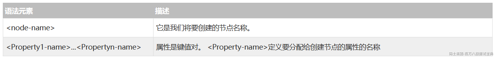

## 5.MATCH和RETURN

在Neo4j CQL中，我们不能单独使用MATCH或RETURN命令，因此我们应该合并这两个命令以从数据库检索数据。

Neo4j使用CQL MATCH + RETURN命令 -

- 检索节点的某些属性

- 检索节点的所有属性

- 检索节点和关联关系的某些属性

- 检索节点和关联关系的所有属性

语法结构

```plain
MATCH Command
RETURN Command
```

语法说明

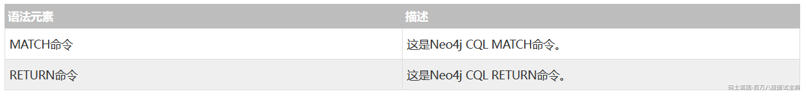

## 6.CREATE+MATCH+RETURN命令

先创建一个客户

```plain
create (e:Customer {id:"1001",name:"boge",location:"cs"})
```

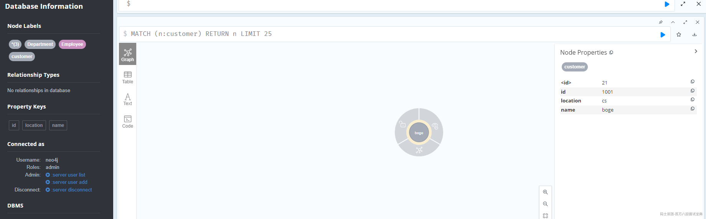

创建一个信用卡节点

```plain
create (cc:CreditCard {id:"9999",number:"1234567890",cvv:"888",expiredate:"22/17"})
```

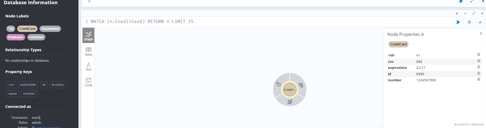

然后我们可以查询对应的信息

```plain
match (k:customer) return k.name,k.location,k.id
```

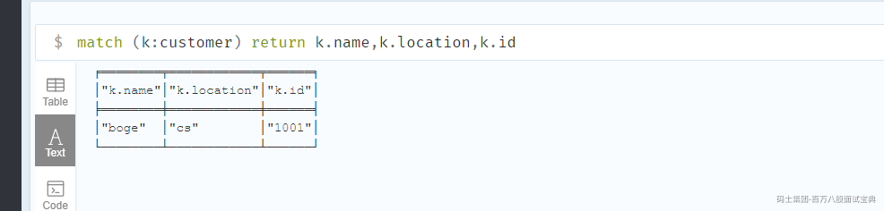

还可以查询信用卡的信息

```plain
match (m:CreditCard) return m.number,m.cvv,m.id,m.expiredate
```

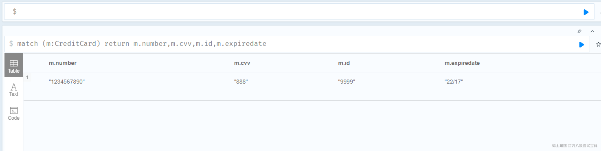

## 7.关系基础

Neo4j图数据库遵循属性图模型来存储和管理其数据。

根据属性图模型，关系应该是定向的。 否则，Neo4j将抛出一个错误消息。

基于方向性，Neo4j关系被分为两种主要类型。

- 单向关系

- 双向关系

在以下场景中，我们可以使用Neo4j CQL CREATE命令来创建两个节点之间的关系。 这些情况适用于Uni和双向关系。

- 在两个现有节点之间创建无属性的关系

- 在两个现有节点之间创建有属性的关系

- 在两个新节点之间创建无属性的关系

- 在两个新节点之间创建有属性的关系

- 在具有WHERE子句的两个退出节点之间创建/不使用属性的关系

**注意 -**

我们将创建客户和CreditCard之间的关系，如下所示：

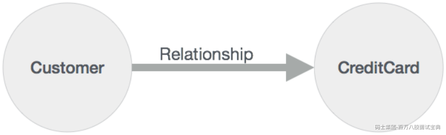

## 8.CREATE创建标签

CREATE标签可以创建单个标签或者多个标签

```plain
CREATE(node-name:lable-name1:lable-name2)
```

还有就是可以根据CREATE语句来创建标签之间的关系

```plain
CREATE (node1-name:lable1-name) - [relationship-name:relationship-lable-name]->(node2-name:lable2-name)
```

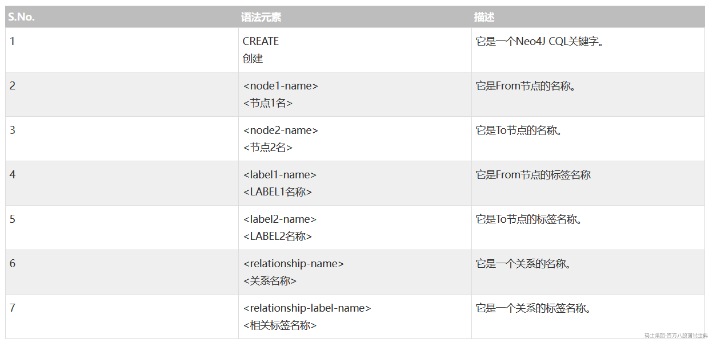

案例：

```plain
create (p1:Profile1)-[r1:喜欢]->(p2:Profile2)
```

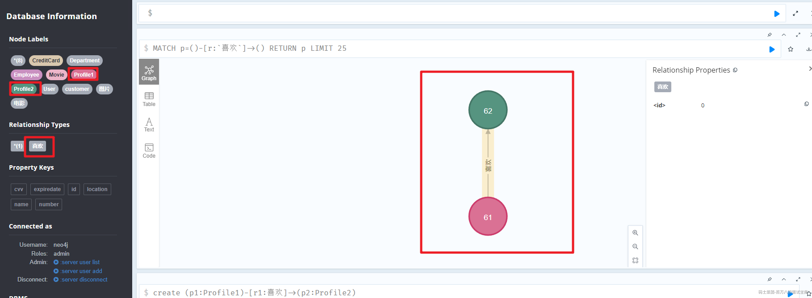

## 9.WHERE子句

像SQL一样，Neo4j CQL在CQL MATCH命令中提供了WHERE子句来过滤MATCH查询的结果。

语法结构

```plain
WHERE <condition>
```

复杂的语法结构

```plain
WHERE <condition> <boolean-operator> <condition>
```

Neo4j支持以下布尔运算符在Neo4j CQL WHERE子句中使用以支持多个条件。

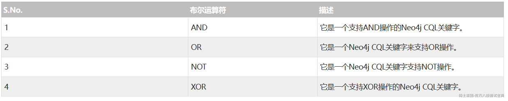

Neo4j 支持以下的比较运算符，在 Neo4j CQL WHERE 子句中使用来支持条件。

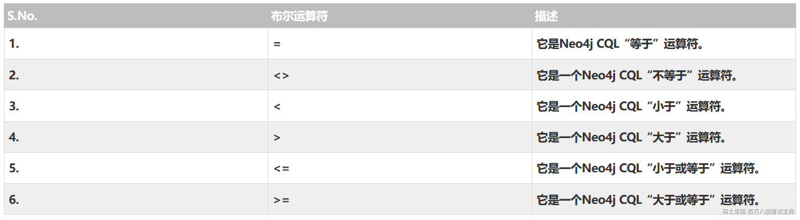

案例:

```plain
match (m:Employee) where m.age > 18 or m.id = 1002  return m
```

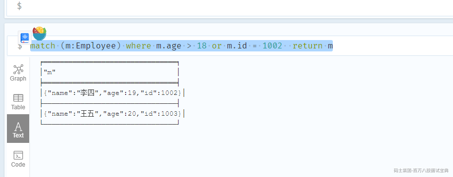

多个节点关联查询

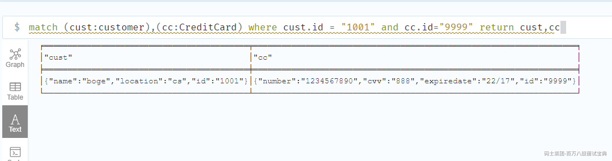

where子句也可以创建关系

语法结构

```plain
MATCH (<node1-label-name>:<node1-name>),(<node2-label-name>:<node2-name>) 
WHERE <condition>
CREATE (<node1-label-name>)-[<relationship-label-name>:<relationship-name>
       {<relationship-properties>}]->(<node2-label-name>) 
```

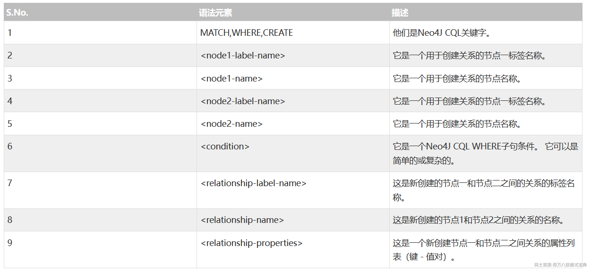

案例

```plain
match (c:customer) , (d:CreditCard) where c.id = "1001" and d.id = "9999" create (c)-[r:消费{shopdate:"2022/09/28",price:6000}]->(d) return r
```

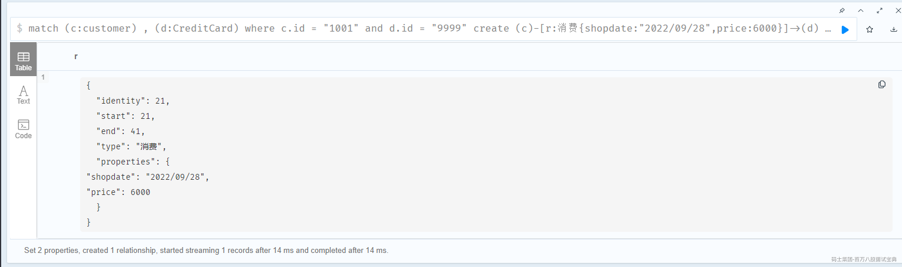

## 10.DELETE命令

Neo4j使用CQL DELETE子句

- 删除节点。

- 删除节点及相关节点和关系。

对应的语法结构

```plain
DELETE <node-name-list>
```

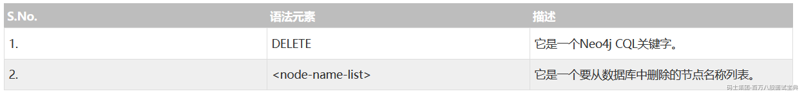

**注意 -**

我们应该使用逗号（，）运算符来分隔节点名。

## 11.REMOVE命令

有时基于我们的客户端要求，我们需要向现有节点或关系添加或删除属性。

我们使用Neo4j CQL SET子句向现有节点或关系添加新属性。

我们使用Neo4j CQL REMOVE子句来删除节点或关系的现有**属性**。

Neo4j CQL REMOVE命令用于

- 删除节点或关系的标签

- 删除节点或关系的属性

Neo4j CQL DELETE和REMOVE命令之间的主要区别 -

- DELETE操作用于删除节点和关联关系。

- REMOVE操作用于删除标签和属性。

Neo4j CQL DELETE和REMOVE命令之间的相似性 -

- 这两个命令不应单独使用。

- 两个命令都应该与MATCH命令一起使用。

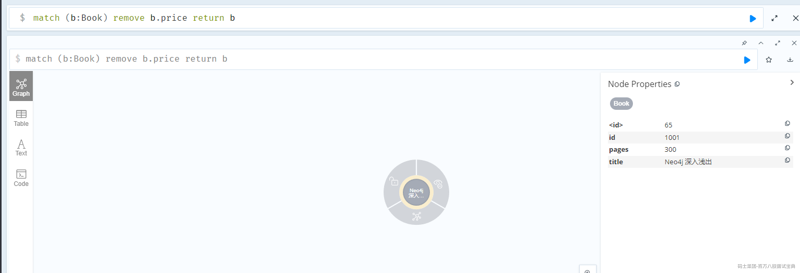

通过remove来移除标签

```plain
match (d:`电影`) remove d:Movie
```

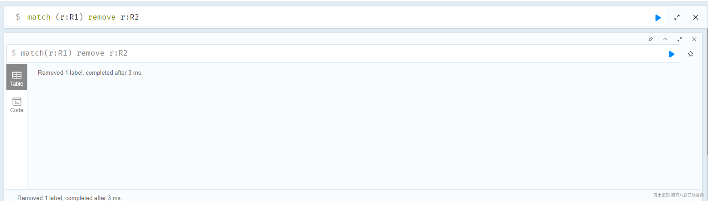

## 12.SET子句

有时，根据我们的客户端要求，我们需要向现有节点或关系添加新属性。

要做到这一点，Neo4j CQL 提供了一个SET子句。

Neo4j CQL 已提供 SET 子句来执行以下操作。

- 向现有节点或关系添加新属性

- 添加或更新属性值

语法结构

```plain
SET  <property-name-list>
```

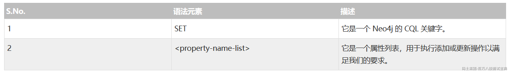

添加属性：

```plain
MATCH (book:Book)
SET book.title = 'superstar'
RETURN book
```

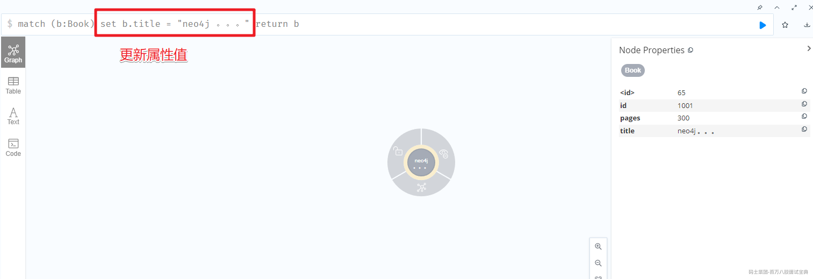

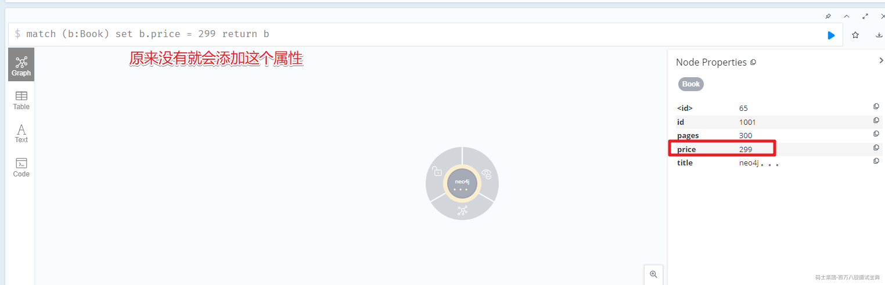

## 13.ORDER BY排序

Neo4j CQL在MATCH命令中提供了“ORDER BY”子句，对MATCH查询返回的结果进行排序。

我们可以按升序或降序对行进行排序。

默认情况下，它按升序对行进行排序。 如果我们要按降序对它们进行排序，我们需要使用DESC子句。

语法结构

```plain
ORDER BY  <property-name-list>  [DESC]	 
```

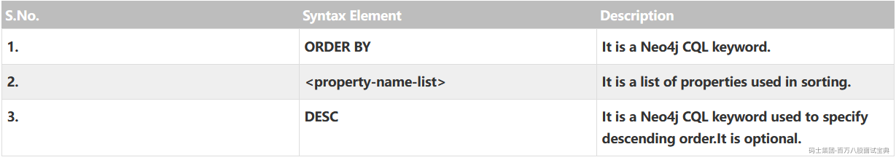

举例：

```plain
MATCH (emp:Employee)
RETURN emp.empid,emp.name,emp.salary,emp.deptno
ORDER BY emp.name
```

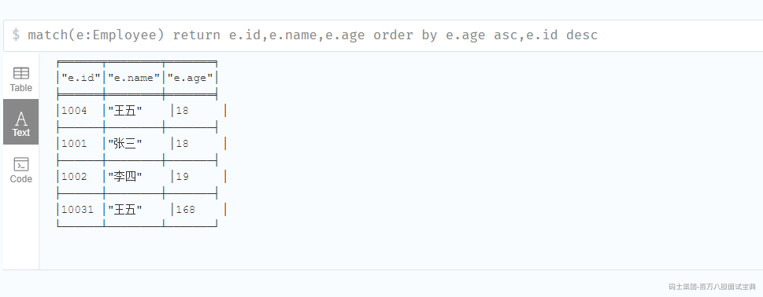

## 14.UNION合并

与SQL一样，Neo4j CQL有两个子句，将两个不同的结果合并成一组结果

- UNION

- UNION ALL

UNION子句

它将两组结果中的公共行组合并返回到一组结果中。 它不从两个节点返回重复的行。

限制：

结果列类型和来自两组结果的名称必须匹配，这意味着列名称应该相同，列的数据类型应该相同。

语法结构

```plain
<MATCH Command1>
   UNION
<MATCH Command2>
```

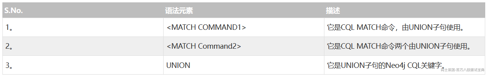

**注意 -**

如果这两个查询不返回相同的列名和数据类型，那么它抛出一个错误。

as 来处理不同的前缀

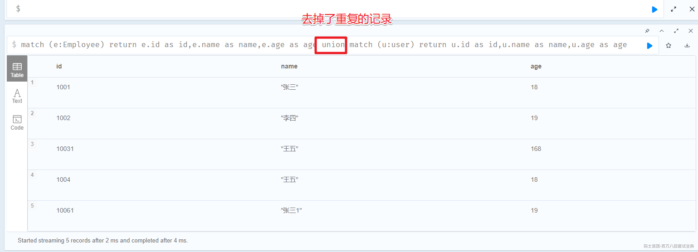

```plain
MATCH (cc:CreditCard)
RETURN cc.id as id,cc.number as number,cc.name as name,
   cc.valid_from as valid_from,cc.valid_to as valid_to
UNION
MATCH (dc:DebitCard)
RETURN dc.id as id,dc.number as number,dc.name as name,
   dc.valid_from as valid_from,dc.valid_to as valid_to
```

UNION ALL子句

它结合并返回两个结果集的所有行成一个单一的结果集。它还返回由两个节点重复行。

限制

结果列类型，并从两个结果集的名字必须匹配，这意味着列名称应该是相同的，列的数据类型应该是相同的。

union all 语法

```plain
<MATCH Command1>
UNION ALL
<MATCH Command2>
```

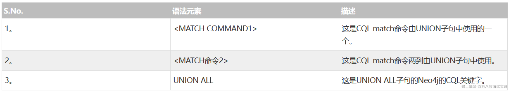

## 15.LIMIT和SKIP子句

Neo4j CQL已提供“LIMIT”子句来过滤或限制查询返回的行数。 它修剪CQL查询结果集底部的结果。

如果我们要修整CQL查询结果集顶部的结果，那么我们应该使用CQL SKIP子句

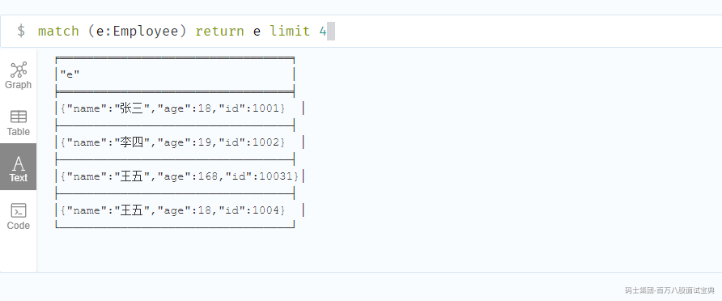

skip跳过

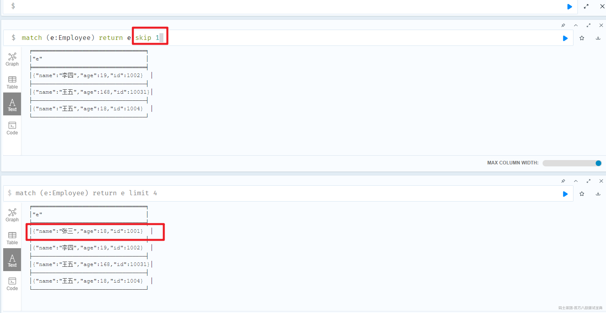

skip和limit可以结合使用达到分页的效果

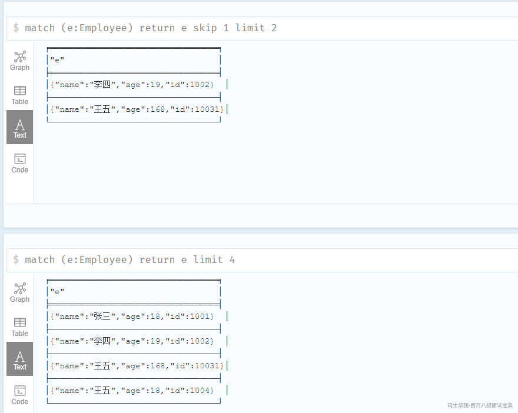

## 16.合并

Neo4j使用CQL MERGE命令 -

- 创建节点，关系和属性

- 为从数据库检索数据

MERGE命令是CREATE命令和MATCH命令的组合。

```plain
MERGE = CREATE + MATCH
```

merge语法

```plain
MERGE (<node-name>:<label-name>
{
   <Property1-name>:<Pro<rty1-Value>
   .....
   <Propertyn-name>:<Propertyn-Value>
})
```

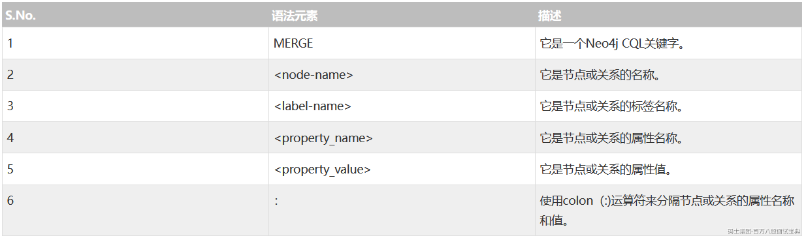

**注意 -**

Neo4j CQL MERGE命令语法与CQL CREATE命令类似。

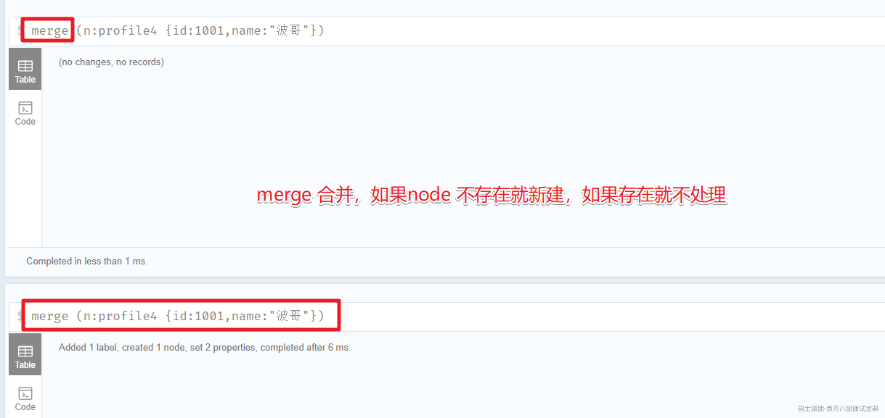

## 17.NULL值

Neo4j CQL将空值视为对节点或关系的属性的缺失值或未定义值。

当我们创建一个具有现有节点标签名称但未指定其属性值的节点时，它将创建一个具有NULL属性值的新节点。

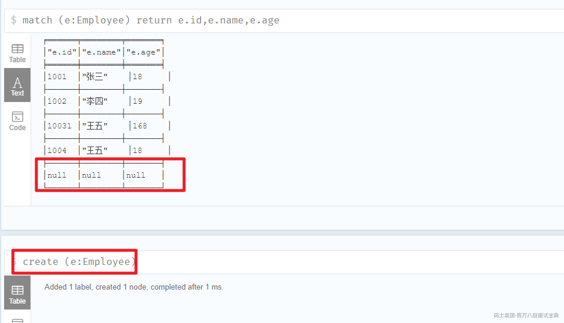

还可以用null 作为查询的条件

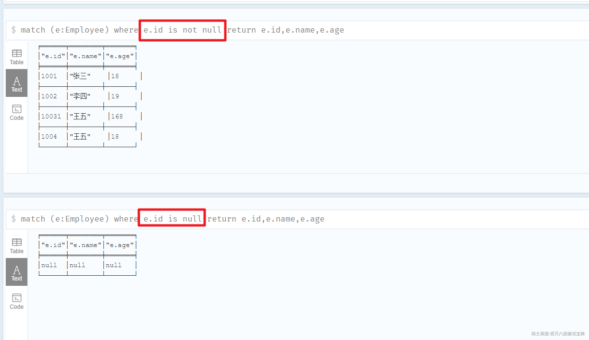

## 18.IN操作符

与SQL一样，Neo4j CQL提供了一个IN运算符，以便为CQL命令提供值的集合。

```plain
IN[<Collection-of-values>]
```

案例:

```plain
MATCH (e:Employee) 
WHERE e.id IN [123,124]
RETURN e.id,e.name,e.sal,e.deptno
```

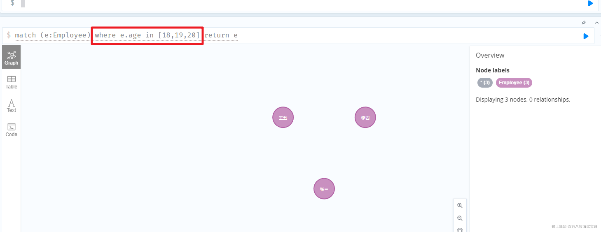

# 三、CQL函数

## 1.字符串函数

与SQL一样，Neo4J CQL提供了一组String函数，用于在CQL查询中获取所需的结果。

列举几个常用的

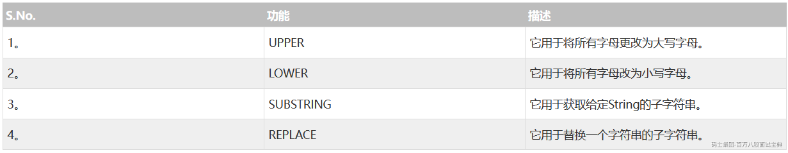

案例：

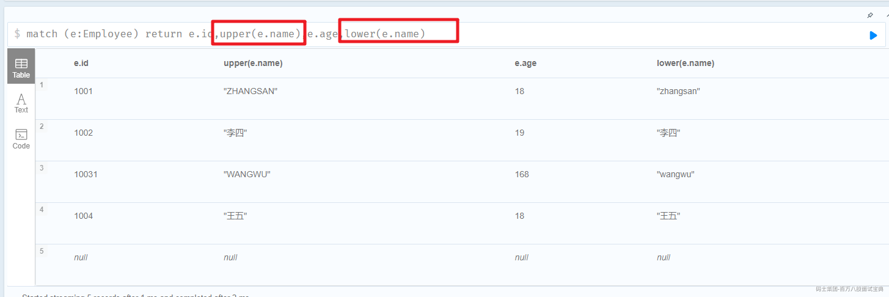

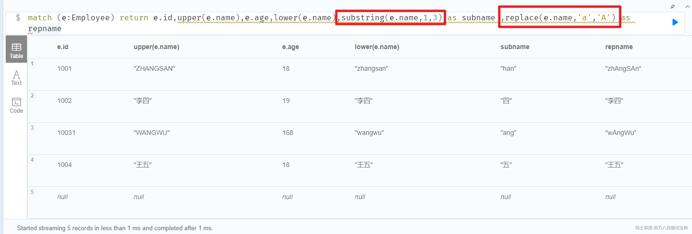

## 2.AGGEGATION聚合

和SQL一样，Neo4j CQL提供了一些在RETURN子句中使用的聚合函数。 它类似于SQL中的GROUP BY子句。

我们可以使用MATCH命令中的RETURN +聚合函数来处理一组节点并返回一些聚合值。

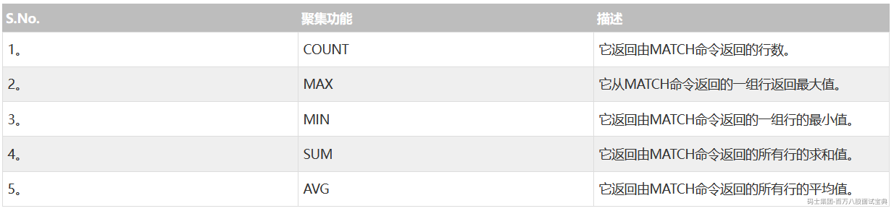

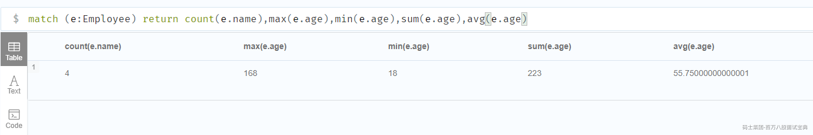

## 3.关系函数

Neo4j CQL提供了一组关系函数，以在获取开始节点，结束节点等细节时知道关系的细节。

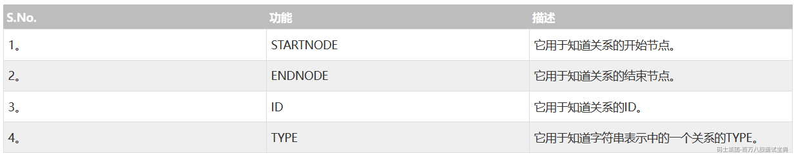

案例：

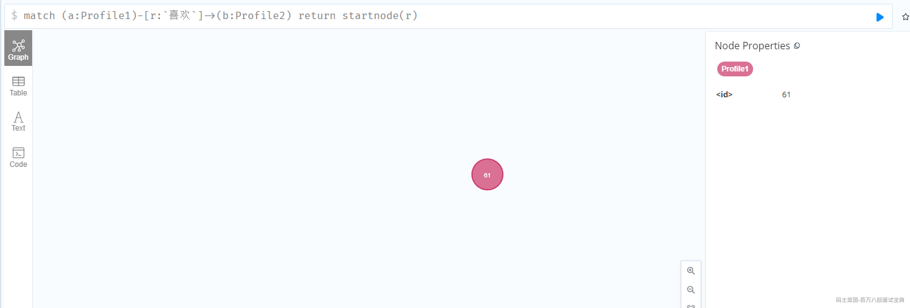

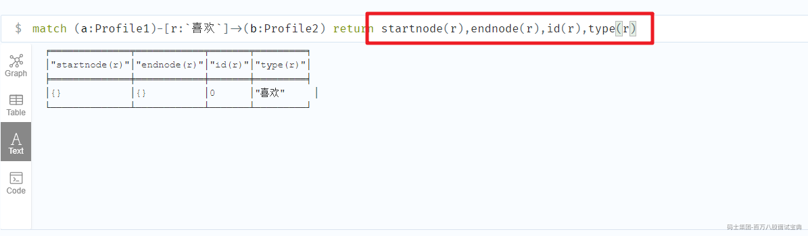

# 四、Neo4J和SpringBoot整合

添加对应的依赖

```plain
        <dependency>
            <groupId>org.springframework.boot</groupId>

            <artifactId>spring-boot-starter-data-neo4j</artifactId>

        </dependency>

```

然后添加对应的配置文件

```plain
# neo4j配置
spring.data.neo4j.uri= bolt://localhost:7687
spring.data.neo4j.username=neo4j
spring.data.neo4j.password=123456

```

## 1.Node的操作

然后创建对应的实体对象

```plain
@Data
@NodeEntity("Person")
public class Person {

    @Id
    @GeneratedValue
    private Long id;

    @Property("name")
    private String name;
}
```

> @NodeEntity：标明是一个节点实体
>
> @RelationshipEntity：标明是一个关系实体
>
> @Id：实体主键
>
> @Property：实体属性
>
> @GeneratedValue：实体属性值自增
>
> @StartNode：开始节点（可以理解为父节点）
>
> @EndNode：结束节点（可以理解为子节点）

然后创建对应的Repository接口

```plain
@Repository
public interface PersonRepository extends Neo4jRepository<Person,Long> {
}
```

然后我们就可以测试Node的创建了

```plain
    @Autowired
    private PersonRepository personRepository;

    @Test
    void contextLoads() {
        Person person = new Person();
        person.setName("波哥");
        personRepository.save(person);
    }
```

创建成功

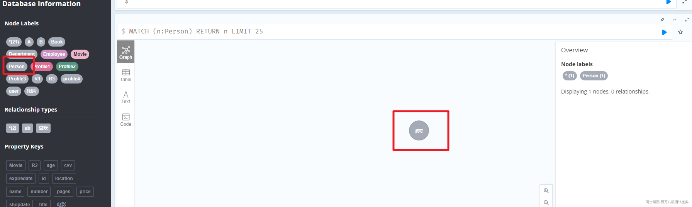

## 2.Node关系的维护

创建关系实体

```plain
@Data
@RelationshipEntity(type = "徒弟")
public class PersonRelation implements Serializable {

    @Id
    @GeneratedValue
    private Long id;

    @StartNode
    private Person parent;

    @EndNode
    private Person child;

    @Property
    private String relation;

    public PersonRelation(Person parent, Person child, String relation) {
        this.parent = parent;
        this.child = child;
        this.relation = relation;
    }
}

```

创建对应的Dao持久层

```plain
@Repository
public interface PersonRelationRepository extends Neo4jRepository<PersonRelation,Long> {

}
```

然后测试

```plain
    /**
     * 节点关系
     */
    @Test
    void nodeRelation(){
        Person p1 = new Person("唐僧",6666);
        Person p2 = new Person("孙悟空",5555);
        Person p3 = new Person("猪八戒",3333);
        Person p4 = new Person("沙僧",2222);
        Person p5 = new Person("白龙马",1111);

        // 维护 关系
        PersonRelation pr1 = new PersonRelation(p1,p2,"徒弟");
        PersonRelation pr2 = new PersonRelation(p1,p3,"徒弟");
        PersonRelation pr3 = new PersonRelation(p1,p4,"徒弟");
        PersonRelation pr4 = new PersonRelation(p1,p5,"徒弟");

        personRelationRepository.save(pr1);
        personRelationRepository.save(pr2);
        personRelationRepository.save(pr3);
        personRelationRepository.save(pr4);

    }
```

运行后的效果：

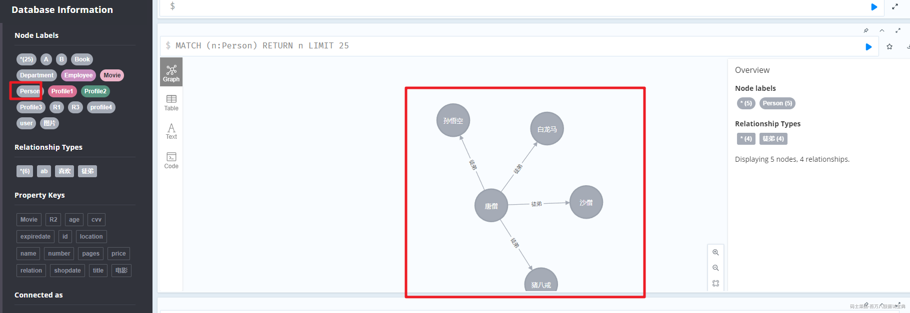
