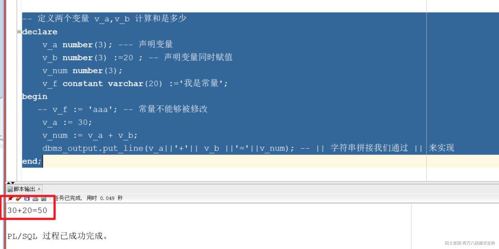
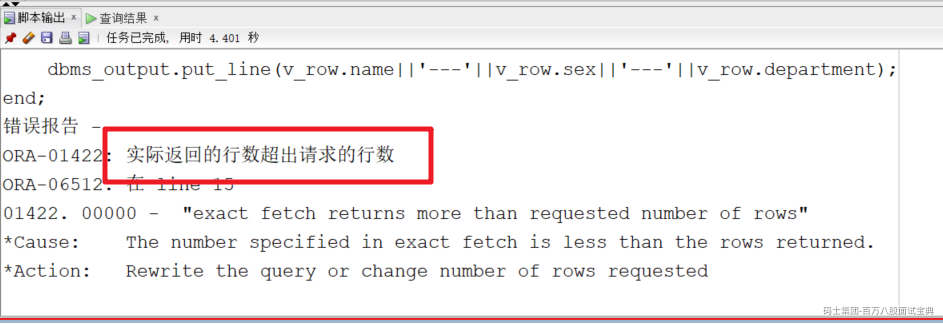
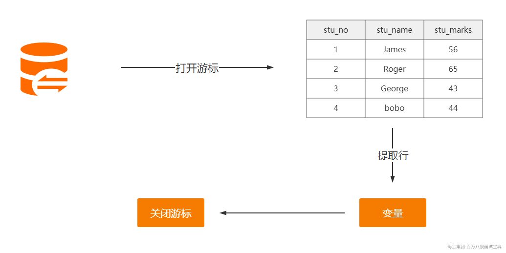
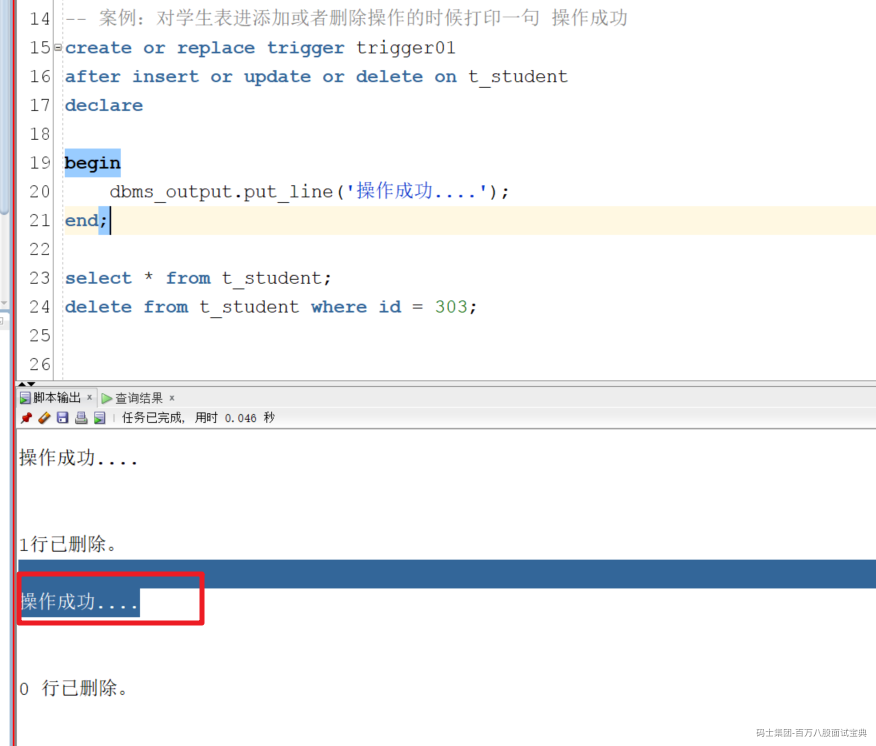
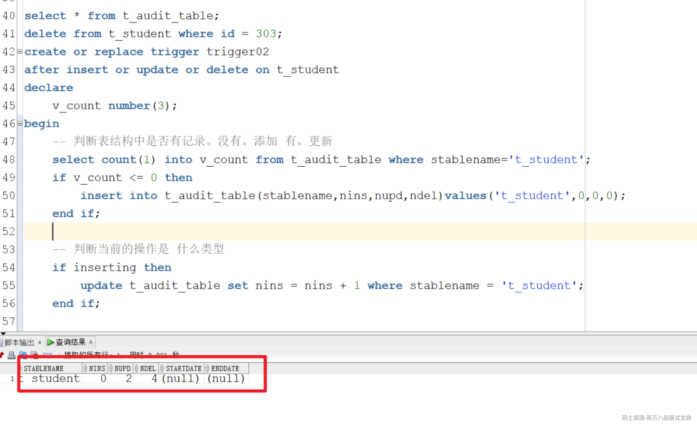
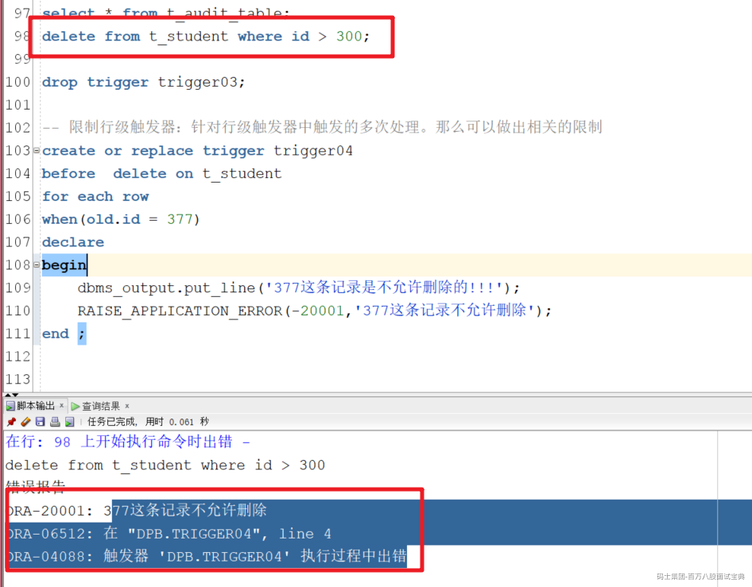

# Oracle高级部分

# 一、PLSQL编程

  是过程语言(Procedural Language)与结构化查询语言(SQL)结合而成的编程语言.通过增加变量、控制语句，使我们可以写一些逻辑更加复杂的数据库操作.

语法结构

```sql
declare
    --声明变量  变量名称 v_ 开头，规范
begin
   --执行具体的语句
   --异常处理
end;
```

注意：

1. 赋值通过':='完成

2. begin和end之间必须有一行可执行的代码

3. end之后必须跟上';'

4. 如果没有需要声明的变量declare可以省略掉

```sql
declare
    v_hello varchar(20);
begin
    v_hello := 'Hello Oracle';
    dbms_output.put_line(v_hello);
end;

begin
   dbms_output.put_line('hello');
end;
```

> dbms\_output不输出的问题。执行如下命令即可
>
> set serveroutput on;

## 1. dbms\_output用法

  dbms\_output包主要用于调试pl/sql程序，或者在sql\*plus命令中显示信息(displaying message)和报表，譬如我们可以写一个简单的匿名pl/sql程序块，而该块出于某种目的使用dbms\_output包来显示一些信息。

1. enable：在serveroutput on的情况下，用来使dbms\_output生效(默认即打开)

2. disable：在serveroutput on的情况下，用来使dbms\_output失效

3. put：将内容写到内存，等到put\_line时一起输出

4. put\_line：不用多说了，输出字符

5. new\_line：作为一行的结束，可以理解为写入buffer时的换行符

6. get\_line(value, index)：获取缓冲区的单行信息

7. get\_lines(array, index)：以数组形式来获取缓冲区的多行信息

```sql
begin
   dbms_output.put('a1');
   dbms_output.put('b2');
   dbms_output.new_line(); -- 输出缓存中的信息，新起一行
   dbms_output.put_line('aaaaa'); -- 会输出缓存中的信息和当前的信息，不会换行
end;
```

## 2.赋值操作

### 2.1 :=

```java
-- 定义两个变量 v_a,v_b 计算和是多少
declare
    v_a number(3); --- 声明变量
    v_b number(3) :=20 ; -- 声明变量同时赋值
    v_num number(3);
    v_f constant varchar(20) :='我是常量';
begin
   -- v_f := 'aaa'; -- 常量不能够被修改
    v_a := 30;
    v_num := v_a + v_b;
    dbms_output.put_line(v_a||'+'|| v_b ||'='||v_num); -- || 字符串拼接我们通过 || 来实现
end;
```



### 2.2 into

  into我们在执行SQL操作的时候，需要把查询的字段信息赋值给变量。那么这时我们就可以通过into 关键字来实现。如果有多个字段要赋值。我们只需要在into的左右两侧建立好对应关系即可。

```sql
declare
   v_name varchar2(30);
   v_sex varchar2(3);
   v_dept varchar2(10);
begin
   select name,sex,department into v_name,v_sex,v_dept from student where id = 901;
   dbms_output.put_line(v_name||'-'||v_sex||'-'||v_dept);
end;

-- 定义两个变量 v_a,v_b 计算和是多少
declare
    v_a number(3) :=&请输入a; --- 声明变量
    v_b number(3) :=&请输入b; -- 声明变量同时赋值
    v_num number(3);
begin
    v_num := v_a + v_b;
    dbms_output.put_line(v_a||'+'|| v_b ||'='||v_num); -- || 字符串拼接我们通过 || 来实现
end;
```

### 2.3 属性类型

1. %type:变量和字段类型的绑定

2. %rowtype：表结构中的一条记录的绑定

```sql
-- 变量的类型如果和字段的类型不一致怎么办?
-- 属性类型
declare
   v_name student.name%type;
   v_sex student.sex%type;
   v_dept student.department%type;
begin
   select name,sex,department into v_name,v_sex,v_dept from student where id = 901;
   dbms_output.put_line(v_name||'-'||v_sex||'-'||v_dept);
end;
-- 表结构中有很多个字段。我们对于的就需要声明多少个变量，很繁琐。
declare
   v_row student%rowtype;
begin
   select * into v_row from student where id = 901;
   dbms_output.put_line(v_row.id||'-'||v_row.name||'-'||v_row.sex);
end;
```

## 3.控制语句

### 3.1 分支语句

#### 3.1.1 if语句

  if语句的作用是控制程序的执行顺序。范围控制

```sql
declare
   v_age number(3) := &请输入年龄;
begin 
   dbms_output.put_line('v_age='||v_age);
   if v_age = 18 then
      dbms_output.put_line('成年小伙');
   end if;
   dbms_output.put_line('-------');
   if v_age = 18 then
      dbms_output.put_line('成年小伙');
      else
      dbms_output.put_line('未知...');
   end if;
   dbms_output.put_line('-------');
   if v_age = 18 then
      dbms_output.put_line('成年小伙');
      elsif v_age < 18 then
      dbms_output.put_line('小孩子');
      elsif v_age > 18 then
      dbms_output.put_line('成年人');
      else
      dbms_output.put_line('未知...');
   end if;
end;
```

#### 3.1.2 case语句

  case语句是一个非常强大的关键字。既可以实现类似于Java中的switch语句的作用。也可以像if语句一样来实现范围的处理。

```sql
-- case 语句
declare
   v_age number(3) := &输入年龄;
begin
   case
     when v_age < 18 then
      dbms_output.put_line('小朋友');
      when v_age > 18 then 
      dbms_output.put_line('成年人');
      else
      dbms_output.put_line('刚好成年');
   end case;
end;
-- case 语句可以实现类似于Java中的switch语句。在 case 和when之间声明变量就可以
-- 如果是在when 和 then 之间指定条件那么和if语句是类似的
declare
   v_age number(3) := &输入年龄;
begin
   case v_age
     when 18 then
      dbms_output.put_line('18');
      when 19 then 
      dbms_output.put_line('19');
      else
      dbms_output.put_line('未知');
   end case;
end;
```

### 3.2 循环语句

#### 3.2.1 无限循环

  loop循环可以通过exit来指定条件跳出循环。如果不指定那么就是无限循环

```sql
-- 输出1~10
declare
  v_i number(3) := 1;
begin
  loop
     dbms_output.put_line(v_i);
     exit when v_i >= 10; -- 退出循环
     v_i := v_i + 1;
  end loop;
end;
```

#### 3.2.2 有条件循环

通过while来指定循环的条件

```sql
declare
   v_i number(3) := 1;
begin
   while v_i <= 10 loop
      dbms_output.put_line(v_i);
      -- 修改变量
      v_i := v_i + 1;
   end loop;
end;
```

#### 3.2.3 for循环

```sql
--for循环
begin
   for i in 1..10 loop
    dbms_output.put_line(i);
   end loop;
end;
select * from student;
begin
  for cur_row in (select id,name,sex,department  from student) loop
     dbms_output.put_line(cur_row.id||'-'|| cur_row.name ||'-' || cur_row.sex || '-' || cur_row.department);
  end loop;
end;
```

### 3.2.4 goto

顺序控制用于按顺序执行语句,goto关键字会跳转到我们指定的位置开始自上而下执行。

```sql
-- goto
declare
   v1 number(3) := &请输入v1的值;
begin
   if v1 > 10 then
        goto c1;
   elsif v1 = 10 then 
      goto c2; 
   else
      dbms_output.put_line('其他');
   end if;
        dbms_output.put_line('666');
   <<c1>>
   dbms_output.put_line('大于10');
   <<c2>>
   dbms_output.put_line('等于10');
   
   dbms_output.put_line('----1----');
   dbms_output.put_line('----2----');
end;
```

## 4.动态SQL语句

  动态 SQL 是指在PL/SQL程序执行时生成的SQL 语句。

语法结构为：

```sql
EXECUTE IMMEDIATE dynamic_sql_string
      [INTO  define_variable_list]
      [USING bind_argument_list];
```

案例

```sql
-- 可以根据名字或者性别来查询学生的信息
declare
    v_name student.name%type := '&请输入姓名';
    v_sex student.sex%type :='&请输入性别';
    v_sql varchar2(200);
    v_row student%rowtype;
begin
    v_sql := 'select * from student where 1=1 ';
    if v_name is not null then
        v_sql := v_sql || ' and name like ''%'||v_name||'%''' ;
    end if;
  
    if v_sex is not null then
       v_sql := v_sql || ' and sex = '''|| v_sex||'''' ;
    end if;
    execute immediate v_sql into v_row ;
  
  
    dbms_output.put_line(v_row.name||'---'||v_row.sex||'---'||v_row.department);
end;
```

如果查询的结果不存在或者返回的记录过多那么都会爆出异常信息



## 5.异常语句

在运行程序时出现的错误叫做异常  
发生异常后，语句将停止执行，控制权转移到PL/SQL 块的异常处理部分  
异常有两种类型

- 预定义异常 - 当 PL/SQL 程序违反 Oracle 规则或超越系统限制时隐式引发

- 用户定义异常 - 用户可以在 PL/SQL 块的声明部分定义异常，自定义的异常通过 RAISE 语句显式引发

处理系统预定义异常：

```sql
-- 异常的应用
-- 系统预定义异常： 
-- too_many_rows 多行数据
-- no_data_found 找不到
-- others 其他异常
declare
   v_name student.name%type;
   
begin
   select name into v_name from student where id = 900 ;
   dbms_output.put_line(v_name);
   
   -- 异常语句块
   exception
       when too_many_rows then
        dbms_output.put_line('返回太多行');
       when no_data_found then
        dbms_output.put_line('找不到数据');
       when others then
        dbms_output.put_line('其他错误');
end;

```

自定义异常：

步骤：

1. 需要显示的声明自定义的异常

2. 在业务逻辑代码中通过raise关键字抛出自定义异常

3. 我们需要在异步部分来声明自定义异常满足条件的处理方案

```sql
-- 自定义异常
declare
   myException exception; -- 声明异常
   v_name varchar2(30) := '张三1';
begin
   if v_name not in ('张三','李四','王五') then
      -- 满足条件就抛出异常
      raise myException;
    else
      dbms_output.put_line('---------------------');
   end if;
    dbms_output.put_line('---------66666------------');
   
   exception
      when myException then
        dbms_output.put_line('---------触发了自定义异常------------');
      when others then
       dbms_output.put_line('---------其他异常------------');
end;
```

# 二、游标

游标的作用：处理多行数据，类似与java中的集合

## 1.隐式游标

  一般是配合显示游标去使用的，不需要显示声明，打开，关闭，系统自定维护,名称为：sql

常用属性：

- sql%found:语句影响了一行或者多行时为true

- %NOTFOUND:语句没有任何影响的时候为true

- %ROWCOUNT:语句影响的行数

- %ISOPEN:游标是否打开，始终为false

案例：

```sql
begin
           update t_student set age=20 ;
  
           if sql%found then
               dbms_output.put_line('修改成功，共修改了   ' ||  sql%rowcount  || '   条记录');
             else
                 dbms_output.put_line('没有这个学生');
             end if;
   
            -- commit ;-- 提交应该要放在隐式游标后面
        end ; 
```

## 2.显示游标

  显式游标在PL/SQL块的声明部分定义查询，该查询可以返回多行,处理多行数据



实现步骤：

1. 声明一个游标

2. 打开游标

3. 循环提取数据

4. 关闭游标

案例：

a) 无参数 ：查询所有学生信息，并显示出学生姓名，性别，年龄

```sql
-- 步骤：1.声明一个游标  2.打开游标  3.循环提取数据 4.关闭游标
-- 查询所有的学生信息。并且显示学生的姓名，年龄和性别
declare
   v_row t_student%rowtype;
   -- 1.游标的声明
   cursor mycursor is select * from t_student ;
begin
    -- 2.打开游标
    open mycursor;
  
    -- 3.循环提取数据
    loop
        fetch mycursor into v_row;
        -- 找到出口
        exit when mycursor%notfound;
        dbms_output.put_line(v_row.name||'-'||v_row.gender||'-'||v_row.age);
    end loop;
    -- 4.关闭游标
    close mycursor;
end;
```

b) 有参数：

```sql
declare
          v_sex varchar2(4) :='&请输入性别' ;
           v_row t_student%rowtype ;
           cursor mycursor(p_sex varchar2) is select * from t_student where sex=p_sex ; -- 注：参数的类型不要指定长度大小
        begin
           open mycursor(v_sex) ;-- 2、打开游标
           loop
               fetch mycursor into v_row;
                  exit when mycursor%notfound;
               dbms_output.put_line(v_row.stuname || ',' || v_row.sex || ',' || v_row.age);
   
           end loop; 
           close mycursor;--  4、 关闭游标
        end ;   
```

c ) 循环游标. 简化 游标 for：不需要打开游标 也不需要关闭游标

```sql
declare
          v_sex varchar2(4) :='&请输入性别' ;
           cursor mycursor(p_sex varchar2) is select * from t_student where sex=p_sex ; -- 注：参数的类型不要指定长度大小
        begin
   
          for v_row   in  mycursor(v_sex)    loop
               dbms_output.put_line(v_row.stuname || ',' || v_row.sex || ',' || v_row.age);  
           end loop; 
   
        end ;   
```

d) 使用显式游标更新行：

允许使用游标删除或更新活动集中的行，声明游标时必须使用 select ... for update 语句。

```sql
declare
          v_sex varchar2(4) :='&请输入性别' ;
           v_row t_student%rowtype ;
           cursor mycursor(p_sex varchar2) is select * from t_student where sex=p_sex  for update; -- 注：参数的类型不要指定长度大小
        begin
           open mycursor(v_sex) ;-- 2、打开游标
           loop
               fetch mycursor into v_row;
                  exit when mycursor%notfound;
              -- dbms_output.put_line(v_row.stuname || ',' || v_row.sex || ',' || v_row.age);
   
               update t_student set age = age +10 where current of mycursor;
   
           end loop; 
           --commit ;
           close mycursor;--  4、 关闭游标
        end ;   
  
```

## 3.REF游标

  处理运行时动态执行的 SQL 查询,特点：

优点：

1. 动态SQL语句

2. 在存储过程中可以当参数

缺点：

1. 不能使用循环游标for

2. 不能使用游标更新行

使用步骤：

1. 定义一个ref的类型

2. 声明游标

3. 打开游标

4. 提取数据

5. 关闭游标

案例讲解

```sql
declare
         v_sex varchar2(4) ;
       --type mytype is ref cursor return t_student%rowtype; -- 强类型的 ref 游标类型
         type mytype is ref cursor  ;   --  1）弱类型的 ref 游标类型
         mycursor mytype;   --  2) 声明游标
         v_sql varchar2(100) ;
         v_row t_student%rowtype ;
     begin
         v_sql :=' select * from t_student ' ;
  
        -- open mycursor for select * from t_student; 
         open mycursor for v_sql ;
         loop
             fetch mycursor into v_row ;
             exit when mycursor%notfound ;
             dbms_output.put_line(v_row.stuname || ',' || v_row.sex || ',' || v_row.age);
         end loop;
         close mycursor ;  
   
     end ;
```

可以使用sys\_refcursor类型

```sql
declare
         v_stuname t_student.stuname%type :='&请输入名字' ;
           v_sex varchar2(3) :='&请输入性别' ;
  
         mycursor  sys_refcursor ;   --  2) 声明游标
         v_sql varchar2(100) ;
         v_row t_student%rowtype ;
     begin
   
          v_sql :='select * from t_student  where  1=1 ';
   
             if  v_stuname is not null then 
                 v_sql :=v_sql  || '  and stuname like  ''%'  || v_stuname || '%'' ' ;
              end if;  
  
            if  v_sex is not null then
                   v_sql :=v_sql || '  and sex = '''  || v_sex || ''' ' ;
            end if;
  
            dbms_output.put_line('v_sql= ' || v_sql );
   
  
        -- open mycursor for select * from t_student; 
         open mycursor for v_sql ;
         loop
             fetch mycursor into v_row ;
             exit when mycursor%notfound ;
             dbms_output.put_line(v_row.stuname || ',' || v_row.sex || ',' || v_row.age);
         end loop;
         close mycursor ;  
   
     end ;
```

游标的小结：

- 游标用于处理查询结果集中的数据

- 游标类型有：隐式游标、显式游标和 REF游标

- 隐式游标由 PL/SQL 自动定义、打开和关闭

- 显式游标用于处理返回多行的查询

- 显式游标可以删除和更新活动集中的行

- 要处理结果集中所有记录时，可使用循环游标

# 三、子程序

  什么是子程序：命名的 PL/SQL 块，编译并存储在数据库中

## 1.存储过程

### 1.1 语法结构

```sql
CREATE [OR REPLACE] PROCEDURE 
   <procedure name> [(<parameter list>)]
IS|AS 
   <local variable declaration>
BEGIN
   <executable statements>
[EXCEPTION
   <exception handlers>]
END;
```

### 1.2 案例讲解

无参数案例：写一个存储过程 ，往学生表中模拟 10 00 条数据（插入1000 条数据 ）

```sql
create or replace procedure protest01
     is
        -- 声明变量  
     begin
         for  i  in 1..100 loop
             insert into t_student(id,stuname,sex,age) values(seq_t_student.nextval  , '小李' || i  , '男' , i );
         end loop;
         commit ;
     end ;
```

调用存储过程：

```sql
declare
        begin
           -- protest01();
            protest01;   --  当没有参数里，括号可省略不写
        end;
```

有参数的案例：

```sql
create or replace procedure protest02(
    p_name varchar2,
    p_sex  varchar2, 
    p_age number
    )
     is
        -- 声明变量  
     begin
   
         dbms_output.put_line(p_name || ',' || p_sex || ',' || p_age );
   
     end ;
```

调用处理

```sql
declare
           v_name varchar2(10) :='&请输入名字' ;
           v_sex varchar2(4) :='&请输入性别';
           v_age number(3) :='&请输入年龄'; 
        begin
            protest02(v_name,  v_sex , v_age);   --  当没有参数里，括号可省略不写
        end;
```

参数的三种类型

- in 输入

- out 输出

- in out 输入输出

案例讲解

```sql
create or replace procedure protest03(
    p_name in varchar2, 
    p_sex in out  varchar2, 
    p_age in out number)
     is
        -- 声明变量  
     begin
   
         dbms_output.put_line(p_name || ',' || p_sex || ',' || p_age );
         p_sex :='我是P_sex';  
     end ;
```

调用过程

```sql
     declare
           v_name varchar2(10) :='&请输入名字' ;
           v_sex varchar2(50) :='&请输入性别';
           v_age number(3) :='&请输入年龄'; 
        begin
            protest03(v_name,  v_sex , v_age);   --  当没有参数里，括号可省略不写
             dbms_output.put_line(v_sex);
        end;
  
```

案例： 请根据性别或名字查询相关记录，并把结果 返回来 打印了出来 提示用 sys\_refcursor

```sql
create or replace procedure protest04(
        p_name varchar2,
        p_sex varchar2, 
        myresult out sys_refcursor)
          is
             v_sql  varchar2(100) ;
          begin
             v_sql :='select * from t_student where 1=1 ';
             if p_name is not null then
                v_sql :=v_sql  ||  '  and  stuname like  ''%'  || p_name  ||   '%'' ' ;
             end if;
             if p_sex is not null then
                v_sql := v_sql || '  and  sex = ''' || p_sex || '''  ';
             end if;
             dbms_output.put_line('v_sql='  || v_sql);
   
             open myresult for v_sql ;
  
          end;
```

调用

```sql
-- 执行测试
          declare
             v_name varchar2(20) :='&请输入名字';
             v_sex varchar2(4) :='&请输入性别' ;
             mycursor sys_refcursor ;
             v_row t_student%rowtype;
          begin
             --  protest04(v_name, v_sex , mycursor);  
    -- 1) 位置传递
                --2 ）名称传递
                 --protest04( p_sex =>v_sex , p_name => v_name , myresult => mycursor);
                 --3) 混合使用  : 先用位置传递，如果后面有用了名称传递，后面就不能用位置传递
                     protest04(v_name , myresult=>mycursor ，p_sex => v_sex,);
               loop
                   fetch mycursor into  v_row ;
                    exit when mycursor%notfound ;
                    dbms_output.put_line(v_row.stuname || ',' || v_row.sex || ',' || v_row.age );
               end loop;
   
               close mycursor ;   
          end;
```

## 2.存储函数

  类似于java中方法，有返回值可以返回值的命名的 PL/SQL 子程序。

### 2.1 语法结构

```sql
CREATE [OR REPLACE] FUNCTION 
  <function name> [(param1,param2)]
RETURN <datatype>  IS|AS 
  [local declarations]
BEGIN
  Executable Statements;
  RETURN result;
EXCEPTION
  Exception handlers;
END;
```

### 2.2 案例讲解

无参案例：写一个函数 ，获取学生名称

```sql
create or replace function funtest02
   return varchar2
   is
      v_name varchar2(20) ;
   begin
         select stuname into v_name from t_student where id=201;
         return v_name;
   end ;
```

如何调用呢

- a)用PL/SQL块调用函数

- b)用select语句调用: 在函数中不能有增加删除修改的语句，只能是查询的语句

有参案例：

```sql
create or replace function  funtest03(p_name in varchar2, p_sex out varchar2, p_age in out number)
     return varchar2
     is
        -- 声明变量  
     begin
   
         dbms_output.put_line(p_name || ',' || p_sex || ',' || p_age );
         p_sex :='我是函数的p_sex' ;
            return '成功';
     end ; 
```

调用

```sql
   -- 调用 
     declare
           v_name varchar2(10) :='&请输入名字' ;
           v_sex varchar2(20) :='&请输入性别';
           v_age number(3) :='&请输入年龄'; 
           v_result varchar2(30) ;
        begin
            v_result := funtest03(v_name, v_sex , p_age=>v_age);   
              dbms_output.put_line('v_result=' || v_result || ', v_sex=' || v_sex );
        end;
```

## 3.程序包

程序包：作用就是管理我们的存储过程和方法

```sql
-- 程序包：作用就是管理我们的存储过程和方法
-- 规范和主体两部分组成
-- 创建一个规范
create or replace package pak01
is
   procedure myprocdure01(p_name varchar2);
   function myfun01 return number;
end pak01;

-- 创建规范对应的主体：主体中的方法如果在规范中声明了。那么外包可以访问。如果没有那么就只能被内部调用
create or replace package body pak01
is

    -- myprodure01 存储过程
    procedure myprocdure01(p_name varchar2)
    as
    begin
        dbms_output.put_line('p_name = '||p_name);
    end;
    -- myfun01 方法
    function myfun01 return number
    is
    begin
         dbms_output.put_line('方法执行了.... ');
         return 666;
    end;
end pak01;

create or replace package body pak01
is

    -- myprodure01 存储过程
    procedure myprocdure01(p_name varchar2)
    as
    begin
        dbms_output.put_line('p_name = '||p_name);
    end;
    -- myfun01 方法
    function myfun01 return number
    is
    begin
         dbms_output.put_line('方法执行了.... ');
         return 666;
    end;
  
    function myfun02 return number
    is
  
    begin
       dbms_output.put_line('方法执行了..222.. ');
       return 999;
    end;
end pak01;

-- 调用package中的过程和方法 package.
begin
   pak01.myprocdure01('李四');
end;

select pak01.myfun02 from dual;
```

# 四、触发器

## 1.触发器的基本讲解

  当特定事件出现时自动执行的存储过程

语法结构

```sql
CREATE [OR REPLACE] TRIGGER trigger_name
AFTER | BEFORE | INSTEAD OF
[INSERT] [[OR] UPDATE [OF column_list]] 
[[OR] DELETE]
ON table_or_view_name
[REFERENCING {OLD [AS] old / NEW [AS] new}]
[FOR EACH ROW]
[WHEN (condition)]
declare
begin
end;
```

案例：对学生表进行增加删除修改后打印一句 操作成功

```sql
create or replace trigger trigger01
after insert or update or delete on t_student
declare
   
begin
   dbms_output.put_line('操作成功');
end ;
```



## 2.触发器的类型

### 2.1 语句级触发器

 关注的是执行了这条语句

案例：创建一个对学生表的增删改的审计触发器

准备表

```sql
CREATE TABLE t_audit_table
(
  stablename varchar2(30),
  nins number,--记录添加次数
  nupd number,--记录修改次数
  ndel number,--记录删除次数
  startdate date,
  enddate date
)
```

实现：

```sql
create or replace trigger trigger02
    after insert or delete or update on t_student
    declare
       v_count number(3);
    begin
        -- 先判断t_student在这个日志表中是否有这条记录，如果没有，要先插入数据
        select count(*) into v_count from t_audit_table where stablename='t_student';
        if v_count<=0 then
             insert into t_audit_table(stablename,nins,nupd,ndel) values('t_student', 0,0 ,0);
        end if;
  
        if inserting then
            update t_audit_table set nins=nins+1 where stablename='t_student';
        end if;
        if updating then
             update t_audit_table set nupd=nupd+1 where stablename='t_student';
        end if;
        if deleting then
            update t_audit_table set ndel=ndel+1 where stablename='t_student';
        end if;
```



### 2.2 行级触发器

  和影响的行数：影响了多少行数据。那么这个触发器就会触发多少次

```sql
create or replace trigger trigger02
    after insert or delete or update on t_student
    FOR EACH ROW
    declare
       v_count number(3);
    begin
        -- 先判断t_student在这个日志表中是否有这条记录，如果没有，要先插入数据
        select count(*) into v_count from t_audit_table where stablename='t_student';
        if v_count<=0 then
             insert into t_audit_table(stablename,nins,nupd,ndel) values('t_student', 0,0 ,0);
        end if;
  
        if inserting then
            update t_audit_table set nins=nins+1 where stablename='t_student';
        end if;
        if updating then
             update t_audit_table set nupd=nupd+1 where stablename='t_student';
        end if;
        if deleting then
            update t_audit_table set ndel=ndel+1 where stablename='t_student';
        end if;
  
```

### 2.3 限制行级触发器

  对部分数据做特定的处理，比如：不能删除管理员

```sql
create or replace trigger trigger03
   before  delete on t_student
    for each row
    when(old.stuname='小李6')  
  declare
  begin
         dbms_output.put_line('班长不能被删除');
   
        RAISE_APPLICATION_ERROR(-20001, '班长不能被删除');
  end;
```



# 五、视图和索引

## 1. 视图

### 1.1 视图的介绍

**视图** 是一种数据库对象，是从 一个或者多个 数据表或视图中导出的 **虚表** 。

1. 视图所对应的数据， **并不是真正的存储在 视图 中** ，而是 **存储在所引用的数据表** 中。

2. 视图的结构和数据，是对数据表进行查询的结果。

  根据创建视图时给定的条件，视图可以是一个数据表的一部分，也可以是多个基表的联合。它存储了要执行检索的 **查询语句的定义** ，以便在引用该视图时使用。

使用视图的优点:

- 简化数据操作：视图可以简化用户处理数据的方式。

- 着重于特定数据：不必要的数据 或 敏感数据，可以不出现在视图中。视图提供了一个简单而有效的安全机制，可以定制不同用户对数据的访问权限。

- 提供向后兼容性：视图使用户能够在表的架构更改时，为表创建向后兼容接口。

- 集中分散数据。

- 简化查询语句。

- 重用SQL语句。

- 保护数据安全。

- 共享所需数据。

- 更改数据格式。

### 1.2 视图的语法

```sql
CREATE [OR REPLACE] [FORCE] VIEW '视图名'
AS '子查询'
[WITH [CASCADED|LOCAL] CHECK OPTION]
-- 只读。
[WITH READ ONLY] 

```

说明：  
OR REPLACE：若所创建的试图已经存在，Oracle 自动重建该视图  
FORCE：不管基表是否存在，Oracle 都会自动创建该视图  
sub\_query：一条完整的 SELECT 语句，可以在该语句中定义别名  
WITH CHECK OPTION：数据表 插入或修改 的数据行，必须满足视图定义的约束  
WITH READ ONLY：该视图上不能进行任何 DML 操作

简单案例

```sql
CREATE OR REPLACE VIEW v_student
AS 
SELECT * FROM t_student
WHERE age >= 18
WITH CHECK OPTION;
```

查看视图

```sql
select * from v_student
```

删除视图

```sql
DROP VIEW [IF EXISTS] '视图名'[,'视图名2'] ... [RESTRICT|CASCADE];
-- RESTRICT：限制。
-- CASCADE：级联。

DROP VIEW 'view_name'; 

```

### 1.3 视图案例

#### 1.3.1 简单视图

如果视图中的语句只是 **单表查询** ，并且 **没有聚合函数** ，我们就称之为 **简单视图** 。

```sql
-- 1.简单视图：针对单表查询。没有使用聚合函数，这一类的视图我们就称为简单视图
create or replace view v_t_student
as
select * from t_student;

select * from v_t_student where id = 1;
-- 简单视图可以像普通的表结构那样去使用。不仅可以查询。还可以DML操作,本质还是对物理表做的DML操作
update v_t_student set age = 22 where id = 1;
```

#### 1.3.2 带检查约束视图

  视图的数据可能只是原来数据的一部分。那么我们做更新处理的时候也不能超过数据的访问

```sql
create or replace view v_t_student
as
select * from t_student where id in (1,2,3,4,5)
with check option;

select * from v_t_student;

update v_t_student set age = 33 where id = 306;
```

#### 1.3.3 只读视图

  有些情况下我们为了保证数据的安全。访问改视图的用户我们不允许做DML操作。这时我们可以添加 with read only 关键字

```plain
-- 只读视图：有些情况下我们为了保证数据的安全。访问改视图的用户我们不允许做DML操作。这时我们可以添加 with read only 关键字
create or replace view v_t_student
as
select id,name from t_student
with read only; -- 表示该视图只读
```

#### 1.3.4 带错误视图

  有的时候。创建视图的时候，表可能并不存在。创建视图后可能存在。如果此时我们需要创建这样的视图，那么需要添加 `force` 关键字

```sql
create or replace force view v_t_student
as
select id,name from t_student1
with read only; -- 表示该视图只读
```

#### 1.3.5 复杂视图

  在视图的SQL语句中。有聚会函数或者多表关联查询。

```sql
-- 复杂视图
create or replace view v_student1
as
select t1.id,t1.name,t2.name className
from t_student t1 left join t_class t2
on t1.class_id = t2.id;

select * from v_student1;
-- 在复杂视图中。我们可以DML操作主表。不能对从表做处理
update v_student1 set name = '波哥' where id = 4;
update v_student1 set classname = 'aa' where id = 302;
--复杂视图还有 聚合函数的使用-这种情况肯定不能DML操作了
create or replace view v_student1
as
select count(1) num ,avg(age) avgage from t_student;
select * from v_student1;
```

## 2.索引

  索引是建立在表的一列或多个列上的辅助对象，目的是加快访问表中的数据；Oracle存储索引的数据结构是B树，位图索引也是如此，只不过是叶子节点不同B数索引；索引由根节点、分支节点和叶子节点组成，上级索引块包含下级索引块的索引数据，叶节点包含索引数据和确定行实际位置的rowid。

语法：

```plain
create [unique | bitmap] index [schema.] 索引名
on [schema.] 表名 (列名1, .., 列名N);
```
