# 一、PostgreSQL介绍

PostgreSQL是一个功能强大的 **开源** 的关系型数据库。底层基于C实现。

PostgreSQL的开源协议和Linux内核版本的开源协议是一样的。。BDS协议，这个协议基本和MIT开源协议一样，说人话，就是你可以对PostgreSQL进行一些封装，然后商业化是收费。

PostgreSQL的名字咋来的。之前叫Ingres，后面为了解决一些ingres中的一些问题，作为后面的ingres，就起名叫postgre。

PostgreSQL版本迭代的速度比较快，现在最新的正式的发布版本，已经到了15.RELEASE。

PGSQL的版本选择一般有两种：

- 如果为了稳定的运行，推荐使用12.x版本。

- 如果想体验新特性，推荐使用14.x版本。

PGSQL允许跨版本升级，而且没有什么大问题。

PGSQL社区特别活跃，基本是三个月一发版。意味着很多常见的BUG都可以得到及时的修复。

PGSQL其实在国外使用的比较多，国内暂时还是以MySQL为主。

但是国内很多国产数据库都是基于PGSQL做的二次封装：比如华为GaussDB还有腾讯的Tbase等等。真实很多公司原来玩的Oracle，直接平转到PGSQL。同时国内的很多云产品都支持PGSQL了。

PGSQL因为开源，有很多做数据迁移的工具，可以让你快速的从MySQL，SQLServer，Oracle直接平转到PGSQL中内部，比如pgloader这样的数据迁移工具。

PGSQL的官方地址：<https://www.postgresql.org/>

PGSQL的国内社区：<http://www.postgres.cn/v2/home>

# 二、PostgreSQL和MySQL的区别

技术没有好坏之分，知识看一下是否符合你的业务，能否解决你的业务需求。其次也要查看社区的活跃度以及更新的频次。

MySQL不支持的几点内容：

- MySQL的数据类型不够丰富。

- MySQL不支持序列概念，Sequence。

- 使用MySQL时，网上比较好用的插件。

- MySQL的性能优化监控工具不是很多，定位问题的成本是比较高。

- MySQL的主从复制没有一个官方的同步策略，同步问题难以解决。

- MySQL虽然开源，but，不够彻底。

PostgreSQL相对MySQL上述问题的特点：

- PostgreSQL的数据类型嘎嘎丰富。

- PostgreSQL是有序列的概念的。

- PostgreSQL的插件特别丰富。

- PostgreSQL支持主从复制的同步操作，可以实现数据的0丢失。

- PostgreSQL的MVCC实现和MySQL不大一样。PostgreSQL一行数据会存储多个版本。最多可以存储40亿个事务版本。

# 三、PostgreSQL的安装

咱们只在Linux中安装，不推荐大家在Windows下安装。

Linux的版本尽量使用7.x版本，最好是7.6或者是7.8版本。

去官网找按照的方式

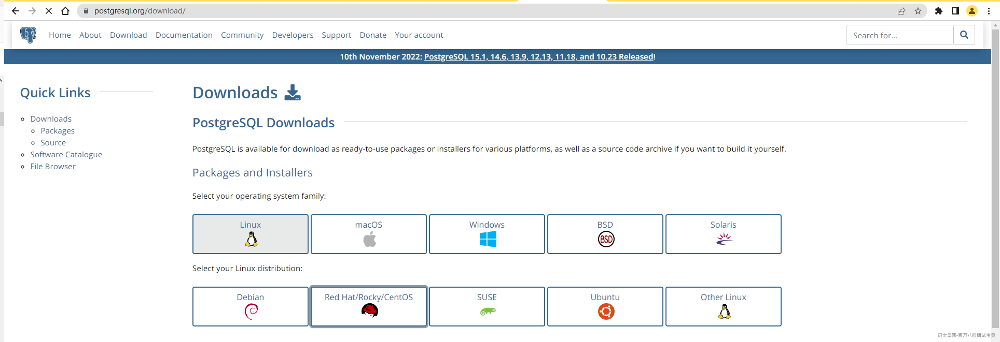

选择好PGSQL的版本，已经Linux的发行版本

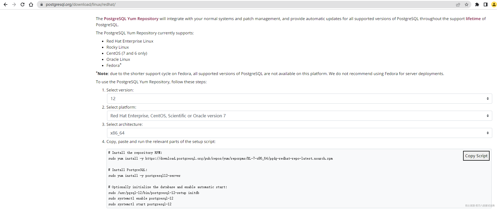

拿到命令，麻也不管，直接扔到Linux中运行即可

```shell
# 下载PGSQL的rpm包
sudo yum install -y https://download.postgresql.org/pub/repos/yum/reporpms/EL-7-x86_64/pgdg-redhat-repo-latest.noarch.rpm
# 安装PGSQL12的软件程序，需要下载，需要等一会，一般不会失败，即便失败，他也会重新帮你找镜像
sudo yum install -y postgresql12-server
# 数据库初始化
sudo /usr/pgsql-12/bin/postgresql-12-setup initdb
# 设置开启启动项，并设置为开启自行启动
sudo systemctl enable postgresql-12
# 启动PGSQL
sudo systemctl start postgresql-12
```

这种属于Windows下的傻瓜式安装，基本不会出错。如果出错，可能是那些问题：

- 安装Linux的时候，一定要选择最小安装

- 你的Linux不能连接外网

- Linux中的5432端口，可能被占用了

PostgreSQL不推荐使用root管理，在安装成功postgreSQL后，他默认会给你创建一个用户：postgres

玩PGSQL前，先切换到postgres

```plain
su postgres
```

奇幻到postgres用户后，直接输入psql即可进入到postgreSQL提供的客户端

```plain
# 进入命令行
psql
# 查看有哪些库，如果是新安装的，有三个库，一个是postgres，template0，template1
\l  
```

其次不推荐下载Windows版本去玩

如果非要下载：<https://sbp.enterprisedb.com/getfile.jsp?fileid=1258242>

# 四、PostgreSQL的配置

要搞两个配置信息，一个关于postgreSQL的远程连接配置以及postgreSQL的日志配置。

PostgreSQL的主要配置放在数据目录下的， **postgresql.conf** 以及 **pg\_hba.conf** 配置文件

这些配置文件都放在了

```shell
# 这个目录下
/var/lib/pgsql/12/data
```

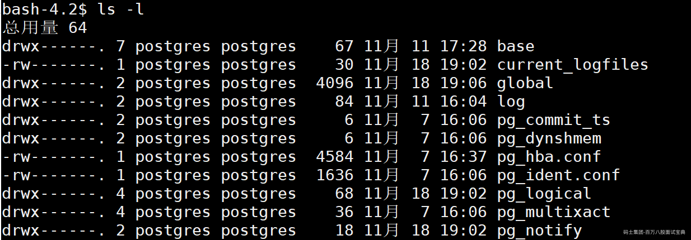

上图可以看到，postgreSQL的核心文件，都属于postgres用户，操作的时候，尽可能的别用root用户，容易玩出坑，尽可能先切换到postgres用户去玩。

## 4.1 远程连接配置

PostgreSQL默认情况下不支持远程连接的，这个跟MySQL几乎一样

- MySQL给mysql.user追加用户，一般是采用grant的命令去玩。

- PostgreSQL要基于配置文件修改，才能制定用户是否可以远程连接。

直接去修改pg\_hba.conf配置文件

用户以及对应数据库和连接方式的编写模板

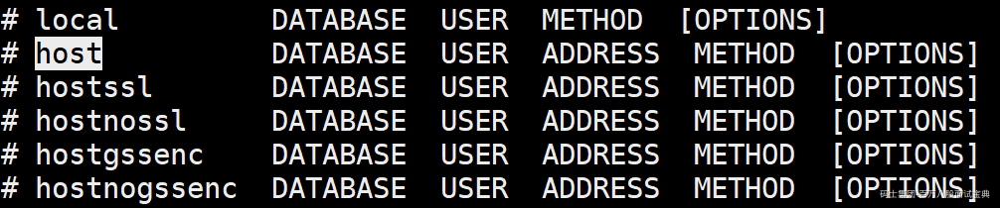

```plain
# 第一块
local：代表本地连接，host代表可以指定连接的ADDRESS
# 第二块
database编写数据库名，如果写all，代表所有库都可以连接
# 第三块
user编写连接的用户，可以写all，代表所有用户
# 第四块
address代表那些IP地址可以连接
# 第五块
method加密方式，这块不用过多关注，直接md5
# 直接来个痛快的配置吗，允许任意地址的全部用户连接所有数据库
host    all             all             0.0.0.0/0               md5
```

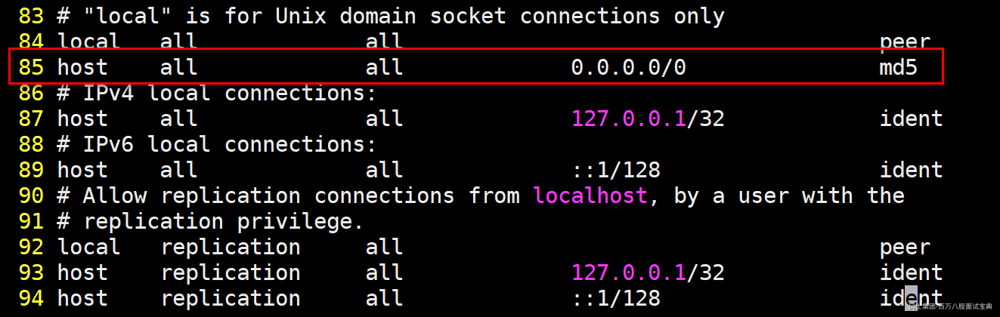

为了实现远程连接，除了用户级别的这种配置，还要针对服务级别修改一个配置

服务级别的配置在postgresql.conf

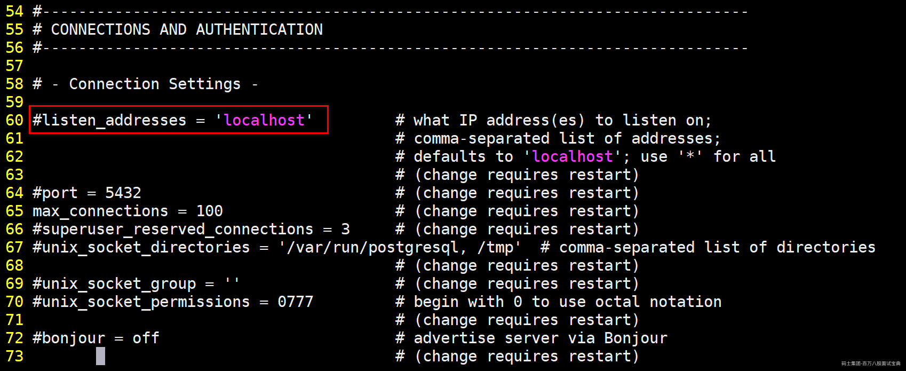发现默认情况下，PGSQL只允许localhost连接，直接配置为\*即可解决问题

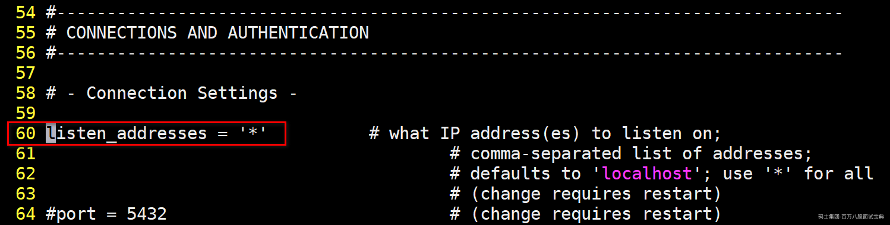

记得，为了生效，一定要重启

```shell
# postgres密码不管，直接root用户
sudo systemctl restart postgresql-12
```

## 4.2 配置数据库的日志

查看postgresql.conf文件

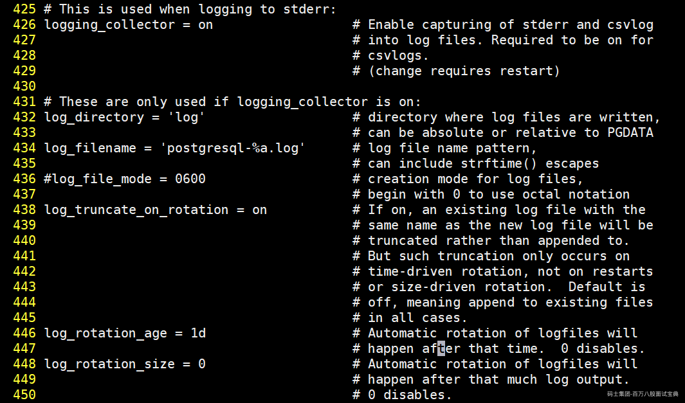

postgreSQL默认情况下，只保存7天的日志，循环覆盖。

```plain
# 代表日志是开启的。
logging_collector = on
# 日志存放的路径，默认放到当前目录下的log里
log_directory = 'log'
# 日志的文件名，默认是postgresql为前缀，星期作为后缀
log_filename = 'postgresql-%a.log'
# 默认一周过后，日志文件会被覆盖
log_truncate_on_rotation = on
# 一天一个日志文件
log_rotation_age = 1d
# 一个日志文件，没有大小限制
log_rotation_size = 0
```

# 五、PostgreSQL的基操

只在psql命令行（客户端）下，执行了一次\l，查看了所有的库信息

可以直接基于psql查看一些信息，也可以基于psql进入到命令行后，再做具体操作

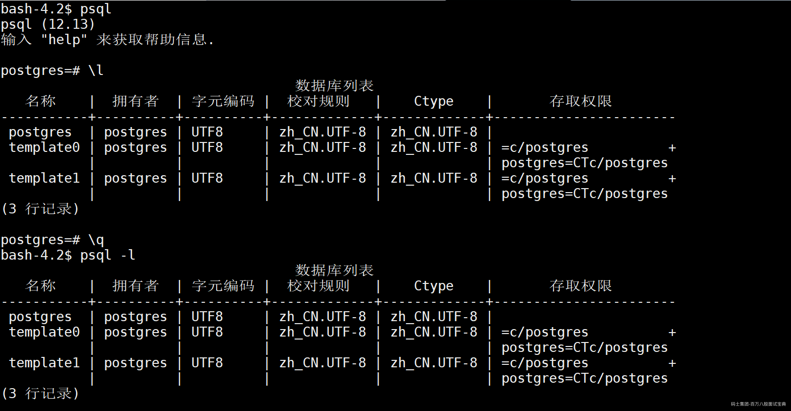

可以直接基于psql去玩

```plain
可以数据psql --help，查看psql的命令
可以直接进入到命令行的原因，是psql默认情况下，就是以postgres用户去连接本地的pgsql，所以可以直接进入
下面的图是默认的连接方式
```

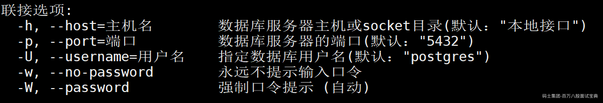

后面都基于psql的命令行（客户端）去进行操作

命令绝对不要去背，需要使用的时候，直接找帮助文档，在psql命令行中，直接注入

```plain
\help，即可查看到数据库级别的一些命令
\?，可以查看到服务级别的一些命令
```

## 5.1 用户操作

构建用户命令巨简单

```sql
# 区别就是create user默认有连接权限，create role没有，不过可以基于选项去设置
CREATE USER 名称 [ [ WITH ] 选项 [ ... ] ]
create role 名称 [ [ WITH ] 选项 [ ... ] ]
```

构建一个超级管理员用户

```sql
create user root with SUPERUSER PASSWORD 'root';
```


退出psql命令行

编写psql命令尝试去用root用户登录

```shell
psql -h 192.168.11.32 -p 5432 -U root -W
```

发现，光有用户不让登录，得让用户有一个数据库，直接构建一个root库

```plain
create database root;
```


可以在不退出psql的前提下，直接切换数据库

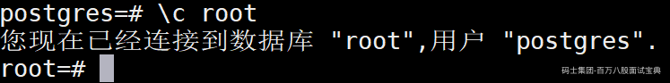

也可以退出psql，重新基于psql命令去切换用户以及数据库

如果要修改用户信息，或者删除用户，可以查看

```shell
# 修改用户，直接基于ALTER命令操作
# 删除用户，直接基于DROP命令操作
```

如果要查看现在的全部用户信息

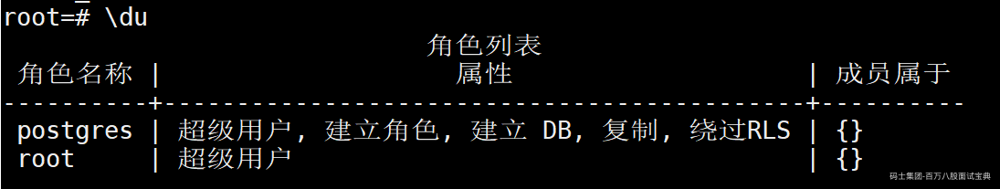

## 5.2 权限操作

权限操作前，要先掌握一下PGSQL的逻辑结构

|  |
| --- |
| 逻辑结构图 |
| 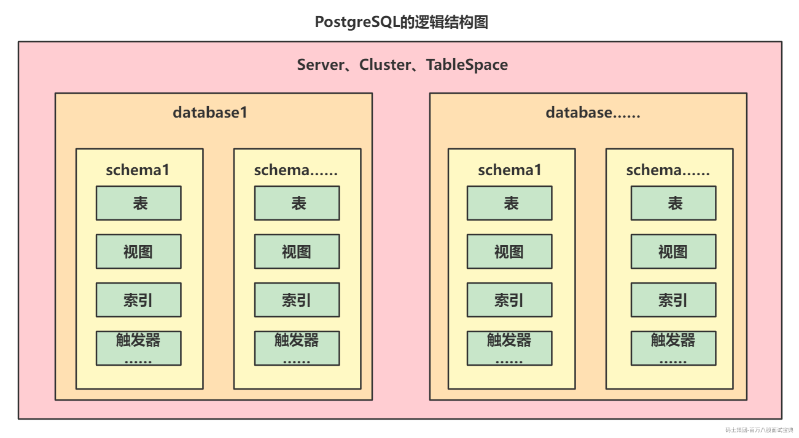 |

可以看到PGSQL一个数据库中有多个schema，在每个schema下都有自己的相应的库表信息，权限粒度会比MySQL更细一些。

在PGSQL中，权限的管理分为很多多层

> server、cluster、tablespace级别：这个级别一般是基于pg\_hba.conf去配置
>
> database级别：通过命令级别操作，grant
>
> namespace、schema级别：玩的不多……不去多了解这个~~
>
> 对象级别：通过grant命令去设置

后面如果需要对database或者是对象级别做权限控制，直接基于grant命令去操作即可

```shell
# 查看grant命令
\help grant
```

## 小任务

构建一个用户（你自己名字）

构建一个数据库

在这个数据库下构建一个schema（数据库默认有一个public的schema）

将这个schema的权限赋予用户

在这个schema下构建一个表

将表的select，update，insert权限赋予用户

## 完成上述操作

```sql
-- 准备用户
create user laozheng with password 'laozheng';
-- 准备数据库
create database laozheng;
-- 切换数据库
\c laozheng;
-- 构建schema
create schema laozheng;
-- 将schema的拥有者修改为laozheng用户
alter schema laozheng owner to laozheng;
-- 将laozheng库下的laozheng的schema中的表的增，改，查权限赋予给laozheng用户
grant select,insert,update on all tables in schema laozheng to laozheng;
-- 用postgres用户先构建一张表
create table laozheng.test(id int);
-- 切换到laozheng用户。
\c laozheng -laozheng 
-- 报错：
-- 致命错误:  对用户"-laozheng"的对等认证失败
-- Previous connection kept
-- 上述方式直接凉凉，原因是匹配连接方式时，基于pg_hba.conf文件去从上往下找
-- 找到的第一个是local，匹配上的。发现连接方式是peer。
-- peer代表用当前系统用户去连接PostgreSQL
-- 当前系统用户只有postgres，没有laozheng，无法使用peer连接
-- 想构建laozheng用户时，发现postgreSQL的所有文件拥有者和所属组都是postgres，并且能操作的只有拥有者
```

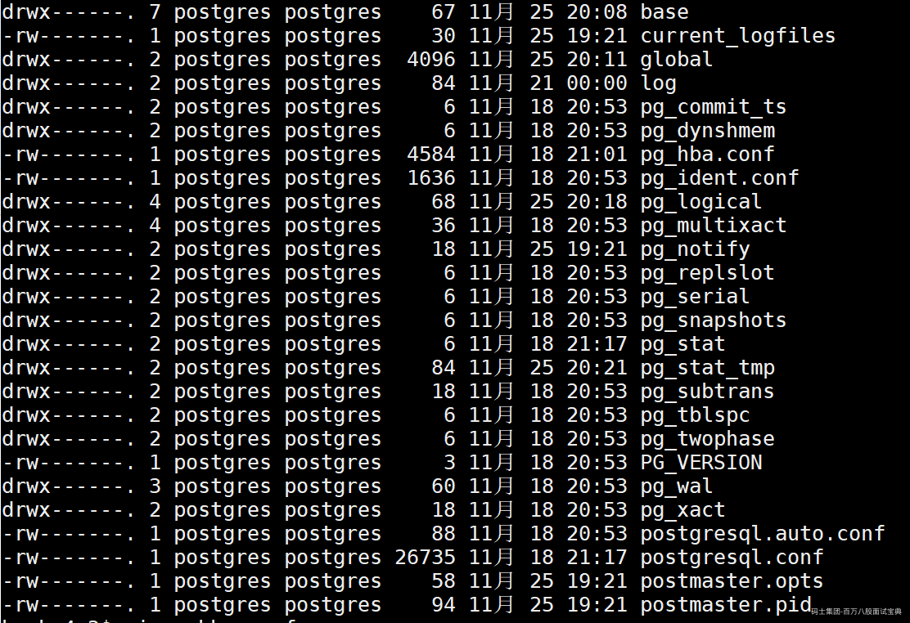

```plain
-- 基于上述问题，不采用本地连接即可。
-- 采用远程连接。
psql -h 192.168.11.32 -p 5432 -U laozheng -W
-- 这样依赖，跳过了local链接方式的匹配，直接锁定到后面的host，host的连接方式是md5，md5其实就是密码加密了。
-- 登录后，直接输入
\dn
-- 查看到当前database下有两个schema
```

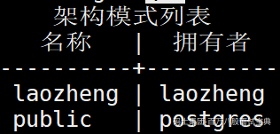

这种权限的赋予方式，可以用管理员用户去构建整体表结构，如此一来，分配指定用户，赋予不同的权限，这样一来，就不怕用户误操了。

# 六、图形化界面安装

图形化界面可以连接PGSQL的很多，Navicat（收费）。

也可以直接使用PostgreSQL官方提供的图形化界面。（完全免费）

官方提供的：<https://www.pgadmin.org/>

直接点击就可以下载~~~

<https://www.postgresql.org/ftp/pgadmin/pgadmin4/v6.9/windows/>

傻瓜式安装~~~

打开pgAdmin

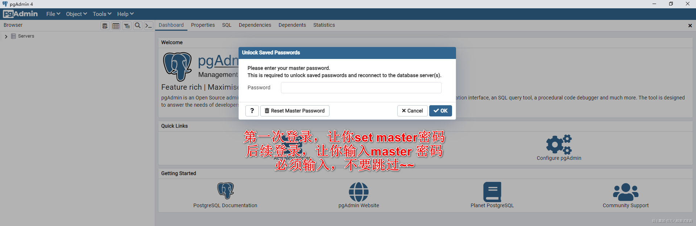

添加一个新的连接

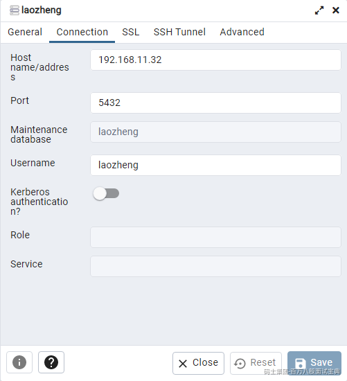

直接save，就可以连接到老郑的信息

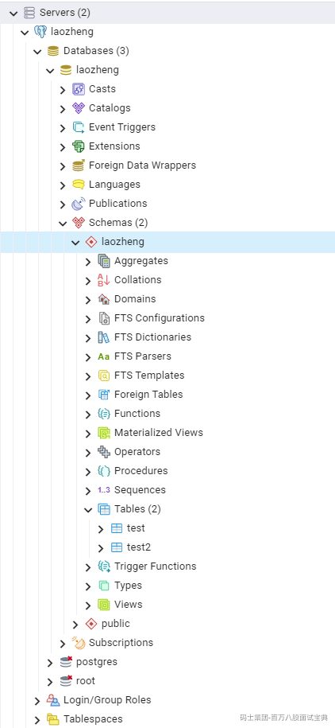

可以切换语言

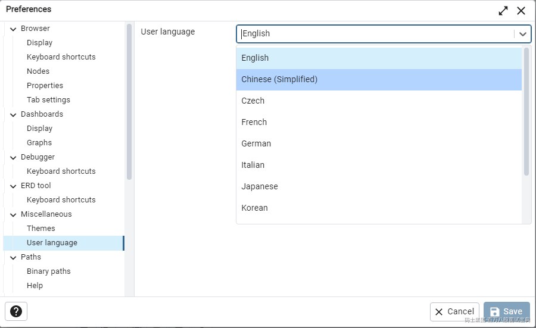

# 七、数据类型

PGSQL支持的类型特别丰富，大多数的类型和MySQL都有对应的关系

|  |  |  |
| --- | --- | --- |
| 名称 | 说明 | 对比MySQL |
| 布尔类型 | boolean，标准的布尔类型，只能存储true，false | MySQL中虽然没有对应的boolean，但是有替换的类型，数值的tinyint类型，和PGSQL的boolean都是占1个字节。 |
| 整型 | smallint（2字节），integer（4字节），bigint（8字节） | 跟MySQL没啥区别。 |
| 浮点型 | decimal，numeric（和decimal一样一样的，精准浮点型），real（float），double precision（double），money（货币类型） | 和MySQL基本也没区别，MySQL支持float，double，decimal。MySQL没有这个货币类型。 |
| 字符串类型 | varchar(n)（character varying），char(n)（character），text | 这里和MySQL基本没区别。&#x3c;br />PGSQL存储的varchar类型，可以存储一个G。MySQL好像存储64kb（应该是）。 |
| 日期类型 | date（年月日），time（时分秒），timestamp（年月日时分秒）（time和timestamp可以设置时区） | 没啥说的，和MySQL基本没区别。&#x3c;br />MySQL有个datetime。 |
| 二进制类型 | bytea-存储二进制类型 | MySQL也支持，MySQL中是blob |
| 位图类型 | bit(n)（定长位图），bit varying(n)（可变长度位图） | 就是存储0，1。MySQL也有，只是这个类型用的不多。 |
| 枚举类型 | enum，跟Java的enum一样 | MySQL也支持。 |
| 几何类型 | 点，直线，线段，圆………… | MySQL没有，但是一般开发也用不到 |
| 数组类型 | 在类型后，追加[]，代表存储数组 | MySQL没有~~~ |
| JSON类型 | json（存储JSON数据的文本），jsonb（存储JSON二进制） | 可以存储JSON，MySQL8.x也支持 |
| ip类型 | cidr（存储ip地址） | MySQL也不支持~ |
| 等等 | <http://www.postgres.cn/docs/12/datatype.html> |  |

# 八、PostgreSQL基本操作&数据类型

## 8.1 单引号和双引号

在PGSQL中，写SQL语句时，单引号用来标识实际的值。双引号用来标识一个关键字，比如表名，字段名。

```sql
-- 单引号写具体的值，双引号类似MySQL的``标记，用来填充关键字
-- 下面的葡萄牙会报错，因为葡萄牙不是关键字
select 1.414,'卡塔尔',"葡萄牙";
```

## 8.2 数据类型转换

第一种方式：只需要在值的前面，添加上具体的数据类型即可

```sql
-- 将字符串转成位图类型
select bit '010101010101001';
```

第二种方式：也可以在具体值的后面，添加上 ::类型 ，来指定

```sql
-- 数据类型
select '2011-11-11'::date;
select '101010101001'::bit(20);
select '13'::int;
```

第三种方式：使用CAST函数

```sql
-- 类型转换的完整写法
select CAST(varchar '100' as int);
```

## 8.3 布尔类型

布尔类型简单的丫批，可以存储三个值，true，false，null

```sql
-- 布尔类型的约束没有那么强，true，false大小写随意，他会给你转，同时yes，no这种他也认识，但是需要转换
select true,false,'yes'::boolean,boolean 'no',True,FaLse,NULL::boolean;
```

boolean类型在做and和or的逻辑操作时，结果

|  |  |  |  |
| --- | --- | --- | --- |
| 字段A | 字段B | a and b | a or b |
| true | true | true | true |
| true | false | false | true |
| true | NULL | NULL | true |
| false | false | false | false |
| false | NULL | false | NULL |
| NULL | NULL | NULL | NULL |

## 8.4 数值类型

### 8.4.1 整型

整型比较简单，主要就是三个：

- smallint、int2：2字节

- integer、int、int4：4字节

- bigint、int8：8字节

正常没啥事就integer，如果要存主键，比如雪花算法，那就bigint。空间要节约，根据情况smallint

### 8.4.2 浮点型

浮点类型就关注2个（其实是一个）

- decimal(n,m)：本质就是numeric，PGSQL会帮你转换

- numeric(n,m)：PGSQL本质的浮点类型

针对浮点类型的数据，就使用 **numeric**

### 8.4.3 序列

MySQL中的主键自增，是基于auto\_increment去实现。MySQL里没有序列的对象。

PGSQL和Oracle十分相似，支持序列：sequence。

PGSQL可没有auto\_increment。

序列的正常构建方式：

```sql
create sequence laozheng.table_id_seq;
-- 查询下一个值
select nextval('laozheng.table_id_seq');
-- 查询当前值
select currval('laozheng.table_id_seq');
```

默认情况下，seqeunce的起始值是0，每次nextval递增1，最大值9223372036854775807

告诉缓存，插入的数据比较多，可以指定告诉缓存，一次性计算出20个后续的值，nextval时，就不可以不去计算，直接去高速缓存拿值，效率会有一内内的提升。

序列大多数的应用，是用作表的主键自增效果。

```sql
-- 表自增
create table laozheng.xxx(
    id int8 default nextval('laozheng.table_id_seq'),
    name varchar(16)
);
insert into laozheng.xxx (name) values ('xxx');
select * from laozheng.xxx;
```

上面这种写法没有问题，但是很不爽~很麻烦。

PGSQL提供了序列的数据类型，可以在声明表结构时，直接指定序列的类型即可。

bigserial相当于给bigint类型设置了序列实现自增。

- smallserial

- serial

- bigserial

```sql
-- 表自增（爽）
create table laozheng.yyy(
    id bigserial,   
    name varchar(16)
);
insert into laozheng.yyy (name) values ('yyy');
```

在drop表之后，序列不会被删除，但是序列会变为不可用的状态。

如果是单独构建序列，再构建表，使用传统方式实现，序列和表就是相对独立的。

### 8.4.4 数值的常见操作

针对数值咱们可以实现加减乘除取余这5个操作

还有其他的操作方式

|  |  |  |  |
| --- | --- | --- | --- |
| 操作符 | 描述 | 示例 | 结果 |
| ^ | 幂 | 2 ^ 3 | 8 |
| |/ | 平方根 | |/ 36 | 6 |
| @ | 绝对值 | @ -5 | 5 |
| & | 与 | 31 & 16 | 16 |
| | | 或 | 31|32 | 63 |
| << | 左移 | 1<<1 | 2 |
| >> | 右移 | 16>>1 | 8 |

数值操作也提供了一些函数，比如pi()，round(数值，位数)，floor()，ceil()

## 8.5 字符串类型

字符串类型用的是最多的一种，在PGSQL里，主要支持三种：

- character（就是MySQL的char类型），定长字符串。（最大可以存储1G）

- character varying（varchar），可变长度的字符串。（最大可以存储1G）

- text（跟MySQL异常）长度特别长的字符串。

操作没什么说的，但是字符串常见的函数特别多。

字符串的拼接一要要使用||来拼接。

其他的函数，可以查看 <http://www.postgres.cn/docs/12/functions-string.html>

## 8.6 日期类型

在PGSQL中，核心的时间类型，就三个。

- timestamp（时间戳，覆盖 年月日时分秒）

- date（年月日）

- time（时分秒）

在PGSQL中，声明时间的方式。

只需要使用字符串正常的编写 yyyy-MM-dd HH:mm:ss 就可以转换为时间类型。

直接在字符串位置使用之前讲到的数据类型转换就可以了。

**当前系统时间** ：

- 可以使用now作为当前系统时间（没有时区的概念）

```plain
select timestamp 'now';
-- 直接查询now，没有时区的概念
select time with time zone 'now' at time zone '08:00:00'
```

- 也可以使用current\_timestamp的方式获取（推荐，默认东八区）

日期类型的运算

- 正常对date类型做+，-操作，默认单位就是天~

- date + time = timestamp~~~

```plain
select date '2011-11-11' + time '12:12:12' ;
```

- 可以针对timestamp使用interval的方式进行 +，-操作，在查询以时间范围为条件的内容时，可以使用

```plain
select timestamp '2011-11-11 12:12:12' + interval '1day' + interval '1minute' + interval '1month';
```

## 8.7 枚举类型

枚举类型MySQL也支持，只是没怎么用，PGSQL同样支持这种数据类型

可以声明枚举类型作为表中的字段类型，这样可以无形的给表字段追加诡异的规范。

```sql
-- 声明一个星期的枚举，值自然只有周一~周日。
create type week as enum ('Mon','Tues','Sun');
-- 声明一张表，表中的某个字段的类型是上面声明的枚举。
drop table test;
create table test(
    id bigserial ,
    weekday week
);
insert into test (weekday) values ('Mon');
insert into test (weekday) values ('Fri');
```

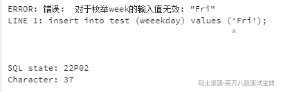

## 8.8 IP类型

PGSQL支持IP类型的存储，支持IPv4，IPv6这种，甚至Mac内种诡异类型也支持

这种IP类型，可以在存储IP时，帮助做校验，其次也可以针对IP做范围查找。

IP校验的效果

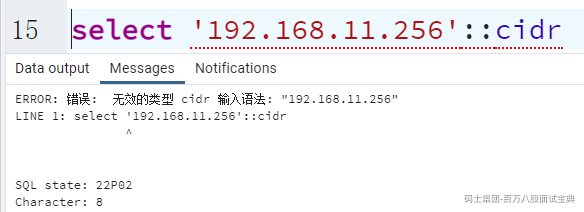

IP也支持范围查找。

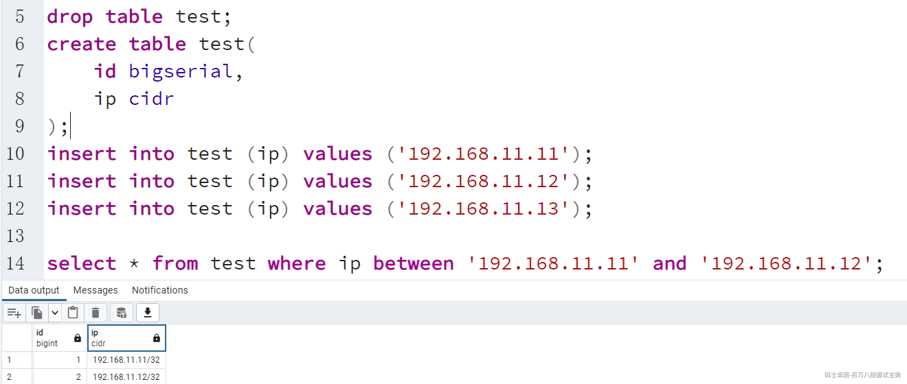

## 8.9 JSON&JSONB类型

JSON在MySQL8.x中也做了支持，但是MySQL支持的不好，因为JSON类型做查询时，基本无法给JSON字段做索引。

PGSQL支持JSON类型以及JSONB类型。

JSON和JSONB的使用基本没区别。

撇去JSON类型，本质上JSON格式就是一个字符串，比如MySQL5.7不支持JSON的情况的下，使用text也可以，但是字符串类型无法校验JSON的格式，其次单独的字符串没有办法只获取JSON中某个key对应的value。

JSON和JSONB的区别：

- JSON类型无法构建索引，JSONB类型可以创建索引。

- JSON类型的数据中多余的空格会被存储下来。JSONB会自动取消多余的空格。

- JSON类型甚至可以存储重复的key，以最后一个为准。JSONB不会保留多余的重复key（保留最后一个）。

- JSON会保留存储时key的顺序，JSONB不会保留原有顺序。

JSON中key对应的value的数据类型

|  |  |
| --- | --- |
| JSON | PGSQL |
| String | text |
| number | numeric |
| boolean | boolean |
| null | (none) |

```json
[
  {"name": "张三"},
  {"name": {
      "info": "xxx"
    }}

]
```

操作JSON：

- 上述的四种JSON存储的类型：

```plain
select '9'::JSON,'null'::JSON,'"laozheng"'::JSON,'true'::json;
select '9'::JSONB,'null'::JSONB,'"laozheng"'::JSONB,'true'::JSONB;
```

- JSON数组

```plain
select '[9,true,null,"我是字符串"]'::JSON;
```

- JSON对象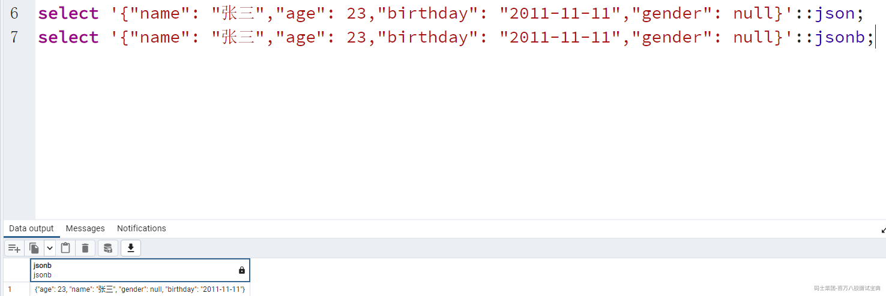

```plain
select '{"name": "张三","age": 23,"birthday": "2011-11-11","gender": null}'::json;
select '{"name": "张三","age": 23,"birthday": "2011-11-11","gender": null}'::jsonb;
```

- 构建表存储JSON

```plain
create table test(
    id bigserial,
    info json,
    infob jsonb
);
insert into
  test
(info,infob)   
  values 
('{"name":            "张三"              ,"age": 23,"birthday": "2011-11-11","gender": null}',
'{"name":               "张三"             ,"age": 23,"birthday": "2011-11-11","gender": null}')
select * from test;
```

- 构建索引的效果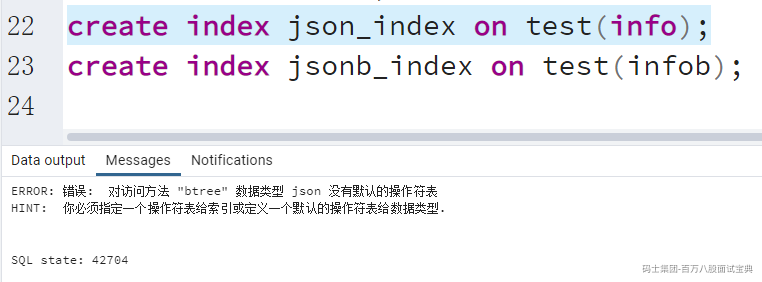

```plain
create index json_index on test(info);
create index jsonb_index on test(infob);
```

JSON还支持很多函数。可以直接查看 <http://www.postgres.cn/docs/12/functions-json.html> 函数太多了，不分析了。

## 8.10 复合类型

复合类型就好像Java中的一个对象，Java中有一个User，User和表做了一个映射，User中有个人信息对象。可以基于符合类型对映射上个人信息。

```java
public class User{
   private Integer id;
   private Info info;
}

class Info{
   private String name;
   private Integer age;
}
```

按照上面的情况，将Info构建成一个复合类型

```sql
-- 构建复合类型，映射上Info
create type info_type as (name varchar(32),age int);
-- 构建表，映射User
create table tb_user(
    id serial,
    info info_type
);
-- 添加数据
insert into tb_user (info) values (('张三',23));
insert into tb_user (info) values (('露丝',233));
insert into tb_user (info) values (('jack',33));
insert into tb_user (info) values (('李四',24));
select * from tb_user;
```

## 8.11 数组类型

数组还是要依赖其他类型，比如在设置住址，住址可能有多个住址，可以采用数组类型去修饰字符串。

PGSQL中，指定数组的方式就是[]，可以指定一维数组，也支持二维甚至更多维数组。

构建数组的方式：

```sql
drop table test;
create table test(
    id serial,
    col1 int[],
    col2 int[2],
    col3 int[][]
);
-- 构建表指定数组长度后，并不是说数组内容只有2的长度，可以插入更多数据
-- 甚至在你插入数据，如果将二维数组结构的数组扔到一维数组上，也可以存储。
-- 数组编写方式
select '{{how,are},{are,you}}'::varchar[];
select array[[1,2],[3,4]];
insert into test (col1,col2,col3) values ('{1,2,3}','{4,5,6}','{7,8,9}');
insert into test (col1,col2,col3) values ('{1,2,3}','{4,5,6}',array[[1,2],[3,4]]);
insert into test (col1,col2,col3) values ('{1,2,3}','{4,5,6}','{{1,2},{3,4}}');
select * from test;
```

如果现在要存储字符串数组，如果存储的数组中有双引号怎么办，有大括号怎么办。

```sql
-- 如果存储的数组中的值，有单引号怎么办？
-- 使用两个单引号，作为一个单引号使用
select '{''how''}'::varchar[];
-- 如果存储的数组中的值，有逗号怎么办？(PGSQL中的数组索引从1开始算，写0也是从1开始算。)
-- 用双引号将数组的数据包起来~
select ('{"how,are"}'::varchar[])[2];
-- 如果存储的数组中的值，有双引号怎么办？
-- 如果要添加双引号，记得转义。
select ('{"\"how\",are"}'::varchar[])[1];
```

数组的比较方式

```sql
-- 包含
select array[1,2] @> array[1];
-- 被包含
select array[1,2] <@ array[1,2,4];
-- 是否有相同元素
select array[2,4,4,45,1] && array[1];
```

# 九、表

表的构建语句，基本都会。

核心在于构建表时，要指定上一些约束。

## 9.1 约束

### 9.1.1 主键

```sql
-- 主键约束
drop table test;
create table test(
    id bigserial primary key ,
    name varchar(32)
);
```

### 9.1.2 非空

```sql
-- 非空约束
drop table test;
create table test(
    id bigserial primary key ,
    name varchar(32) not null
);
```

### 9.1.3 唯一

```sql
drop table test;
create table test(
    id bigserial primary key ,
    name varchar(32) not null,
    id_card varchar(32) unique
);
insert into test (name,id_card) values ('张三','333333333333333333');
insert into test (name,id_card) values ('李四','333333333333333333');
insert into test (name,id_card) values (NULL,'433333333333333333');
```

### 9.1.4 检查

```sql
-- 检查约束
-- 价格的表，price，discount_price
drop table test;
create table test(
    id bigserial primary key,
    name varchar(32) not null,
    price numeric check(price > 0),
    discount_price numeric check(discount_price > 0),
    check(price >= discount_price)
);
insert into test (name,price,discount_price) values ('粽子',122,12);
```

### 9.1.5 外键（不玩）

### 9.1.6 默认值

一般公司内，要求表中除了主键和业务字段之外，必须要有5个字段

created，create\_id，updated，update\_id，is\_delete

```sql
-- 默认值
create table test(
    id bigserial primary key,
    created timestamp default current_timestamp
);
```

## 9.2 触发器

触发器Trigger，是由事件出发的一种存储过程

当对标进行insert，update，delete，truncate操作时，会触发表的Trigger（看触发器的创建时指定的事件）

构建两张表，学生信息表，学生分数表。

在删除学生信息的同时，自动删除学生的分数。

先构建表信息，填充数据

```sql
create table student(
    id int,
    name varchar(32)
);
create table score(
    id int,
    student_id int,
    math_score numeric,
    english_score numeric,
    chinese_score numeric
);
insert into student (id,name) values (1,'张三');
insert into student (id,name) values (2,'李四');
insert into
    score
(id,student_id,math_score,english_score,chinese_score)
    values
(1,1,66,66,66);

insert into
    score
(id,student_id,math_score,english_score,chinese_score)
    values
(2,2,55,55,55);

select * from student;
select * from score;
```

为了完成级联删除的操作，需要编写pl/sql。

先查看一下PGSQL支持的plsql，查看一下PGSQL的plsql语法

```sql
[ <<label>> ]
[ DECLARE
    declarations ]
BEGIN
    statements
END [ label ];
```

构建一个存储函数，测试一下plsql

```sql
-- 优先玩一下plsql
-- $$可以理解为是一种特殊的单引号，避免你在declare，begin，end中使用单引号时，出现问题，
-- 需要在编写后，在$$之后添加上当前内容的语言。
create function test() returns int as $$
declare
    money int := 10;
begin
    return money;
end;
$$ language plpgsql;

select test();
```

在简单了解了一下plpgsql的语法后，编写一个触发器函数。

触发器函数允许使用一些特殊变量

```sql
NEW
数据类型是RECORD；该变量为行级触发器中的INSERT/UPDATE操作保持新数据行。在语句级别的触发器以及DELETE操作，这个变量是null。

OLD
数据类型是RECORD；该变量为行级触发器中的UPDATE/DELETE操作保持新数据行。在语句级别的触发器以及INSERT操作，这个变量是null。
```

构建一个删除学生分数的触发器函数。

```sql
-- 构建一个删除学生分数的触发器函数。
create function trigger_function_delete_student_score() returns trigger as $$
begin
    delete from score where student_id = old.id;
    return old;
end;
$$ language plpgsql;
```

开始构建触发器，在学生信息表删除时，执行前面声明的触发器函数

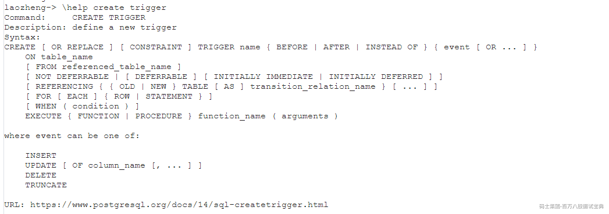

```sql
CREATE [ OR REPLACE ] [ CONSTRAINT ] TRIGGER name { BEFORE | AFTER | INSTEAD OF } { event [ OR ... ] }
    ON table_name
    [ FROM referenced_table_name ]
    [ NOT DEFERRABLE | [ DEFERRABLE ] [ INITIALLY IMMEDIATE | INITIALLY DEFERRED ] ]
    [ REFERENCING { { OLD | NEW } TABLE [ AS ] transition_relation_name } [ ... ] ]
    [ FOR [ EACH ] { ROW | STATEMENT } ]
    [ WHEN ( condition ) ]
    EXECUTE { FUNCTION | PROCEDURE } function_name ( arguments )

where event can be one of:

    INSERT
    UPDATE [ OF column_name [, ... ] ]
    DELETE
    TRUNCATE
```

> 当 `CONSTRAINT`选项被指定，这个命令会创建一个 *约束触发器* 。这和一个常规触发器相同，不过触发该触发器的时机可以使用[SET CONSTRAINTS](http://www.postgres.cn/docs/12/sql-set-constraints.html)调整。约束触发器必须是表上的 `AFTER ROW`触发器。它们可以在导致触发器事件的语句末尾被引发或者在包含该语句的事务末尾被引发。在后一种情况中，它们被称作是被 *延迟* 。一个待处理的延迟触发器的引发也可以使用 `SET CONSTRAINTS`立即强制发生。当约束触发器实现的约束被违背时，约束触发器应该抛出一个异常。

描绘一波~~

```sql
-- 编写触发器，指定在删除某一行学生信息时，触发当前触发器，执行触发器函数
create trigger trigger_student 
after 
delete 
on student 
for each row 
execute function trigger_function_delete_student_score();
-- 测试效果
select * from student;
select * from score;
delete from student where id = 1;
```

## 9.3 表空间（问题填坑）

在存储数据时，数据肯定要落到磁盘上，基于构建的tablespace，指定数据存放在磁盘上的物理地址。

如果没有自己设计tablespace，PGSQL会自动指定一个位置作为默认的存储点。

可以通过一个函数，查看表的物理数据存放在了哪个磁盘路径下。

```sql
-- 查询表存储的物理地址
select pg_relation_filepath('student');
```


这个位置是在$PG\_DATA后的存放地址

```sql
$PG_DATA == /var/lib/pgsql/12/data/
```

41000其实就是存储数据的物理文件

---

构建表空间，指定数据存放位置

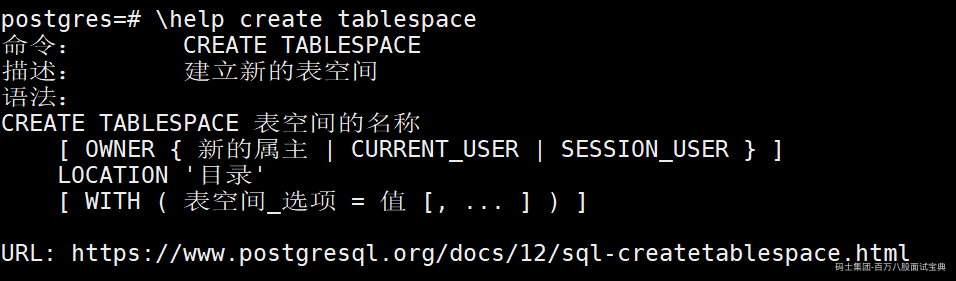

```plain
-- 构建表空间,构建表空间需要用户权限是超级管理员，其次需要指定的目录已经存在
create tablespace tp_test location '/var/lib/pgsql/12/tp_test';
```

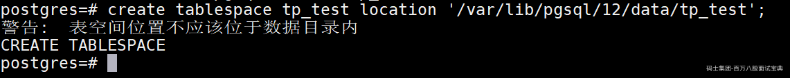

构建数据库，以及表，指定到这个表空间中

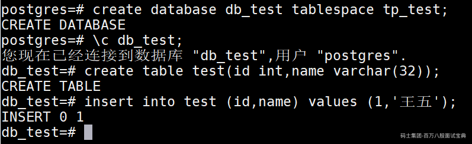

其实指定表空间的存储位置后，PGSQL会在$PG\_DATA目录下存储一份，同时在咱们构建tablespace时，指定的路径下也存储一份。

这两个绝对路径下的文件都有存储表中的数据信息。

```plain
/var/lib/pgsql/12/data/pg_tblspc/41015/PG_12_201909212/41016/41020
/var/lib/pgsql/12/lz_tp_test/PG_12_201909212/41016/41020
```

进一步会发现，其实在PGSQL的默认目录下，存储的是一个link，连接文件，类似一个快捷方式

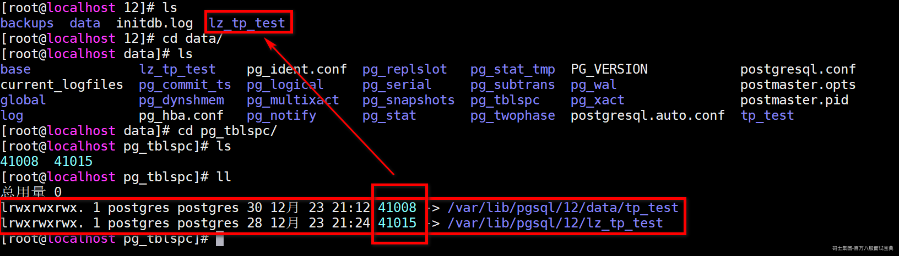

## 9.4 视图

跟MySQL的没啥区别，把一些复杂的操作封装起来，还可以隐藏一些敏感数据。

视图对于用户来说，就是一张真实的表，可以直接基于视图查询一张或者多张表的信息。

视图对于开发来说，就是一条SQL语句。

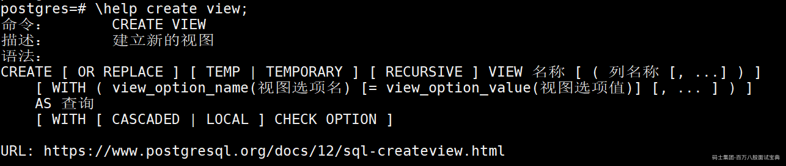

在PGSQL中，简单（单表）的视图是允许写操作的。

但是强烈不推荐对视图进行写操作，虽然PGSQL默认允许（简单的视图）。

写入的时候，其实修改的是表本身

```sql
-- 构建一个简单视图
create view vw_score as 
(select id,math_score from score);

select * from vw_score;
update vw_score set math_score = 99 where id = 2;
```

多表视图

```sql
-- 复杂视图(两张表关联)
create view vw_student_score as 
(select stu.id as id ,stu.name as name ,score.math_score from student stu,score score where stu.id = score.student_id);

select * from vw_student_score;

update vw_student_score set math_score =999 where id = 2;
```

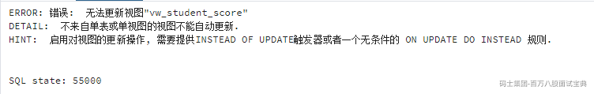

## 9.5 索引

### 9.5.1 索引的基本概念

先了解概念和使用

索引是数据库中快速查询数据的方法。

索引能提升查询效率的同时，也会带来一些问题

- 增加了存储空间

- 写操作时，花费的时间比较多

索引可以提升效率，甚至还可以给字段做一些约束

### 9.5.2 索引的分类

B-Tree索引：最常用的索引。

Hash索引：跟MySQL类似，做等值判断，范围凉凉~

GIN索引：针对字段的多个值的类型，比如数组类型。

### 9.5.3 创建索引看效果

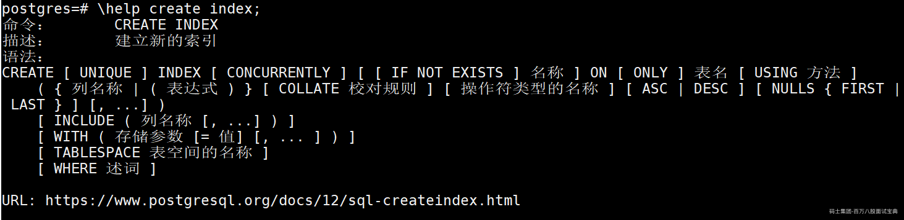

准备大量测试数据，方便查看索引效果

```sql
-- 测试索引效果
create table tb_index(
    id bigserial primary key,
    name varchar(64),
    phone varchar(64)[]
);

-- 添加300W条数据测试效果
do $$
declare
    i int := 0;
begin
    while i < 3000000 loop
        i = i + 1;
        insert into
            tb_index
        (name,phone) 
            values
        (md5(random()::text || current_timestamp::text)::uuid,array[random()::varchar(64),random()::varchar(64)]);
    end loop;
end;
$$ language plpgsql;
```

在没有索引的情况下，先基于name做等值查询，看时间，同时看执行计划

```sql
-- c0064192-1836-b019-c649-b368c2be31ca
select * from tb_index where id = 2222222;
select * from tb_index where name = 'c0064192-1836-b019-c649-b368c2be31ca';
explain select * from tb_index where name = 'c0064192-1836-b019-c649-b368c2be31ca';
-- Seq Scan  这个代表全表扫描
-- 时间大致0.3秒左右
```

在有索引的情况下，再基于name做等值查询，看时间，同时看执行计划

```sql
-- name字段构建索引（默认就是b-tree）
create index index_tb_index_name on tb_index(name);
-- 测试效果
select * from tb_index where name = 'c0064192-1836-b019-c649-b368c2be31ca';
explain select * from tb_index where name = 'c0064192-1836-b019-c649-b368c2be31ca';
-- Index Scan 使用索引
-- 0.1s左右
```

---

测试GIN索引效果

在没有索引的情况下，基于phone字段做包含查询

```sql
-- phone：{0.6925242730781953,0.8569644964711074}
select * from tb_index where phone @> array['0.6925242730781953'::varchar(64)];
explain select * from tb_index where phone @> array['0.6925242730781953'::varchar(64)];
-- Seq Scan 全表扫描
-- 0.5s左右
```

给phone字段构建GIN索引，在查询

```sql
-- 给phone字符串数组类型字段构建一个GIN索引
create index index_tb_index_phone_gin on tb_index using gin(phone);
-- 查询
select * from tb_index where phone @> array['0.6925242730781953'::varchar(64)];
explain select * from tb_index where phone @> array['0.6925242730781953'::varchar(64)];
-- Bitmap Index 位图扫描
-- 0.1s以内完成
```

## 9.6 物化视图

前面说过普通视图，本质就是一个SQL语句，普通的视图并不会本地磁盘存储任何物理。

每次查询视图都是执行这个SQL。效率有点问题。

物化视图从名字上就可以看出来，必然是要持久化一份数据的。使用套路和视图基本一致。这样一来查询物化视图，就相当于查询一张单独的表。相比之前的普通视图，物化视图就不需要每次都查询复杂SQL，每次查询的都是真实的物理存储地址中的一份数据（表）。

物化视图因为会持久化到本地，完全脱离原来的表结构。

而且物化视图是可以单独设置索引等信息来提升物化视图的查询效率。

But，有好处就有坏处，更新时间不太好把控。 如果更新频繁，对数据库压力也不小。 如果更新不频繁，会造成数据存在延迟问题，实时性就不好了。

如果要更新物化视图，可以采用触发器的形式，当原表中的数据被写后，可以通过触发器执行同步物化视图的操作。或者就基于定时任务去完成物化视图的数据同步。

look 一下语法。

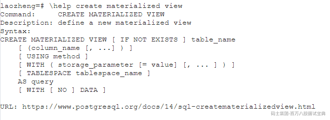

干活！

```sql
-- 构建物化视图
create materialized view mv_test as (select id,name,price from test);
-- 操作物化视图和操作表的方式没啥区别。
select * from mv_test;
-- 操作原表时，对物化视图没任何影响
insert into test values (4,'月饼',50,10);
-- 物化视图的添加操作(不允许写物化视图)，会报错
insert into mv_test values (5,'大阅兵',66);
```

物化视图如何从原表中进行同步操作。

PostgreSQL中，对物化视图的同步，提供了两种方式，一种是全量更新，另一种是增量更新。

全量更新语法，没什么限制，直接执行，全量更新

```sql
-- 查询原来物化视图的数据
select * from mv_test;
-- 全量更新物化视图
refresh materialized view mv_test;
-- 再次查询物化视图的数据
select * from mv_test;
```

增量更新，增量更新需要一个唯一标识，来判断哪些是增量，同时也会有行数据的版本号约束。

```sql
-- 查询原来物化视图的数据
select * from mv_test;
-- 增量更新物化视图，因为物化视图没有唯一索引，无法判断出哪些是增量数据
refresh materialized view concurrently mv_test;
-- 给物化视图添加唯一索引。
create unique index index_mv_test on mv_test(id);
-- 增量更新物化视图
refresh materialized view concurrently mv_test;
-- 再次查询物化视图的数据
select * from mv_test;
-- 增量更新时，即便是修改数据，物化视图的同步，也会根据一个xmin和xmax的字段做正常的数据同步

update test set name = '汤圆' where id = 5;
insert into test values (5,'猪头肉',99,40);
select * from test;
```

# 十、事务

## 10.1 什么是ACID？（常识）

在日常操作中，对于一组相关操作，通常要求要么都成功，要么都失败。在关系型数据库中，称这一组操作为事务。为了保证整体事务的安全性，有ACID这一说：

- 原子性A：事务是一个最小的执行单位，一次事务中的操作要么都成功，要么都失败。

- 一致性C：在事务完成时，所有数据必须保持在一致的状态。（事务完成后吗，最终结果和预期结果是一致的）

- 隔离性：一次事务操作，要么是其他事务操作前的状态，要么是其他事务操作后的状态，不存在中间状态。

- 持久性：事务提交后，数据会落到本地磁盘，修改是永久性的。

PostgreSQL中，在事务的并发问题里，也是基于MVCC，多版本并发控制去维护数据的一致性。相比于传统的锁操作，MVCC最大的有点就是可以让 **读写互相不冲突** 。

当然，PostgreSQL也支持表锁和行锁，可以解决写写的冲突问题。

PostgreSQL相比于其他数据，有一个比较大的优化，DDL也可以包含在一个事务中。比如集群中的操作，一个事务可以保证多个节点都构建出一个表，才算成功。

## 10.2 事务的基本使用

首先基于前面的各种操作，应该已经体会到了，PostgreSQL是自动提交事务。跟MySQL是一样的。

可以基于关闭PostgreSQL的自动提交事务来进行操作。

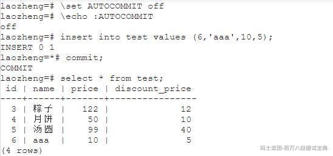

但是上述方式比较麻烦，传统的方式。

就是三个命令：

- begin：开始事务

- commit：提交事务

- rollback：回滚事务

```sql
-- 开启事务
begin;
-- 操作
insert into test values (7,'bbb',12,5);
-- 提交事务 
commit;
```

## 10.3 保存点（了解）

比如项目中有一个大事务操作，不好控制，超时有影响，回滚会造成一切重来，成本太高。

我针对大事务，拆分成几个部分，第一部分完成后，构建一个保存点。如果后面操作失败了，需要回滚，不需要全盘回滚，回滚到之前的保存点，继续重试。

有人会发现，破坏了整体事务的原子性。

But，只要操作合理，可以在保存点的举出上，做重试，只要重试不成功，依然可以全盘回滚。

比如一个电商项目，下订单，扣库存，创建订单，删除购物车，增加用户积分，通知商家…………。这个其实就是一个大事务。可以将扣库存和下订单这种核心功能完成后，增加一个保存点，如果说后续操作有失败的，可以从创建订单成功后的阶段，再做重试。

不过其实上述的业务，基于最终一致性有更好的处理方式，可以保证可用性。

简单操作一下。

```sql
-- savepoint操作
-- 开启事务
begin;
-- 插入一条数据
insert into test values (8,'铃铛',55,11);
-- 添加一个保存点
savepoint ok1;
-- 再插入数据,比如出了一场
insert into test values (9,'大唐官府',66,22);
-- 回滚到之前的提交点
rollback to savepoint ok1;
-- 就可以开始重试操作，重试成功，commit，失败可以rollback;
commit;
```

# 十一、并发问题

## 11.1 事务的隔离级别

在不考虑隔离性的前提下，事务的并发可能会出现的问题：

- 脏读：读到了其他事务未提交的数据。（必须避免这种情况）

- 不可重复读：同一事务中，多次查询同一数据，结果不一致，因为其他事务修改造成的。（一些业务中这种不可重复读不是问题）

- 幻读：同一事务中，多次查询同一数据，因为其他事务对数据进行了增删吗，导致出现了一些问题。（一些业务中这种幻读不是问题）

针对这些并发问题，关系型数据库有一些事务的隔离级别，一般用4种。

- READ UNCOMMITTED：读未提交（啥用没用，并且PGSQL没有，提供了只是为了完整性）

- READ COMMITTED：读已提交，可以解决脏读（PGSQL默认隔离级别）

- REPEATABLE READ：可重复读，可以解决脏读和不可重复读（MySQL默认是这个隔离级别，PGSQL也提供了，但是设置为可重复读，效果还是串行化）

- SERIALIZABLE：串行化，啥都能解决（锁，效率慢）

PGSQL在老版本中，只有两个隔离级别，读已提交和串行化。在PGSQL中就不存在脏读问题。

## 11.2 MVCC

首先要清楚，为啥要有MVCC。

如果一个数据库，频繁的进行读写操作，为了保证安全，采用锁的机制。但是如果采用锁机制，如果一些事务在写数据，另外一个事务就无法读数据。会造成读写之间相互阻塞。 大多数的数据库都会采用一个机制 **多版本并发控制 MVCC** 来解决这个问题。

比如你要查询一行数据，但是这行数据正在被修改，事务还没提交，如果此时对这行数据加锁，会导致其他的读操作阻塞，需要等待。如果采用PostgreSQL，他的内部会针对这一行数据保存多个版本，如果数据正在被写入，包就保存之前的数据版本。让读操作去查询之前的版本，不需要阻塞。等写操作的事务提交了，读操作才能查看到最新的数据。 这几个及时可以确保 **读写操作没有冲突** ，这个就是MVCC的主要特点。

**写写操作，和MVCC没关系，那个就是加锁的方式！**

**Ps：这里的MVCC是基于** ***读已提交*** **去聊的，如果是串行化，那就读不到了。**

在操作之前，先了解一下PGSQL中，每张表都会自带两个字段

- xmin：给当前事务分配的数据版本。如果有其他事务做了写操作，并且提交事务了，就给xmin分配新的版本。

- xmax：当前事务没有存在新版本，xmax就是0。如果有其他事务做了写操作，未提交事务，将写操作的版本放到xmax中。提交事务后，xmax会分配到xmin中，然后xmax归0。

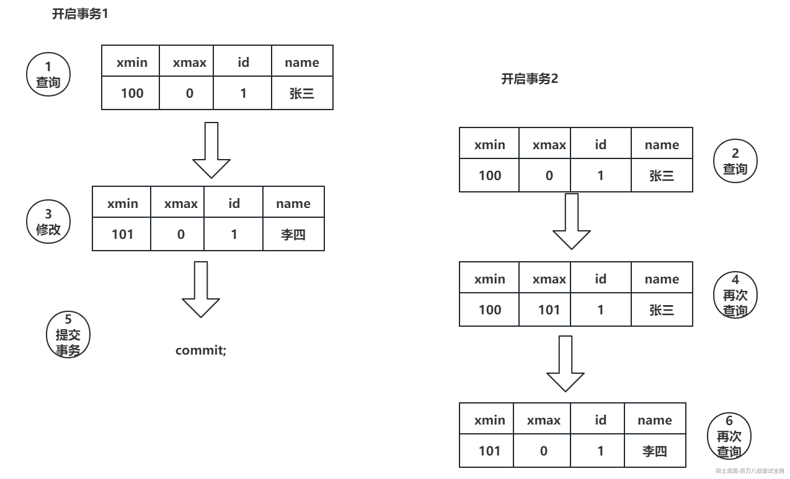

基于上图的操作查看一波效果

事务A

```sql
-- 左，事务A
--1、开启事务
begin;
--2、查询某一行数据,  xmin = 630,xmax = 0
select xmin,xmax,* from test where id = 8;
--3、每次开启事务后，会分配一个事务ID 事务id=631
select txid_current();
--7、修改id为8的数据，然后在本事务中查询   xmin = 631, xmax = 0
update test set name = '铃铛' where id = 8;
select xmin,xmax,* from test where id = 8;
--9、提交事务
commit;
```

事务B

```sql
-- 右，事务B
--4、开启事务
begin;
--5、查询某一行数据,  xmin = 630,xmax = 0
select xmin,xmax,* from test where id = 8;
--6、每次开启事务后，会分配一个事务ID 事务id=632
select txid_current();
--8、事务A修改完，事务B再查询  xmin = 630  xmax = 631
select xmin,xmax,* from test where id = 8;
--10、事务A提交后，事务B再查询  xmin = 631  xmax = 0
select xmin,xmax,* from test where id = 8;
```

# 十二、锁

PostgreSQL中主要有两种锁，一个表锁一个行锁

PostgreSQL中也提供了页锁，咨询锁，But，这个不需要关注，他是为了锁的完整性

## 12.1 表锁

表锁显而易见，就是锁住整张表。表锁也分为很多中模式。

表锁的模式很多，其中最核心的两个：

- ACCESS SHARE：共享锁（读锁），读读操作不阻塞，但是不允许出现写操作并行

- ACCESS EXCLUSIVE：互斥锁（写锁），无论什么操作进来，都阻塞。

具体的可以查看官网文档：<http://postgres.cn/docs/12/explicit-locking.html>

表锁的实现：

先查看一波语法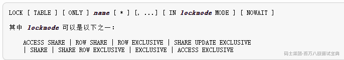

就是基于LOCK开启表锁，指定表的名字name，其次在MODE中指定锁的模式，NOWAIT可以指定是否在没有拿到锁时，一致等待。

```sql
-- 111号连接
-- 基于互斥锁，锁住test表
-- 先开启事务
begin;
-- 基于默认的ACCESS EXCLUSIVE锁住test表
lock test in ACCESS SHARE mode;
-- 操作
select * from test;
-- 提交事务，锁释放
commit;
```

当111号连接基于事务开启后，锁住当前表之后，如果使用默认的ACCESS EXCLUSIVE，其他连接操作表时，会直接阻塞住。

如果111号是基于ACCESS SHARE共享锁时，其他线程查询当前表是不会锁住得

## 12.2 行锁

PostgreSQL的行锁和MySQL的基本是一模一样的，基于select for update就可以指定行锁。

MySQL中有一个概念，for update时，如果select的查询没有命中索引，可能会锁表。

PostgerSQL有个特点，一般情况，在select的查询没有命中索引时，他不一定会锁表，依然会实现行锁。

PostgreSQL的行锁，就玩俩，一个for update，一个for share。  
在开启事务之后，直接执行select \* from table where 条件 for update;

```sql
-- 先开启事务
begin;
-- 基于for update 锁住id为3的数据
select * from test where id = 3 for update;
update test set name = 'v1' where id = 3;
-- 提交事务，锁释放
commit;
```

其他的连接要锁住当前行，会阻塞住。

# 十三、备份&恢复

防止数据丢失的第一道防线就是备份。数据丢失有的是硬件损坏，还有人为的误删之类的，也有BUG的原因导致误删数据。

正常备份和恢复，如果公司有DBA，一般咱们不用参与，BUT，学的Java，啥都得会点~~

在PostgreSQL中，有三种备份方式：

**SQL备份（逻辑备份）** ：其实就是利用数据库自带的类似dump的命令，或者是你用图形化界面执行导入导出时，底层就是基于这个dump命令实现的。备份出来一份sql文件，谁需要就复制给谁。

优点：简单，方便操作，有手就行，还挺可靠。

缺点：数据数据量比较大，这种方式巨慢，可能导出一天，都无法导出完所有数据。

**文件系统备份（物理备份）** ：其实就是找到当前数据库，数据文件在磁盘存储的位置，将数据文件直接复制一份或多份，存储在不同的物理机上，即便物理机爆炸一个，还有其他物理机。

优点：相比逻辑备份，恢复的速度快。

缺点：在备份数据时，可能数据还正在写入，一定程度上会丢失数据。 在恢复数据时，也需要注意数据库的版本和环境必须保持高度的一致。如果是线上正在运行的数据库，这种复制的方式无法在生产环境实现。

**如果说要做数据的迁移，这种方式还不错滴。**

**归档备份：（也属于物理备份）**

先了解几个概念，在PostgreSQL有多个子进程来辅助一些操作

- BgWriter进程：BgWriter是将内存中的数据写到磁盘中的一个辅助进程。当向数据库中执行写操作后，数据不会马上持久化到磁盘里。这个主要是为了提升性能。BgWriter会周期性的将内存中的数据写入到磁盘。但是这个周期时间，长了不行，短了也不行。

- 如果快了，IO操作频繁，效率慢。

- 如果慢了，有查询操作需要内存中的数据时，需要BgWriter现把数据从内存写到磁盘中，再提供给查询操作作为返回结果。会导致查询操作效率变低。

- 考虑一个问题： **事务提交了，数据没落到磁盘，这时，服务器宕机了怎么办？**

- WalWriter进程：WAL就是write ahead log的缩写，说人话就是预写日志（redo log）。其实数据还在内存中时，其实已经写入到WAL日志中一份，这样一来，即便BgWriter进程没写入到磁盘中时，数据也不会存在丢失的问题。

- WAL能单独做备份么？单独不行！

- 但是WAL日志有个问题，这个日志会循环使用，WAL日志有大小的线程，只能保存指定时间的日志信息，如果超过了，会覆盖之前的日志。

- PgArch进程：WAL日志会循环使用，数据会丢失。没关系，还有一个归档的进程，会在切换wal日志前，将WAL日志备份出来。PostgreSQL也提供了一个全量备份的操作。可以根据WAL日志，选择一个事件点，进行恢复。

查看一波WAL日志：

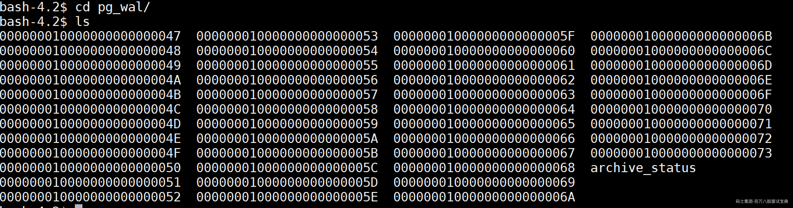

这些就是归档日志

> wal日志的名称，是三块内容组成，
>
> 没8个字符分成一组，用16进制标识的
>
> 00000001 00000000 0000000A
>
> 时间线 逻辑id 物理id

查询当前库用的是哪个wal日志

```sql
-- 查看当前使用的wal日志  查询到的lsn：0/47233270
select pg_current_wal_lsn();
-- 基于lsn查询具体的wal日志名称  000000010000000000000047
select pg_walfile_name('0/47233270');
```

归档默认不是开启的，需要手动开启归档操作，才能保证wal日志的完整性

修改postgresql.conf文件

```plain
# 开启wal日志的内容，注释去掉即可
wal_level = replica
fsync = on
```

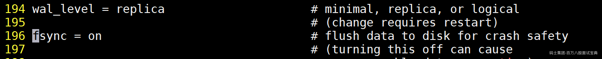

```plain
# 开启归档操作
archive_mode = on
# 修改一小下命令，修改存放归档日志的路径
archive_command = 'test ! -f /archive/%f && cp %p /archive/%f'
```

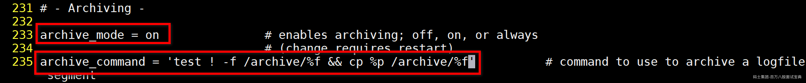

**修改完上述配置文件后，记得重启postgreSQL进程，才会生效！！！！**

归档操作执行时，需要保证/archive存在，并且postgres用户有权限进行w操作

构建/archive路径

```bash
# postgres没有权限在/目录下构建目录
# 切换到root，构建目录，将目录的拥有者更改为postgres
mkdir /archive
chown -R postgres. archive
```

在当前库中做大量写操作，接入到wal日志，重置切换wal日志，再查看归档情况

发现，将当前的正在使用的wal日志和最新的上一个wal日志归档过来了，但是之前的没归档，不要慌，后期备份时，会执行命令，这个命令会直接要求wal日志立即归档，然后最全量备份。

## 13.1 逻辑备份&恢复

PostgreSQL提供了pg\_dump以及pg\_dumpall的命令来实现逻辑备份。

这两命令差不多，看名字猜！

pg\_dump这种备份，不会造成用户对数据的操作出现阻塞。

数据库不是很大的时候，pg\_dump也不是不成！

查看一波命令：

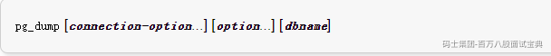

这个命令从三块去看：<http://postgres.cn/docs/12/app-pgdump.html>

- 连接的信息，指定连接哪个库，用哪个用户~

- option的信息有就点多，查看官网。

- 备份的数据库！

操作一波。

备份老郑库中的全部数据。

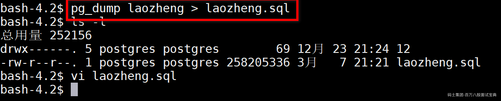

删除当前laozheng库中的表等信息，然后恢复数据

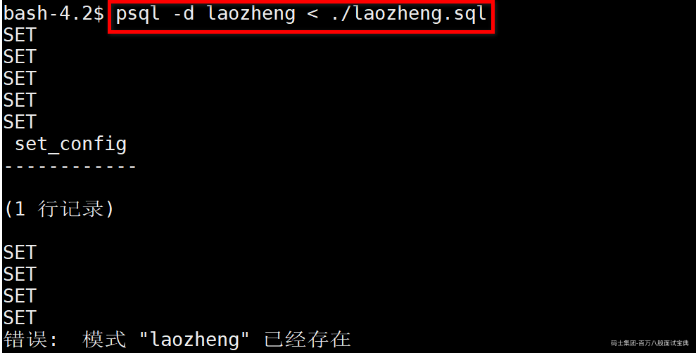

---

除此之外，也可以通过图形化界面备份，在库的位置点击备份就成，导出一个文本文件。

## 13.2 物理备份（归档+物理）

这里需要基于前面的文件系统的备份和归档备份实现最终的操作

单独使用文件系统的方式，不推荐毕竟数据会丢失。

这里直接上PostgreSQL提供的pg\_basebackup命令来实现。

pg\_basebackup会做两个事情、

- 会将内存中的脏数据落到磁盘中，然后将数据全部备份

- 会将wal日志直接做归档，然后将归档也备走。

查看一波pg\_basebackup命令

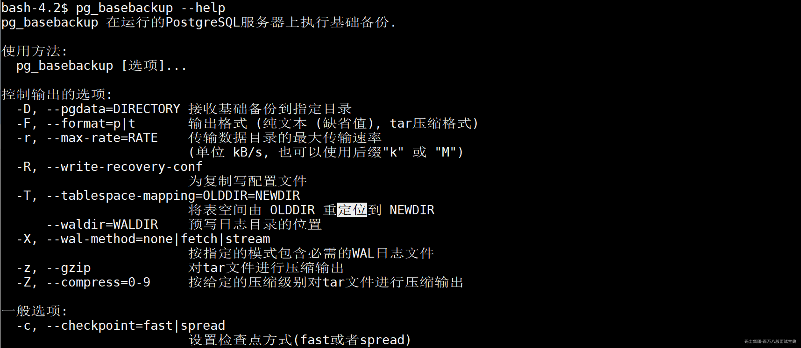

先准备一个pg\_basebackup的备份命令

```shell
# -D 指定备份文件的存储位置
# -Ft 备份文件打个包
# -Pv 输出备份的详细信息
# -U 用户名（要拥有备份的权限）
# -h ip地址  -p 端口号
# -R 复制写配置文件
pg_basebackup -D /pg_basebackup -Ft -Pv -Upostgres -h 192.168.11.32 -p 5432 -R
```

准备测试，走你~

- 提前准备出/pg\_basebackup目录。记得将拥有者赋予postgres用户

```plain
mkdir /pg_basebackup
chown -R postgres. /pg_basebackup/
```

- 给postgres用户提供replication的权限，修改pg\_hba.conf，记得重启生效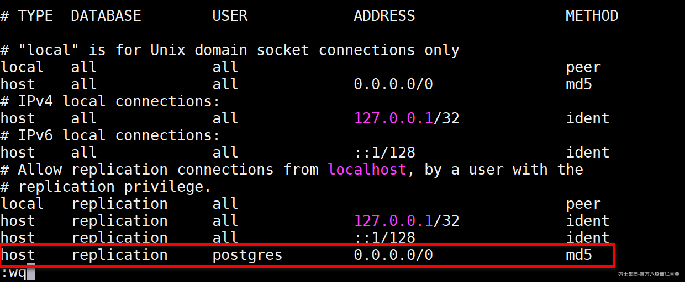

- 执行备份

```plain
pg_basebackup -D /pg_basebackup -Ft -Pv -Upostgres -h 192.168.11.32 -p 5432 -R
```

- 需要输入postgres的密码，这里可以设置，重新备份。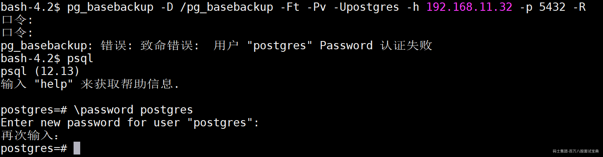

- 执行备份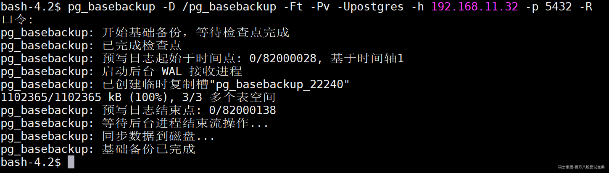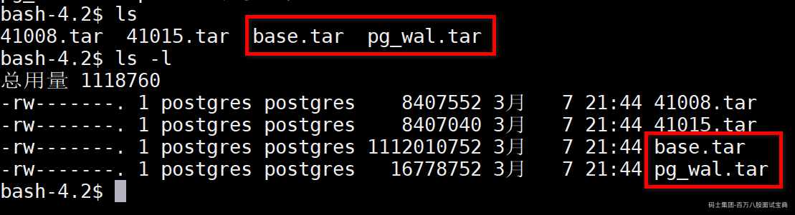

## 13.3 物理恢复（归档+物理）

模拟数据库崩盘，先停止postgresql服务，然后直接删掉data目录下的全部内容

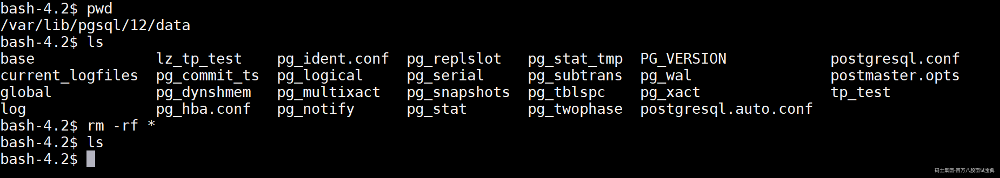

将之前备份的两个文件准备好，一个base.tar，一个pg\_wal.tar

第一步：将base.tar中的内容，全部解压到 **12/data** 目录下

第二步：将pg\_wal.tar中的内容，全部解压到 **/archive** 目录下

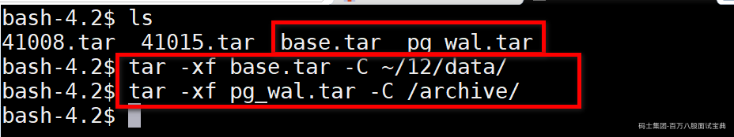

第三步：在postgresql.auto.conf文件中，指定归档文件的存储位置，以及恢复数据的方式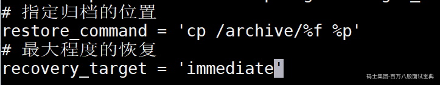

第四步：启动postgresql服务

```sql
systemctl start postgresql-12
```

第五步：启动后，发现查询没问题，但是执行写操作时，出错，不让写。需要执行一个函数，取消这种恢复数据后的状态，才允许正常的执行写操作。

```sql
select pg_wal_replay_resume();
```

## 13.4 物理备份&恢复（PITR-Point in time Recovery）

### 模拟场景

> 场景：每天凌晨02:00，开始做全备（PBK），到了第二天，如果有人14:00分将数据做了误删，希望将数据恢复到14:00分误删之前的状态？

1、恢复全备数据，使用PBK的全备数据恢复到凌晨02:00的数据。（数据会丢失很多）

2、归档恢复：备份中的归档，有02:00~14:00之间的额数据信息，可以基于归档日志将数据恢复到指定的事务id或者是指定时间点，从而实现数据的完整恢复。

### 准备场景和具体操作

1、构建一张t3表查询一些数据

```sql
-- 构建一张表
create table t3 (id int);
insert into t3 values (1);
insert into t3 values (11);
```

2、模拟凌晨2点开始做全备操作

```shell
pg_basebackup -D /pg_basebackup -Ft -Pv -Upostgres -h 192.168.11.32 -p 5432 -R
```

3、再次做一些写操作，然后误删数据

```sql
-- 凌晨2点已经全备完毕
-- 模拟第二天操作
insert into t3 values (111);
insert into t3 values (1111);
-- 误删操作  2023年3月20日20:13:26
delete from t3;
```

4、恢复数据（确认有归档日志）

将当前服务的数据全部干掉，按照之前的全备恢复的套路先走着

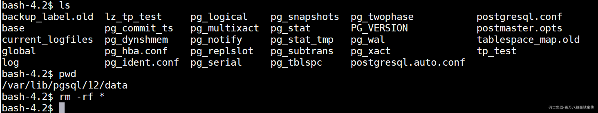

然后将全备的内容中的base.tar扔data目录下，归档日志也扔到/archive位置。

5、查看归档日志，找到指定的事务id

查看归档日志，需要基于postgresql提供的一个命令

```plain
# 如果命令未找到，说明两种情况，要么没有这个可执行文件，要么是文件在，没设置环境变量
# 咱们这是后者
pg_waldump
# 也可以采用全路径的方式
/usr/pgsql-12/bin/pg_waldump
```

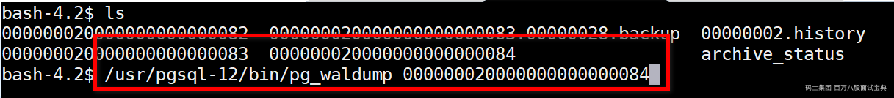

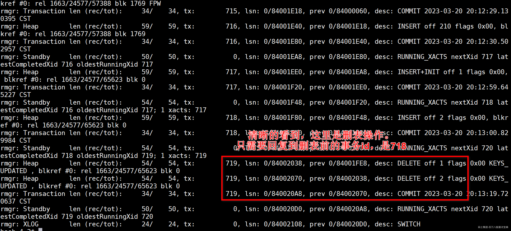

6、修改data目录下的恢复数据的方式

修改postgresql.auto.conf文件

将之前的最大恢复，更换为指定的事务id恢复

基于提供的配置例子，如何指定事务id

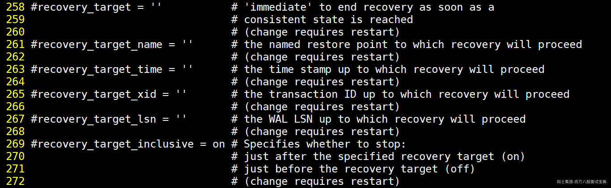

修改postgresql.auto.conf文件指定好事务ID

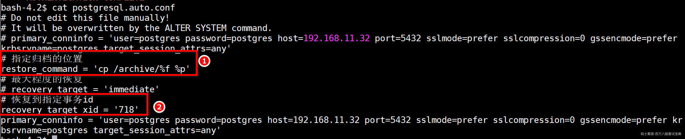

7、启动postgreSQL服务，查看是否恢复到指定事务ID

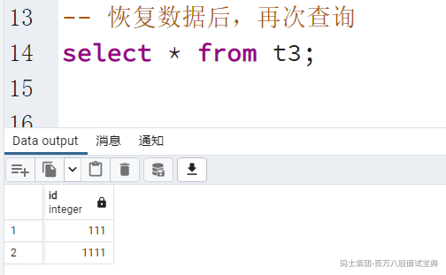

8、记得执行会后的函数，避免无法执行写操作

```plain
select pg_wal_replay_resume();
```

# 十四、数据迁移

PostgreSQL做数据迁移的插件非常多，可以从MySQL迁移到PostgreSQL也可以基于其他数据源迁移到PostgreSQL

这种迁移的插件很多，这里只说一个，pgloader（巨方便）

以MySQL数据迁移到PostgreSQL为例，分为几个操作：

1、准备MySQL服务（防火墙问题，远程连接问题，权限问题）

准备了一个sms\_platform的库，里面大概有26W条左右的数据

2、准备PostgreSQL的服务（使用当前一直玩的PostgreSQL）

3、安装pgloader

pgloader可以安装在任何位置，比如安装在MySQL所在服务，或者PostgreSQL所在服务，再或者一个独立的服务都可以

我就在PostgreSQL所在服务安装

```bash
# 用root用户下载
yum -y install pgloader
```

4、准备pgloader需要的脚本文件

官方文档： <https://pgloader.readthedocs.io/en/latest/>

**记住，PostgreSQL的数据库需要提前构建好才可以！！！！**

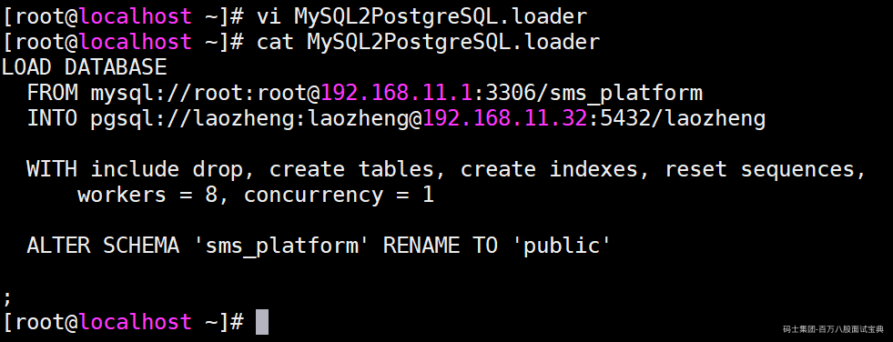

5、执行脚本，完成数据迁移

先确认pgloader命令可以使用

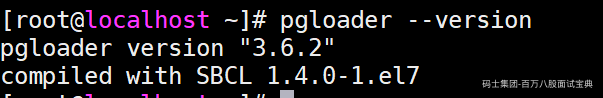

执行脚本：

```plain
pgloader 刚刚写好的脚本文件
```

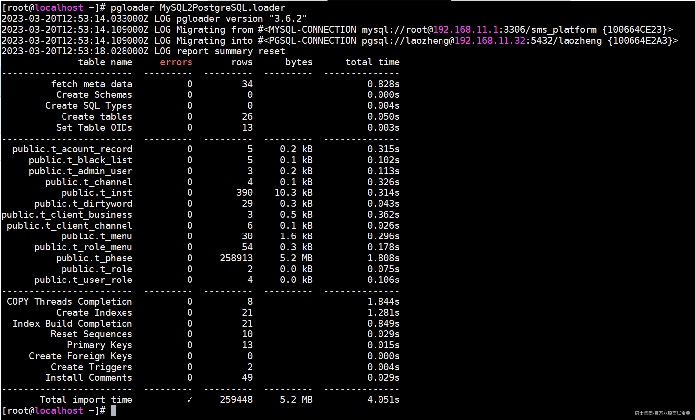

# 十五、主从操作

PostgreSQL自身只支持简单的主从，没有主从自动切换，仿照类似Nginx的效果一样，采用keepalived的形式，在主节点宕机后，通过脚本的执行完成主从切换。

## 15.1 主从实现（异步流复制）

操作方式类似与之前的备份和恢复

### 1、准备环境：

|  |  |  |
| --- | --- | --- |
| 角色 | IP | 端口 |
| Master | 192.168.11.66 | 5432 |
| Standby | 192.168.11.67 | 5432 |

准备两台虚拟机，完成上述的环境准备

修改好ip，安装好postgresql服务

### 2、给主准备一些数据

```sql
create table t1 (id int);
insert into t1 values (111);
select * from t1;
```

### 3、配置主节点信息（主从都配置，因为后面会有主从切换的操作）

修改 **pg\_hba.conf** 文件

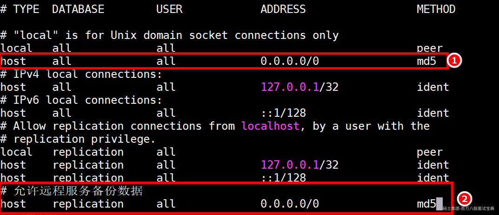

修改 **postgresql.conf** 文件

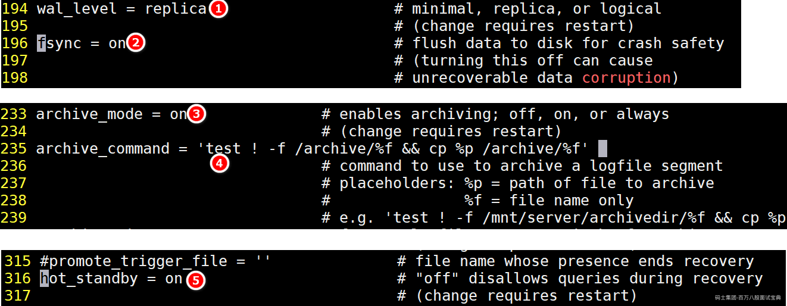

提前构建好归档日志和备份目录，并且设置好拥有者

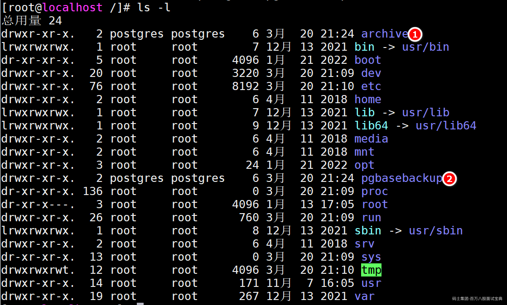

重启PostgreSQL服务

```plain
systemctl restart postgresql-12
```

### 4、从节点加入到主节点

关闭从节点服务

```plain
systemctl stop postgresql-12
```

删除从节点数据（删除data目录）

```plain
rm -rf ~/12/data/*
```

基于pbk去主节点备份数据

```shell
# 确认好备份的路径，还有主节点的ip
pg_basebackup -D /pgbasebackup -Ft -Pv -Upostgres -h 192.168.11.66 -p 5432 -R
```

恢复数据操作，解压tar包

```bash
cd /pgbasebackuo
tar -xf base.tar -C ~/12/data
tar -xf pg_wal.tar -C /archive
```

修改postgresql.auto.conf文件

```plain
# 确认有这两个配置，一般第一个需要手写，第二个会自动生成
restore_command = 'cp /archive/%f %p'
primary_conninfo = 'user=postgres password=postgres host=192.168.11.66 port=5432 sslmode=prefer sslcompression=0 gssencmode=prefer krbsrvname=postgres target_session_attrs=any'
```

修改standby.signal文件，开启从节点备份模式

```plain
# 开启从节点备份
standby_mode = 'on'
```

启动从节点服务

```plain
systemctl restart postgresql-12
```

查看主从信息

- 查看从节点是否有t1表

- 主节点添加一行数据，从节点再查询，可以看到最新的数据

- 从节点无法完成写操作，他是只读模式

- 主节点查看从节点信息

```plain
select * from pg_stat_replication
```

- 从节点查看主节点信息

```plain
select * from pg_stat_wal_receiver
```

## 15.2 主从切换（不这么玩）

其实主从的本质就是从节点去主节点不停的备份新的数据。

配置文件的系统其实就是两个：

- standby.signal文件，这个是从节点开启备份

- postgresql.auto.conf文件，这个从节点指定主节点的地址信息

切换就是原主追加上述配置，原从删除上述配追

1、主从节点全部stop停止：………………

2、原从删除上述配置：…………

3、原从新主启动服务：………

4、原主新从去原从新主备份一次数据：pg\_basebackup操作，同时做解压，然后修改postgresql.conf文件以及standby.signal配置文件

5、启动原主新从查看信息

## 15.3 主从故障切换

默认情况下，这里的主从备份是异步的，导致一个问题，如果主节点写入的数据还没有备份到从节点，主节点忽然宕机了，导致后面如果基于上述方式实现主从切换，数据可能丢失。

PGSQL在9.5版本后提供了一个pg\_rewind的操作，基于归档日志帮咱们做一个比对，比对归档日志，是否有时间差冲突。

实现操作：

1、rewind需要开启一项配置才可以使用

修改postgresql.conf中的 **wal\_log\_hints = 'on'**

2、为了可以更方便的使用rewind，需要设置一下 **/usr/pgsql-12/bin/** 的环境变量

```plain
vi /etc/profile
  追加信息
  export PATH=/usr/pgsql-12/bin/:$PATH
source /etc/profile
```

3、模拟主库宕机，直接对主库关机

4、从节点切换为主节点

```plain
# 因为他会去找$PGDATA，我没配置，就基于-D指定一下PGSQL的data目录
pg_ctl promote -D ~/12/data/
```

5、将原主节点开机，执行命令，搞定归档日志的同步

- 启动虚拟机

- 停止PGSQL服务

```plain
pg_ctl stop -D ~/12/data
```

- 基于pg\_rewind加入到集群

```plain
pg_rewind -D ~/12/data/ --source-server='host=192.168.11.66 user=postgres password=postgres'
```

- 如果上述命令失败，需要启动再关闭PGSQL，并且在执行，完成归档日志的同步

```plain
pg_ctl start -D ~/12/data
pg_ctl stop -D ~/12/data
pg_rewind -D ~/12/data/ --source-server='host=192.168.11.66 user=postgres password=postgres'
```

6、修改新从节点的配置，然后启动

- 构建standby.signal

```plain
standby_mode = 'on'
```

- 修改postgresql.auto.conf文件

```plain
# 注意ip地址
primary_conninfo = 'user=postgres password=postgres host=192.168.11.66 port=5432 sslmode=prefer sslcompression=0 gssencmode=prefer krbsrvname=postgres target_session_attrs=any'
restore_command = 'cp /archive/%f %p'
```

- 启动新的从节点

```plain
pg_ctl start -D ~/12/data/
```
