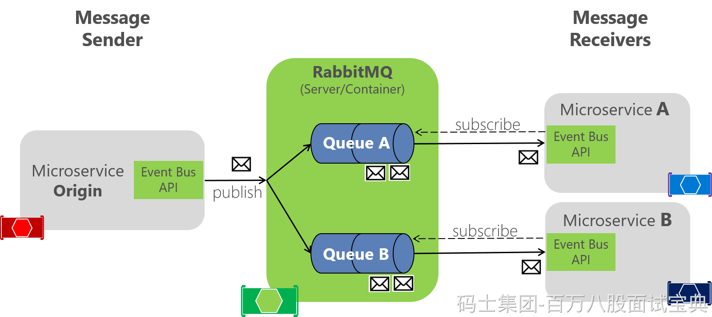

当消息堆积时，常见原因包括生产速率过快、消费者处理能力不足、内存耗尽等。下面从识别、根因和解决策略三个层面说明：M

#### 一、识别消息堆积

通过监控与队列状态，及时检查：

- 使用 Management UI 或 HTTP API 查询 `messages_ready` 和 `messages_unacknowledged`，监控排队和未确认消息数异常。
- 设置监控告警工具（如 Prometheus、Datadog 等），触发阈值提醒：高队列长度、无消费者、处理延迟等。

S

#### 二、常见堆积原因与对应策略

1. **消费者处理慢**

- 横向扩展：增加消费者实例并行处理；
- 性能优化：优化业务逻辑、多线程或批量消费；
- 设置合理 `prefetchCount` 限制，防止过载。

2. **生产速度快于消费速度**

- 在 Producer 端限流或批量发送，平衡系统负载；
- 优化 routing 和 exchange 配置，减少不必要的投递。

3. **Broker 内存压力或配置不当**

- 启用 **Lazy Queues**，将消息优先存入磁盘，缓释内存压力；
- 使用 Quorum 消息类型替代经典镜像队列，提升稳定性；
- 设置队列最大长度（`x-max-length`），溢出后将旧消息转向死信队列（DLQ）。

4. **消息超大或格式不当**

- 大消息拆分为小批次，减少单条处理开销。

5. **消费者异常或死锁**

- 配置死信队列，及时隔离异常消息避免堆积；
- 异常时自动重启，确保消费者可用；
- 使用手动 ACK 与 Nack 机制，确保“中断”消息能够重投或进入 DLQ。

B

#### 三、系统级优化建议

- **监控 + 告警体系**：设置队列长度、消费者延迟、资源使用等监控规则，并自动扩容或报警。
- **集群设计**：

- 使用 Quorum 队列替换经典镜像队列，提升性能与可靠性；
- 启用 Lazy Queues 缓解突发高流量；
- 调整 Broker 系统限制（文件句柄、磁盘低水位、内存限额）。

- **拓扑与治理**：

- 为不同业务设置独立队列，分区管理资源；
- 合理设置消息 TTL 和最大长度；
- 超载时将溢出消息导入 DLQ 并使用 Shovel 或重试机制再次投递。
