# 分布式事务与实战运用

## 什么是分布式事务？

业务场景：用户A转账100元给用户B，这个业务比较简单，具体的步骤：  
1、用户A的账户先扣除100元  
2、再把用户B的账户加100元

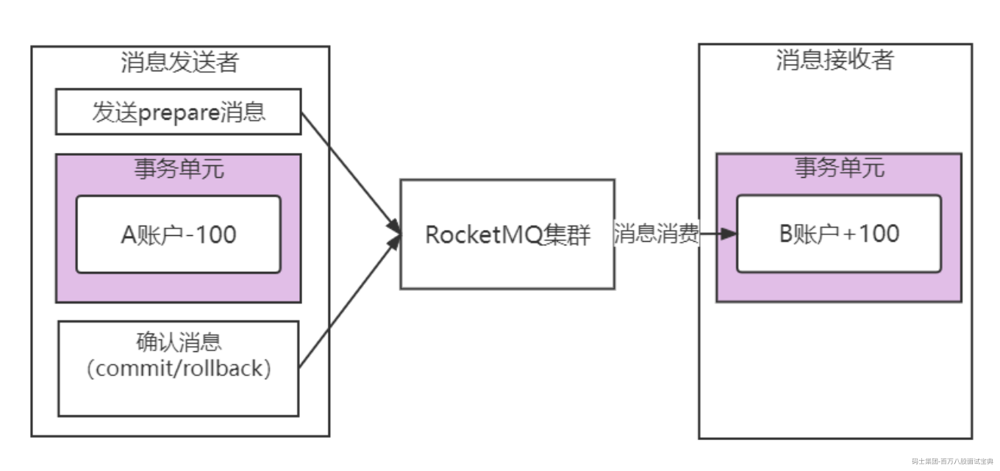

如果在同一个数据库中进行，事务可以保证这两步操作，要么同时成功，要么同时不成功。这样就保证了转账的数据一致性。  
但是在微服务架构中，因为各个服务都是独立的模块，都是远程调用，都没法在同一个事务中，都会遇到分布式事务问题。

## RocketMQ的解决方案

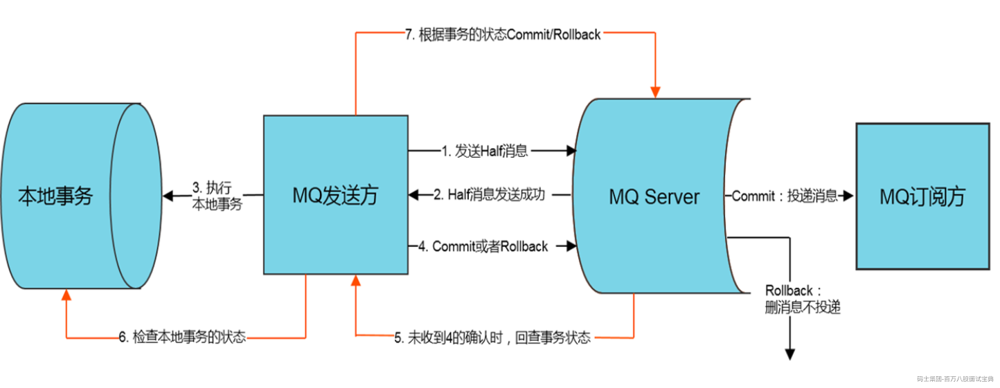

RocketMQ采用两阶段提交，把扣款业务和加钱业务异步化，在A系统扣款成功后，发送“扣款成功消息”到消息中间件；B系统中加钱业务订阅“扣款成功消息”，再对用户进行加钱。

#### 具体的处理方案

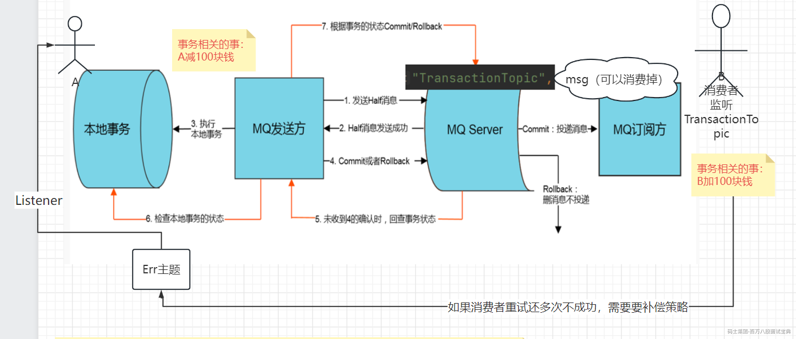

1. 生产者发送半消息（half message）到RocketMQ服务器

2. RocketMQ服务器向生产者返回半消息的提交结果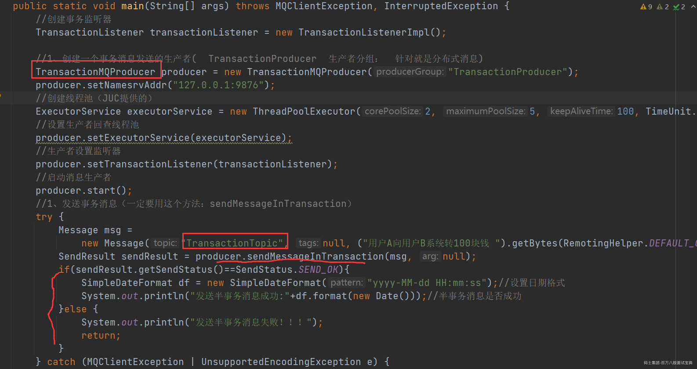

3. 生产者执行本地的事务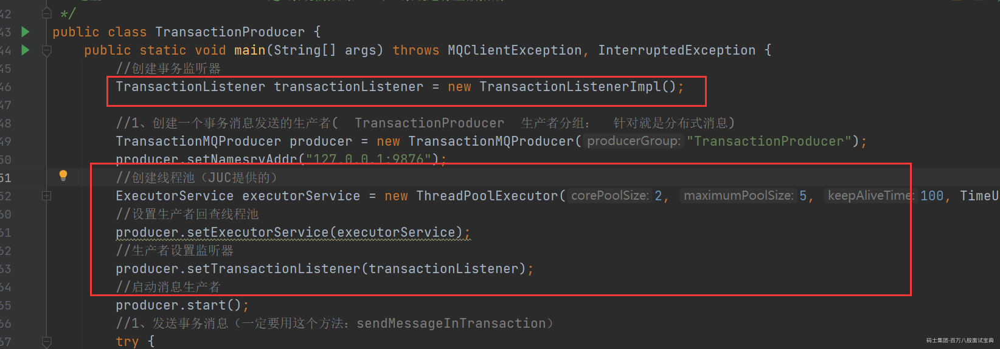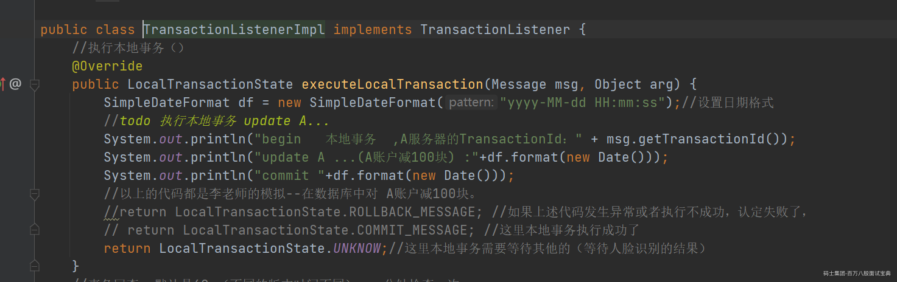1）这里如果是标记为可提交状态（commit），消费者监听主题即可立马消费（TransactionTopic主题），消费者进行事务处理，提交。2）如果这里标记为回滚，那么消费者就看不到这条消息，整个事务都是回滚的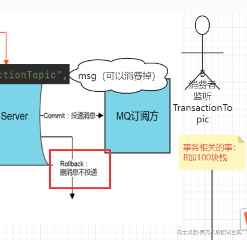3）当然本地事务中还有一种情况，那就是没执行完，这个时候，可以提交UNKNOW,交给事务回查机制。 如果是事务回查中，生产者本地事务执行成功了，则提交commit，消费者监听主题即可立马消费，消费者进行事务处理，提交。 如果这里标记为回滚，那么消费者就看不到这条消息，整个事务都是回滚的。 当然本地事务中还有一种情况，那就是还没执行完，这个时候还是可以继续提交UNKNOW,交给事务回查机制（过段时间继续进入事务回查）。

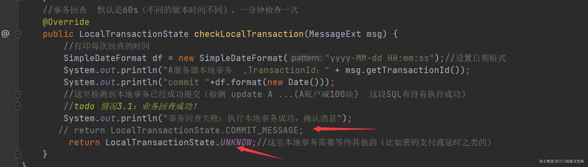

## RocketMQ分布式事务方案中的异常处理

### 事务回查失败的处理机制

在生产者有可能是要进行定时的事务回查的，所以在这个过程中有可能生产者宕机导致这条分布式事务消息不能正常进行。那么在RocketMQ中的生产者分组就会发挥作用

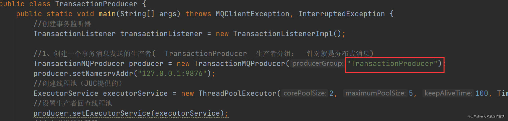

也就是如果在进行分布式事务回查中（RocketMQ去调用生产者客户端）某一台生产者宕机了，这个时候只要还有一台分组名相同的生产者在运行，那么就可以帮助之前宕机的生产者完成事务回查。

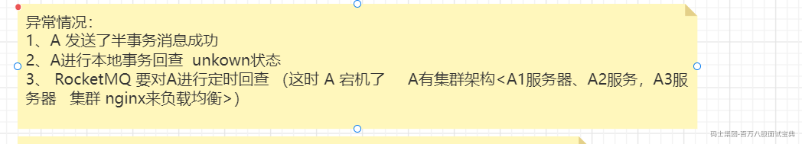

### 消费者失败补偿机制

虽然在消费者采用最大可能性的方案（重试的机制）确保这条消息能够执行成功，从而确保消费者事务的确保执行。但是还是有可能会发生消费者无法执行事务的情况，这个时候就必须要使用事务补偿方案。

业务场景：用户A转账100元给用户B，这个业务比较简单，具体的步骤：  
1、用户A的账户先扣除100元----生产者成功执行了  
2、再把用户B的账户加100元----消费者一直加100元失败。

那么就需要去通知生产者把之前扣除100元的操作进行补偿回滚操作。

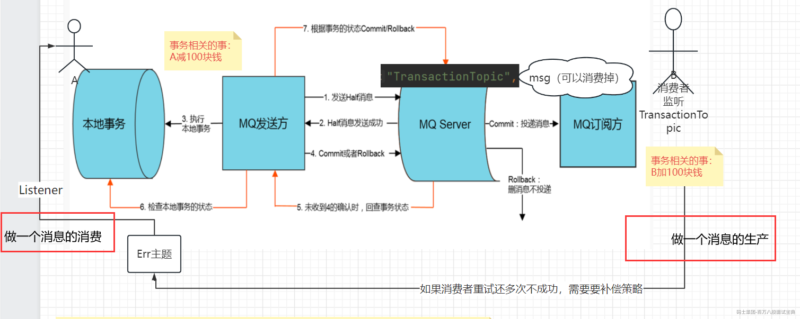

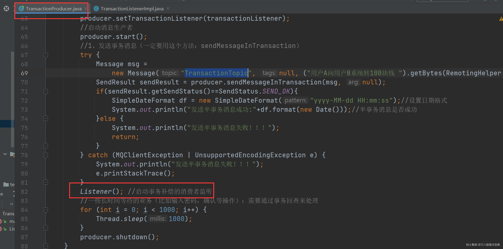

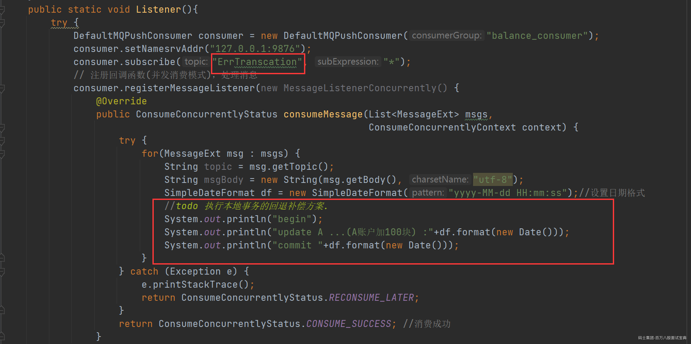

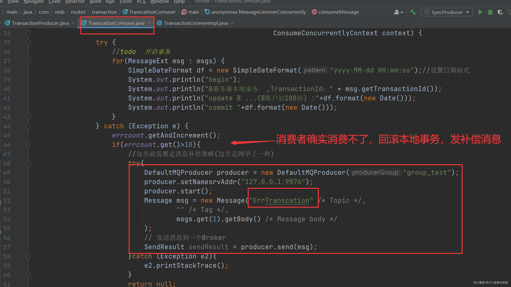

## RocketMQ的实战运用

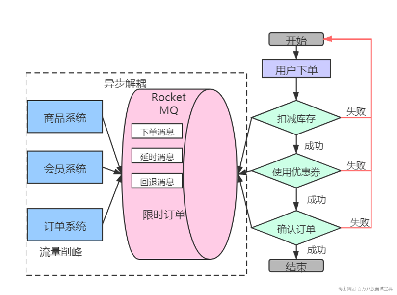

### **问题分析**

#### **分布式系统宕机问题**

整个系统是分布式部署，有订单系统、商品系统、会员系统。三个系统通过RPC调用完成整个下单流程。RPC调用会导致下单中各系统耦合在一起，假如会员系统宕机，会导致下单流程的不可用。

**如何异步解耦：**

利用RocketMQ，订单系统在下单后，作为生产者把“下单消息”写入MQ，商品系统与会员系统作为消费者消费MQ中的“下单消息”。这样可以达到异步解耦的目的，只要订单系统正常，对于用户来说下单业务都可以正常进行。

#### **数据完整性问题**

用户提交订单后，扣减库存成功、扣减优惠券成功，但是在确认订单操作失败（比如：支付失败），那么就需要对库存、优惠券进行回退。

如何保证数据的完整性？前面讲到的利用分布式事物消息确保要么都成功，要么都失败。

#### 消息重复消费的幂等性处理

对于消息接收端的情况,幂等的含义是采用同样的输入多次调用处理函数,得到同样的结果。例如，一个SQL操作

update stat\_table set count= 10 where id =1

这个操作多次执行,id等于1的记录中的 count字段的值都为10,这个操作就是幂等的,我们不用担心这个操作被重复。

再来看另外一个SQL操作

update stat\_table set count= count +1 where id= 1;

这样的SQL操作就不是幂等的,一旦重复,结果就会产生变化。

##### 去重表：

利用数据库表单的特性来实现幂等，常用的一个思路是在表上构建唯一性索引，保证某一类数据一旦执行完毕，后续同样的请求不再重复处理了（利用一张日志表来记录已经处理成功的消息的ID，如果新到的消息ID已经在日志表中，那么就不再处理这条消息。）

以电商平台为例子，电商平台上的订单id就是最适合的token。当用户下单时，会经历多个环节，比如生成订单，减库存，减优惠券等等。每一个环节执行时都先检测一下该订单id是否已经执行过这一步骤，对未执行的请求，执行操作并缓存结果，而对已经执行过的id，则直接返回之前的执行结果，不做任何操作。
